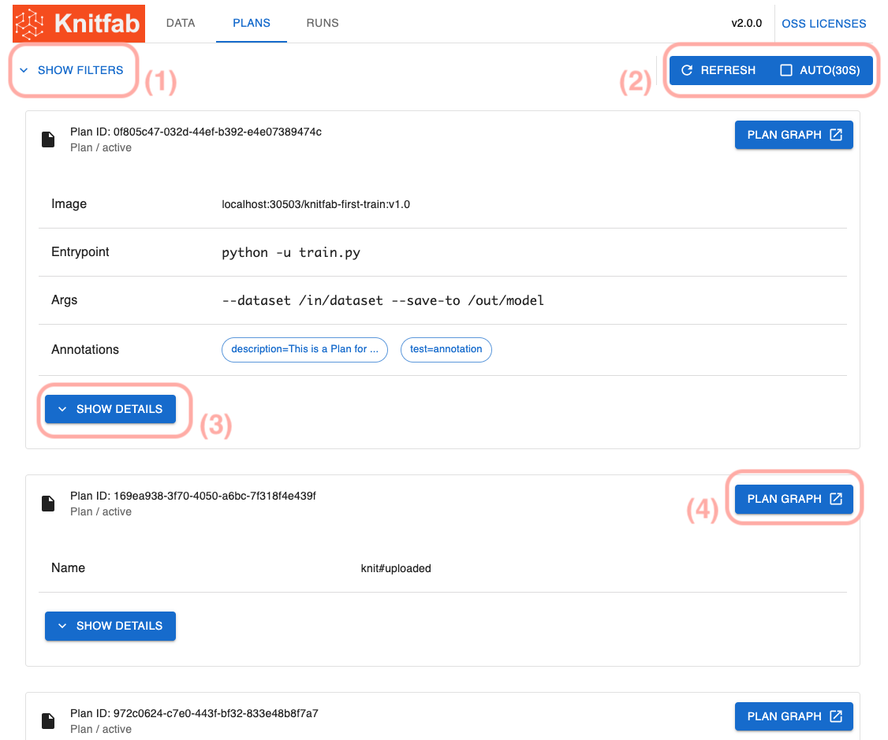
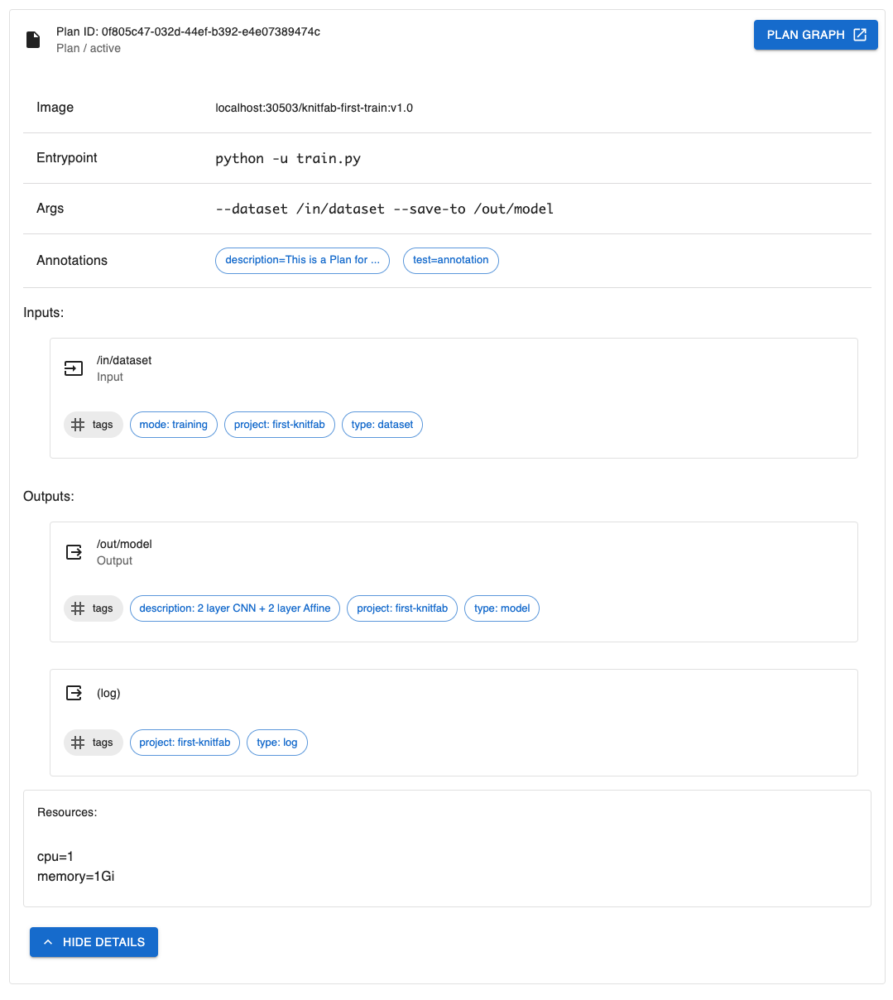
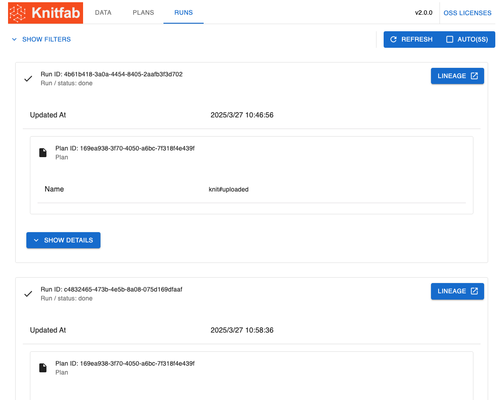
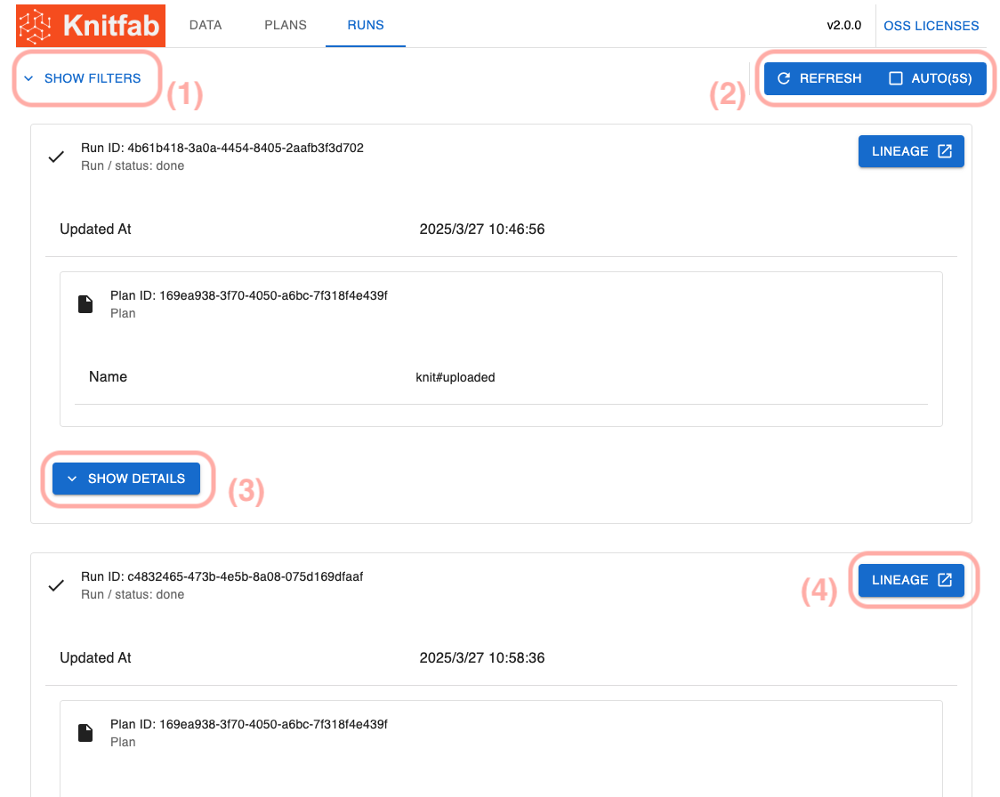
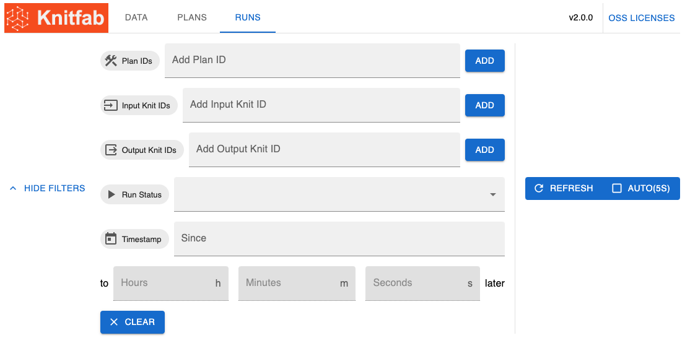
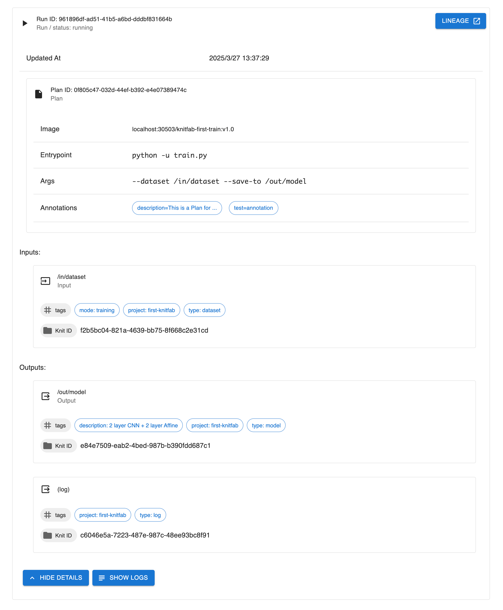

User Guide
============

This document explains the concepts and usage of Knitfab to Knitfab users.

The section explaining the concept is useful for anyone involved with Knitfab to understand the basic ideas.
The other chapters are specifically written for users who want to perform machine learning tasks on Knitfab.

他言語版/Translations
---------------------

- 日本語: [./user-guide.ja.md](./user-guide.ja.md)

Concept of Knitfab
--------

Knitfab is
- a MLOps tool which has
- an automatic lineage management feature
- with a tag-based pipeline engine

pipeline Engine automatically executes the necessary tasks according to the user-defined plan.
The automatic lineage management feature automatically records the history of all data generated by Knitfab by tracking the relationship between each task and its inputs and outputs during the execution of the tasks.

### Machine Learning Tasks

In Knitfab, all machine learning tasks (including general processes) are abstracted as "taking inputs and producing outputs".
This means that almost any program can be used as a machine learning task.

However, machine learning tasks have the following constraints:

- Inputs are read from the file system (directories).
- Outputs are written to standard output/error or to the file system (directories).
- They are packaged as container images (Docker images).

For example, a program that reads training data from one directory and training hyperparameters from another directory (these are inputs), and writes the model to one directory and training metrics to another directory (these are outputs), would be suitable as a machine learning task in Knitfab.

### Tag

Tag can be assigned to resources managed by Knitfab.
Tag is metadata that take the form of key-value pairs and can generally be freely set.

For example, consider the following Tags:

- `project: some-project`: Indicates that the resource is related to a specific project.
- `type: dataset`: Indicates that the Data is a dataset of some kind.
- `format: mnist`: Indicates that the Data is formatted in the MNIST format.
- `mode: train`: Indicates that the Data is intended for training purposes.

If a set of Tags like these is attached to a piece of data, it is likely to be the training dataset for MNIST.

In all cases, the key of the Tag is everything before the first `:`, and the value is everything after.

There are some constraints on the Tag keys:

- The character `:` cannot be used.
- Keys starting with `knit#` are reserved by Knitfab (known as "System Tag") and cannot be set by users.

### Data

Data refers to the input and output of machine learning tasks. Data is organized by directories.
Of course, Data generated as output by one machine learning task can be used as input by other machine learning tasks.

Data can be put Tags. The Tags associated with the Data are metadata that describe "What is this Data?" and "What are its characteristics?"

Once Data is created, it remains immutable, meaning its content cannot be changed except for its Tags.

### Plan

A Plan is a definition of a machine learning task. It specifies:

- What processing to perform
- What Data to assign as input to which file paths
- Which file paths are outputs and what kind of Data they represent

A Plan is defined using the following YAML format:

```yaml
image: "localhost:30503/Knitfab-first-validation:v1.0"

inputs:
  - path: "/in/dataset"
    tags:
      - "type:dataset"
      - "mode:test"
      - "project:some-project"
  - path: "/in/model"
    tags:
      - "type:model"
      - "framework:pytorch"
      - "project:some-project"

outputs:
  - path: "/out/metrics"
    tags:
      - "type:csv"
      - "project:some-project"

log:
  tags:
    - "type:log"
    - "project:some-project"
    - "type:text"
```

- `image`: Specifies the content of the processing as a container image.
- `inputs`, `outputs`: Indicates the inputs and outputs.
    - Tags are specified for file paths.
- `log`: Records the standard output and standard error generated by the machine learning task as Data.
    - Since this is also a type of output, can be put Tags.

The Tags for inputs indicate "What kind of Data can be assigned to this input?"
The Data assigned by Knitfab to a certain input must have all the Tags specified for that input.

The Tags for outputs indicate "What Tags should be assigned to the Data written to this output?"
When the machine learning task is executed, the output Data is newly created, and the initial Tags set at that time are specified as the Tags for the output.

### Runs and Lineage

A Run is a record of an executed machine learning task. A Run is made form a Plan as a template, and actual Data assigned to inputs and outputs.

When Knitfab detects that a certain Data can be assigned as input for each Plan, it automatically generates a Run from the combination of inputs and Data.

For a given Plan, there may be multiple possible Data assignments for inputs.
For example, taking the example shown in the Plan section, if there are two possible Data (evaluation dataset) that can be set for `/in/dataset` and three possible Data (trained model) that can be set for `/in/model`, Knitfab will generate and execute a total of $2 \times 3 = 6$ Runs.

A Run consists of specific input Data, output Data, and information about the Plan that the Run is based on.
It is simply a record of "What was inputted and outputted for a specific machine learning task", representing one step of lineage.
Knitfab represents lineage as a chain of dependencies between Runs and Data.

A Machine Learning Task corresponding with a Run is executed on a Kubernetes Pod in isorated environment. The Pod is started with Data assigned to Run as Volumes, and executing the image of the Plan.

Knitfab watches Pods status and when Pod stop successfully, Knitfab records the correcponding Run get be done and output Data is finished to be generated. Then, Knitfab checkes assignability of the Data to any Plans and start next Runs in a chain reaction.

CLI Tool: knit
-----------------

Knitfab users perform operations on Knitfab using the CLI command `knit`.

You can get `knit` CLI from Knitfab Releases page ( https://github.com/opst/knitfab/releases ).
Download a binary for your OS, and put it in a directory which in `PATH` environment variable.

> For Linux/Max users: put executable permisson on the binary (`chmod +x ...`).

### Subcommands

`knit` has subcommands based on the concepts it handles.

- `knit data`: Commands for manipulating Data
    - Example: `knit data pull`: Download the Data recorded in Knitfab.
- `knit plan`: Commands for manipulating Plans
    - Example: `knit plan apply`: Register a Plan in Knitfab.
- `knit run`: Commands for manipulating Runs
    - Example: `knit run find`: Search for Runs.

There are also additional subcommands for management purposes. They will be introduced as needed when explaining specific tasks.

Connecting to the cluster, managing projects
-----------------------------------

Knitfab is a client-server system.
The CLI `knit` sends requests to the Knitfab server, and the actual processing is performed on the server side.

Before using the `knit` command, the connection settings are required.

### Handout

To use Knitfab, please obtain a set of configuration files called a "handout" from the Knitfab administrator (installer).

The handout is generated when Knitfab is installed and contains the necessary information to connect to Knitfab.

### (Required) Connecting to Knitfab

To connect to Knitfab, you need to register a connection profile (knitprofile) with the `knit` command.
The connection profile is included in the handout.

Next, when you use the following command

```
knit init path/to/handout/knitprofile
```

the specified knitprofile will be imported into your profile store. The profile store is located at ~/.knit/profile by default.

Now, the knit command will be able to connect to Knitfab.

### (Required; on-prem) Trusting Knitfab in Docker

Knitfab has a private container image registry within the cluster. With this, you can register their own images as machine learning tasks that can only be used by Knitfab.

However, when using this cluster image registry, it is necessary to trust its TLS certificate in your docker environment.

There is a directory called `docker/certs.d` in the handout. Incorporate its contents into your docker configuration.

**For Linux-like environments:**

> [!Note]
>
> This pattern includes scenarios where dockerd is running on a Linux virtual machine on physical machines such as Windows or MacOS (e.g., docker-machine, colima, minikube).
>
> In this case, the certificate needs to be placed inside the `/etc/docker/certs.d` directory on the virtual machine.
>

```
cp -r path/to/handout/docker/certs.d/* /etc/docker/certs.d/
```

In some cases, you may need to use `sudo`.

For more details, please refer to https://docs.docker.com/engine/security/certificates/ .

**For Windows environment with Docker Desktop**

```
cp -r path\to\handout\docker\certs.d/* %USERPROFILE%\docker\certs.d
```

After executing the above command, restart Docker Desktop.

For more details, please refer to https://docs.docker.com/desktop/faqs/windowsfaqs/#how-do-i-add-custom-ca-certificates and https://docs.docker.com/desktop/faqs/windowsfaqs/#how-do-i-add-client-certificates.

### (Optional) Sharing Project-Specific Settings

In a project using Knitfab, you can share default behaviors of certain commands with other team members.

By creating a configuration file called `knitenv`, its contents will be applied in the directory where the file exists or any of its subdirectories.

The `knitenv` file is a YAML file with the following structure.

```
tag:
    - project:some-project
resource:
    cpu: 1
    memory: 1Gi
```

The meanings of each key are as follows:

- `tag`: Tags that are commonly set for Data and Plan inputs and outputs (multiple tags can be set; default is empty)
    - In the example above, all registered Data and created Plans will automatically have the Tag `project:some-project` set.
- `resource`: Required computing resources for creating Plan definition templates.
    - In this example, the project defaults to using 1 CPU core and 1 GB of memory for processing this Plan.
    - More details about this item will be covered in the Plan Definition section.

This file is intended to be shared among your team.
If you are version controlling your machine learning project with git or similar tools, it is recommended to include this file in version control.

Managing Data
-----

Data refers to directories with tags that contain the results of machine learning tasks. Users can also create Data by registering it with Knitfab.

The created Data in Knitfab is compared with the inputs of each Plan and if there is an executable Plan, it is executed as a Run.

This chapter discusses the handling of this Data.

### Registering Data

When you want to use a collection of files, such as a dataset, as input for a machine learning task, you can register it as Data in Knitfab.

Do the following:

```
knit data push -t your:tag /path/to/data
```

By doing this, the directory `/path/to/data` will be uploaded to Knitfab and treated as Data in Knitfab.

The `-t` flag means that when uploading the Data, a Tag will also be set for the Data. In this example, the Tag `your:tag` will be set when registering the Data.

Even without providing the `-t` flag, the Tags specified in the `knitenv` file will be implicitly set.

After executing the command, the metadata of the registered Data will be displayed on the console, following the progress logs.

```json
{
    "knitId": "a0f5911d-5ac5-4035-8c91-9946b02adc70",
    "tags": [
        "knit#id:a0f5911d-5ac5-4035-8c91-9946b02adc70",
        "knit#timestamp:2024-03-06T09:25:16.586+00:00",
        "project:some-project",
        "your:tag"
    ],
    "upstream": {
        "path": "/upload",
        "tags": [],
        "run": {
            "runId": "a5c1106c-122f-416c-b4f4-e6dd03af212c",
            "status": "done",
            "updatedAt": "2024-03-06T09:25:16.586+00:00",
            "plan": {
                "planId": "fb9b7087-9fe7-43c3-9302-a35488c85ffb",
                "name": "knit#uploaded"
            }
        }
    },
    "downstreams": [],
    "nomination": []
}
```

- `knitId`: This is the ID that identifies this Data.
- `tags`: It shows the Tags that are set for this Data.
    - It includes automatically assigned system-generated Tags (with keys starting with `knit#`) and user-defined Tags.
    - Additionally, if there are any Tags set in `knitenv`, they will also be included.
- `upstream`: It shows the output where this Data was written and information about the corresponding Run.
    - In this case, it displays a Run of a special  Plan that accepts the upload of Data.
- `downstream`: It includes information about the Runs that use this Data (if any).
- `nomination`: It includes information about the inputs of the Plan to which this Data is assigned (if any).

#### Command Line Options

- `-t key:value`, `--tag key:value`: Set Tags for the registered Data.
- `-n`, `--name`: Set Tags based on the directory name.
    - The set Tag will be `name:${directory_name}`.
- `-L`, `--dereference`: Trace symlinks in the directory and register the target instead of the symlink.
    - Without this flag, symlinks will be registered as symlinks.
    - `knit` does not validate if the target is included in the Data.

### Check Data

#### Check Metadata

There may be times when you want to check the metadata of registered Data later on. For example:

- What Tags are currently set?
- What Plans could potentially use this Data as input?
- How has this Data been used as input for Runs?

To examine the metadata of such Data, use the following command.

```
knit data find -t knit#id:KNIT-ID
```

Replace `KNIT-ID` with the ID of the Data you are interested in.

The `knit data find` command is used to search for Data.

The `-t` flag is used to specify "having this Tag" as a search condition, and in this case, the value of the `knit#id:` Tag is specified as the ID of the Data. As a result, you can obtain metadata for a specific Data.

The following results will be returned.

```json
[
    {
        "knitId": "5ea1b982-0e2c-4e02-adb6-431da718c7c1",
        "tags": [
            "format:mnist",
            "knit#id:5ea1b982-0e2c-4e02-adb6-431da718c7c1",
            "knit#timestamp:2024-10-16T09:03:42.726+00:00",
            "mode:training",
            "name:qmnist-train",
            "project:first-knitfab",
            "type:dataset"
        ],
        "upstream": {
            "path": "/upload",
            "tags": [],
            "run": {
                "runId": "0f6ffd26-9917-4d37-8f24-5bc920ef4c26",
                "status": "done",
                "updatedAt": "2024-10-16T09:03:42.726+00:00",
                "plan": {
                    "planId": "ea0fd879-c5f3-4c8c-9ff6-23852f4d3e46",
                    "name": "knit#uploaded"
                }
            }
        },
        "downstreams": [
            {
                "path": "/in/1/dataset",
                "tags": [
                    "mode:training",
                    "project:first-knitfab",
                    "type:dataset"
                ],
                "run": {
                    "runId": "95fa5441-0146-42a7-86e7-48593d2666ad",
                    "status": "done",
                    "updatedAt": "2024-10-17T02:32:06.928+00:00",
                    "exit": {
                        "code": 0,
                        "message": ""
                    },
                    "plan": {
                        "planId": "9e5dd235-02e3-4700-a174-f2a50f74c8ba",
                        "image": "localhost:30503/knitfab-first-train:v1.0",
                        "entrypoint": [
                            "python",
                            "-u",
                            "train.py"
                        ],
                        "args": [
                            "--dataset",
                            "/in/1/dataset",
                            "--save-to",
                            "/out/1/model"
                        ],
                        "annotations": [
                            "description=this is knitfab hands-on plan",
                            "detailed-description=this is detailed description\n containing new line."
                        ]
                    }
                }
            }
        ],
        "nomination": [
            {
                "path": "/in/dataset",
                "tags": [
                    "mode:training",
                    "project:first-knitfab",
                    "type:dataset"
                ],
                "plan": {
                    "planId": "352b17f7-1dde-437f-b4b9-d473e2bb13ec",
                    "image": "localhost:30503/knitfab-first-train:v1.0",
                    "annotations": [
                        "description=this is knitfab hands-on plan",
                        "detailed-description=this is detailed description\n containing new line."
                    ]
                }
            }
        ]
    }
]
```

The structure of each element is the same as described in the "Registering Data" section. In this example, since the Data has been used as input in other runs, the `downstreams` and `nomination` also contain the details.

##### Command-line options

- `-t key:value`, `--tag key:value`: Search for Data with the specified Tag.
    - If multiple Tags are specified, only the Data with all the Tags will be searched.

If `-t` is not specified at all, all Data will be shown.

#### Downloading the Data Itself

You can not only view metadata but also download the actual Data itself.

You may often want to download model parameters or evaluation results.

```
knit data pull -x KNIT_ID path/to/dest
```

This command writes the contents of the Data identified by the ID `KNIT_ID` to the directory `path/to/dest/${KNIT_ID}`.

##### Command-line options

- `-x`: Download and extract the Data.
    - If not specified, the Data"will be downloaded as a `tar.gz` compressed file to `path/to/dest/${KNIT_ID}.tar.gz`.

### Changing Data Tags

You can change the Tags of already registered Data.

For example,

- If there is a Tag `deployed:true` that indicates "deployed", you may want to move it to other Data.
- If you no longer want a certain Data to be used as input for a Run, you may want to remove the Tag.
- If you want to use a certain Data in a specific Plan, you may want to add the Tag.

This is useful in such cases.

To add Tag, you can use the following command:

```
knit data tag --add new:tag KNIT_ID
```

and This will add the "new:tag" Tag to the Data identified by the ID `KNIT_ID`.

In addition, executing

```
knit data tag --remove old:tag KNIT_ID
```

will removed the Tag `old:tag` from the Data identified by the ID `KNIT_ID`.

It is able to remove Tags by their key.

```
knit data tag --remove-key example-key KNIT_ID
```

Doing above, all Tags keyed with `example-key` are removed from Data identfied by ID `KNIT_ID`.

If you try to add a Tag that already exists in the Data or remove a Tag that doesn't exist, nothing will happen and no error will be thrown.

In this case, you cannot add or remove Tag that start with the key `knit#`. These tags are reserved and managed by the system.

#### Command-line options

- `--add KEY:VALUE`: Add a Tag with the key and value.
- `--remove KEY:VALUE`: Remove a Tag matching the key and the value.
- `--remove-key KEY`: Remove Tags keyed `KEY`.

Both options can be specified multiple times and will take effect for all specified Tags.

When `--remove`, `--remove-key` and `--add` are passed at a time, Knitfab perform removing first, and then adding. So, when you do `knit data tag --remove foo:bar --add foo:bar KNIT_ID`, the Data is tagged with `foo:bar` finally.

### Data cannot be deleted

In Knitfab, it is not possible to directly delete specific Data.

However, if a Run is deleted, the output Data of that Run will also be deleted. Therefore, this method can be used if the Data is no longer needed.

For more details, please refer to the "Managing Runs" section.

Managing Plans
-----

A Plan is a definition of a machine learning task in Knitfab.

When you register a Plan in Knitfab, it calculates executable input patterns based on the definition and automatically generates Runs.

This chapter describes how to handle Plans.

### Registering a Plan Definition

To register a Plan in Knitfab, use the following command:

```
knit plan apply path/to/plan_definition.yaml
```

When you specify the Plan definition file `path/to/plan_definition.yaml`, Knitfab registers the Plan with its contents.

#### Describing the Plan Definition

The Plan definition file is a yaml file that focuses on "which image", "what inputs to assign", and "what outputs to obtain".

A **minimal** Plan definition file looks something like this:

```yaml
image: "localhost:30503/train:v1.0"

inputs:
  - path: "/in/dataset"
    tags:
      - "project:some-project"
      - "type:dataset"
      - "mode:train"
  - path: "/in/params"
    tags:
      - "project:some-project"
      - "type:hyper-params"
      - "format:yaml"

outputs:
  - path: "/out"
    tags:
      - "project:some-project"
      - "type:model"

logs:
  - "project:some-project"
  - "type:log"
```

- `image`: Specifies "which image" for the processing.
    - The container image name is specified with the tag.
        - The image name follows the structure of `[host:port/][repository/]name:tag`.
    - If you want to use an image registered in the Knitfab image registry,
        - Set the host to `localhost`.
        - The port is typically `30503` for a standard installation. Please check with the administrator who performed the installation for details.
- `inputs`: Specifies "what inputs" to assign.
    - Each input is a combination of `path` and `tags`. Multiple inputs can be specified.
        - In the example, there are two inputs: `/in/dataset` and `/in/params`.
    - For each input,
        - `path` indicates the directory in the container where the input is provided when executing this task.
        - `tags` indicate what Data can be assigned to this input.
            - You can specify "system Tags" such as `knit#id` and `knit#timestamp`. This can be useful if you want to do something specific after identifying the Data.
    - At least one input is required. And each input must have at least one "Tag" set.
- `outputs`: Specifies "what outputs" will be obtained.
    - This is also a combination of `path` and `tags`. Like `inputs`, multiple outputs can be specified.
    - For each output,
        - `path` indicates the directory in the container where the task output is written.
        - `tags` indicate the set of "Tags" that are automatically assigned when this output Data is created.
    - Outputs can be zero.
- `logs`: A special output that collects the logs (stdout and stderr) of the task and turns them into Data.
    - This is optional. If omitted, the logs of the Run based on this Plan will not be recorded and will be discarded.
    - `tags` are the same as `tags` in `outputs` and indicate the set of "Tags" automatically assigned to the written logs.

It is recommended to generate a template for the Plan definition file by executing the following command, rather than writing it manually:

```
knit plan template --scratch > template.plan.yaml
```

This command generates an empty template in `template.plan.yaml`.


Also, if you have already decided on the container image you want to use, you can generate a template that reflects the contents of that image with the following command:

```
docker save IMAGE_NAME:TAG | knit plan tempalte > IMAGE.TAG.plan.yaml
```

(`IMAGE_NAME:TAG` should be changed accordingly to the desired image)

Even when executing this command, it is necessary to review the contents of the Plan definition file and adjust it to meet the actual requirements.

In addition to what is shown here, there are optional attributes.

#### `entrypoint` and `args`

Plan can be set [entrypoint and args](https://kubernetes.io/docs/reference/kubernetes-api/workload-resources/pod-v1/#entrypoint) for a Pod of a Run based the Plan.

```yaml
entrypoint: ["python", "main.py"]
args: ["--arg", "value"]
```

By setting `entrypoint` or `args` (both is okay), the default entrypoint or args in the image of the Plan are overridden.

#### `annotation`

Besides of Tags on input/output, Plan itself can have metadata, `annotation`.

```yaml
annoation:
    - key=value
    - description=...
    # ...
```

Annotations are list of "key=value" pair of arbitary content. You can use this to describe the Plan, record the creator or anything which is needed. Lineage does not care annotations, so annotations have no effect for Knitfab to derive Runs from Plans.

A Plan can have many annotations. And also, a Plan can have annotations with same key if their values are different. For example, `annotation` like below are valid.

```yaml
annoation:
    - created-by=Alice
    - created-by=Bob
    - created-by=Charie
```

`annotation` is mutable.

#### `active`

```yaml
active: true
```

Specifies the "active" status of the Plan. Only the Runs based on an "active" Plan will be actually executed. The default value is `true`.

There may be cases where you don't want the Runs based on the Plan to be executed immediately when registering that Plan.
In such cases, it is recommended to set `active: false` (inactive) in the Plan definition file and apply it using `knit plan apply`.

`active` is mutable.

#### `resource`

```yaml
resources:
  cpu: 1
  memory: 1Gi
```

You can specify the limits of compute resources allocated to the Runs based on this Plan.
The default is 1 CPU core and 1 GiB of memory as mentioned above.
If `resources.cpu` or `resources.memory` are omitted, these default values will be applied.

Alternatively, if `resources` is defined in the `knitenv` file, it will be used instead of the default values.

If you need more resources, you can modify the settings. Decimal values are also allowed.
For example, if you anticipate needing 2.5 cores and 3.5 GiB of memory, you can specify it as follows:

```yaml
resources:
  cpu: 2.5
  memory: 3.5Gi
```


In addition, it is possible to describe the resource requirements for compute resources such as GPUs in the `resources` section.

```yaml
resources:
  cpu: 1
  memory: 1Gi
  nvidia.com/gpu: 1
```

The types of compute resources that can be specified other than `cpu` and `memory` depend on the underlying Kubernetes cluster that Knitfab is built on. Please check with your Knitfab administrator for the possible values that can be configured.

> **Advanced Note**
>
> This value will ultimately be used as `resources.limits` and `resources.requests` in the pod definition of Kubernetes.
>

`resource` is mutable.

### service_account

```yaml
service_account: SERVICE_ACCOUNT_NAME
```

The ML task of a Run based a Plan are execute as Kubernetes Pod. With the `service_account` field, you can specify a Kubernetes [ServiceAccount](https://kubernetes.io/docs/concepts/security/ service-accounts/) for the Pod.

This field is optional and Pods have no ServiceAccount by default. As long as the Task of a Run is closed in a Pod, ServiceAccount may not needed.

Ask your Kubernetes Admin for avaiable ServiceAccounts.

`service_account` is mutable.

#### on_node

There may be cases where you want to execute certain computational tasks on specific machines.

For example,

- Training tasks may need to be executed on machines with GPUs, while evaluation tasks may not.
- Tasks that are sufficiently handled by CPUs may want to avoid machines with GPUs and prioritize tasks that require valuable computational resources.

By setting appropriate values in `on_node`, you can restrict the placement of Runs for this Plan on specific machines.

```yaml
on_node:
  may:
    - "key=value"
  prefer:
    - "vram=large"
  must:
    - "accelarator=gpu"
```

`on_node.may`, `on_node.prefer`, and `on_node.must` all require an array of "labels" (`key=value`) to be specified.
These labels refer to the metadata labels of the machines.
For meaningful values, please consult the administrator who set up the Kubernetes cluster where Knitfab is installed.

Each item is optional, and if omitted, it is equivalent to not specifying any labels for that item.
If `on_node` itself is omitted, it is equivalent to having all items empty.

The meanings of each item are as follows:

- `may`:
    - Indicates that the task **may be executed** on a machine with that label.
    - Machines with that label are typically configured to not receive computational tasks.
- `prefer`:
    - Indicates that the task should be executed on a machine with that label, **if possible**.
    - If the machine is not available, a machine without that label may be used.
- `must`:
    - Indicates that the task **must be executed** only on a machine with that label.
    - If a machine with that label does not exist, the Run will not proceed.

> **Advanced Note**
>
> This value is used as a combination of Kubernetes `torelation` and node affinity.
>
> - Labels specified in `may` become `torelation` (`NoSchedule`).
> - Labels specified in `prefer` become `torelation` (`NoSchedule` + `PreferNoSchedule`) and node affinity (`preferredDuringSchedulingIgnoredDuringExecution`).
> - Labels specified in `must` become `torelation` (`NoSchedule` + `PreferNoSchedule`) and node affinity (`requiredDuringSchedulingIgnoredDuringExecution`).
>
> In order for these specifications to work effectively, the Kubernetes cluster needs to be properly configured by the administrator.
>

`on_node` is mutable.

### Check Plan Definitions

You can check the registered Plan definitions with the following command:

```
knit plan show PLAN_ID
```

To get detailed information about a specific Plan, you need to specify the ID of the Plan you want to know about in place of `PLAN_ID`.
If the specified Plan exists, you will receive console output similar to the following:

```json
{
    "planId": "d134463a-9766-4e43-8f87-002e48d624a6",
    "image": "localhost:30503/knitfab-first-train:v1.0",
    "entrypoint": [
        "python",
        "-u",
        "train.py"
    ],
    "args": [
        "--dataset",
        "/in/dataset",
        "--save-to",
        "/out/model"
    ],
    "annotations": [
        "description=this is knitfab hands-on plan",
        "detailed-description=this is detailed description\ncontaining new line."
    ],
    "inputs": [
        {
            "path": "/in/dataset",
            "tags": [
                "mode:training",
                "project:first-knitfab",
                "type:dataset"
            ],
            "upstreams": []
        }
    ],
    "outputs": [
        {
            "path": "/out/model",
            "tags": [
                "description:2 layer CNN + 2 layer Affine",
                "project:first-knitfab",
                "type:model"
            ],
            "downstreams": [
                {
                    "plan": {
                        "planId": "a363ba5d-b874-496a-8f40-ee1ebf28b8e6",
                        "image": "localhost:30503/knitfab-first-validation:v1.0",
                        "entrypoint": [
                            "python",
                            "-u",
                            "validation.py",
                            "--dataset",
                            "/in/dataset",
                            "--model",
                            "/in/model/model.pth"
                        ],
                        "annotations": [
                            "test=annotation"
                        ]
                    },
                    "mountpoint": {
                        "path": "/in/model",
                        "tags": [
                            "project:first-knitfab",
                            "type:model"
                        ]
                    }
                },
            ]
        }
    ],
    "log": {
        "Tags": [
            "project:first-knitfab",
            "type:log"
        ],
        "downstreams": []
    },
    "active": true,
    "resources": {
        "cpu": "1",
        "memory": "1Gi"
    }
}
```

This JSON is similer in structure to a Plan definition YAML.

There are additional elements of definitions, `"upstreams"` in `"inputs"` and `"downstreams"` in `"outputs"` and `"log"`.
These shows you connectivity between other Plans and these inputs, outputs and log.

`"downstreams"` lists inputs of the other Plans which Data generated from the Output (in a Run of the Plan) will be assined to.
`"upstreams"` are counterpart of that. When doing `knit plan show` of the Plan in `"downstreams"` above example, the result below will be gotten.

```json
{
    "planId": "a363ba5d-b874-496a-8f40-ee1ebf28b8e6",
    "image": "localhost:30503/knitfab-first-validation:v1.0",
    "entrypoint": [
        "python",
        "-u",
        "validation.py",
        "--dataset",
        "/in/dataset",
        "--model",
        "/in/model/model.pth"
    ],
    "annotations": [
        "test=annotation"
    ],
    "inputs": [
        {
            "path": "/in/dataset",
            "tags": [
                "mode:test",
                "project:first-knitfab",
                "type:dataset"
            ],
            "upstreams": []
        },
        {
            "path": "/in/model",
            "tags": [
                "project:first-knitfab",
                "type:model"
            ],
            "upstreams": [
                {
                    "plan": {
                        "planId": "d134463a-9766-4e43-8f87-002e48d624a6",
                        "image": "localhost:30503/knitfab-first-train:v1.0",
                        "entrypoint": [
                            "python",
                            "-u",
                            "train.py"
                        ],
                        "args": [
                            "--dataset",
                            "/in/dataset",
                            "--save-to",
                            "/out/model"
                        ],
                        "annotations": [
                            "description=this is knitfab hands-on plan",
                            "detailed-description=this is detailed description\ncontaining new line."
                        ]
                    },
                    "mountpoint": {
                        "path": "/out/model",
                        "tags": [
                            "description:2 layer CNN + 2 layer Affine",
                            "project:first-knitfab",
                            "type:model"
                        ]
                    }
                }
            ]
        }
    ],
    "outputs": [],
    "log": {
        "Tags": [
            "project:first-knitfab",
            "type:log",
            "type:validation"
        ],
        "downstreams": []
    },
    "active": true,
    "resources": {
        "cpu": "1",
        "memory": "1Gi"
    }
}
```

When you don't know the ID of the Plan you are interested in, you can also search for it.

If you know the image name, you can use the following command:

```
knit plan find --image HOST:PORT/IMAGE:TAG
```

If you know the Tags used in the inputs or outputs, you can use the following:

```
knit plan find --in-tag KEY:VALUE
```

```
knit plan find --out-tag KEY:VALUE
```

If you want to limit the search to active Plans, use the following command:

```
knit plan find --active yes
```

These search conditions can be specified simultaneously, and only the Plans that meet all the conditions will be shown.

Furthermore, `--in-tag` and `--out-tag` can be specified repeatedly, and in that case, the search will only match if there are inputs or outputs that have all the specified "Tags".

When `knit plan find` is executed without any search conditions, it will match all the Plans in the search.

#### Command Line Flags: `knit plan find`

- `--active MODE`: Limits the search to Plans that are active (or inactive).
    - The following values can be specified for MODE:
        - `both` (default): Does not consider the active status as a condition.
        - `yes`, `true`: Searches only for active Plans.
        - `no`, `false`: Searches only for inactive Plans.
- `--image IMAGE[:TAG]`: Searches based on the image of the Plan.
    - `TAG` can be omitted. In that case, the search ignores the tags of the image.
    - The `IMAGE` part also matches the hostname or port of the registered image in the Plan definition. It does not perform partial matching.
- `-i KEY:VALUE`, `--in-tag KEY:VALUE`: Limits the search to those with inputs that have the specified Tags.
    - If this flag is specified multiple times, it only searches for those with inputs that have all the specified Tags.
- `-o KEY:VALUE`, `--out-tag KEY:VALUE`: Limits the search to those with outputs that have the specified Tags.
    - If this flag is specified multiple times, it only searches for those with outputs that have all the specified Tags".

### Connect Plans/Visualize Connectivities of Plans

With Knitfab, Machine Learning Task Pipeline are made by Plans.

For example, let's assume that 2 Plans below, "trainer" and "validator", are registered.

```yaml:trainer.plan.yaml
image: "localhost:30503/train:v1.0"
annotations:
  - "name=trainer"

inputs:
  - path: "/in/dataset"
    tags:
      - "project:some-project"
      - "type:dataset"
      - "mode:train"
  - path: "/in/params"
    tags:
      - "project:some-project"
      - "type:hyper-params"
      - "format:yaml"

outputs:
  - path: "/out"
    tags:
      - "project:some-project"
      - "type:model"

logs:
  - "project:some-project"
  - "type:log"
```

```yaml:validator.plan.yaml
image: "localhost:30503/validate:v1.0"
annotations:
  - "name=validator"

inputs:
  - path: "/in/dataset"
    tags:
      - "project:some-project"
      - "type:dataset"
      - "mode:validate"
  - path: "/in/model"
    tags:
      - "project:some-project"
      - "type:model"

outputs:
  - path: "/out"
    tags:
      - "project:some-project"
      - "type:report"

logs:
  - "project:some-project"
  - "type:log"
```

In the example, Data generated from a Run which based on the Plan "trainer" is assigned to the output `/in/model` of the Plan "validator". Because all Tags on the input `/in/model` of the Plan "validator" are found in Tags of `/out` of the Plan "trainer" (in the example, the tags are same).

Then, Runs based on "validator" will be created when Runs based on "trainer" get done successfully.

Like this, with Knitfab, "knitting up" Machine Learning Task Pipeline is realised with connecting outputs and inputs of Plans with Tags and letting Plans do chain-reaction.

And, to visualize a pipeline build as above, do

```
knit plan graph PLAN_ID | dot -Tpng > graph.png
```

`knit plan graph` writes out the pipeline in 3 Plans distanced from the specified Plan as `PLAN_ID` in dot format.
In the example command above, pass the dot script to `dot` command and convert to a PNG image. An image gotten likes below:


This pipeline image is visualized by searching from "validator", placed in the downstream of the pipeline. In the image, Borderd objects are Plans and arrows notates the direction of dataflows.

The Plan "trainer" is upperhalf of the image and the Plan "validator" is bottom half. Each narrow yellow borders is boundarie of a Plan. Bold yellow borders inside of them show summries of Plans (activeness, ID, container image and annotations). The Plan which background of ID is colord is the one specified to `knit plan graph`, thus the starting point of traverse the pipeline (in this example, "validator" is it).

Green dots on narrow outer borders are inputs, outputs or log of Plans. Direction of narrow arrows between dots and Plan summaries denote the dots are input or not. Arrows heading to Plan summary are inputs, and heading to dots are output or log. Arrows are labelled with filepathes for input/output or "(log)" for log.

Bold arrows shows connectivity of Plans. Inputs outputs or logs which are not connected with bold arrows means no Plans are found in the search range of `knit plan graph`.

You can specify the search range with `--numbers` (or `-n`) flag. For example, to search in 10 Plans distance, do

```
knit plan graph -n 10 PLAN_ID
```

When `-n all`, `knit plan graph` searches unlimitedly.

To search only upstreams,

```
knit plan graph --upstream PLAN_ID
```

For only downstreams,

```
knit plan graph --downstream PLAN_ID
```

#### Commnadline Flags: `knit plan graph`

- `-n POSITIVE-INTEGER|all`, `--numbers POSITIVE-INTEGER|all`: Specify search range
    - Pass a positive integer or `all`.
        - When passed a positive integer, it searches Plans distanced upto the number.
        - When passed `all`, it searches unlimitedly.
- `-u`, `--upstream`: Search upstream.
    - When passed it, `knit plan graph` searches upstreams of the starting Plan, that is, Plans which are reachable to inputs of the stating Plan.
- `-d`, `--downstream`: Search downstream.
    - When passed it, `knit plan graph` searches doenstreams of the starring Plan, that is, Plans which are reachable to outputs and log from the starting Plan.

When neither of `-u` and `-d` are passed, it assumes both of them are passed, so `knit plan graph` searches upstream and downstream.

### Annotate or Unannotate a Plan

Annotation, metadata of Plan, can be set or unset after Plan is registered.

To add annotations to a Plan identified with ID `PLAN_ID`, do:

```
knit plan annotate --add KEY=VALUE PLAN_ID
```

Pass an annotation as key-value pair joined with `=` to `--add` flag.

To remove annotations from a Plan, do:

```
knit plan annotate --remove KEY=VALUE PLAN_ID
```

And, to remove all annotations with a key from a Plan, do:

```
knit plan annotate --remove-key KEY PLAN_ID
```

Annotations to be removed will be ignored if they are not on a Plan. As like that, Annotations to be added will be ignored if they have been already on a Plan.

For example, when the Plan `PLAN_ID` has an annotation `aaa=bbb`, doing

```
knit plan annotate --add aaa=bbb --add ccc=ddd --remove eee=fff PLAN_ID
```

is same as

```
knit plan annotate --add ccc=ddd PLAN_ID
```

#### Commandline Flags: `knit plan annotate`

- `--remove KEY=VALUE`: remove the passed annotation from the Plan.
- `--remove-key KEY`: remove all annotations with key `KEY` from the Plan.
- `--add KEY=VALUE`: add an annotation to the Plan.

### Activating and deactivating a Plan

If you no longer need a Plan, you can deactivate it:

```
knit plan active no PLAN_ID
```

By executing this command, the Plan identified by the specified `PLAN_ID` will be deactivated.
Any Run based on this Plan that has not started yet will be prevented from executing.

You can also reactivate a Plan that was deactivated for some reason.

```
knit plan active yes PLAN_ID
```

This command will re-execute any prevented Run based on the Plan with the specified `PLAN_ID`.

### Set or unset ServiceAccount of a Plan

To set ServiceAccount on a Plan, do:

```
knit plan serviceaccount --set SERVICE_ACCOUNT_NAME PLAN_ID
```

To unset, do:

```
knit plan serviceaccount --unset PLAN_ID
```

Flag `--set` and `--unset` are mutual exclusive.

### Updating the compute resources required by a Plan

Let's say you have executed a computational task and found that there is an excess or shortage of compute resources specified in the Plan definition. This can be a problem, especially if there is a shortage of resources, as the computation cannot be executed.

In such cases, you can update the compute resources specified in the Plan.

For example, if you need "10GiB of memory", you can do the following:

```
knit plan resource --set memory=10Gi
```

If you want to speed up the computation by setting the CPU to 4 cores, use the following command:

```
knit plan resource --set cpu=4
```

Generally,

```
knit plan resource --set TYPE=QUANTITY
```

can specify the required amount for each type of compute resource.

You can also remove constraints on unnecessary compute resources using `--unset`.

If you no longer need the GPU, use the following command:

```
knit plan resource --unset gpu
```

However, even if you use `--unset cpu` or `--unset memory`, it will fallback to the default values of 1 core / 1GiB.

Managing Runs
----

A Run is created from a combination of a Plan and Data.

Users do not directly create Runs. It is generally the responsibility of Knitfab to create Runs, start computations, and detect completion.
A Run launches a container called a worker in the background. The actual computational task is executed inside the worker container.

In this chapter, we will discuss the handling of such Runs.

### Lifecycle of a Run

A Run involves actual computation. Therefore, it has a series of lifecycle stages: "preparing for computation, starting computation, and completing computation".
Before diving into the details of a Run, let's discuss its lifecycle.


A Run follows the lifecycle depicted in this state transition diagram.

- `waiting`, `deactivated`: Initial states of a Run.
    - Knitfab generates a new Run in the following cases:
        - All inputs of the Plan have been assigned with Data.
        - No existing Run has been executed with that combination of inputs and Data.
- `ready`, `starting`: Preparing to start the computation of the Run and in the process of starting it.
    - When preparation is complete, it transitions to `ready`, and then attempts to start the container, transitioning to `starting`.
- `running`: The computation is actively progressing.
- `aborting`, `failed`: The computation has failed.
    - When a failure is detected, it transitions to `aborting`, and once the container is removed, it transitions to `failed`.
- `completing`, `done`: The computation has succeeded.
    - When successful completion is detected, it transitions to `completing`, and once the container is removed, it transitions to `done`.
    - **Only the data outputted from a Run in this state can be used as input by other Runs.**
- `invalidated`: An internal state used by Knitfab for management purposes. Users will not encounter a Run in this state.

The success of a Run is determined by the exit status of the user-defined container.
If the exit status is `0`, it is considered successful; otherwise, it is considered a failure.

> If a task is implemented in a Python script and an exception is raised, causing the program to stop, the program is considered to have failed.

### Searching for Runs

You can search for Runs within Knitfab using the `run find` command.

For example, if you want to find information about ongoing Runs, by executing:

```
knit run find -s ready -s starting -s running -s completing -s aborting
```

you can only see the active Run states.
`-s` is an alias for `--status`, and when specified multiple times, it searches for Runs that are in any of the specified states.

The following output is expected:

```json
[
    {
        "runId": "95fa5441-0146-42a7-86e7-48593d2666ad",
        "status": "done",
        "updatedAt": "2024-10-17T02:32:06.928+00:00",
        "plan": {
            "planId": "9e5dd235-02e3-4700-a174-f2a50f74c8ba",
            "image": "localhost:30503/knitfab-first-train:v1.0",
            "entrypoint": [
                "python",
                "-u",
                "train.py"
            ],
            "args": [
                "--dataset",
                "/in/1/dataset",
                "--save-to",
                "/out/1/model"
            ],
            "annotations": [
                "description=this is knitfab hands-on plan",
                "detailed-description=this is detailed description\n containing new line."
            ]
        },
        "inputs": [
            {
                "path": "/in/1/dataset",
                "tags": [
                    "mode:training",
                    "project:first-knitfab",
                    "type:dataset"
                ],
                "knitId": "5ea1b982-0e2c-4e02-adb6-431da718c7c1"
            }
        ],
        "outputs": [
            {
                "path": "/out/1/model",
                "tags": [
                    "description:2 layer CNN + 2 layer Affine",
                    "project:first-knitfab",
                    "type:model"
                ],
                "knitId": "88d60df9-8699-4b85-8b40-8741824b6737"
            }
        ],
        "log": {
            "Tags": [
                "project:first-knitfab",
                "type:log"
            ],
            "knitId": "d75cd6e0-0d92-4536-812c-4308f8180a12"
        }
    }
]
```

> If multiple Runs are found, more elements will be in an array.

- `runId`: The ID that identifies this Run.
- `updatedAt`: The timestamp when the state changes of this Run were last detected.
- `status`: The status of this Run.
- `plan`: An overview of the Plan that generated this Run.
- `inputs`, `outputs`, `log`: The actual inputs, outputs, and log of this Run.
    - `knitId` is the specific ID assigned to the Data.
    - `tags` are the Tags of the inputs, outputs, or log (not the Tags of the Data).

Additional information is included for a stopped Run.

```json
{
    "runId": "3cb1b091-01ad-41b1-acac-3f042f9df97c",
    "status": "done",
    "updatedAt": "2024-03-07T06:32:54.791+00:00",
    "exit": {
        "code": 0,
        "message": "Completed"
    },
    "plan": {
        ...
    },
    "inputs": [...],
    "outputs": [...],
    "log": {...}
}
```

For a stopped Run, an additional element called `exit` is displayed.
You can read the container's exit code (`code`) and the status at the time of container termination (`message`).


#### コマンドラインフラグ: `knit run find`

You can pass search criteria as command-line flags.

- `-s STATUS`, `--status STATUS`: The status of the Run.
- `-i KNIT_ID`, `--in-knitid KNIT_ID`: The ID of the input Data.
- `-o KNIT_ID`, `--out-knitid KNIT_ID`: The ID of the output Data.
- `-p PLAN_ID`, `--planid PLAN_ID`: The ID of the Plan that generated the Run.

#### Investigating a specific run

If you have identified the ID of a Run, you can use the command `knit run show RUN_ID` to check the information of the Run.

Additionally, by executing `knit run show --log RUN_ID`, you can retrieve the log of that Run if it exists.
Furthermore, by executing `knit run show --log --follow RUN_ID`, you can follow the log of that Run if it exists. This means that new log content will be written to the console whenever a log is generated.

### Stopping and Retrying a Run

Users cannot explicitly create a Run, but users can interrupt a running Run or retry a completed Run.


This functionality is designed for cases where a Run goes out of control and needs to be stopped, or when a Run fails due to unexpected issues during execution and needs to be retried.

#### Stopping a Run

```
knit run stop --fail RUN_ID
```

This command interrupts a Run and forces it to fail. Specifically, it sets the state to `aborting`.

If the `--fail` flag is omitted, the Run is considered to have been interrupted and completed successfully. This is achieved by setting the state to `completing`.

Naturally, you cannot interrupt a Run that is already stopped.

#### Retrying a Run

You can retry a Run that has already stopped and is in a `done` or `failed` state.

```
knit run retry RUN_ID
```

By executing this command,

- Delete the output Data of the Run identified by `RUN_ID`, and
- Reset the state of the Run to `waiting`.

The Run that has been reset to `waiting` will be executed again according to its lifecycle.

A Run that outputs Data used as input of other Runs cannot be retried.
This is an intentional design. By protecting such Runs, the lineage is preserved.

### Deleting a Run

> [!Warning]
>
> This operation is irreversible.

You can delete a Run **only if it is already stopped and there are no other runs downstream**.

```
knit run rm RUN_ID
```

By executing this command, the corresponding Run and its outputs will be deleted. The same combination of inputs and Data will not be executed again.

Lineage
-------

The chain of Runs and Data is called lineage, which is managed by Knitfab.

### Visualizing

There is a feature to export this lineage in graphviz format (dot notation).

In combination with the `dot` command,

```
knit data lineage KNIT_ID | dot -T png -o lineage-graph.png
```

can obtain the lineage of the specified Data with the preceding and following 3 Data  as an image file named `lineage-graph.png`.

#### Command Line Flags

- `-u`: Explore the lineage graph only on the input side (upstream).
- `-d`: Explore the lineage graph only on the output side (downstream).
- `-n int|"all"`: Depth of exploration counted by the number of Data.
    - Default is 3.
    - Specify `all` to explore without limitations.

Guidelines for Tagging
----------------------

Tags can be added to the input and output of Data and Plan.
In terms of specifications, any Tag can be added. The specific usage is left to the user's discretion.

However, as the Knitfab development team, we recommend setting certain Tags.

- `project:...`: The name of the project to which the Data and Plan belong.
    - Prevents unrelated Data from being mixed in.
- `type:...`: Indicates the rough type of the Data.
    - Example: `type:dataset`, `type:hyper-params`, `type:log`, `type:random-seed`, `type:metrics`
- `format:...`: The file format of the Data.
    - Example: `format:mnist`, `format:csv`, `format:text`, `format:png`

Furthermore, Tags can also be used for memos.

- `name:...`: The name of the Data.
    - Especially for uploaded Data.
- `description:...`: Description or summary of the Data.
    - Especially for uploaded Data.

Tags such as `name:...` and `description:...` may not be used for assigning to Plan inputs, but they will help with understanding when looking back with commands like `knit data find`.

Also, it is important to set conditions as Tags to prevent certain types of Data from being accidentally included as inputs.

- `class:...`, `script:...`, `version:...`: (For models and hyperparameters) Class names, scripts, and versions that can be loaded.
- `mode:train`, `mode:validation`, `mode:test`: (For datasets) The purpose of use.
    - Training with test data and evaluating with test data will result in meaningless results.

Extention Command
------------------

Knitfab CLI `knit` recognize Extention Commands.

You can invoke commands prefixed with `knit-` and found in environmental variable `PATH` via `knit`.

> [!NOTE]
>
> The rule convert from command name to subcommand name of `knit`.
>
> 1. Trim prefix `knit-`.
> 2. Trim following suffix, if exits: `.exe`, `.cmd`, `.bat`. `.com`
>
> For example:
>
> - `knit-example` can be invoked as `knit example`
> - `knit-example.exe` also can be invoked as `knit example`
> - `knit-example.exe.something` can be involed as `knit example.exe.someting` (a suffix is trimmed from the last only)
>

On invoking Extention Commands, STDIN, STDOUT and STDERR are passed through from `knit`.
Also all args (except `--profile`, `--profile-store`, `--env`) are passed from `knit` to a Extention Command.

`knit` passes environmental variables and add following:

- `KNIT_PROFILE`: the current Knitfab profile name
- `KNIT_PROFILE_STORE`: the filepath to Knitfab Profile Store

The Profile Store file is a yaml file fomratted as below:

```yaml
PROFILE_NAME:
    apiRoot: https://example.com/knitfab/api
    cert:
        ca: ...
ANOTHER_PROFILE_NAME:
    apiRoot: ...
    cert:
        ca: ...
...
```

This file is structured as a mapping which each keys is a Profile name and its value is a Profile configuration.

Each elements in Profile means:

- `apiRoot`: the root URL of Knitfab Web API
- `cert`: TLS Certification for `apiRoot`
    - `ca`: CA Certificate, BASE64 encoded

The host of `apiRoot` may use a self-signed certification. To request to Knitfab Web API, you may need to trust `cert.ca`.

Web Console
-----------

Knitfab comes with a browser-based Web Console.

With the Web Console, you can view Data, Plans, and Runs in Knitfab.

The Web Console is accessible at the root (`/`) of the host where Knitfab is deployed.
The URL of the Web Console could be, for example,

- `https://example.com/`, if Knitfab is deployed on the host `example.com`
- `https://192.0.2.1:30803/`, if Knitfab is deployed on the host `192.0.2.1` and port `30803`

For the actual URL, ask your Knitfab admin.

The Web Console has tabs, each of which lists specific information:

- the Data tab
- the Plan tab
- the Run tab

You can filter items in the list.

### The Data tab


The Data tab lists Data items in Knitfab.

### Controls of the Data tab


- (1) Show Filters: Opens filters.
- (2) Refresh: Refreshes the list.
    - To auto refresh every 30 seconds, check "AUTO".
- (3) Show Detail: Opens details about the Data.
- (4) Lineage: Opens a lineage graph related to the Data.

#### Show Filters

When you open the filters, input fields are displayed as shown below:


- Tags: Filters with tags on the Data.
    - Input a tag (a text containing `:`) and click Add button to update the filter.
    - Corresponding to `knit data find --tag ...`.
- Timestamp: Filters with timestamps when the Data is registered.
    - Uses your local timezone.
    - It filters the list to include only Data created since the "from" field, enabling "to" fields.
        - Corresponding to `knit data find --since ...`.
    - Inputting "to" fields, the list is narrowed to Data created since "from" until "to".
        - Corresponding to `knit data find --since ... --duration ...`

#### Show Detail

Open details of the Data. It shows dependencies of the Data as shown below:


#### Lineage

As shown below, it opens Lineage Graph about Data and Runs.


Click a node (Data or Run) on the graph to view its details.

### The Plans tab


The Plans tab lists Plans items in Knitfab.

### Controls of the Plans tab



- (1) Show Filters: Opens filters.
- (2) Refresh: Refreshes the list.
    - To auto refresh every 30 seconds, check "AUTO".
- (3) Show Detail: Opens details about the Plan.
- (4) Plan Graph: Opens a Plan Graph visualizing dependencies of the Plan.

#### Show Filters

When you open the filters, input fields are displayed as shown below:


- Active Status: Filters with activeness of Plans。
    - Any = Does not filter with activeness.
    - Active = Lists only active Plans.
    - Inactive = Lists only inactive Plans.
    - Corresponding to `knit plan find --active ...`.
- Image: Filters with container names of Plans.
    - Corresponds to `knit plan find --image ...`.
- Tags for Inputs, Tags for Outputs: Filters with tags on Input and Output of Plans.
    - Input a tag (a text containing `:`) and click Add button to update the filter.

#### Show Detail

Open details of the Plan. It shows Inputs/Outputs, resources and other options of the Plan.



#### Plan Graph

It opens a Plan Graph showing the dependencies of the Plan.


Thick edges represent the connections between the main parts of Plans and their Inputs or Outputs.
Thin edges are between Outputs to Inputs.

Click a node (Plan, Input, or Output) to see information about the Plan.

### The Run tab



The Run tab lists Runs in Knitfab.

### Controls of the Run tab



- (1) Show Filters: Opens filters.
- (2) Refresh: Refreshes the list.
    - To auto refresh every 5 seconds, check "AUTO".
- (3) Show Detail: Opens details about the Run.
- (4) Lineage: Opens a lineage graph related to the Run.

#### Show Filters

When you open the filters, input fields are displayed as shown below:



- PlanIDs: Filters with Plan ID of Runs.
    - Input Plan ID and click Add button to update the filter.
    - Corresponding to `knit run find --plan-id ...`.
- Input Knit IDs, Output Knit IDs: Filter with Data which are input to or output from Runs.
    - Corresponding to `knit run find --in-knitid ...` or `knit run find --out-knitid ...`, respectively.
- Run Status: Filters with Run status.
    - Corresponding to `knit run find --status ...`.
- Timestamp: Filter with the timestamp when Runs are updated.
    - Uses your local timezone.
    - It filters the list to include only Runs updated since the "from" field, enabling "to" fields.
        - Corresponding to `knit run find --since ...`.
    - Inputting "to" fields, the list is narrowed to Run updated since "from" until "to".
        - Corresponding to `knit run find --since ... --duration ...`.

#### Show Details



It opens the details of the Run. You can view the Runs' inputs and outputs.

#### Lineage

Like in the Data tab, it opens Lineage Graph related to the Run.
