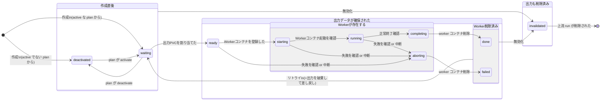

ユーザーガイド
============

本書は、Knitfab のユーザを対象に、Knitfab の概念と利用法について説明する。

コンセプトについて述べている部分は、Knitfab に関わるあらゆる人にとって、基本的な考え方を理解するうえで有用である。
それ以外の章は、もっぱら機械学習タスクを Knitfab 上で実行したいユーザに向けて書かれている。

他言語版/Translations
---------------------

- en: [./user-guide.en.md](./user-guide.en.md)

Knitfab のコンセプト
--------

Knitfab とは、

- タグベースのワークフローエンジンと
- 自動リネージ管理機能を有する
- MLOps ツール

である。

ワークフローエンジンは、ユーザの定義したプランにしたがって、必要なタスクを自動的に実行する。
自動リネージ管理機能は、ワークフローエンジンがタスクを遂行する際に、その各タスクと入出力の関係を追跡することで Knitfab が生成した全データの生成履歴を自動的に記録する。

### 機械学習タスク

Knitfab において機械学習タスク (を含む処理一般) はすべて、「入力をとって出力をあたえるもの」として抽象化される。
すなわち、ほぼ任意のプログラムを機械学習タスクとして利用することができる。

ただし、機械学習タスクの制約は次のものである。

- 入力はファイルシステム (ディレクトリ) からファイルを読み込むことでおこなう。
- 出力は、標準出力・標準エラーに書き出すか、ファイルシステム（ディレクトリ）にファイルを書き出すことでおこなう。
- コンテナイメージ ( docker イメージ) としてパッケージングされている。

たとえば「あるディレクトリから訓練データを、また別のディレクトリから訓練時ハイパーパラメータを読み取って (ここまでが入力) 、あるディレクトリにモデルを、また別のディレクトリに学習時メトリクスを書き出す (これらが出力) 」というようなプログラムは Knitfab の機械学習タスクとして適当である。

### タグ

Knitfab が管理するリソースには "タグ" を設定できるものがある。
"タグ" はキー:バリュー形式をとるメタデータであり、概ね自由に設定できる。

たとえば、次のようなタグを考えることができる。

- `project: some-project`: あるプロジェクトに関連するリソースであることを示す
- `type: dataset`: "データ" の種類がなんらかのデータセットであることを示す
- `format: mnist`: "データ" が MNIST 形式にフォーマットされていることを示す
- `mode: train`: "データ" が訓練時に使われることを意図していることを示す

これらの "タグ" 一式がついたデータがあれば、それは mnist の訓練用データセットであろう。

いずれも、最初の `:` の前までがキーであり、その後がバリューである。

"タグ" のキーには、次の制約がある。

- 文字 `:` は使えない。
- `knit#` から始まるキーは Knitfab が予約している ("システムタグ") ので、ユーザは設定できない。

### データ

"データ" とは、機械学習タスクの入出力である。 "データ" はディレクトリを単位にしている。
もちろん、ある機械学習タスクが出力として書き出した "データ" は、他の機械学習タスクが入力として利用できる。

"データ" には "タグ" をつけることができる。 "データ" の "タグ" は「この "データ" は何か？ どういう性質のものか？」というメタデータである。

"データ" は一度作成されると、その "タグ" を除き、内容が変更されることはない (イミュータブル) 。

### プラン

"プラン" とは、機械学習タスクの定義である。すなわち、

- どのような処理を実行するのか
- どのような "データ" を、どのファイルパスに入力として割り当てるのか
- どのファイルパスは出力であり、その出力はどのようなデータなのか

といった内容を定めたものである。

"プラン" は次のような yaml で定義される。

```yaml
image: "localhost:30503/Knitfab-first-validation:v1.0"

inputs:
  - path: "/in/dataset"
    tags:
      - "type:dataset"
      - "mode:test"
      - "project:some-project"
  - path: "/in/model"
    tags:
      - "type:model"
      - "framework:pytorch"
      - "project:some-project"

outputs:
  - path: "/out/metrics"
    tags:
      - "type:csv"
      - "project:some-project"

log:
  tags:
    - "type:log"
    - "project:some-project"
    - "type:text"
```

- `image`: 処理の内容をコンテナイメージとして指定している。
- `inputs`, `outputs`: 入力や出力を示している。
    - ファイルパスに対して "タグ" を指定している。
- `log`: 機械学習タスクから書き出された標準出力と標準エラーを、 "データ" として記録する。
    - これもある種の出力であるので、 "タグ" が指定できる。

入力の "タグ" は「その入力には、どういう "データ" が割り当てられてよいか」を示している。
Knitfab がある入力に割り当てる "データ" は、その入力の "タグ" をすべて持っている "データ" である。

出力の "タグは" 「その出力に書き出された "データ" には、どういう "タグ" を指定すべきか」を示している。
機械学習タスクが実行された際に出力された "データ" が新規に作成されるのであるが、このときにセットされる初期状態の "タグ" を、出力の "タグ" として指定する。

### ランとリネージ

"ラン"とは、実行された機械学習タスクの記録である。"ラン" は "プラン" をひな形として、入出力に具体的な "データ" を割り当てることで生成される。Knitfab は各 "プラン" の入力について、割り当て可能な "データ" を検出すると、自動的にその "プラン" と "データ" の組み合わせから "ラン" を生成する。

ある "プラン" に対して、可能な入力の割り当て方は複数通り存在する場合がある。
たとえば、 "プラン" のセクションで示した例をとれば、 `/in/dataset` に設定可能な "データ"  (評価用データセット) が 2 通り、 `/in/model` に設定可能な "データ" (訓練済みモデル) が 3 通りあれば、 Knitfab は $2 \times 3 = 6$ 個の "ラン" をそれぞれ生成・実行する。

"ラン" は具体的な入力 "データ" と出力 "データ" 、およびその "ラン" の元となった "プラン" の情報から構成されている。
これは「どの機械学習タスクに、何を入力したら、何が出力されたか」という記録、すなわちリネージの 1 ステップ分にほかならない。
Knitfab はリネージを "ラン" と "データ" の依存関係が連鎖している様として表現しているということである。

"ラン" に対応する機械学習タスクは、Kubernetes の Pod として、他から隔離された環境で実行される。
この Pod は、"ラン" の入出力に割り当てられた "データ" をボリュームとしてマウントされた状態で、"ラン" を生成した "プラン" に指定されたイメージを実行するように起動される。
Knitfab はこの Pod の状態を監視していて、Pod が正常に終了すれば "ラン" も正常に終了したものと記録され、出力 "データ" の作成が完了する。
"データ" の作成が完了すると、それをいずれかの "プラン" の入力に割り当てることができるか自動的にチェックされ、連鎖的に "ラン" が実行されることになる。

CLI ツール: knit
-----------------

Knitfab ユーザは、Knitfab に対する操作を CLI コマンド `knit` を介して行う。

CLI を入手する方法については getting-started に記載がある。

### サブコマンド

`knit` は、取り扱う概念ごとにサブコマンドに分かれている。

- `knit data` : "データ" を操作するコマンド群
    - 例: `knit data pull` : Knitfab に記録されている "データ" をダウンロードする。
- `knit plan` : "プラン" を操作するコマンド群
    - 例: `knit plan apply` : Knitfab に "プラン" を登録する。
- `knit run` : "ラン" を操作するコマンド群
    - 例: `knit run find`: "ラン" を検索する

この他にも管理用のサブコマンドがある。具体的なタスクについて解説する際に、随時紹介する。

クラスタに接続する、プロジェクトを管理する
-----------------------------------

Knitfab はサーバ・クライアント型のシステムである。
CLI `knit` は Knitfab サーバに対してリクエストを送り、実際の処理等はサーバ側で実施される。

`knit` コマンドを使うに先立ち、その接続設定が必要である。

### ハンドアウト

Knitfab を利用するために必要な設定ファイルのセット (ハンドアウト) を、Knitfab の管理者 (インストール実施者) から受け取ってほしい。

ハンドアウトは Knitfab をインストールしたときに生成されるもので、 Knitfab に接続するために必要な情報が含まれている。

### (必須) Knitfab に接続する

Knitfab に接続するには、接続プロファイル(knitprofile)を knit コマンドに登録する必要がある。
接続プロファイルはハンドアウトに含まれている。

続いて、

```
knit init path/to/handout/knitprofile
```

というコマンドを実行すると、指定した knitprofile があなたのプロファイルストアに取り込まれる。
プロファイルストアは、デフォルトでは `~/.knit/profile` である。

これで `knit` コマンドが Knitfab に接続できるようになる。

### (必須; on-prem) Docker に Knitfab を信頼させる

Knitfab はクラスタ内にプライベートなコンテナイメージレジストリを持っている。
これを使えば、ユーザが自分で作成したイメージを、Knitfab だけで使える機械学習タスクとして登録できる。

ただし、このクラスタ内イメージレジストリを利用する場合には、その TLS 証明書を、お使いの docker に信頼させる必要がある。

ハンドアウト内に `docker/certs.d` というディレクトリがある。この内容を docker の設定として取り込む。

**linux-like 環境の場合:**

> [!Note]
>
> このパターンは、Windows や MacOS などで、dockerd を linux 仮想マシン上で実行している場合 (例: docker-machine, colima, minikube) も含む。
>
> この場合、仮想マシン側の `/etc/docker/certs.d` 内に証明書が配置されている必要がある。
>

```
cp -r path/to/handout/docker/certs.d/* /etc/docker/certs.d/
```

場合によっては `sudo` する必要があるだろう。

詳細は https://docs.docker.com/engine/security/certificates/ を参照されたい。

**windows 環境の docker Desktop の場合**

```
cp -r path\to\handout\docker\certs.d/* %USERPROFILE%\docker\certs.d
```

上記コマンドを実行したうえで、docker Desktop を再起動する。

詳細は https://docs.docker.com/desktop/faqs/windowsfaqs/#how-do-i-add-custom-ca-certificates や https://docs.docker.com/desktop/faqs/windowsfaqs/#how-do-i-add-client-certificates を参照されたい。

### (選択) プロジェクト固有の設定を共有する

Knitfab をつかったプロジェクトでは、他のチームメンバーと一部コマンドのデフォルト挙動を共有できる。

設定ファイル `knitenv` を作成すると、そのファイルがあるディレクトリか、その子孫ディレクトリにおいては、`knitenv` の内容が反映される。

`knitenv` ファイルは次のような構造をした yaml ファイルである。

```
tag:
    - project:some-project
resource:
    cpu: 1
    memory: 1Gi
```

各キーの意味は次の通りである。

- `tag`: "データ" や "プラン" 入出力に標準的にセットする"タグ" (複数設定可。デフォルトは空)
    - 上記の例では、登録するすべてのデータや、作成するプランには "タグ" として `project:some-project` が自動的に設定される。
- `resource`: "プラン" 定義のテンプレート作成時における、所要計算機リソース。
    - この例は、この "プラン" の処理には CPU を 1 コア、メモリを 1 GB 使うことをプロジェクトのデフォルトとしている。
    - この項目の詳細は、 "プラン" 定義のセクションに譲る。

このファイルはチームで共有することが想定されている。
機械学習プロジェクトを git などでバージョン管理しているなら、バージョン管理の対象とするとよいだろう。

データを管理する
-----

"データ" とは、機械学習タスクの結果 (が含まれたディレクトリ) にタグがついたもの、のことである。
また、 "データ" はユーザが Knitfab に登録することで作成することもできる。

作成された "データ" は 各 "プラン" の入力を突き合わせて、実行可能な "プラン"があれば、"ラン" として実行される。

本章ではこの "データ" の取り扱いについて述べる。

### データを登録する

手元にあるデータセットなどのファイル群を機械学習タスクの入力として使いたい場合は、それを "データ" として Knitfab に登録する。

次のようにする。

```
knit data push -t your:tag /path/to/data
```

こうすると、ディレクトリ `/path/to/data` を Knitfab にアップロードして、Knitfab の "データ" として扱えるようになる。

フラグ `-t` は、 "データ" をアップロードする際に、合わせて "データ" に "タグ" を設定することを意味する。この例では、 "データ" が登録できると `your:tag` という "タグ" も設定されることになる。

フラグ `-t` を与えなくても、`knitenv` に記述されている `tag` エントリの "タグ" は、暗黙に設定される。

コマンドを実行すると、処理の進捗ログに続いて、登録された "データ" のメタデータがコンソールに表示される。

```json
{
    "knitId": "a0f5911d-5ac5-4035-8c91-9946b02adc70",
    "tags": [
        "knit#id:a0f5911d-5ac5-4035-8c91-9946b02adc70",
        "knit#timestamp:2024-03-06T09:25:16.586+00:00",
        "project:some-project",
        "your:tag"
    ],
    "upstream": {
        "path": "/upload",
        "tags": [],
        "run": {
            "runId": "a5c1106c-122f-416c-b4f4-e6dd03af212c",
            "status": "done",
            "updatedAt": "2024-03-06T09:25:16.586+00:00",
            "plan": {
                "planId": "fb9b7087-9fe7-43c3-9302-a35488c85ffb",
                "name": "knit#uploaded"
            }
        }
    },
    "downstreams": [],
    "nomination": []
}
```

- `knitId`: この "データ" を特定する ID である。
- `tags`: この "データ" に設定されている "タグ" が示されている。
    - システムが自動的に割り当てた "タグ"  (キーが `knit#` 始まり) と、ユーザが自分で設定した "タグ" が含まれている。
    - 加えて `kntienv` に設定されていた "タグ" があれば、それも設定されていることがわかる。
- `upstream`: この "データ" が書き出された出力と、その "ラン" の情報が示されている。
    - 今回は "データ" のアップロードを受け付ける、特殊な "プラン" の "ラン" が表示されている。
- `downstream`: この "データ" を利用している "ラン" の情報が含まれる。 (もしあれば)
- `nomination`: この "データ" が割り当てられてる "プラン" の入力の情報が含まれる。 (もしあれば)

#### コマンドラインオプション

- `-t key:value`, `--tag key:value`: 登録する "データ" に "タグ" を設定する。
- `-n`, `--name`: ディレクトリ名に基づいた "タグ" を設定する。
    - 設定される "タグ" は `name:${ディレクトリ名}` になる。
- `-L`, `--dereference`: ディレクトリ内の symlink をたどって、symlink ではなくリンク先を登録する。
    - このフラグを渡さないと、symlink は symlink のまま登録されることになる。
    - `knit` はリンク先が "データ" に含まれるかどうか、という検証は行わない。

### データを確認する

#### メタデータを確認する

登録された "データ" について、そのメタデータをあとから確認したい、ということもあるだろう。
たとえば、

- いまどんな "タグ" が設定されているのか？
- どんな "プラン" に入力される可能性があるのか？
- どんな "ラン" の入力として使われたのか？

こうした "データ" のメタデータを調べるには、次のようにする。

```
knit data find -t knit#id:KNIT-ID
```

`KNIT-ID` の部分は、関心のある "データ" の ID に置き換えてほしい。

コマンド `knit data find` は "データ" を検索するためのコマンドである。

フラグ `-t` は「この "タグ" をもっていること」を検索条件として指定するものであるが、ここに `knit#id:` "タグ" の値として "データ" の ID を指定した。結果として、特定の "データ" についてメタデータを得ることができる。

次のような結果が返されるだろう。

```json
[
    {
        "knitId": "5ea1b982-0e2c-4e02-adb6-431da718c7c1",
        "tags": [
            "format:mnist",
            "knit#id:5ea1b982-0e2c-4e02-adb6-431da718c7c1",
            "knit#timestamp:2024-10-16T09:03:42.726+00:00",
            "mode:training",
            "name:qmnist-train",
            "project:first-knitfab",
            "type:dataset"
        ],
        "upstream": {
            "path": "/upload",
            "tags": [],
            "run": {
                "runId": "0f6ffd26-9917-4d37-8f24-5bc920ef4c26",
                "status": "done",
                "updatedAt": "2024-10-16T09:03:42.726+00:00",
                "plan": {
                    "planId": "ea0fd879-c5f3-4c8c-9ff6-23852f4d3e46",
                    "name": "knit#uploaded"
                }
            }
        },
        "downstreams": [
            {
                "path": "/in/1/dataset",
                "tags": [
                    "mode:training",
                    "project:first-knitfab",
                    "type:dataset"
                ],
                "run": {
                    "runId": "95fa5441-0146-42a7-86e7-48593d2666ad",
                    "status": "done",
                    "updatedAt": "2024-10-17T02:32:06.928+00:00",
                    "exit": {
                        "code": 0,
                        "message": ""
                    },
                    "plan": {
                        "planId": "9e5dd235-02e3-4700-a174-f2a50f74c8ba",
                        "image": "localhost:30503/knitfab-first-train:v1.0",
                        "entrypoint": [
                            "python",
                            "-u",
                            "train.py"
                        ],
                        "args": [
                            "--dataset",
                            "/in/1/dataset",
                            "--save-to",
                            "/out/1/model"
                        ],
                        "annotations": [
                            "description=this is knitfab hands-on plan",
                            "detailed-description=this is detailed description\n containing new line."
                        ]
                    }
                }
            }
        ],
        "nomination": [
            {
                "path": "/in/dataset",
                "tags": [
                    "mode:training",
                    "project:first-knitfab",
                    "type:dataset"
                ],
                "plan": {
                    "planId": "352b17f7-1dde-437f-b4b9-d473e2bb13ec",
                    "image": "localhost:30503/knitfab-first-train:v1.0",
                    "annotations": [
                        "description=this is knitfab hands-on plan",
                        "detailed-description=this is detailed description\n containing new line."
                    ]
                }
            }
        ]
    }
]
```

各要素の構造は「 "データ" を登録する」のセクションで説明したものと同じである。この例では、他の "ラン" に入力として使われたことがある "データ" なので、`downstreams` や `nomination` にも内容が含まれている。

##### コマンドラインオプション

- `-t key:value`, `--tag keu:value`: 指定した "タグ" を持った "データ" を検索する。
    - 複数指定した場合は、すべての "タグ" をもった "データ" のみを検索対象とする。

`-t` を全く指定しない場合は、すべての "データ" が検索にヒットする。

#### データそのものをダウンロードする

メタデータを見るだけではなくて、 "データ" そのものをダウンロードすることもできる。

モデルパラメータや評価結果などは、しばしばダウンロードしたくなるだろう。

```
knit data pull -x KNIT_ID path/to/dest
```

このコマンドは ID `KNIT_ID` で特定される "データ" の内容を、ディレクトリ `path/to/dest/${KNIT_ID}` に書き込む。

##### コマンドラインオプション

- `-x`: "データ" をダウンロードして、展開する。
    - これを指定しない場合は、 `path/to/dest/${KNIT_ID}.tar.gz` に `tar.gz` 圧縮ファイルとしてダウンロードする。

### データのタグを変更する

すでに登録されている "データ" の "タグ" を変更できる。

たとえば、

- 「デプロイされている」ことを示す "タグ" `deployed:true` があったとして、これを他の "データ" に移したい。
- ある "データ" を、もう "ラン" の入力として使ってほしくないので、 "タグ" を除去したい。
- ある "データ" を、ある "プラン" にも使いたくなったので、 "タグ" を追加したい。

といった場合に有用である。

"タグ" を追加するには

```
knit data tag --add new:tag KNIT_ID
```

とすると、ID `KNIT_ID` で特定される "データ" に対して "タグ" `new:tag` が追加される。

また、

```
knit data tag --remove old:tag KNIT_ID
```

とすると、ID `KNIT_ID` で特定される "データ" から "タグ" `old:tag` が除去される。

タグを削除するに当たり、特定のキーを有するものを一括除去することもできる。

```
knit data tag --remove-key example-key KNIT_ID
```

こうすることで、 ID `KNIT_ID` で特定される "データ" から、キー `example-key` を有するタグをすべて除去できる。

"データ" に存在する "タグ" を追加したり、まだない "タグ" を除去したりしようとした場合には、何もおきないだけでエラーにはならない。

この場合でも、キーが `knit#` から始まる "タグ" は追加したり除去したりすることはできない。システムが予約・管理しているからある。

#### コマンドラインオプション

- `--add KEY:VALUE`: "タグ" を追加する
- `--remove KEY:VALUE`: キーと値が一致する "タグ" を除去する
- `--remove-key KEY`: キーが一致するタグをすべて除去する。

いずれも複数回指定でき、すべて効果を発揮する。

`--remove` や `--remove-key` と `--add` を同時に指定した場合には、まず除去してから、続いて追加を行う。
したがって、 `knit data tag --remove foo:bar --add foo:bar KNIT_ID` としたなら、その "データ" は最終的に `foo:bar` でタグ付けられることになる。

### データは削除できない

Knitfab においては、特定の "データ" のみを直接削除することはできない。

ただし、 "ラン" を削除すると、その "ラン" の出力 "データ" ごと削除されるので、 "データ" が不要である場合にはこの方法をとることになる。

詳細は「ランを管理する」の章を参照されたい。

プランを管理する
-----

"プラン" は、Knitfab において、機械学習タスクの定義を与えるものである。

これを Knitfab に登録すると、その定義に従って Knitfab が実行可能な入力のパターンを算出し、自動的に "ラン" を生成する。

本章では、 "プラン" の取り扱いについて述べる。

### プラン定義を登録する

Knitfab に "プラン" を登録するには、次のようにする。

```
knit plan apply path/to/plan_definition.yaml
```

"プラン" 定義ファイル `path/to/plan_definition.yaml` を指定すると、Knitfab にその内容で "プラン" が登録される。

#### プラン定義を記述する

"プラン"定義ファイルは、「どのイメージに」「どんな入力を与えると」「どんな出力が得られるのか」ということを中心的な内容とした yaml ファイルである。

**最小限の** "プラン"定義ファイルは、およそ次のようなものだ。

```yaml
image: "localhost:30503/train:v1.0"

inputs:
  - path: "/in/dataset"
    tags:
      - "project:some-project"
      - "type:dataset"
      - "mode:train"
  - path: "/in/params"
    tags:
      - "project:some-project"
      - "type:hyper-params"
      - "format:yaml"

outputs:
  - path: "/out"
    tags:
      - "project:some-project"
      - "type:model"

logs:
  - "project:some-project"
  - "type:log"
```

- `image`: 処理内容として、「どのイメージに」を指定する。
    - コンテナイメージ名を、タグまで指定する。
        - イメージ名は `[ホスト:ポート/][リポジトリ/]名前:タグ` という構造をしている。
    - Knitfab 内のイメージレジストリに登録したイメージが使いたい場合、
        - ホストは `localhost` とする。
        - ポートは、標準的なインストールなら例のとおり `30503` である。詳細はインストールを実施した管理者に確認してほしい。
- `inputs`: 「どんな入力を与えると」を指定する。
    - 個々の入力は `path` と `tags` の組である。複数の入力を指定できる。
        - 例では、2 つの入力 `/in/dataset` と `/in/params` があることになっている。
    - 各入力について、
        - `path` は、このタスクを実行する際に、コンテナのどのディレクトリに入力を与えるか、を示す。
        - `tag` は、どんなデータならこの入力に割り当ててよいか、を示す。
            - `tag` には、 "システムタグ" である `knit#id` や `knit#timestamp` を指定することが **できる** 。"データ" を特定した上でなにかしたいことがある場合には有用だろう。
    - 入力は、すくなくとも 1 つは必要である。また、どの入力も、少なくとも 1 つは "タグ" が設定されている必要がある。
- `outputs`: 「どんな出力が得られるのか」を指定する。
    - これも `path` と `tags` の組になっている。`inputs` と同様、複数の出力を指定できる。
    - 各出力について、
        - `path` は、コンテナのどのディレクトリにタスクの出力が書き出されるのか、を示す。
        - `tags` は、この出力の "データ" が作られたときに最初に自動的にセットされる "タグ" 集合を示す。
    - 出力は、0 個でも構わない。
- `logs`: タスクのログ（標準出力と標準エラー）を収集して "データ" にする、特殊な出力である。
    - オプショナルである。省略すると、その "プラン" に基づく "ラン" のログは記録されずに破棄される。
    - `tags` は `outputs` の `tags` 同様、書き出されたログに自動的に指定する "タグ" 集合である。

"プラン" 定義ファイルは、いきなり手で書くよりも、ひな型を生成することをお勧めする。

```
knit plan template --scratch > template.plan.yaml
```

とすると、空のひな型が `template.plan.yaml` に生成される。


また、使いたいコンテナイメージが既に決まっている場合には、

```
docker save IMAGE_NAME:TAG | knit plan tempalte > IMAGE.TAG.plan.yaml
```

( `IMAGE_NAME:TAG` は使いたいイメージに合わせて適宜変更して欲しい)

とすると、イメージの内容を反映したひな型が生成される。この場合でも、内容を確認して、実際の要求に合うように調整する必要があるだろう。

ここに示したもの以外にも、オプショナルな属性が存在する。

### `entrypoint` と `args`

"プラン" に基づく "ラン" の Pod を実行するにあたって、Pod に指定される [entrypoint と args](https://kubernetes.io/docs/reference/kubernetes-api/workload-resources/pod-v1/#entrypoint) を指定できる。

```yaml
entrypoint: ["python", "main.py"]
args: ["--arg", "value"]
```

`entrypoint` と `args` （一方だけでもよい）を指定することで、 "プラン" の `image` に設定されているデフォルトのエントリポイントと引数を上書きできる。

#### `annotation`

入出力の"タグ"とは別に、 "プラン" 自体にもメタデータをセットすることができる。それが `annotation` (アノテーション) である。

```yaml
annoation:
    - key=value
    - description=...
    # ...
```

アノテーションは "キー=値" 組のリストであり、内容は任意である。その"プラン"についての説明、作成者の情報など、実務上の必要に応じて自由に設定するとよい。
アノテーションはリネージとは無関係であり、どのようなアノテーションがセットされていたとしても、Knitfab が "プラン" から "ラン" を生成する挙動には影響しない。

ひとつの Plan に複数のアノテーションを登録できる。また、キーが重複したアノテーションでも、値が異なるものは登録できる。たとえば、次のような `annotation` は有効である。

```yaml
annoation:
    - created-by=Alice
    - created-by=Bob
    - created-by=Charie
```

`annotation` は"プラン"作成後にも変更可能なパラメータである。

#### `active`

```yaml
active: true
```

"プラン" の "アクティブ性" を指定する。 `active: true` (アクティブ) な "プラン" の "ラン" だけが、実際に計算される。デフォルトは `true` である。

"プラン" を登録する際、いきなりその "プラン" の "ラン" が実行されては困る、というケースもあるだろう。
その場合には、 `active: false` (非アクティブ) をセットした "プラン" 定義ファイルを `knit plan apply` するとよい。

`active` はプラン作成後にも変更可能なパラメータである。

#### `resource`

```yaml
resources:
  cpu: 1
  memory: 1Gi
```

この "プラン" に基づく "ラン" に割り当てる計算機資源の制限を指定できる。
デフォルトは上記の通り CPU 1 コア、メモリ 1 GiB である。
`resources.cpu` や `resources.memory` は、省略した場合にはこの通りのデフォルトが適用される。

また、 `knitenv` ファイルに `resources` が定義されていれば、デフォルトの代わりにそちらが利用されることになる。

もしより多くのリソースが必要なら、設定を変更する。また、小数値も指定できる。
たとえば、 2.5 コア・3.5GiB のリソースが必要だと見込まれるなら

```yaml
resources:
  cpu: 2.5
  memory: 3.5Gi
```

とすればよい。

この他にも、GPU などの計算機資源について、その要求を `resources` セクションに記述できる可能性がある。

```yaml
resources:
  cpu: 1
  memory: 1Gi
  nvidia.com/gpu: 1
```

`cpu` と `memory` 以外に指定できる計算機資源タイプは、Knitfab の基盤となっている kubernetes クラスタに依存して決まっている。設定可能な値は、お使いの Knitfab の管理者に確認してほしい。

> **Advanced Note**
>
> この値は、最終的には kubernetes の pod 定義における `resources.limits` と `resources.requests` として使われる。
>

`resource` はプラン作成後にも変更可能なパラメータである。

### service_account

```yaml
service_account: SERVICE_ACCOUNT_NAME
```

"プラン"に基づく"ラン"は、Kubernetes の Pod として実行される。`service_account` には、この Pod に指定される Kubernetes の [ServiceAccount](https://kubernetes.io/docs/concepts/security/service-accounts/) を指定できる。

この項目はオプショナルであり、設定しなかった場合には ServiceAccount なしで Pod が起動することになる。"ラン" のタスクが Pod 内に閉じているのなら、ServiceAccount は不要であろう。

クラスタに存在する ServiceAccount については、クラスタの管理者に問い合わせて欲しい。

`service_account` はプラン作成後にも変更可能なパラメータである。

#### on_node

ある種の計算タスクは特定の計算機で実行したい、というケースがあるだろう。

たとえば、

- 訓練タスクは GPU のある計算機上で実行する必要があるが、評価タスクはそうではないかもしれない。
- CPU で十分なタスクは GPU のある計算機を避けて、貴重な計算機資源を必要としているタスクを優先したいだろう。

`on_node` に適当な値を設定することで、この "プラン" の "ラン" を配置する計算機を制限できる。

```yaml
on_node:
  may:
    - "key=value"
  prefer:
    - "vram=large"
  must:
    - "accelarator=gpu"
```

`on_node.may`, `on_node.prefer`, `on_node.must` のいずれも、「ラべル」 (`key=value`) の配列を指定する。
ここに指定するラベルは、計算機のメタデータとしてのラベルである。
意味のある値については、Knitfab がインストールされている kubernetes クラスタを構築した管理者に問い合わせてほしい。

どの項目オプショナルであって、省略すると、その項目にはラベルをまったく指定しなかったものと同じことになる。
`on_node` 自体を省略した場合は、すべての項目が空であるものと同じである。

それぞれの意味するところは次のとおりである。

- `may`:
    - そのラベルのある計算機で実行され **てもよい** ことを意味する。
    - そのラベルがある計算機は、通常は計算タスクを受け取らないように設定されているだろう。
- `prefer`:
    - そのラベルのある計算機で、 **できることなら実行する** ことを意味する。
    - もし計算機が空いていなければ、そのラベルがない計算機を使うかもしれない。
- `must`:
    - そのラベルがある計算機 **のみで実行される** ことを意味する。
    - 万一、そのラベルがある計算機が存在しなければ、 "ラン" は進行しないだろう。

> **Advanced Note**
>
> この値は kubernetes の torelation と node affinity の組み合わせとして使われる。
>
> - `may` に指定したラベルは torelation (`NoSchedule`) になる。
> - `prefer` に指定したラベルは torelaton (`NoSchedule` + `PreferNoSchedule`) と node affinity (`preferredDuringSchedulingIgnoredDuringExecution`) になる。
> - `must` に指定したラベルは torelation (`NoSchedule` + `PreferNoSchedule`) と node affinity (`requiredDuringSchedulingIgnoredDuringExecution`) になる。
>
> これらの指定が有効に機能するためには、管理者によって kubernetes クラスタが適切に設定されている必要がある。
>

`on_node` はプラン作成後に変更可能なパラメータである。

### プラン定義を確認する

登録済みの "プラン" 定義は、次のようにして確認できる。

```
knit plan show PLAN_ID
```

`PLAN_ID` の部分に詳細を知りたい "プラン" の ID を指定したらよい。
指定した "プラン" が存在していれば、次のようなコンソール出力が得られる。

```json
{
    "planId": "d134463a-9766-4e43-8f87-002e48d624a6",
    "image": "localhost:30503/knitfab-first-train:v1.0",
    "entrypoint": [
        "python",
        "-u",
        "train.py"
    ],
    "args": [
        "--dataset",
        "/in/dataset",
        "--save-to",
        "/out/model"
    ],
    "annotations": [
        "description=this is knitfab hands-on plan",
        "detailed-description=this is detailed description\ncontaining new line."
    ],
    "inputs": [
        {
            "path": "/in/dataset",
            "tags": [
                "mode:training",
                "project:first-knitfab",
                "type:dataset"
            ],
            "upstreams": []
        }
    ],
    "outputs": [
        {
            "path": "/out/model",
            "tags": [
                "description:2 layer CNN + 2 layer Affine",
                "project:first-knitfab",
                "type:model"
            ],
            "downstreams": [
                {
                    "plan": {
                        "planId": "a363ba5d-b874-496a-8f40-ee1ebf28b8e6",
                        "image": "localhost:30503/knitfab-first-validation:v1.0",
                        "entrypoint": [
                            "python",
                            "-u",
                            "validation.py",
                            "--dataset",
                            "/in/dataset",
                            "--model",
                            "/in/model/model.pth"
                        ],
                        "annotations": [
                            "test=annotation"
                        ]
                    },
                    "mountpoint": {
                        "path": "/in/model",
                        "tags": [
                            "project:first-knitfab",
                            "type:model"
                        ]
                    }
                },
            ]
        }
    ],
    "log": {
        "Tags": [
            "project:first-knitfab",
            "type:log"
        ],
        "downstreams": []
    },
    "active": true,
    "resources": {
        "cpu": "1",
        "memory": "1Gi"
    }
}
```

"プラン" 定義とよく似た構造をしている。

"プラン" 定義に存在しなかった要素として、出力およびログの `"downstreams"` と、入力の `"upstreams"` が追加されている。
これらは、各入出力およびログが、他のどの "プラン" と関係があるか、ということを示している。

`"downstreams"` には、その出力（に対応する "ラン" の出力）から生成された "データ" が、他のどの "プラン" の入力に割り当てられるか、を示している。
`"upstreams"` はその逆である。上に示した例で `"downstreams"` に見える "プラン" について `knit plan show` すると、次のような結果になる。

```json
{
    "planId": "a363ba5d-b874-496a-8f40-ee1ebf28b8e6",
    "image": "localhost:30503/knitfab-first-validation:v1.0",
    "entrypoint": [
        "python",
        "-u",
        "validation.py",
        "--dataset",
        "/in/dataset",
        "--model",
        "/in/model/model.pth"
    ],
    "annotations": [
        "test=annotation"
    ],
    "inputs": [
        {
            "path": "/in/dataset",
            "tags": [
                "mode:test",
                "project:first-knitfab",
                "type:dataset"
            ],
            "upstreams": []
        },
        {
            "path": "/in/model",
            "tags": [
                "project:first-knitfab",
                "type:model"
            ],
            "upstreams": [
                {
                    "plan": {
                        "planId": "d134463a-9766-4e43-8f87-002e48d624a6",
                        "image": "localhost:30503/knitfab-first-train:v1.0",
                        "entrypoint": [
                            "python",
                            "-u",
                            "train.py"
                        ],
                        "args": [
                            "--dataset",
                            "/in/dataset",
                            "--save-to",
                            "/out/model"
                        ],
                        "annotations": [
                            "description=this is knitfab hands-on plan",
                            "detailed-description=this is detailed description\ncontaining new line."
                        ]
                    },
                    "mountpoint": {
                        "path": "/out/model",
                        "tags": [
                            "description:2 layer CNN + 2 layer Affine",
                            "project:first-knitfab",
                            "type:model"
                        ]
                    }
                }
            ]
        }
    ],
    "outputs": [],
    "log": {
        "Tags": [
            "project:first-knitfab",
            "type:log",
            "type:validation"
        ],
        "downstreams": []
    },
    "active": true,
    "resources": {
        "cpu": "1",
        "memory": "1Gi"
    }
}
```

"プラン"　の情報を調べるにあたり、 もし関心のある "プラン" の ID がわからないなら、検索することもできる。

イメージ名がわかっているなら、

```
knit plan find --image HOST:PORT/IMAGE:TAG
```

とすればよい。

入力や出力に使われている "タグ" がわかっているなら、

```
knit plan find --in-tag KEY:VALUE
```

```
knit plan find --out-tag KEY:VALUE
```

と指定できる。

アクティブな "プラン" に限定したければ

```
knit plan find --active yes
```

とする。

これらの検索条件は同時に指定でき、すべての条件を満たした "プラン" だけが検索にヒットする。

さらに `--in-tag` と `--out-tag` は繰り返し指定でき、その場合はすべての "タグ" を持っている入力や出力がある場合にだけ検索にヒットするようになる。

`knit plan find` は検索条件なしに実行されると、すべての "プラン" を検索にヒットさせる。

#### コマンドラインフラグ: `knit plan find`

- `--active MODE`: "プラン" がアクティブ (または非アクティブ) であるものに限る。
    - mode として指定できる値は次の通り:
        - `both` (デフォルト): アクティブ性を条件にしない。
        - `yes`, `true`: アクティブなものだけを検索する。
        - `no`, `false`: アクティブでないものだけを検索する。
- `--image IMAGE[:TAG]`: "プラン" のイメージに基づいて検索する。
    - `TAG` は省略できる。その場合は、イメージのタグを無視して検索する。
    - `IMAGE` の部分は、 "プラン" 定義として登録したイメージのホスト名やポートも一致するものを検索する。部分一致はとらない。
- `-i KEY:VALUE`, `--in-tag KEY:VALUE`: 指定した "タグ" が設定されている入力をもつものに限る。
    - もしこのフラグを繰り返し指定したら、すべての "タグ" が設定された入力があるものだけを検索する。
- `-o KEY:VALUE`, `--out-tag KEY:VALUE`: 指定した "タグ" が設定されている出力をもつものに限る。
    - もしこのフラグを繰り返し指定したら、すべての "タグ" が設定された出力があるものだけを検索する。

### プラン同士をつなげる・つながりを可視化する

Knitfab では、複数の "プラン" を組み合わせて機械学習タスクのパイプラインを構築する。

たとえば、次の 2 つのプラン、trainer と validator が登録されているとする。

```yaml:trainer.plan.yaml
image: "localhost:30503/train:v1.0"
annotations:
  - "name=trainer"

inputs:
  - path: "/in/dataset"
    tags:
      - "project:some-project"
      - "type:dataset"
      - "mode:train"
  - path: "/in/params"
    tags:
      - "project:some-project"
      - "type:hyper-params"
      - "format:yaml"

outputs:
  - path: "/out"
    tags:
      - "project:some-project"
      - "type:model"

logs:
  - "project:some-project"
  - "type:log"
```

```yaml:validator.plan.yaml
image: "localhost:30503/validate:v1.0"
annotations:
  - "name=validator"

inputs:
  - path: "/in/dataset"
    tags:
      - "project:some-project"
      - "type:dataset"
      - "mode:validate"
  - path: "/in/model"
    tags:
      - "project:some-project"
      - "type:model"

outputs:
  - path: "/out"
    tags:
      - "project:some-project"
      - "type:report"

logs:
  - "project:some-project"
  - "type:log"
```

このとき、trainer に基づいた "ラン" が出力 `/out` から生成した "データ" は、自動的に validator の入力 `/in/model` に割り当てられる。というのも、trainer の出力 `/out` に指定されているタグが、validator の入力 `/in/model` のタグをすべて含む（この例では一致している）からである。

すると、 trainer に基づく "ラン" が正常に完了したときに、validator に基づく "ラン" も適宜生成されることになる。

このように、"プラン" の出力と、別の "プラン" の入力をタグベースで関連付け、"プラン" を連鎖反応させることが、Knitfab においてパイプラインを編み上げてゆくことなのである。

さて、そうして構築されたパイプラインがどういう構成をしているのか、調べたいことがある。次のコマンドを利用する。

```
knit plan graph PLAN_ID | dot -Tpng > graph.png
```

`knit plan graph` は引数 `PLAN_ID` に指定した "プラン" を起点に、前後 3 プランにわたるパイプラインを探索して、 dot 形式で書き出す。
上のコマンド例では、それを `dot` コマンドに通して PNG 形式の画像に変換している。次のような画像が得られる。


この画像は、パイプラインの下流側にあたる validator "プラン" を指定してパイプラインを描かせたものである。
図中の枠は "プラン"、 矢印はデータフローの向きを示している。

この図では、上側に trainer 、下側に validator が描かれている。細い黄色い枠の範囲がひとつの "プラン" に対応している。その中にある、太い黄色い内枠が "プラン" の概要（アクティブ性、ID、イメージ、アノテーション）を示している。
ID の背景に色がついている "プラン" は、`knit plan graph` に指定した "プラン"、すなわちパイプライン探索の起点である（この例では、 validator "プラン" がそれである）。

細い外枠上にある緑の小さな点は、"プラン" の入出力を示している。緑の点と "プラン" 本体をつなぐ矢印の向きは入出力に対応している。やじりが内枠側に向いているものが入力、やじりが緑の点に向いているものが出力である。ファイルパスは矢印のラベルとして示されている。

"プラン" 同士のつながりは、入出力同士をつなぐ太い矢印が示している。太い矢印のつながっていない入出力は、 `knit plan graph` の探索範囲にはその上流や下流の "プラン" が見つからなかったということである。

`knit plan graph` の探索範囲は `--numbers` (あるいは `-n`)フラグで指定できる。たとえば、起点から 10 "プラン" までの範囲で探したければ

```
knit plan graph -n 10 PLAN_ID
```

とすればよい。`-n all` を指定すれば、探索範囲は無制限になる。

起点プランから上流側だけを探索したいときは

```
knit plan graph --upstream PLAN_ID
```

とすればよい。また、下流側だけを探索したいときは、

```
knit plan graph --downstream PLAN_ID
```

とすればよい。

#### コマンドラインフラグ: `knit plan graph`

- `-n POSITIVE-INTEGER|"all"`, `--numbers POSITIVE-INTEGER|"all"`: 探索範囲を指定する。
    - 正の整数か、`all` を指定する。
        - 正の整数を指定した場合は、起点となる "プラン" からその数だけ離れたプランまでを探索する。
        - `all` を指定した場合は、探索範囲が無制限となる。
    - このフラグは省略できる。デフォルトは `3` である。
- `-u`, `--upstream`:　上流側を探索する。
    - 起点となる "プラン" から上流側、すなわち起点となる "プラン" の入力につながっている "プラン" を探索する。
- `-d`, `--downstream`: 下流側を探索する。
    - 起点となる "プラン" から下流側、すなわち起点となる "プラン" の出力につながっている "プラン" を探索する。

`-u` も `-d` も両方とも指定しなかった場合には、`knit plan graph` は `-u -d` の両方を指定されたものとして振る舞う（つまり、上流・下流の両方を探索する）。

### プランにアノテーションを追加する、削除する

"プラン" 本体のメタデータであるアノテーションは、 "プラン" 登録後に変更（= 削除、追加）できる。


"プラン" にアノテーションを追加する場合は、

```
knit plan annotate --add KEY=VALUE PLAN_ID
```

とする。`--add` フラグに追加したいアノテーションを、キーと値の組を `=` で繋いだものとして渡している。
こうすると、ID `PLAN_ID` で特定される "プラン" に新しいアノテーションを追加できる。

"プラン" からアノテーションを除去したい場合は、

```
knit plan annotate --remove KEY=VALUE PLAN_ID
```

とする。

また、"プラン" から、あるキーをもったアノテーションを取り除くには

```
knit plan annotate --remove-key KEY PLAN_ID
```

とすればよい。

削除しようとしたアノテーションが "プラン" に存在しない場合や、追加しようとしたアノテーションがすでに "プラン" に存在する場合には、無視される。

たとえば、 `aaa=bbb` というアノテーションのみを持っている "プラン" に対して

```
knit plan annotate --add aaa=bbb --add ccc=ddd --remove eee=fff PLAN_ID
```

とした場合、これは

```
knit plan --add ccc=ddd PLAN_ID
```

と等価である。

#### コマンドラインフラグ: `knit plan annotate`

- `--remove KEY=VALUE`: 指定した キー=値 をもったアノテーションを削除する。
- `--remove-key KEY`: 指定した キー をもったアノテーションをすべて削除する。
- `--add KEY=VALUE`: 指定した キー=値 のアノテーションを追加する。

いずれもオプショナルであり、繰り返し設定でき、同時に設定できる。

`--remove` や `--remove-key` と `--add` が同時に指定された場合には、先に削除をしてから、続いて登録を行う。

### プランをアクティブにする、非アクティブにする

もう使わない "プラン" は非活性にしたい。

```
knit plan active no PLAN_ID
```

こうすることで、指定した `PLAN_ID` で特定される "プラン" が非アクティブになる。
この "プラン" に基づく "ラン" のうち、開始される前のものは実行が抑止される。

また、事情があって非アクティブにしていた "プラン" も、アクティブに戻すことがあるだろう。
それには、次のようにする。

```
knit plan active yes PLAN_ID
```

`PLAN_ID` の "プラン" に基づく "ラン" のうち、実行が抑止されていたものは再度実行されるようになる。

### プランに ServiceAccount を設定する/除去する

"プラン" に ServiceAccount を設定する場合には、次のようにする。

```
knit plan serviceaccount --set SERVICE_ACCOUNT_NAME PLAN_ID
```

また、ServiceAccount を除去するには、次のようにする。

```
knit plan serviceaccount --unset PLAN_ID
```

コマンドラインフラグ `--set` と `--unset` は排他的であり、いずれか一方のみを指定することができる。

### プランが要求する計算機リソースを更新する

実際に計算タスクを実行してみたところ、"プラン" 定義に指定した計算機リソースに過剰や不足がある、とわかったとしよう。
特に不足の場合は計算が実行できないので、問題である。

そうした場合には、プランに指定されている計算機リソースを更新できる。

たとえば、「メモリが 10GiB 必要」なら、こうする。

```
knit plan resource --set memory=10Gi
```

「 CPU を 4 コア」にして計算を高速化したければ、

```
knit plan resource --set cpu=4
```

一般に、

```
knit plan resource --set TYPE=QUANTITY
```

とすると、計算機リソースの種類ごとに必要量を指定し直すことができる。

また、不要になった計算機リソースの制約は、 `--unset` で除去できる。

GPU が不要になったなら、次のコマンドを実行すればよい。

```
knit plan resource --unset gpu
```

ただし、 `--unset cpu` や `--unset memory` をしても、デフォルト値である 1 コア / 1GiB にフォールバックする。

ランを管理する
----

"ラン" は、"プラン" と "データ" の組み合わせから作られる。

ユーザは直接的に "ラン" を作ることはない。"ラン" を作り出して、計算を開始させ、終了を検出するのは原則として Knitfab の責務である。
"ラン" は背後で worker と呼ばれるコンテナを起動させる。実際の計算機タスクは worker コンテナ内部で実行される

本章では、そうした "ラン" の取り扱いについて述べる。

### ランのライフサイクル

"ラン" は実際の計算を伴う。そのため「計算の準備をして、計算を開始し、終了する」という一連のライフサイクルがある。
"ラン" の詳細に入ってゆく前に "ラン" のライフサイクルについて述べておく。



"ラン" は、この状態遷移図に示すライフサイクルをたどる。

- `waiting`, `deactivated`: "ラン" の初期状態
    - 次の場合に、 Knitfab は新しい "ラン" を生成する。
        - "プラン" の各入力に "データ" を割り当てることができた。
        - その入力と "データ" の組み合わせで実行された "ラン" がまだ存在しない。
- `ready`, `starting`: "ラン" の計算を開始する準備をし、計算を開始しつつある。
    - 準備ができると `ready`、その後コンテナの起動を試みると `starting` になる。
- `running`: 実際に計算が進行している。
- `aborting`, `failed`: 計算が失敗した。
     - 失敗が検出されると `aborting`、コンテナの削除まで終わると `failed` になる。
- `completing`, `done`: 計算は成功した。
     - 正常終了が検出されると `completing`、コンテナの削除まで終わると `done` になる。
     - **この状態になったランから出力されたデータだけが、他のランから入力として利用されることができる。**
- `invalidated`: Knitfab が内部管理用に利用している状態。ユーザはこの状態の "ラン" を目にすることはないだろう。

"ラン" が成功したかどうかは、ユーザ定義コンテナの終了ステータスによって決まる。
終了ステータスが `0` なら成功、それ以外は失敗である。

> python スクリプトでタスクを実装したなら、例外が `raise` されてプログラムが停止すると、プログラムは失敗する。

### ランを検索する

Knitfab 内の "ラン" は `run find` で検索できる。

たとえば、進行中の "ラン" について知りたければ、

```
knit run find -s ready -s starting -s running -s completing -s aborting
```

とすると、動きのある "ラン" に限って状態を見ることができるだろう。
`-s` は `--status` のエイリアスであり、繰り返し指定した場合にはいずれかの状態である "ラン" を探し出す。

次のような出力が得られるだろう。

```json
[
    {
        "runId": "95fa5441-0146-42a7-86e7-48593d2666ad",
        "status": "done",
        "updatedAt": "2024-10-17T02:32:06.928+00:00",
        "plan": {
            "planId": "9e5dd235-02e3-4700-a174-f2a50f74c8ba",
            "image": "localhost:30503/knitfab-first-train:v1.0",
            "entrypoint": [
                "python",
                "-u",
                "train.py"
            ],
            "args": [
                "--dataset",
                "/in/1/dataset",
                "--save-to",
                "/out/1/model"
            ],
            "annotations": [
                "description=this is knitfab hands-on plan",
                "detailed-description=this is detailed description\n containing new line."
            ]
        },
        "inputs": [
            {
                "path": "/in/1/dataset",
                "tags": [
                    "mode:training",
                    "project:first-knitfab",
                    "type:dataset"
                ],
                "knitId": "5ea1b982-0e2c-4e02-adb6-431da718c7c1"
            }
        ],
        "outputs": [
            {
                "path": "/out/1/model",
                "tags": [
                    "description:2 layer CNN + 2 layer Affine",
                    "project:first-knitfab",
                    "type:model"
                ],
                "knitId": "88d60df9-8699-4b85-8b40-8741824b6737"
            }
        ],
        "log": {
            "Tags": [
                "project:first-knitfab",
                "type:log"
            ],
            "knitId": "d75cd6e0-0d92-4536-812c-4308f8180a12"
        }
    }
]
```

> 複数の "ラン" が見つかれば、配列の要素は複数になる。

- `runId`: この "ラン" を特定する ID 。
- `updatedAt`: "ラン" の状態変化が最後に検出された時刻。
- `status`: この "ラン" の状態。
- `plan`: この "ラン" を生成した "プラン" の概略。
- `inputs`, `outputs`, `log`: この "ラン" の実際の入出力とログ。
    - `knitId` が割り当てられている具体的な "データ" (の ID) である。
    - `tags` はその入出力やログの "タグ" である ( "データ" の "タグ" ではない) 。

停止した "ラン" には、さらに追加の情報が含まれる。

```json
{
    "runId": "3cb1b091-01ad-41b1-acac-3f042f9df97c",
    "status": "done",
    "updatedAt": "2024-03-07T06:32:54.791+00:00",
    "exit": {
        "code": 0,
        "message": "Completed"
    },
    "plan": {
        ...
    },
    "inputs": [...],
    "outputs": [...],
    "log": {...}
}
```

停止した "ラン" には、`exit` という追加の要素が表示される。
コンテナの終了コード (`code`) とコンテナ終了時の状況 (`message`) を読み取ることができる。


#### コマンドラインフラグ: `knit run find`

検索条件をコマンドラインフラグとして渡すことができる。

- `-s STATUS`, `--status STATUS`: "ラン" の状態
- `-i KNIT_ID`, `--in-knitid KNIT_ID`: 入力に渡されている "データ" (の ID)
- `-o KNIT_ID`, `--out-knitid KNIT_ID`: 出力に渡されている "データ" (の ID)
- `-p PLAN_ID`, `--planid PLAN_ID`: "ラン" を生成した "プラン" の ID

#### 特定の run について調べる

もし "ラン" の ID が特定できているのであれば、 `knit run show RUN_ID` というコマンドを使っても、 "ラン" の情報を確認できる。

また、 `knit run show --log RUN_ID` とすると、その "ラン" のログが (もしあれば) 取得できる。
さらに、 `knit run show --log --follow RUN_ID` とすると、その "ラン" のログが (もしあれば) をフォローする。すなわち、ログが生成される都度コンソールに新しいログ内容を書き出す。

### ランを中断させる、リトライする

ユーザは明示的に "ラン" を作成することはできないが、実行中の "ラン" を中断させたり、終了した "ラン" を再試行することはできる。

暴走した "ラン" を止めたり、あるいは実行時の偶発的な問題によって失敗した "ラン" をリトライしたい、というケースが想定されている。

#### ランを中断させる

```
knit run stop --fail RUN_ID
```

"ラン" を中断して、強制的に失敗させる。具体的には、状態を `aborting` にする。

フラグ `--fail` 省略すると、 "ラン" は中断したうえに成功したものとして扱われる。こちらは状態を `completing` にする。

当然ながら、すでに停止している "ラン" を改めて中断することはできない。

#### ランをリトライする

既に停止して `done` や `failed` な状態になった "ラン" をリトライできる。

```
knit run retry RUN_ID
```

を実行すると、

- `RUN_ID` で特定される "ラン" の出力 "データ" を削除して、
- "ラン" の状態を `waiting` に差し戻す

`waiting` に差し戻された "ラン" は、ライフサイクルにしたがって改めて実行される。

他の "ラン" の入力として使用されている "データ" を出力した "ラン" はリトライできない。
これは意図された仕様である。このような "ラン" を保護することで、リネージを壊さないようになっている。

### ランを削除する

> [!Warning]
>
> この操作は非可逆である。

**"ラン" がすでに停止していて、下流に他の "ラン" がない場合に限り**、"ラン" を削除できる。

```
knit run rm RUN_ID
```

こうすると、当該 "ラン" と、その出力が削除される。入力と"データ"の組み合わせが同じ "ラン" が再度実行されることはない。

リネージ
-------

"ラン" と "データ" の連鎖が、Knitfab が管理しているリネージである。

### 可視化する

このリネージを graphviz 形式 (dot 記法)で書き出す、という機能がある。

`dot` コマンドと組み合わせて、

```
knit data lineage KNIT_ID | dot -T png -o lineage-graph.png
```

こうすると、指定した "データ" の前後 3 データ分のリネージを画像ファイル `lineage-graph.png` として得ることができる。

#### コマンドラインフラグ

- `-u`: 入力側 (上流側 = **u** pstream) に限ってリネージグラフを探索する。
- `-d`: 出力側 (下流側 = **d** ownstream) に限ってリネージグラフを探索する。
- `-n int|"all"`: "データ" の数で数えた探索の深さ。
    - デフォルトは 3
    - `all` を指定することで、無制限に探索する。

タグ付けのガイドライン
-------------------

"データ" や "プラン" の入出力には "タグ" をつけることができる。
仕様上は任意の "タグ" をつけることができる。具体的な使い方はユーザの工夫に委ねたいところである。

それはそれとして、Knitfab 開発チームとして設定することを推奨する "タグ" について示しておく。

- `project:...`: "データ" や "プラン" が属しているプロジェクトの名前
    - 無関係な "データ" が混入することを防ぐ。
- `type:...`: "データ" の大まかな種別を示す
    - 例: `type:dataset`, `type:hyper-params`, `type:log`, `type:random-seed`, `type:metrics`
- `format:...`: "データ" のファイル形式
    - 例: `format:mnist`, `format:csv`, `format:text`, `format:png`

さらに、"タグ" は備忘のために使うこともできる。

- `name:...`: "データ" の名前
    - 特にアップロードした "データ" について
- `descripton: ...`: "データ" の説明、概略
    - 特にアップロードした "データ" について

`name:...` や `description:...` といった "タグ" はプラン入力への割り当てには利用されないだろうけれども、あとから `knit data find` などで振り返った時に理解を助けるだろう。

また、 "データ" の種類によっては、誤って入力に取り込まれないように、使える条件を "タグ" にしておくことは重要だろう。

- `class:...`, `script:...`, `version:...`: (モデルやハイパーパラメータについて) 読み込むことができるクラス名やスクリプト、バージョン。
- `mode:train`, `mode:validation`, `mode:test`: (データセットについて) その利用目的。
    - テストデータで訓練して、テストデータで評価してしまうと、意味のない結果が得られてしまう。

拡張コマンド
--------------

Knitfab の CLI `knit` は、拡張コマンドを認識する。

環境変数 `PATH` から見つかる、 `knit-` をプレフィックスにもった名前のコマンドがあれば、そのコマンドを拡張コマンドとして `knit` コマンド経由で実行することができる。

> [!NOTE]
>
> コマンド名から `knit` のサブコマンド名への変換規則は、次のとおりである。
>
> 1. プレフィックス `knit-` を取り除く。
> 2. 次の拡張子があれば、取り除く: `.exe`, `.cmd`, `.bat`. `.com`
>
> たとえば:
>
> - `knit-example` は `knit example` として実行できる。
> - `knit-example.exe` も `knit example` として実行できる。
> - `knit-example.exe.something` は `knit example.exe.something` として実行できる。（取り除かれる拡張子は、末尾のものだけである）
>

拡張コマンドが実行されるにあたり、標準入出力ならびに標準エラーは `knit` コマンドから引き継がれる。
また、全てのコマンドライン引数も、拡張コマンドに引き渡される。（ただし、`--profile`, `--profile-store`, `--env` を除く。）

拡張コマンドには、通常の環境変数のほか、次の環境変数が追加で渡される。

- `KNIT_PROFILE`: 有効な Knitfab のプロファイル名
- `KNIT_PROFILE_STORE`: Knitfab Profile を格納しているプロファイルストアファイルのファイルパス

プロファイルストアは、次の構造をとる yaml ファイルである。

```yaml
PROFILE_NAME:
    apiRoot: https://example.com/knitfab/api
    cert:
        ca: ...
ANOTHER_PROFILE_NAME:
    apiRoot: ...
    cert:
        ca: ...
...
```

全体として、プロファイル名をキー、プロファイル内容が値となったマッピングが格納されている。

各プロファイルの要素は、それぞれ次の通りの意味をもつ。

- `apiRoot`: Knitfab Web API のルートとなる URL
- `cert`: `apiRoot` に関する証明書情報
    - `ca`: CA 証明書。BASE64 エンコードされている。

`apiRoot` のホストは自己署名証明書を使っている可能性がある。Web API にリクエストを送る際には `cert.ca` を信頼する必要があるだろう。
