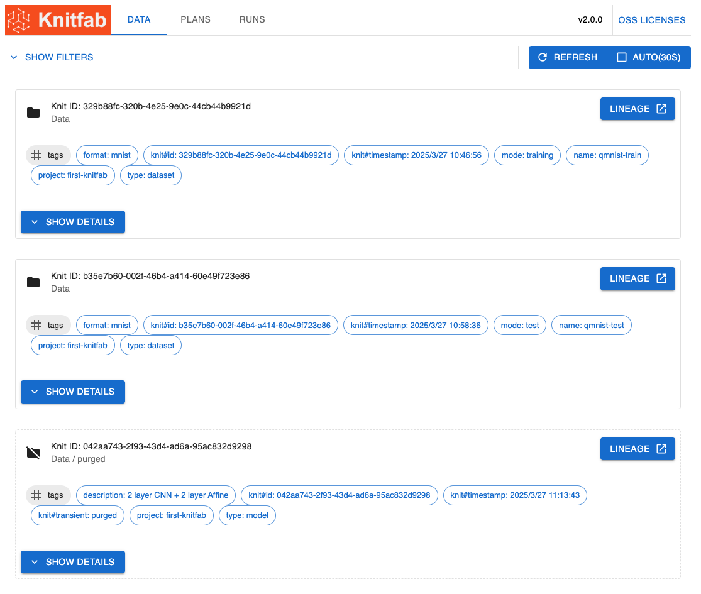
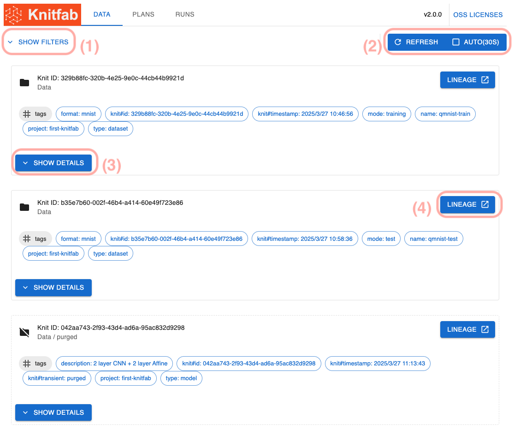
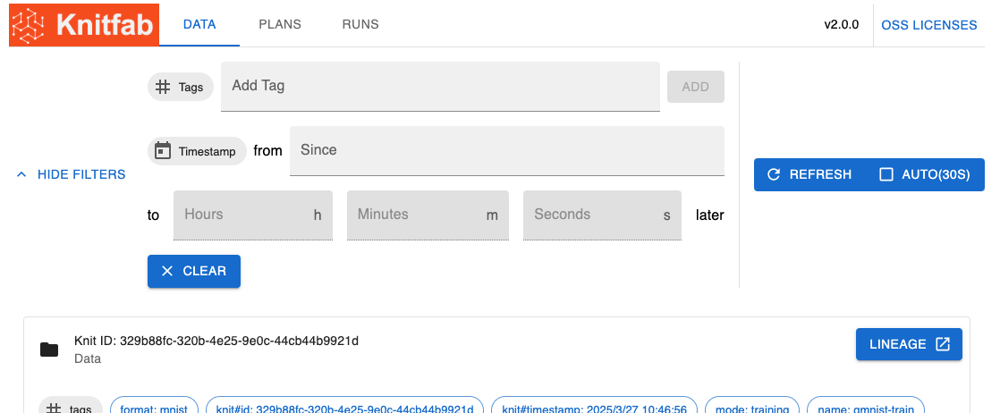
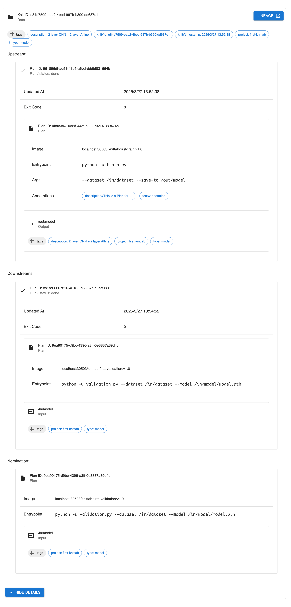
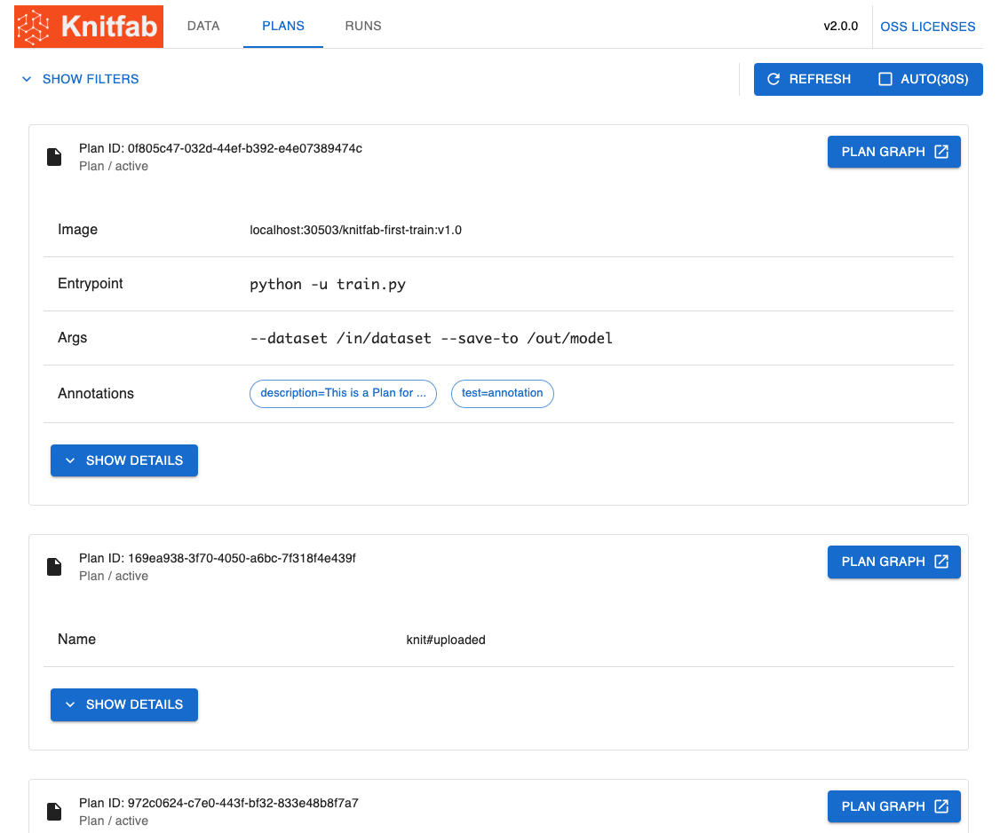
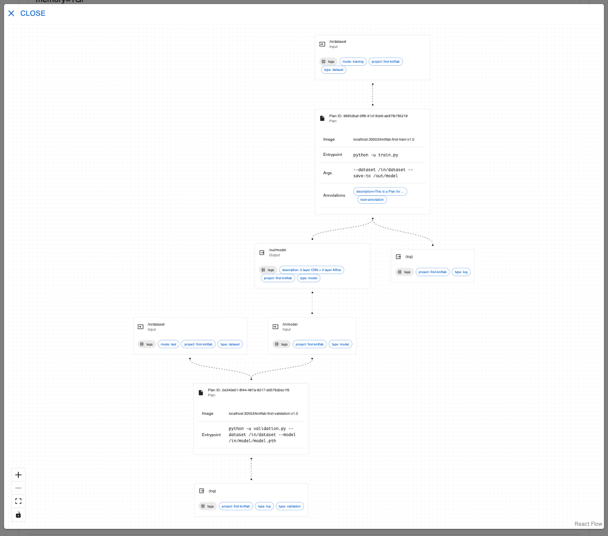

ユーザーガイド
============

本書は、Knitfab のユーザを対象に、Knitfab の概念と利用法について説明します。

コンセプトについて述べている部分は、Knitfab に関わるあらゆる人にとって、基本的な考え方を理解するうえで有用です。
それ以外の章は、もっぱら機械学習タスクを Knitfab 上で実行したいユーザに向けて書かれています。

他言語版/Translations
---------------------

- en: [./user-guide.en.md](./user-guide.en.md)

Knitfab のコンセプト
--------

Knitfab とは、

- タグベースのパイプラインエンジンと
- 自動リネージ管理機能を有する
- MLOps ツール

です。

パイプラインエンジンは、ユーザの定義したプランにしたがって、必要なタスクを自動的に実行します。
自動リネージ管理機能は、パイプラインエンジンがタスクを遂行する際に、その各タスクと入出力の関係を追跡することで Knitfab が生成した全データの生成履歴を自動的に記録します。

### 機械学習タスク

Knitfab において機械学習タスク (を含む処理一般) はすべて、「入力をとって出力をあたえるもの」として抽象化されます。
すなわち、ほぼ任意のプログラムを機械学習タスクとして利用することができます。

ただし、機械学習タスクの制約は次のものです。

- 入力はファイルシステム (ディレクトリ) からファイルを読み込むものとします。
- 出力は、標準出力・標準エラーに書き出すか、ファイルシステム（ディレクトリ）にファイルを書き出すものとします。
- コンテナイメージ ( docker イメージ) としてパッケージングされているものとします。

たとえば「あるディレクトリから訓練データを、また別のディレクトリから訓練時ハイパーパラメータを読み取って (ここまでが入力) 、あるディレクトリにモデルを、また別のディレクトリに学習時メトリクスを書き出す (これらが出力) 」というようなプログラムは Knitfab の機械学習タスクとして適当です。

### タグ

Knitfab が管理するリソースには "タグ" を設定できるものがあります。
"タグ" はキー:バリュー形式をとるメタデータであり、そのキーも値も、概ね自由に設定できます。

たとえば、次のようなタグを考えることができます:

- `project: some-project`: あるプロジェクトに関連するリソースであることを示す
- `type: dataset`: "データ" の種類がなんらかのデータセットであることを示す
- `format: mnist`: "データ" が MNIST 形式にフォーマットされていることを示す
- `mode: train`: "データ" が訓練時に使われることを意図していることを示す

これらの "タグ" 一式がついたデータがあれば、それは mnist の訓練用データセットでしょう。

いずれも、最初の `:` の前までがキーであり、その後がバリューです。

"タグ" のキーには、次の制約があります。

- 文字 `:` は使えません。
- `knit#` から始まるキーは Knitfab が予約している ("システムタグ") ので、ユーザは設定できません。

### データ

"データ" とは、機械学習タスクの入出力です。 "データ" はディレクトリを単位にしています。
もちろん、ある機械学習タスクが出力として書き出した "データ" は、他の機械学習タスクが入力として利用できます。

"データ" には "タグ" をつけることができる。 "データ" の "タグ" は「この "データ" は何か？ どういう性質のものか？」というメタデータです。

"データ" は一度作成されると、その "タグ" を除き、内容が変更されることはありません (イミュータブル) 。

### プラン

"プラン" とは、機械学習タスクの定義です。すなわち、

- どのような処理を実行するのか
- どのような "データ" を、どのファイルパスに入力として割り当てるのか
- どのファイルパスは出力であり、その出力はどのようなデータなのか

といった内容を定めたものです。

"プラン" は次のような yaml で定義されます。

```yaml
image: "localhost:30503/Knitfab-first-validation:v1.0"

inputs:
  - path: "/in/dataset"
    tags:
      - "type:dataset"
      - "mode:test"
      - "project:some-project"
  - path: "/in/model"
    tags:
      - "type:model"
      - "framework:pytorch"
      - "project:some-project"

outputs:
  - path: "/out/metrics"
    tags:
      - "type:csv"
      - "project:some-project"

log:
  tags:
    - "type:log"
    - "project:some-project"
    - "type:text"
```

- `image`: 処理の内容をコンテナイメージとして指定しています。
- `inputs`, `outputs`: 入力や出力を示しています。
    - ファイルパスに対して "タグ" を指定しています。
- `log`: 機械学習タスクから書き出された標準出力と標準エラーを、 "データ" として記録します。
    - これもある種の出力であるので、 "タグ" が指定できます。

入力の "タグ" は「その入力には、どういう "データ" が割り当てられてよいか」を示すものです。
Knitfab がある入力に割り当てる "データ" は、その入力の "タグ" をすべて持っている "データ" です。

出力の "タグは" 「その出力に書き出された "データ" には、どういう "タグ" を指定すべきか」を示すものです。
機械学習タスクが実行された際に出力された "データ" が新規に作成されるのであるが、このときにセットされる初期状態の "タグ" を、出力の "タグ" として指定します。

### ランとリネージ

"ラン"とは、実行された機械学習タスクの記録です。"ラン" は "プラン" をひな形として、入出力に具体的な "データ" を割り当てることで生成されます。
Knitfab は各 "プラン" の入力について、割り当て可能な "データ" を検出すると、自動的にその "プラン" と "データ" の組み合わせから "ラン" を生成します。

ある "プラン" に対して、可能な入力の割り当て方は複数通り存在する場合があります。
たとえば、 "プラン" のセクションで示した例をとれば、 `/in/dataset` に設定可能な "データ"  (評価用データセット) が 2 通り、 `/in/model` に設定可能な "データ" (訓練済みモデル) が 3 通りあれば、 Knitfab は $2 \times 3 = 6$ 個の "ラン" をそれぞれ生成・実行します。

"ラン" は具体的な入力 "データ" と出力 "データ" 、およびその "ラン" の元となった "プラン" の情報から構成されています。
これは「どの機械学習タスクに、何を入力したら、何が出力されたか」という記録、すなわちリネージの 1 ステップ分に相当します。
Knitfab はリネージを "ラン" と "データ" の依存関係が連鎖している様として表現しているということです。

"ラン" に対応する機械学習タスクは、Kubernetes の Pod として、他から隔離された環境で実行されます。
この Pod は、"ラン" の入出力に割り当てられた "データ" をボリュームとしてマウントされた状態で、"ラン" を生成した "プラン" に指定されたイメージを実行するように起動されます。
Knitfab はこの Pod の状態を監視していて、Pod が正常に終了すれば "ラン" も正常に終了したものと記録され、出力 "データ" の作成が完了します。
"データ" の作成が完了すると、それをいずれかの "プラン" の入力に割り当てることができるか自動的にチェックされ、連鎖的に "ラン" が実行されることになるでしょう。

CLI ツール: knit
-----------------

Knitfab ユーザは、Knitfab に対する操作を CLI コマンド `knit` を介して行います。

CLI は Knitfab のリリースページ( https://github.com/opst/knitfab/releases ) から取得できます。
お使いの OS に合ったバイナリをダウンロードして、 `PATH` 環境変数から見つかるディレクトリに配置します。

> Linux/Mac ユーザは、バイナリに実行権限を付与( `chmod +x ...` )してください。

### サブコマンド

`knit` は、取り扱う概念ごとにサブコマンドに分かれています。

- `knit data` : "データ" を操作するコマンド群
    - 例: `knit data pull` : Knitfab に記録されている "データ" をダウンロードする
- `knit plan` : "プラン" を操作するコマンド群
    - 例: `knit plan apply` : Knitfab に "プラン" を登録する
- `knit run` : "ラン" を操作するコマンド群
    - 例: `knit run find`: "ラン" を検索する

この他にも管理用のサブコマンドがあります。具体的なタスクについて解説する際に、随時紹介します。

クラスタに接続する、プロジェクトを管理する
-----------------------------------

Knitfab はサーバ・クライアント型のシステムです。
CLI `knit` は Knitfab サーバに対してリクエストを送り、実際の処理等はサーバ側で実施されることとなります。

`knit` コマンドを使うに先立ち、その接続設定が必要です。

### ハンドアウト

Knitfab を利用するために必要な設定ファイルのセット (ハンドアウト) を、Knitfab の管理者 (インストール実施者) から受け取ってください。

ハンドアウトは Knitfab をインストールしたときに生成されるもので、 Knitfab に接続するために必要な情報が含まれています。

### (必須) Knitfab に接続する

Knitfab に接続するには、接続プロファイル(knitprofile)を `knit` コマンドに登録する必要があります。
接続プロファイルはハンドアウトに含まれています。

続いて、

```
knit init path/to/handout/knitprofile
```

というコマンドを実行すると、指定した knitprofile があなたのプロファイルストアに取り込まれます。
プロファイルストアは、デフォルトでは `~/.knit/profile` です。

これで `knit` コマンドが Knitfab に接続できるようになります。

### (必須; on-prem) Docker に Knitfab を信頼させる

Knitfab はクラスタ内にプライベートなコンテナイメージレジストリを持っています。
これを使えば、ユーザが自分で作成したイメージを、Knitfab だけで使える機械学習タスクとして登録できます。

ただし、このクラスタ内イメージレジストリを利用する場合には、その TLS 証明書を、お使いの docker に信頼させる必要があります。

ハンドアウト内に `docker/certs.d` というディレクトリがあります。この内容を docker の設定として取り込んでください。

**linux-like 環境の場合:**

> [!Note]
>
> このパターンは、Windows や MacOS などで、dockerd を linux 仮想マシン上で実行している場合 (例: docker-machine, colima, minikube) も含みます。
>
> この場合、仮想マシン側の `/etc/docker/certs.d` 内に証明書が配置されている必要がある点に注意してください。
>

```
cp -r path/to/handout/docker/certs.d/* /etc/docker/certs.d/
```

場合によっては `sudo` する必要があるでしょう。

詳細は https://docs.docker.com/engine/security/certificates/ をご参照ください。

**windows 環境の docker Desktop の場合**

```
cp -r path\to\handout\docker\certs.d/* %USERPROFILE%\docker\certs.d
```

上記コマンドを実行したうえで、docker Desktop を再起動します。

詳細は https://docs.docker.com/desktop/faqs/windowsfaqs/#how-do-i-add-custom-ca-certificates や https://docs.docker.com/desktop/faqs/windowsfaqs/#how-do-i-add-client-certificates を参照してください。

### (選択) プロジェクト固有の設定を共有する

Knitfab をつかったプロジェクトでは、他のチームメンバーと一部コマンドのデフォルト挙動を共有できます。

設定ファイル `knitenv` を作成すると、そのファイルがあるディレクトリか、その子孫ディレクトリにおいては、`knitenv` の内容が反映されます。

`knitenv` ファイルは次のような構造をした yaml ファイルです。

```
tag:
    - project:some-project
resource:
    cpu: 1
    memory: 1Gi
```

各キーの意味は次の通りです:

- `tag`: "データ" や "プラン" 入出力に標準的にセットする"タグ" (複数設定可。デフォルトは空)
    - 上記の例では、登録するすべてのデータや、作成するプランには "タグ" として `project:some-project` が自動的に設定されます。
- `resource`: "プラン" 定義のテンプレート作成時における、所要計算機リソース。
    - この例は、この "プラン" の処理には CPU を 1 コア、メモリを 1 GB 使うことをプロジェクトのデフォルトとしています。
    - この項目の詳細は、 "プラン" 定義のセクションに譲ります。

このファイルはチームで共有することが想定されています。
機械学習プロジェクトを git などでバージョン管理しているなら、バージョン管理の対象とするとよいでしょう。

データを管理する
-----

"データ" とは、機械学習タスクの結果 (が含まれたディレクトリ) にタグがついたもの、のことです。
また、 "データ" はユーザが Knitfab に登録することで作成することもできます。

作成された "データ" は 各 "プラン" の入力を突き合わせて、実行可能な "プラン"があれば、"ラン" として実行されます。

本章ではこの "データ" の取り扱いについて説明します。

### データを登録する

手元にあるデータセットなどのファイル群を機械学習タスクの入力として使いたい場合は、それを "データ" として Knitfab に登録します。

次のようにします。

```
knit data push -t your:tag /path/to/data
```

こうすると、ディレクトリ `/path/to/data` を Knitfab にアップロードして、Knitfab の "データ" として扱えるようになります。

フラグ `-t` は、 "データ" をアップロードする際に、合わせて "データ" に "タグ" を設定することを意味します。
この例では、 "データ" が登録できると `your:tag` という "タグ" も設定されることになります。

フラグ `-t` を与えなくても、`knitenv` に記述されている `tag` エントリの "タグ" は、暗黙に設定されます。

コマンドを実行すると、処理の進捗ログに続いて、登録された "データ" のメタデータがコンソールに表示されます。

```json
{
    "knitId": "a0f5911d-5ac5-4035-8c91-9946b02adc70",
    "tags": [
        "knit#id:a0f5911d-5ac5-4035-8c91-9946b02adc70",
        "knit#timestamp:2024-03-06T09:25:16.586+00:00",
        "project:some-project",
        "your:tag"
    ],
    "upstream": {
        "path": "/upload",
        "tags": [],
        "run": {
            "runId": "a5c1106c-122f-416c-b4f4-e6dd03af212c",
            "status": "done",
            "updatedAt": "2024-03-06T09:25:16.586+00:00",
            "plan": {
                "planId": "fb9b7087-9fe7-43c3-9302-a35488c85ffb",
                "name": "knit#uploaded"
            }
        }
    },
    "downstreams": [],
    "nomination": []
}
```

- `knitId`: この "データ" を特定する ID です。
- `tags`: この "データ" に設定されている "タグ" が示されています。
    - システムが自動的に割り当てた "タグ"  (キーが `knit#` 始まり) と、ユーザが自分で設定した "タグ" が含まれています。
    - 加えて `kntienv` に設定されていた "タグ" があれば、それも設定されています。
- `upstream`: この "データ" が書き出された出力と、その "ラン" の情報が示されています。
    - 今回は "データ" のアップロードを受け付ける、特殊な "プラン" の "ラン" が表示されています。
- `downstream`: この "データ" を利用している "ラン" の情報が含まれます。 (もしあれば)
- `nomination`: この "データ" が割り当てられてる "プラン" の入力の情報が含まれます。 (もしあれば)

#### コマンドラインオプション

- `-t key:value`, `--tag key:value`: 登録する "データ" に "タグ" を設定します。
- `-n`, `--name`: ディレクトリ名に基づいた "タグ" を設定します。
    - 設定される "タグ" は `name:${ディレクトリ名}` です。
- `-L`, `--dereference`: ディレクトリ内の symlink をたどって、symlink ではなくリンク先を登録します。
    - このフラグを渡さないと、symlink は symlink のまま登録されることになります。
    - `knit` はリンク先が "データ" に含まれるかどうか、という検証は行いません。

### データを確認する

#### メタデータを確認する

登録された "データ" について、そのメタデータをあとから確認したい、ということもあるでしょう。
たとえば、

- いまどんな "タグ" が設定されているのか？
- どんな "プラン" に入力される可能性があるのか？
- どんな "ラン" の入力として使われたのか？

こうした "データ" のメタデータを調べるには、次のようにします。

```
knit data find -t knit#id:KNIT-ID
```

`KNIT-ID` の部分は、関心のある "データ" の ID に置き換えてください。

コマンド `knit data find` は "データ" を検索するためのコマンドです。

フラグ `-t` は「この "タグ" をもっていること」を検索条件として指定するものですが、
ここに `knit#id:` "タグ" の値として "データ" の ID を指定しました。
結果として、特定の "データ" についてメタデータを得ることができます。

次のような結果が返されるでしょう。

```json
[
    {
        "knitId": "5ea1b982-0e2c-4e02-adb6-431da718c7c1",
        "tags": [
            "format:mnist",
            "knit#id:5ea1b982-0e2c-4e02-adb6-431da718c7c1",
            "knit#timestamp:2024-10-16T09:03:42.726+00:00",
            "mode:training",
            "name:qmnist-train",
            "project:first-knitfab",
            "type:dataset"
        ],
        "upstream": {
            "path": "/upload",
            "tags": [],
            "run": {
                "runId": "0f6ffd26-9917-4d37-8f24-5bc920ef4c26",
                "status": "done",
                "updatedAt": "2024-10-16T09:03:42.726+00:00",
                "plan": {
                    "planId": "ea0fd879-c5f3-4c8c-9ff6-23852f4d3e46",
                    "name": "knit#uploaded"
                }
            }
        },
        "downstreams": [
            {
                "path": "/in/1/dataset",
                "tags": [
                    "mode:training",
                    "project:first-knitfab",
                    "type:dataset"
                ],
                "run": {
                    "runId": "95fa5441-0146-42a7-86e7-48593d2666ad",
                    "status": "done",
                    "updatedAt": "2024-10-17T02:32:06.928+00:00",
                    "exit": {
                        "code": 0,
                        "message": ""
                    },
                    "plan": {
                        "planId": "9e5dd235-02e3-4700-a174-f2a50f74c8ba",
                        "image": "localhost:30503/knitfab-first-train:v1.0",
                        "entrypoint": [
                            "python",
                            "-u",
                            "train.py"
                        ],
                        "args": [
                            "--dataset",
                            "/in/1/dataset",
                            "--save-to",
                            "/out/1/model"
                        ],
                        "annotations": [
                            "description=this is knitfab hands-on plan",
                            "detailed-description=this is detailed description\n containing new line."
                        ]
                    }
                }
            }
        ],
        "nomination": [
            {
                "path": "/in/dataset",
                "tags": [
                    "mode:training",
                    "project:first-knitfab",
                    "type:dataset"
                ],
                "plan": {
                    "planId": "352b17f7-1dde-437f-b4b9-d473e2bb13ec",
                    "image": "localhost:30503/knitfab-first-train:v1.0",
                    "annotations": [
                        "description=this is knitfab hands-on plan",
                        "detailed-description=this is detailed description\n containing new line."
                    ]
                }
            }
        ]
    }
]
```

各要素の構造は「 "データ" を登録する」のセクションで説明したものと同じです。
この例では、他の "ラン" に入力として使われたことがある "データ" なので、`downstreams` や `nomination` にも内容が含まれています。

##### コマンドラインオプション

- `-t key:value`, `--tag keu:value`: 指定した "タグ" を持った "データ" を検索します。
    - 複数指定した場合は、すべての "タグ" をもった "データ" のみを検索対象とします。

`-t` を全く指定しない場合は、すべての "データ" が検索にヒットします。

#### データそのものをダウンロードする

メタデータを見るだけではなくて、 "データ" そのものをダウンロードすることもできます。

モデルパラメータや評価結果などは、しばしばダウンロードしたくなるでしょう。

```
knit data pull -x KNIT_ID path/to/dest
```

このコマンドは ID `KNIT_ID` で特定される "データ" の内容を、ディレクトリ `path/to/dest/${KNIT_ID}` に書き込みます。

##### コマンドラインオプション

- `-x`: "データ" をダウンロードして、展開する。
    - これを指定しない場合は、 `path/to/dest/${KNIT_ID}.tar.gz` に `tar.gz` 圧縮ファイルとしてダウンロードします。

### データのタグを変更する

すでに登録されている "データ" の "タグ" を変更できます。

たとえば、

- 「デプロイされている」ことを示す "タグ" `deployed:true` があったとして、これを他の "データ" に移したい。
- ある "データ" を、もう "ラン" の入力として使ってほしくないので、 "タグ" を除去したい。
- ある "データ" を、ある "プラン" にも使いたくなったので、 "タグ" を追加したい。

といった場合に有用です。

"タグ" を追加するには

```
knit data tag --add new:tag KNIT_ID
```

とすると、ID `KNIT_ID` で特定される "データ" に対して "タグ" `new:tag` が追加されます。

また、

```
knit data tag --remove old:tag KNIT_ID
```

とすると、ID `KNIT_ID` で特定される "データ" から "タグ" `old:tag` が除去されます。

タグを削除するに当たり、特定のキーを有するものを一括除去することもできます。

```
knit data tag --remove-key example-key KNIT_ID
```

こうすることで、 ID `KNIT_ID` で特定される "データ" から、キー `example-key` を有するタグをすべて除去できます。

"データ" に存在する "タグ" を追加したり、まだない "タグ" を除去したりしようとした場合には、何もおきないだけでエラーにはなりません。

この場合でも、キーが `knit#` から始まる "タグ" は追加したり除去したりすることはできません。システムが予約・管理しているためです。

#### コマンドラインオプション

- `--add KEY:VALUE`: "タグ" を追加する
- `--remove KEY:VALUE`: キーと値が一致する "タグ" を除去する
- `--remove-key KEY`: キーが一致するタグをすべて除去する

いずれも複数回指定でき、すべて効果を発揮します。

`--remove` や `--remove-key` と `--add` を同時に指定した場合には、まず除去してから、続いて追加を行います。
したがって、 `knit data tag --remove foo:bar --add foo:bar KNIT_ID` としたなら、その "データ" は最終的に `foo:bar` でタグ付けられることになります。

### データは削除できない

Knitfab においては、特定の "データ" のみを直接削除することはできません。

ただし、 "ラン" を削除すると、その "ラン" の出力 "データ" ごと削除されるので、 "データ" が不要である場合にはこの方法をとることになります。

詳細は「ランを管理する」の章をご参照ください。

プランを管理する
-----

"プラン" は、Knitfab において、機械学習タスクの定義を与えるものです。

これを Knitfab に登録すると、その定義に従って Knitfab が実行可能な入力のパターンを算出し、自動的に "ラン" を生成します。

本章では、 "プラン" の取り扱いについて説明します。

### プラン定義を登録する

Knitfab に "プラン" を登録するには、次のようにします。

```
knit plan apply path/to/plan_definition.yaml
```

指定した "プラン" 定義ファイル `path/to/plan_definition.yaml` に従って、Knitfab に "プラン" が登録されます。

#### プラン定義を記述する

"プラン"定義ファイルは、「どのイメージに」「どんな入力を与えると」「どんな出力が得られるのか」ということを中心的な内容とした yaml ファイルです。

**最小限の** "プラン"定義ファイルは、およそ次のようなものです。

```yaml
image: "localhost:30503/train:v1.0"

inputs:
  - path: "/in/dataset"
    tags:
      - "project:some-project"
      - "type:dataset"
      - "mode:train"
  - path: "/in/params"
    tags:
      - "project:some-project"
      - "type:hyper-params"
      - "format:yaml"

outputs:
  - path: "/out"
    tags:
      - "project:some-project"
      - "type:model"

logs:
  - "project:some-project"
  - "type:log"
```

- `image`: 処理内容として、「どのイメージに」を指定します。
    - コンテナイメージ名を、タグまで指定します。
        - イメージ名は `[ホスト:ポート/][リポジトリ/]名前:タグ` という構造をしています。
    - Knitfab 内のイメージレジストリに登録したイメージが使いたい場合、
        - ホストは `localhost` とします。
        - ポートは、標準的なインストールなら例のとおり `30503` です。詳細はインストールを実施した管理者に確認してください。
- `inputs`: 「どんな入力を与えると」を指定します。
    - 個々の入力は `path` と `tags` の組である。複数の入力を指定できます。
        - 例では、2 つの入力 `/in/dataset` と `/in/params` があることになっています。
    - 各入力について、
        - `path` は、このタスクを実行する際に、コンテナのどのディレクトリに入力を与えるか、を示します。
        - `tag` は、どんなデータならこの入力に割り当ててよいか、を示します。
            - `tag` には、 "システムタグ" である `knit#id` や `knit#timestamp` を指定することが **できます** 。"データ" を特定した上でなにかしたいことがある場合には有用でしょう。
    - 入力は、すくなくとも 1 つは必要です。また、どの入力も、少なくとも 1 つは "タグ" が設定されている必要があります。
- `outputs`: 「どんな出力が得られるのか」を指定します。
    - これも `path` と `tags` の組になっています。`inputs` と同様、複数の出力を指定できます。
    - 各出力について、
        - `path` は、コンテナのどのディレクトリにタスクの出力が書き出されるのか、を示します。
        - `tags` は、この出力の "データ" が作られたときに最初に自動的にセットされる "タグ" 集合を示します。
    - 出力は、0 個でも構いません。
- `logs`: タスクのログ（標準出力と標準エラー）を収集して "データ" にする、特殊な出力です。
    - オプショナルです。省略すると、その "プラン" に基づく "ラン" のログは記録されずに破棄されます。
    - `tags` は `outputs` の `tags` 同様、書き出されたログに自動的に指定する "タグ" 集合です。

"プラン" 定義ファイルは、いきなり手で書くよりも、ひな型を生成することをお勧めします。

```
knit plan template --scratch > template.plan.yaml
```

とすると、空のひな型が `template.plan.yaml` に生成されます。


また、使いたいコンテナイメージが既に決まっている場合には、

```
docker save IMAGE_NAME:TAG | knit plan tempalte > IMAGE.TAG.plan.yaml
```

( `IMAGE_NAME:TAG` は使いたいイメージに合わせて適宜変更してください)

とすると、イメージの内容を反映したひな型が生成されます。この場合でも、内容を確認して、実際の要求に合うように調整する必要があるでしょう。

ここに示したもの以外にも、オプショナルな属性が存在します。

### `entrypoint` と `args`

"プラン" に基づく "ラン" の Pod を実行するにあたって、Pod に指定される [entrypoint と args](https://kubernetes.io/docs/reference/kubernetes-api/workload-resources/pod-v1/#entrypoint) を指定できます。

```yaml
entrypoint: ["python", "main.py"]
args: ["--arg", "value"]
```

`entrypoint` と `args` （一方だけでもよい）を指定することで、 "プラン" の `image` に設定されているデフォルトのエントリポイントと引数を上書きできます。

#### `annotation`

入出力の"タグ"とは別に、 "プラン" 自体にもメタデータをセットすることができます。それが `annotation` (アノテーション) です。

```yaml
annoation:
    - key=value
    - description=...
    # ...
```

アノテーションは "キー=値" 組のリストであり、内容は任意です。その"プラン"についての説明、作成者の情報など、実務上の必要に応じて自由に設定するとよいでしょう。
アノテーションはリネージとは無関係であり、どのようなアノテーションがセットされていたとしても、Knitfab が "プラン" から "ラン" を生成する挙動には影響しません。

ひとつの Plan に複数のアノテーションを登録できます。また、キーが重複したアノテーションでも、値が異なるものは登録できます。たとえば、次のような `annotation` は有効です。

```yaml
annoation:
    - created-by=Alice
    - created-by=Bob
    - created-by=Charie
```

`annotation` は"プラン"作成後にも変更可能なパラメータです。

#### `active`

```yaml
active: true
```

"プラン" の "アクティブ性" を指定します。 `active: true` (アクティブ) な "プラン" の "ラン" だけが、実際に計算されます。デフォルトは `true` です。

"プラン" を登録する際、いきなりその "プラン" の "ラン" が実行されては困る、というケースもあるでしょう。
その場合には、`active: false` (非アクティブ) をセットした "プラン" 定義ファイルを `knit plan apply` するとよいでしょう。

`active` はプラン作成後にも変更可能なパラメータです。

#### `resource`

```yaml
resources:
  cpu: 1
  memory: 1Gi
```

この "プラン" に基づく "ラン" に割り当てる計算機資源の制限を指定できます。
デフォルトは上記の通り CPU 1 コア、メモリ 1 GiB である。
`resources.cpu` や `resources.memory` は、省略した場合にはこの通りのデフォルトが適用されます。

また、 `knitenv` ファイルに `resources` が定義されていれば、デフォルトの代わりにそちらが利用されることになります。

もしより多くのリソースが必要なら、設定を変更します。また、小数値も指定できます。
たとえば、 2.5 コア・3.5GiB のリソースが必要だと見込まれるなら

```yaml
resources:
  cpu: 2.5
  memory: 3.5Gi
```

とすればよいです。

この他にも、GPU などの計算機資源について、その要求を `resources` セクションに記述できる可能性があります。

```yaml
resources:
  cpu: 1
  memory: 1Gi
  nvidia.com/gpu: 1
```

`cpu` と `memory` 以外に指定できる計算機資源タイプは、Knitfab の基盤となっている kubernetes クラスタに依存して決まります。設定可能な値は、お使いの Knitfab の管理者に確認してください。

> **Advanced Note**
>
> この値は、最終的には kubernetes の pod 定義における `resources.limits` と `resources.requests` として使われます。
>

`resource` はプラン作成後にも変更可能なパラメータです。

### service_account

```yaml
service_account: SERVICE_ACCOUNT_NAME
```

"プラン"に基づく"ラン"は、Kubernetes の Pod として実行されます。
`service_account` には、この Pod に指定される Kubernetes の [ServiceAccount](https://kubernetes.io/docs/concepts/security/service-accounts/) を指定できます。

この項目はオプショナルであり、設定しなかった場合には ServiceAccount なしで Pod が起動することになります。
"ラン" のタスクが Pod 内に閉じているのなら、ServiceAccount は不要でしょう。

クラスタに存在する ServiceAccount については、クラスタの管理者に問い合わせてください。

`service_account` はプラン作成後にも変更可能なパラメータです。

#### on_node

ある種の計算タスクは特定の計算機で実行したい、というケースがあるでしょう。

たとえば、

- 訓練タスクは GPU のある計算機上で実行する必要があるが、評価タスクはそうではないかもしれない。
- CPU で十分なタスクは GPU のある計算機を避けて、貴重な計算機資源を必要としているタスクを優先したいでしょう。

`on_node` に適当な値を設定することで、この "プラン" の "ラン" を配置する計算機を制限できます。

```yaml
on_node:
  may:
    - "key=value"
  prefer:
    - "vram=large"
  must:
    - "accelarator=gpu"
```

`on_node.may`, `on_node.prefer`, `on_node.must` のいずれも、「ラべル」 (`key=value`) の配列を指定します。
ここに指定するラベルは、計算機のメタデータとしてのラベルです。
意味のある値については、Knitfab がインストールされている kubernetes クラスタを構築した管理者に問い合わせてください。

どの項目オプショナルであって、省略すると、その項目にはラベルをまったく指定しなかったものと同じことになります。
`on_node` 自体を省略した場合は、すべての項目が空であるものと同じです。

それぞれの意味するところは次のとおりです。

- `may`:
    - そのラベルのある計算機で実行され **てもよい** ことを意味します。
    - そのラベルがある計算機は、通常は計算タスクを受け取らないように設定されているでしょう。
- `prefer`:
    - そのラベルのある計算機で、 **できることなら実行する** ことを意味します。
    - もし計算機が空いていなければ、そのラベルがない計算機を使うかもしれません。
- `must`:
    - そのラベルがある計算機 **のみで実行される** ことを意味します。
    - 万一、そのラベルがある計算機が存在しなければ、 "ラン" は進行しないでしょう。

> **Advanced Note**
>
> この値は kubernetes の torelation と node affinity の組み合わせとして使われます。
>
> - `may` に指定したラベルは torelation (`NoSchedule`) になります。
> - `prefer` に指定したラベルは torelaton (`NoSchedule` + `PreferNoSchedule`) と node affinity (`preferredDuringSchedulingIgnoredDuringExecution`) になります。
> - `must` に指定したラベルは torelation (`NoSchedule` + `PreferNoSchedule`) と node affinity (`requiredDuringSchedulingIgnoredDuringExecution`) になります。
>
> これらの指定が有効に機能するためには、管理者によって kubernetes クラスタが適切に設定されている必要がありまｓｙ。
>

`on_node` はプラン作成後に変更可能なパラメータです。

### プラン定義を確認する

登録済みの "プラン" 定義は、次のようにして確認できます。

```
knit plan show PLAN_ID
```

`PLAN_ID` の部分に詳細を知りたい "プラン" の ID を指定してください。
指定した "プラン" が存在していれば、次のようなコンソール出力が得られます。

```json
{
    "planId": "d134463a-9766-4e43-8f87-002e48d624a6",
    "image": "localhost:30503/knitfab-first-train:v1.0",
    "entrypoint": [
        "python",
        "-u",
        "train.py"
    ],
    "args": [
        "--dataset",
        "/in/dataset",
        "--save-to",
        "/out/model"
    ],
    "annotations": [
        "description=this is knitfab hands-on plan",
        "detailed-description=this is detailed description\ncontaining new line."
    ],
    "inputs": [
        {
            "path": "/in/dataset",
            "tags": [
                "mode:training",
                "project:first-knitfab",
                "type:dataset"
            ],
            "upstreams": []
        }
    ],
    "outputs": [
        {
            "path": "/out/model",
            "tags": [
                "description:2 layer CNN + 2 layer Affine",
                "project:first-knitfab",
                "type:model"
            ],
            "downstreams": [
                {
                    "plan": {
                        "planId": "a363ba5d-b874-496a-8f40-ee1ebf28b8e6",
                        "image": "localhost:30503/knitfab-first-validation:v1.0",
                        "entrypoint": [
                            "python",
                            "-u",
                            "validation.py",
                            "--dataset",
                            "/in/dataset",
                            "--model",
                            "/in/model/model.pth"
                        ],
                        "annotations": [
                            "test=annotation"
                        ]
                    },
                    "mountpoint": {
                        "path": "/in/model",
                        "tags": [
                            "project:first-knitfab",
                            "type:model"
                        ]
                    }
                },
            ]
        }
    ],
    "log": {
        "Tags": [
            "project:first-knitfab",
            "type:log"
        ],
        "downstreams": []
    },
    "active": true,
    "resources": {
        "cpu": "1",
        "memory": "1Gi"
    }
}
```

"プラン" 定義とよく似た構造をしています。

"プラン" 定義に存在しなかった要素として、出力およびログの `"downstreams"` と、入力の `"upstreams"` が追加されています。
これらは、各入出力およびログが、他のどの "プラン" と関係があるか、ということを示しています。

`"downstreams"` には、その出力（に対応する "ラン" の出力）から生成された "データ" が、他のどの "プラン" の入力に割り当てられるか、を示しています。
`"upstreams"` はその逆です。上に示した例で `"downstreams"` に見える "プラン" について `knit plan show` すると、次のような結果になります。

```json
{
    "planId": "a363ba5d-b874-496a-8f40-ee1ebf28b8e6",
    "image": "localhost:30503/knitfab-first-validation:v1.0",
    "entrypoint": [
        "python",
        "-u",
        "validation.py",
        "--dataset",
        "/in/dataset",
        "--model",
        "/in/model/model.pth"
    ],
    "annotations": [
        "test=annotation"
    ],
    "inputs": [
        {
            "path": "/in/dataset",
            "tags": [
                "mode:test",
                "project:first-knitfab",
                "type:dataset"
            ],
            "upstreams": []
        },
        {
            "path": "/in/model",
            "tags": [
                "project:first-knitfab",
                "type:model"
            ],
            "upstreams": [
                {
                    "plan": {
                        "planId": "d134463a-9766-4e43-8f87-002e48d624a6",
                        "image": "localhost:30503/knitfab-first-train:v1.0",
                        "entrypoint": [
                            "python",
                            "-u",
                            "train.py"
                        ],
                        "args": [
                            "--dataset",
                            "/in/dataset",
                            "--save-to",
                            "/out/model"
                        ],
                        "annotations": [
                            "description=this is knitfab hands-on plan",
                            "detailed-description=this is detailed description\ncontaining new line."
                        ]
                    },
                    "mountpoint": {
                        "path": "/out/model",
                        "tags": [
                            "description:2 layer CNN + 2 layer Affine",
                            "project:first-knitfab",
                            "type:model"
                        ]
                    }
                }
            ]
        }
    ],
    "outputs": [],
    "log": {
        "Tags": [
            "project:first-knitfab",
            "type:log",
            "type:validation"
        ],
        "downstreams": []
    },
    "active": true,
    "resources": {
        "cpu": "1",
        "memory": "1Gi"
    }
}
```

"プラン" の情報を調べるにあたり、もし関心のある "プラン" の ID がわからないなら、検索することもできます。

イメージ名がわかっているなら、

```
knit plan find --image HOST:PORT/IMAGE:TAG
```

とすればよいです。

入力や出力に使われている "タグ" がわかっているなら、

```
knit plan find --in-tag KEY:VALUE
```

```
knit plan find --out-tag KEY:VALUE
```

と指定できます。

アクティブな "プラン" に限定したければ

```
knit plan find --active yes
```

とします。

これらの検索条件は同時に指定できて、すべての条件を満たした "プラン" だけが検索にヒットします。

さらに `--in-tag` と `--out-tag` は繰り返し指定でき、その場合はすべての "タグ" を持っている入力や出力がある場合にだけ検索にヒットするようになります。

`knit plan find` は検索条件なしに実行されると、すべての "プラン" が検索にヒットします。

#### コマンドラインフラグ: `knit plan find`

- `--active MODE`: "プラン" がアクティブ (または非アクティブ) であるものに限定します。
    - mode として指定できる値は次の通り:
        - `both` (デフォルト): アクティブ性を条件にしません。
        - `yes`, `true`: アクティブなものだけを検索します。
        - `no`, `false`: アクティブでないものだけを検索します。
- `--image IMAGE[:TAG]`: "プラン" のイメージに基づいて検索します。
    - `TAG` は省略できます。その場合は、イメージのタグを無視して検索します。
    - `IMAGE` の部分は、 "プラン" 定義として登録したイメージのホスト名やポートも一致するものを検索します。部分一致はとりません。
- `-i KEY:VALUE`, `--in-tag KEY:VALUE`: 指定した "タグ" が設定されている入力をもつものに限定します。
    - もしこのフラグを繰り返し指定したら、すべての "タグ" が設定された入力があるものだけを検索します。
- `-o KEY:VALUE`, `--out-tag KEY:VALUE`: 指定した "タグ" が設定されている出力をもつものに限定します。
    - もしこのフラグを繰り返し指定したら、すべての "タグ" が設定された出力があるものだけを検索します。

### プラン同士をつなげる・つながりを可視化する

Knitfab では、複数の "プラン" を組み合わせて機械学習タスクのパイプラインを構築します。

たとえば、次の 2 つのプラン、trainer と validator が登録されているとします:

```yaml:trainer.plan.yaml
image: "localhost:30503/train:v1.0"
annotations:
  - "name=trainer"

inputs:
  - path: "/in/dataset"
    tags:
      - "project:some-project"
      - "type:dataset"
      - "mode:train"
  - path: "/in/params"
    tags:
      - "project:some-project"
      - "type:hyper-params"
      - "format:yaml"

outputs:
  - path: "/out"
    tags:
      - "project:some-project"
      - "type:model"

logs:
  - "project:some-project"
  - "type:log"
```

```yaml:validator.plan.yaml
image: "localhost:30503/validate:v1.0"
annotations:
  - "name=validator"

inputs:
  - path: "/in/dataset"
    tags:
      - "project:some-project"
      - "type:dataset"
      - "mode:validate"
  - path: "/in/model"
    tags:
      - "project:some-project"
      - "type:model"

outputs:
  - path: "/out"
    tags:
      - "project:some-project"
      - "type:report"

logs:
  - "project:some-project"
  - "type:log"
```

このとき、trainer に基づいた "ラン" が出力 `/out` から生成した "データ" は、自動的に validator の入力 `/in/model` に割り当てられます。
というのも、trainer の出力 `/out` に指定されているタグが、validator の入力 `/in/model` のタグをすべて含む（この例では一致している）からです。

すると、 trainer に基づく "ラン" が正常に完了したときに、validator に基づく "ラン" も適宜生成されることになります。

このように、"プラン" の出力と、別の "プラン" の入力をタグベースで関連付け、"プラン" を連鎖反応させることが、Knitfab においてパイプラインを編み上げてゆくことなのです。

さて、そうして構築されたパイプラインがどういう構成をしているのか、調べたいことがあります。次のコマンドを利用します。

```
knit plan graph PLAN_ID | dot -Tpng > graph.png
```

`knit plan graph` は引数 `PLAN_ID` に指定した "プラン" を起点に、前後 3 プランにわたるパイプラインを探索して、 dot 形式で書き出します。
上のコマンド例では、それを `dot` コマンドに通して PNG 形式の画像に変換しています。次のような画像が得られます。


この画像は、パイプラインの下流側にあたる validator "プラン" を指定してパイプラインを描かせたものです。
図中の枠は "プラン"、 矢印はデータフローの向きを示しています。

この図では、上側に trainer 、下側に validator が描かれています。細い黄色い枠の範囲がひとつの "プラン" に対応しています。
その中にある、太い黄色い内枠が "プラン" の概要（アクティブ性、ID、イメージ、アノテーション）を示しています。
ID の背景に色がついている "プラン" は、`knit plan graph` に指定した "プラン"、すなわちパイプライン探索の起点です（この例では、 validator "プラン" がそれです）。

細い外枠上にある緑の小さな点は、"プラン" の入出力を示しています。緑の点と "プラン" 本体をつなぐ矢印の向きは入出力に対応しています。
やじりが内枠側に向いているものが入力、やじりが緑の点に向いているものが出力です。ファイルパスは矢印のラベルとして示されています。

"プラン" 同士のつながりは、入出力同士をつなぐ太い矢印が示しています。
太い矢印のつながっていない入出力は、 `knit plan graph` の探索範囲にはその上流や下流の "プラン" が見つからなかったということです。

`knit plan graph` の探索範囲は `--numbers` (あるいは `-n`)フラグで指定できます。たとえば、起点から 10 "プラン" までの範囲で探したければ

```
knit plan graph -n 10 PLAN_ID
```

とすればよいです。`-n all` を指定すれば、探索範囲は無制限になります。

起点プランから上流側だけを探索したいときは

```
knit plan graph --upstream PLAN_ID
```

とすればよいです。また、下流側だけを探索したいときは、

```
knit plan graph --downstream PLAN_ID
```

とすればよいです。

#### コマンドラインフラグ: `knit plan graph`

- `-n POSITIVE-INTEGER|"all"`, `--numbers POSITIVE-INTEGER|"all"`: 探索範囲を指定します。
    - 正の整数か、`all` を指定します。
        - 正の整数を指定した場合は、起点となる "プラン" からその数だけ離れたプランまでを探索します。
        - `all` を指定した場合は、探索範囲は無制限です。
    - このフラグは省略できる。デフォルトは `3` です。
- `-u`, `--upstream`: 上流側を探索します。
    - 起点となる "プラン" から上流側、すなわち起点となる "プラン" の入力につながっている "プラン" を探索します。
- `-d`, `--downstream`: 下流側を探索します。
    - 起点となる "プラン" から下流側、すなわち起点となる "プラン" の出力につながっている "プラン" を探索します。

`-u` も `-d` も両方とも指定しなかった場合には、`knit plan graph` は `-u -d` の両方を指定されたものとして振る舞います（つまり、上流・下流の両方を探索します）。

### プランにアノテーションを追加する、削除する

"プラン" 本体のメタデータであるアノテーションは、 "プラン" 登録後に変更（= 削除、追加）できます。

"プラン" にアノテーションを追加する場合は、

```
knit plan annotate --add KEY=VALUE PLAN_ID
```

とします。`--add` フラグに追加したいアノテーションを、キーと値の組を `=` で繋いだものとして渡しています。
こうすると、ID `PLAN_ID` で特定される "プラン" に新しいアノテーションを追加できます。

"プラン" からアノテーションを除去したい場合は、

```
knit plan annotate --remove KEY=VALUE PLAN_ID
```

とします。

また、"プラン" から、あるキーをもったアノテーションを取り除くには

```
knit plan annotate --remove-key KEY PLAN_ID
```

とすればよいです。

削除しようとしたアノテーションが "プラン" に存在しない場合や、追加しようとしたアノテーションがすでに "プラン" に存在する場合には、無視されます。

たとえば、 `aaa=bbb` というアノテーションのみを持っている "プラン" に対して

```
knit plan annotate --add aaa=bbb --add ccc=ddd --remove eee=fff PLAN_ID
```

とした場合、これは

```
knit plan --add ccc=ddd PLAN_ID
```

と等価です。

#### コマンドラインフラグ: `knit plan annotate`

- `--remove KEY=VALUE`: 指定した キー=値 をもったアノテーションを削除します。
- `--remove-key KEY`: 指定した キー をもったアノテーションをすべて削除します。
- `--add KEY=VALUE`: 指定した キー=値 のアノテーションを追加します。

いずれもオプショナルであり、繰り返し設定でき、さらに、同時に設定できます。

`--remove` や `--remove-key` と `--add` が同時に指定された場合には、先に削除をしてから、続いて登録を行います。

### プランをアクティブにする、非アクティブにする

もう使わない "プラン" は非活性にしておきたいものです。

```
knit plan active no PLAN_ID
```

こうすることで、指定した `PLAN_ID` で特定される "プラン" が非アクティブになります。
この "プラン" に基づく "ラン" のうち、開始される前のものは実行が抑止されます。

また、事情があって非アクティブにしていた "プラン" も、アクティブに戻すことがあるでしょう。
それには、次のようにします。

```
knit plan active yes PLAN_ID
```

`PLAN_ID` の "プラン" に基づく "ラン" のうち、実行が抑止されていたものは再度実行されるようになります。

### プランに ServiceAccount を設定する/除去する

"プラン" に ServiceAccount を設定する場合には、次のようにします。

```
knit plan serviceaccount --set SERVICE_ACCOUNT_NAME PLAN_ID
```

また、ServiceAccount を除去するには、次のようにします。

```
knit plan serviceaccount --unset PLAN_ID
```

コマンドラインフラグ `--set` と `--unset` は排他的で、いずれか一方のみを指定することができます。

### プランが要求する計算機リソースを更新する

実際に計算タスクを実行してみたところ、"プラン" 定義に指定した計算機リソースに過剰や不足がある、とわかったとしましょう。
特に不足の場合は計算が実行できないので、問題です。

そうした場合には、プランに指定されている計算機リソースを更新できます。

たとえば、「メモリが 10GiB 必要」なら、こうします。

```
knit plan resource --set memory=10Gi
```

「 CPU を 4 コア」にして計算を高速化したければ、

```
knit plan resource --set cpu=4
```

一般に、

```
knit plan resource --set TYPE=QUANTITY
```

とすると、計算機リソースの種類ごとに必要量を指定し直すことがでます。

また、不要になった計算機リソースの制約は、 `--unset` で除去できます。

GPU が不要になったなら、次のコマンドを実行すればよいです。

```
knit plan resource --unset gpu
```

ただし、 `--unset cpu` や `--unset memory` をしても、デフォルト値である 1 コア / 1GiB にフォールバックします。

ランを管理する
----

"ラン" は、"プラン" と "データ" の組み合わせから作られます。

ユーザは直接的に "ラン" を作ることはありません。"ラン" を作り出して、計算を開始させ、終了を検出するのは原則として Knitfab の責務です。
"ラン" は背後で worker と呼ばれるコンテナを起動させます。実際の計算機タスクは worker コンテナ内部で実行されます。

本章では、そうした "ラン" の取り扱いについて説明します。

### ランのライフサイクル

"ラン" は実際の計算を伴います。そのため「計算の準備をして、計算を開始し、終了する」という一連のライフサイクルがあります。
"ラン" の詳細に入ってゆく前に "ラン" のライフサイクルについて述べておくことにします。


"ラン" は、この状態遷移図に示すライフサイクルをたどります。

- `waiting`, `deactivated`: "ラン" の初期状態
    - 次の場合に、 Knitfab は新しい "ラン" を生成します。
        - "プラン" の各入力に "データ" を割り当てることができた場合。
        - その入力と "データ" の組み合わせで実行された "ラン" がまだ存在しない場合。
- `ready`, `starting`: "ラン" の計算を開始する準備をし、計算を開始しつつある状態
    - 準備ができると `ready`、その後コンテナの起動を試みると `starting` になります。
- `running`: 実際に計算が進行している状態。
- `aborting`, `failed`: 計算が失敗した状態。
     - 失敗が検出されると `aborting`、コンテナの削除まで終わると `failed` になります。
- `completing`, `done`: 計算が成功した状態。
     - 正常終了が検出されると `completing`、コンテナの削除まで終わると `done` になります。
     - **この状態になったランから出力されたデータだけが、他のランから入力として利用されることができる。**
- `invalidated`: Knitfab が内部管理用に利用している状態。ユーザはこの状態の "ラン" を目にすることはないでしょう。

"ラン" が成功したかどうかは、ユーザ定義コンテナの終了ステータスによって決まります。
終了ステータスが `0` なら成功、それ以外は失敗です。

> python スクリプトでタスクを実装したなら、例外が `raise` されてプログラムが停止すると、プログラムは失敗します。

### ランを検索する

Knitfab 内の "ラン" は `run find` で検索できます。

たとえば、進行中の "ラン" について知りたければ、

```
knit run find -s ready -s starting -s running -s completing -s aborting
```

とすると、動きのある "ラン" に限って状態を見ることができるでしょう。
`-s` は `--status` のエイリアスであり、繰り返し指定した場合には *いずれかの* 状態である "ラン" を探します。

次のような出力が得られるでしょう。

```json
[
    {
        "runId": "95fa5441-0146-42a7-86e7-48593d2666ad",
        "status": "done",
        "updatedAt": "2024-10-17T02:32:06.928+00:00",
        "plan": {
            "planId": "9e5dd235-02e3-4700-a174-f2a50f74c8ba",
            "image": "localhost:30503/knitfab-first-train:v1.0",
            "entrypoint": [
                "python",
                "-u",
                "train.py"
            ],
            "args": [
                "--dataset",
                "/in/1/dataset",
                "--save-to",
                "/out/1/model"
            ],
            "annotations": [
                "description=this is knitfab hands-on plan",
                "detailed-description=this is detailed description\n containing new line."
            ]
        },
        "inputs": [
            {
                "path": "/in/1/dataset",
                "tags": [
                    "mode:training",
                    "project:first-knitfab",
                    "type:dataset"
                ],
                "knitId": "5ea1b982-0e2c-4e02-adb6-431da718c7c1"
            }
        ],
        "outputs": [
            {
                "path": "/out/1/model",
                "tags": [
                    "description:2 layer CNN + 2 layer Affine",
                    "project:first-knitfab",
                    "type:model"
                ],
                "knitId": "88d60df9-8699-4b85-8b40-8741824b6737"
            }
        ],
        "log": {
            "Tags": [
                "project:first-knitfab",
                "type:log"
            ],
            "knitId": "d75cd6e0-0d92-4536-812c-4308f8180a12"
        }
    }
]
```

> 複数の "ラン" が見つかれば、配列の要素は複数になります。

- `runId`: この "ラン" を特定する ID 。
- `updatedAt`: "ラン" の状態変化が最後に検出された時刻。
- `status`: この "ラン" の状態。
- `plan`: この "ラン" を生成した "プラン" の概略。
- `inputs`, `outputs`, `log`: この "ラン" の実際の入出力とログ。
    - `knitId` が割り当てられている具体的な "データ" (の ID) 。
    - `tags` はその入出力やログの "タグ" です ( "データ" の "タグ" ではありません) 。

停止した "ラン" には、さらに追加の情報が含まれます。

```json
{
    "runId": "3cb1b091-01ad-41b1-acac-3f042f9df97c",
    "status": "done",
    "updatedAt": "2024-03-07T06:32:54.791+00:00",
    "exit": {
        "code": 0,
        "message": "Completed"
    },
    "plan": {
        ...
    },
    "inputs": [...],
    "outputs": [...],
    "log": {...}
}
```

停止した "ラン" には、`exit` という追加の要素が表示されます。
コンテナの終了コード (`code`) とコンテナ終了時の状況 (`message`) を読み取ることができます。


#### コマンドラインフラグ: `knit run find`

検索条件をコマンドラインフラグとして渡すことができます。

- `-s STATUS`, `--status STATUS`: "ラン" の状態
- `-i KNIT_ID`, `--in-knitid KNIT_ID`: 入力に渡されている "データ" (の ID)
- `-o KNIT_ID`, `--out-knitid KNIT_ID`: 出力に渡されている "データ" (の ID)
- `-p PLAN_ID`, `--planid PLAN_ID`: "ラン" を生成した "プラン" の ID

#### 特定の run について調べる

もし "ラン" の ID が特定できているのであれば、 `knit run show RUN_ID` というコマンドを使っても、 "ラン" の情報を確認できます。

また、 `knit run show --log RUN_ID` とすると、その "ラン" のログが (もしあれば) 取得できます。
さらに、 `knit run show --log --follow RUN_ID` とすると、その "ラン" のログが (もしあれば) をフォローします。
すなわち、ログが生成される都度コンソールに新しいログ内容を書き出します。

### ランを中断させる、リトライする

ユーザは明示的に "ラン" を作成することはできなませんが、実行中の "ラン" を中断させたり、終了した "ラン" を再試行することはできます。

暴走した "ラン" を止めたり、あるいは実行時の偶発的な問題によって失敗した "ラン" をリトライしたい、というケースが想定されています。

#### ランを中断させる

```
knit run stop --fail RUN_ID
```

"ラン" を中断して、強制的に失敗させます。具体的には、状態を `aborting` にします。

フラグ `--fail` 省略すると、 "ラン" は中断したうえに成功したものとして扱われます。こちらは状態を `completing` にします。

当然ながら、すでに停止している "ラン" を改めて中断することはできません。

#### ランをリトライする

既に停止して `done` や `failed` な状態になった "ラン" をリトライできます。

```
knit run retry RUN_ID
```

を実行すると、

- `RUN_ID` で特定される "ラン" の出力 "データ" を削除して、
- "ラン" の状態を `waiting` に差し戻します。

`waiting` に差し戻された "ラン" は、ライフサイクルにしたがって改めて実行されます。

他の "ラン" の入力として使用されている "データ" を出力した "ラン" はリトライできません。
これは意図された仕様です。このような "ラン" を保護することで、リネージを壊さないようになっています。

### ランを削除する

> [!Warning]
>
> この操作は不可逆です。

**"ラン" がすでに停止していて、下流に他の "ラン" がない場合に限り**、"ラン" を削除できます。

```
knit run rm RUN_ID
```

こうすると、当該 "ラン" と、その出力が削除されます。入力と"データ"の組み合わせが同じ "ラン" が再度実行されることはありません。

リネージ
-------

"ラン" と "データ" の連鎖が、Knitfab が管理しているリネージです。

### 可視化する

このリネージを graphviz 形式 (dot 記法)で書き出す、という機能があります。

`dot` コマンドと組み合わせて、

```
knit data lineage KNIT_ID | dot -T png -o lineage-graph.png
```

こうすると、指定した "データ" の前後 3 データ分のリネージを画像ファイル `lineage-graph.png` として得ることができます。

#### コマンドラインフラグ

- `-u`: 入力側 (上流側 = **u** pstream) に限ってリネージグラフを探索します。
- `-d`: 出力側 (下流側 = **d** ownstream) に限ってリネージグラフを探索します。
- `-n int|"all"`: "データ" の数で数えた探索の深さ。
    - デフォルトは 3
    - `all` を指定することで、無制限に探索します。

タグ付けのガイドライン
-------------------

"データ" や "プラン" の入出力には "タグ" をつけることができます。
仕様上は任意の "タグ" をつけることができます。具体的な使い方はユーザの工夫に委ねたいところです。

それはそれとして、Knitfab 開発チームとして設定することを推奨する "タグ" について示しておくことにします。

- `project:...`: "データ" や "プラン" が属しているプロジェクトの名前
    - 無関係な "データ" が混入することを防ぎます。
- `type:...`: "データ" の大まかな種別を示します。
    - 例: `type:dataset`, `type:hyper-params`, `type:log`, `type:random-seed`, `type:metrics`
- `format:...`: "データ" のファイル形式を示します。
    - 例: `format:mnist`, `format:csv`, `format:text`, `format:png`

さらに、"タグ" は備忘のために使うこともできます。

- `name:...`: "データ" の名前
    - 特にアップロードした "データ" について
- `descripton: ...`: "データ" の説明、概略
    - 特にアップロードした "データ" について

`name:...` や `description:...` といった "タグ" はプラン入力への割り当てには利用されないでしょうけれども、あとから `knit data find` などで振り返った時に理解を助けるでしょう。

また、 "データ" の種類によっては、誤って入力に取り込まれないように、使える条件を "タグ" にしておくことは重要でしょう。

- `class:...`, `script:...`, `version:...`: (モデルやハイパーパラメータについて) 読み込むことができるクラス名やスクリプト、バージョン。
- `mode:train`, `mode:validation`, `mode:test`: (データセットについて) その利用目的。
    - テストデータで訓練して、テストデータで評価してしまうと、意味のない結果が得られてしまいます。

拡張コマンド
--------------

Knitfab の CLI `knit` は、拡張コマンドを認識します。

環境変数 `PATH` から見つかる、 `knit-` をプレフィックスにもった名前のコマンドがあれば、そのコマンドを拡張コマンドとして `knit` コマンド経由で実行することができます。

> [!NOTE]
>
> コマンド名から `knit` のサブコマンド名への変換規則は、次のとおりです。
>
> 1. プレフィックス `knit-` を取り除く。
> 2. 次の拡張子があれば、取り除く: `.exe`, `.cmd`, `.bat`. `.com`
>
> たとえば:
>
> - `knit-example` は `knit example` として実行できます。
> - `knit-example.exe` も `knit example` として実行できます。
> - `knit-example.exe.something` は `knit example.exe.something` として実行できます。（取り除かれる拡張子は、末尾のものだけです）
>

拡張コマンドが実行されるにあたり、標準入出力ならびに標準エラーは `knit` コマンドから引き継がれます。
また、全てのコマンドライン引数も、拡張コマンドに引き渡されます。（ただし、`--profile`, `--profile-store`, `--env` を除く。）

拡張コマンドには、通常の環境変数のほか、次の環境変数が追加で渡されます。

- `KNIT_PROFILE`: 有効な Knitfab のプロファイル名
- `KNIT_PROFILE_STORE`: Knitfab Profile を格納しているプロファイルストアファイルのファイルパス

プロファイルストアは、次の構造をとる yaml ファイルです。

```yaml
PROFILE_NAME:
    apiRoot: https://example.com/knitfab/api
    cert:
        ca: ...
ANOTHER_PROFILE_NAME:
    apiRoot: ...
    cert:
        ca: ...
...
```

全体として、プロファイル名をキー、プロファイル内容が値となったマッピングが格納されています。

各プロファイルの要素は、それぞれ次の通りの意味をもっています。

- `apiRoot`: Knitfab Web API のルートとなる URL
- `cert`: `apiRoot` に関する証明書情報
    - `ca`: CA 証明書。BASE64 エンコードされています。

`apiRoot` のホストは自己署名証明書を使っている可能性があります。Web API にリクエストを送る際には `cert.ca` を信頼する必要があるでしょう。

Web Console
-----------

Knitfab は、ブラウザベースのコンソール（Web Console）を提供しています。

これによって、 Knitfab 上の "データ"、"プラン"、"ラン"を一覧できます。

Web コンソールにアクセスするには、Knitfab がデプロイされているホストの、ルートにアクセスしてください。
たとえば、

- `example.com` にデプロイされているなら、 `https://example.com/`
- `192.0.2.1:30803` にデプロイされているなら、 `https://192.0.2.1:30803/`

具体的な URL は、 Knitfab の運用管理者にお問い合わせください。

Web コンソールは、情報の種類ごとに一覧するタブがあります。

- "データ"タブ
- "プラン"タブ
- "ラン"タブ

各タブでは項目の検索ができます。

### "データ"タブ



Knitfab に登録されている"データ"の概要が一覧できます。

### "データ"タブの操作



- (1) Show Filters: 検索フィルタを表示します
- (2) Refresh: 一覧を更新します。
    - 右半分の "AUTO" にチェックを入れると、30秒おきに自動更新します。
- (3) Show Detail: "データ" の詳細を表示します。
- (4) Lineage: その "データ" にまつわるリネージグラフをポップアップします。

#### Show Filters

検索フィルタを開くと、次図に示す通りの入力欄が表示されます。



- Tags: "データ"に指定されているタグで絞り込みます。
    - `:` を含む文字列を入力して、Add ボタンを押すことで、検索条件に追加されます。
    - `knit data find --tag ...` に対応しています。
- Timestamp: "データ"の登録日時で絞り込みます。
    - 日時は、お使いの環境のタイムゾーンでご入力ください。
    - from 側を入力すると、「その日時以降」に登録されたものに絞り込みます。さらに、 to 側が入力できるようになります。
        - `knit data find --since ...` に対応しています
    - to 側を入力すると、「from 以降 to まで」の期間に登録されたものに絞り込みます。
        - `knit data find --since ... --duration ...` に対応しています。

#### Show Detail

"データ"の詳細を表示します。次のとおりに、データの依存関係に関する情報が閲覧できます。



#### Lineage

次図のように、Data と Run のリネージグラフをポップアップします。


グラフ上のノード（"データ"や"ラン"）をクリックすると、一覧と同様に、そのノードの情報を参照できます。

### "プラン"タブ



Knitfab に登録されている"プラン"の概要が一覧できます。

### "プラン"タブの操作


- (1) Show Filters: 検索フィルタを表示します
- (2) Refresh: 一覧を更新します
    - 右半分の "AUTO" にチェックを入れると、30秒おきに自動更新します。
- (3) Show Details: "プラン" の詳細を表示します
- (4) Plan Graph: "プラン"の依存関係を図示する "Plan Graph" をポップアップします

#### Show Filters

検索フィルタは、次図に示す通りの入力欄を持っています。


- Active Status: "プラン"の活性状態によって絞り込みます。
    - Any = 活性状態による絞り込みをしません。
    - Active = 活性であるもののみを一覧に表示します。
    - Inactive = 非活性であるもののみを一覧に表示します。
    - `knit plan find --active ...` に対応します。
- Image: "プラン"に指定されているコンテナイメージ名で絞り込みます。
    - `knit plan find --image ...` に対応します。
- Tags for Inputs, Tags for Outputs: それぞれ、入力に指定されているタグと、出力に指定されているタグで絞り込みます
    - いずれも、`:` を含むタグを入力して Add ボタンを押すことで、検索条件にタグを追加します。

#### Show Detail

詳細情報として、"プラン" に定義されている入出力の情報や、リソース定義などを確認できます。


#### Plan Graph

"プラン" の依存関係を示す Plan Graph をポップアップします。



"プラン" 本体と、それに属する入出力が太い点線で結ばれています。入出力同士の依存関係が細い点線で結ばれています。
"プラン" やその入出力をクリックすると、一覧と同様に、選択された "プラン" の情報を確認できます。

### "ラン" タブ


Knitfab に登録されている"ラン"の概要が一覧できます。

### "ラン" タブの操作


- (1) Show Filters: 検索フィルタを表示します。
- (2) Refresh: 一覧を更新します。
    - 右半分の Auto にチェックを入れると、5秒おきに自動更新します。
- (3) Show Details: "ラン" の詳細情報を表示します。
- (4) Lineage: その "ラン" にまつわるリネージグラフをポップアップします。

#### Show Filters

検索フィルタは、次図に示す通りの入力欄を持っています。


- PlanIDs: "ラン" が基づいている "プラン" の ID で絞り込みます。
    - ID を入力して、Add ボタンを押すことで検索条件に追加されます。
    - `knit run find --plan-id ...` に対応しています
- Input Knit IDs, Output Knit IDs: "ラン" に入出力された "データ" に基づいて絞り込みます。
    - それぞれ `knit run find --in-knitid ...` および `knit run find --out-knitid ...` に対応しています。
- Run Status: "ラン" の進行状況に基づいて絞り込みます。
    - `knit run find --status ...` に対応しています
- Timestamp: "ラン" の最終更新日時に基づいて絞り込みます。
    - 日時は、お使いの環境のタイムゾーンでご入力ください。
    - Since 側を入力すると「その日時以降に変化があった"ラン"」のみに絞り込みます。また、to 側が入力できるようになります
        - `knit run find --since ...` に対応しています
    - to 側を入力すると「Sicne 以降 to まで」の期間に変化のあった "ラン" のみに絞り込みます。
        - `knit run find --since ... --duration ...` に対応しています。

#### Show Details


詳細を表示することで、"ラン" の入出力の情報を確認できます。

#### Lineage

"データ" タブの Lineage と同様に、その "ラン" に関係するリネージグラフをポップアップします。
