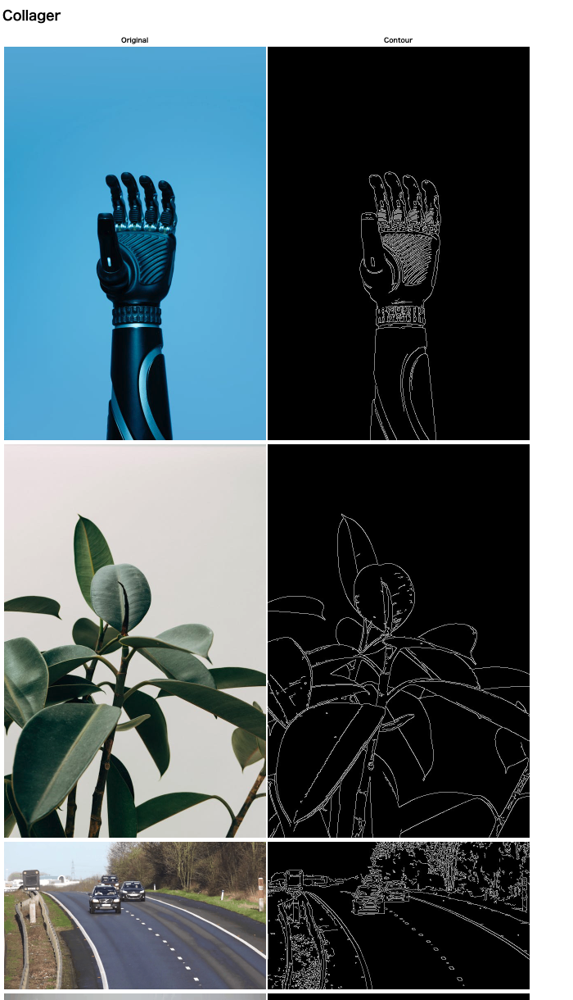
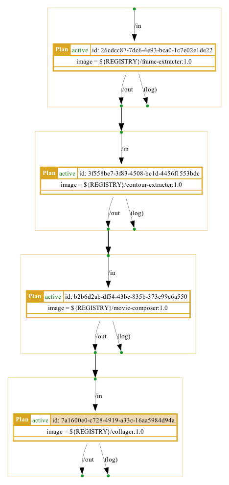
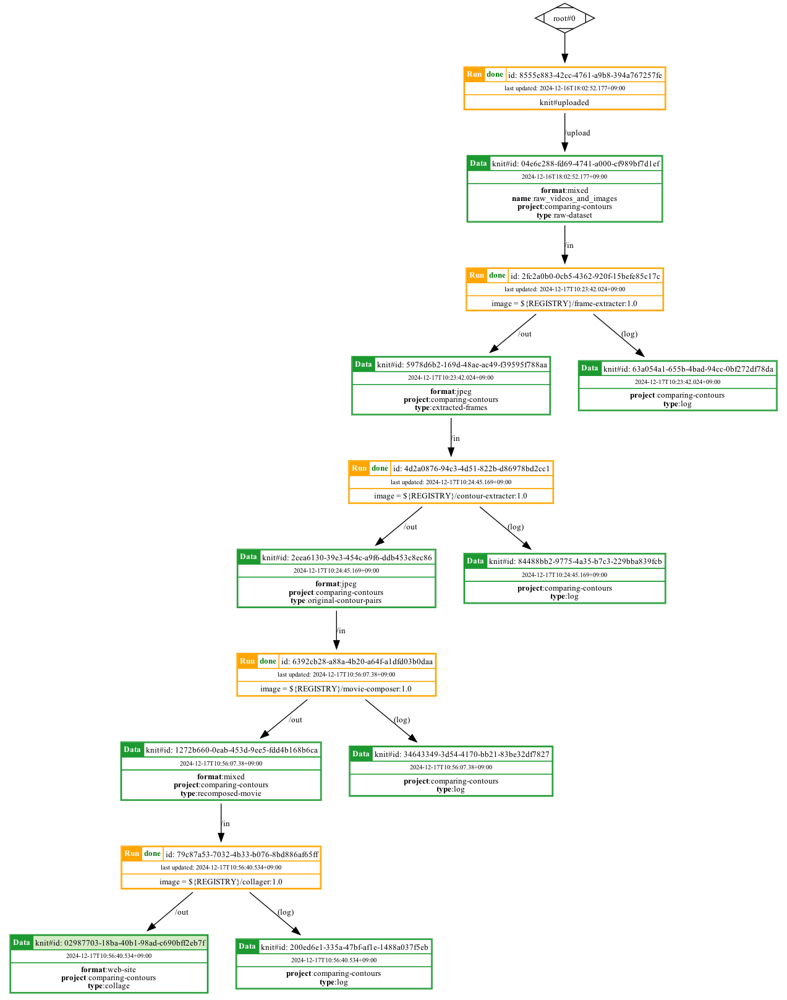

EXAMPLE: Image Processing Pipeline with Knitfab
================================================

本書では、画像処理パイプラインを Knitfab を利用して構築した事例を紹介します。

具体的には「動画や画像から輪郭線を抽出して、元画像と輪郭線画像を比較する HTML ファイルを生成する」という一連のワークフローを作成してゆきます。

## ステップ1. オーバービュー

次の手順で作業を進めてゆくことにします。

1. オーバーピュー
2. 環境構築
3. データセット収集と Knitfab へのアップロード
4. パイプライン構築
5. 結果の確認

## ステップ2. Knitfab プロジェクトの準備をする

Plan を定義し始める前に、この一連のチュートリアルを行うディレクトリを作成します。

```
mkdir -p contour-compairing
cd contour-comparing
```

続いて、このディレクトリを Knitfab の作業ディレクトリにします。

`knit init` して、このディレクトリでの作業で使う Knitfab を設定します。

```
knit init PATH/TO/handout/knitprofile
```

さらに、このディレクトリでのプロジェクト用の共通タグを `knitenv` ファイルに記述します。

```yaml:knitenv
tag:
  - "project:compairing-contours"
```

これによって、以後の `knit data push` や `knit plan template` が、常にこの `project:contour-comparing-pipeline` タグをセットするようになり、他のプロジェクトとこの一連の実験を分離できます。

## ステップ3. データセットのアップロード

入力データセットを収集して、 Knitfab にアップロードします。
Knitfab では、Data をフォルダ単位で取り扱うので、データセットを収集する段階からファイルをひとつのフォルダにまとめておきます。

```
mkdir ./raw_videos_and_images
wget -O ./raw_videos_and_images/robot.jpg https://raw.githubusercontent.com/opst/knitfab-docs/main/04.examples/contour-comparing/dataset/raw_videos_and_images/robot.jpg
wget -O ./raw_videos_and_images/plant.jpg https://raw.githubusercontent.com/opst/knitfab-docs/main/04.examples/contour-comparing/dataset/raw_videos_and_images/plant.jpg
wget -O ./raw_videos_and_images/highway.mp4 https://raw.githubusercontent.com/opst/knitfab-docs/main/04.examples/contour-comparing/dataset/raw_videos_and_images/highway.mp4
wget -O ./raw_videos_and_images/sleeping-cat.mp4 https://raw.githubusercontent.com/opst/knitfab-docs/main/04.examples/contour-comparing/dataset/raw_videos_and_images/sleeping-cat.mp4
```

その後、フォルダ `./raw_videos_and_images` を Knitfab の Data としてアップロードします。

```
knit data push -t format:mixed -t type:raw-dataset -t project:comparing-contours -n ./raw_videos_and_images/
```

## ステップ4. パイプラインを構築する

パイプラインとは、いくつかのタスク (処理) が意味のある順序に沿って並んだものです。パイプの中を流れる液体のように、始点から終点までデータが流れていき、その過程で各タスクが順次実行されていくため、パイプラインと呼びます。

Knitfab のパイプラインも、一連の (1 つまたは複数の) タスクとして実行します。個々のタスクの定義は、ユーザが Plan として与えます。ある 1 つのタスクが完了すると、Plan で決めた規則に従って次のタスクが Knitfab によって起動されます。つまり、パイプラインを構築するためにユーザがやるべきことは、個々のタスクの内容と、それらの間をつなぐ規則を考えて Plan を定義していくことです。

今回の目的である「画像や動画の混ざったデータセットを入力に、それら元画像や元動画と、その輪郭抽出版を比較する HTML ファイルを生成する」というパイプラインに必要なタスクを検討し、各タスクに対応する Plan を順次定義してゆきます。

### パイプラインの見通し

パイプラインを構築する前に、パイプライン全体の見通しを立てます。このパイプラインには次のタスクが必要です。

1. Frame Extracter: データセットのうち、動画をフレーム画像に分解するタスク
2. Contour Extracter: 画像から輪郭線を取り出すタスク
3. Movie Composer: フレーム画像を動画に戻すタスク
4. Collager: 元画像（動画）と輪郭線画像（動画）比較用 Web ページを生成するタスク

以上のタスクを順に施すことで、動画や画像を詰め込んだデータセットから、その輪郭線画像と比較する Web ページを得ることができます。
各タスクに対応する Plan を定義して、パイプラインを構築してゆきます。

タスク 4. では、元画像と輪郭線画像と組にして取り扱いたいので、タスク 2. と 3. でも、ひとつの Data の中に元画像と輪郭線画像を組にして保持することにします。

### Frame Extracter

これは Data 内の mp4 動画からフレームを jpeg 画像として抽出するタスクです。

このタスクを定義するためのディレクトリを作成します。

```
mkdir -p plans/frame-extracter
```

フレーム抽出をするプログラムを書きます。 `plans/frame-extracter/main.py` として、次の Python スクリプトを作成します。

```python:plans/frame-extracter/main.py
from argparse import ArgumentParser
import os
import pathlib
import shutil

import cv2


def extract_frames(video_path: pathlib.Path, output_dir: pathlib.Path):
    orig_name = video_path.stem
    if not video_path.exists():
        raise FileNotFoundError(f"video file {video_path} not found")

    cap = cv2.VideoCapture(str(video_path))
    frame_count = 0
    print(f"Extracting frames from {video_path}")
    while True:
        print(f"...frame #{frame_count}")
        ret, frame = cap.read()
        if not ret:
            break

        cv2.imwrite(
            str(output_dir / f"{orig_name}_frame_{frame_count:010d}.jpg"), frame
        )
        frame_count += 1

    cap.release()


def main(input_dir: pathlib.Path, output_dir: pathlib.Path):
    if not input_dir.exists:
        raise FileNotFoundError(f"input file {input_dir} not found")

    for d, _, files in os.walk(input_dir):
        dirpath = pathlib.Path(d)
        relpath = dirpath.relative_to(input_dir)
        outpath = output_dir / relpath
        os.makedirs(outpath, exist_ok=True)

        for file in files:
            source = dirpath / file
            print(f"Processing {source}")
            if source.name.lower().endswith(".mp4"):
                os.makedirs(outpath / source.stem, exist_ok=True)
                extract_frames(source, outpath / source.stem)
            else:
                shutil.copy(dirpath / file, outpath / file)


if __name__ == "__main__":
    parser = ArgumentParser()
    parser.add_argument("--input", type=pathlib.Path, required=True)
    parser.add_argument("--output", type=pathlib.Path, required=True)

    args = parser.parse_args()
    main(input_dir=args.input, output_dir=args.output)

```

入力 (`--input`) ディレクトリ内のファイルを、出力(`--output`) ディレクトリに複製します。
この際、MP4 ファイルについては、ファイルを複製する代わりに、その各フレームを JPEG ファイルとして抽出しています。
フレーム画像は、 `${元のファイル名}_frame_${フレーム番号}.jpg` というファイル名になるようにしました。フレーム番号は 10 桁の左ゼロ埋めフォーマットにしてあります。これは、ファイル名を辞書順に並べたときに、フレーム番号順に並ぶようにするためです。

続いて、これをコンテナイメージにします。 `plans/frame-extracter/Dockerfile` に、次の Dockerfile を作成します。

```Dockerfile:plans/frame-extracter/Dockerfile
FROM python:3.12-bookworm

WORKDIR "/work"
COPY . .
RUN pip install -r requirements.txt

ENTRYPOINT [ "python", "./main.py" ]
CMD ["--input", "/in", "--output", "/out"]

```

また、このスクリプトを動作させるために、`plans/frame-extracter/requirements.txt` に次の内容を書き込みます。

```plans/frame-extracter/requirements.txt
opencv-python-headless==4.11.0.86

```

これをビルドし、タグ付けて、プッシュします。

```sh
docker build -t frame-extracter:1.0 plans/frame-extracter
docker tag frame-extracter:1.0 ${REGISTRY}/frame-extracter:1.0
docker push ${REGISTRY}/frame-extracter:1.0
```

> [!NOTE]
>
> 本事例をお手元で再現する際には、 `${REGISTRY}` の部分を適宜お使いの Dokcer Image レジストリのホストで上書きしてください。

さらに、このイメージを利用した Plan 定義を作成します。

```yaml:plans/frame-extracter/frame-extracter.plan.yaml
image: "${REGISTRY}/frame-extracter:1.0"

args:
  - --input
  - /in
  - --output
  - /out

inputs:
  - path: "/in"
    tags:
      - "format:mixed"
      - "type:raw-dataset"
      - "project:comparing-contours"

outputs:
  - path: "/out"
    tags:
      - "type:extracted-frames"
      - "format:jpeg"
      - "project:comparing-contours"

log:
  tags:
    - "type:log"
    - "project:comparing-contours"

active: true

resources:
  cpu: 1
  memory: 1Gi

```

> [!NOTE]
>
> Knitfab 組み込みのレジストリをお使いの場合、Plan 定義中の `${REGISTRY}` の部分は `localhost:${PORT}` とお書きください。
> (`${PORT}` は、組み込みのレジストリのポート番号です)

この Plan を Knitfab に登録します。

```sh
knit plan apply plans/frame-extracter/frame-extracter.plan.yaml
```

### Contour Extracter

画像から輪郭線抽出を行うタスクを定義してゆきます。

作業ディレクトリを作成します。

```sh
mkdir plans/contour-extracter
```

輪郭線抽出を行う Python スクリプトを `plans/contour-extracter/main.py` として作成します。

```python:plans/contour-extracter/main.py
from argparse import ArgumentParser
import os
import pathlib
import shutil

import cv2


def extract_contour(imagefile_path: pathlib.Path, outputfile_path: pathlib.Path):
    img = cv2.imread(str(imagefile_path))
    edges = cv2.Canny(img, 100, 200)
    cv2.imwrite(str(outputfile_path), edges)


def main(input_dir: pathlib.Path, output_dir: pathlib.Path):
    if not input_dir.exists:
        raise FileNotFoundError(f"input file {input_dir} not found")

    for d, _, files in os.walk(input_dir):
        dirpath = pathlib.Path(d)
        relpath = dirpath.relative_to(input_dir)
        outpath_original = output_dir / "original" / relpath
        outpath_contour = output_dir / "contour" / relpath

        os.makedirs(outpath_original, exist_ok=True)
        os.makedirs(outpath_contour, exist_ok=True)

        for file in files:
            source = dirpath / file
            if not source.name.lower().endswith(".jpg"):
                continue

            print(f"Processing {source}")
            shutil.copy(source, outpath_original / file)
            extract_contour(source, outpath_contour / file)


if __name__ == "__main__":
    parser = ArgumentParser()
    parser.add_argument("--input", type=pathlib.Path, required=True)
    parser.add_argument("--output", type=pathlib.Path, required=True)

    args = parser.parse_args()
    main(input_dir=args.input, output_dir=args.output)

```

出力ディレクトリ内に `original` と `contour` というディレクトリを作成し、`original` には元画像のコピーを、`contour` には元画像と同じ名前で輪郭抽出画像を置きます。

続いて、コンテナイメージを作成します。　`plans/contour-extracter/Dockerfile` に次の内容の Dockerfile を作成します。

```Dockerfile:plans/contour-extracter/Dockerfile
FROM python:3.12-bookworm

WORKDIR "/work"
COPY . .
RUN pip install -r requirements.txt

ENTRYPOINT [ "python", "./main.py" ]
CMD ["--input", "/in", "--output", "/out"]

```

また、このスクリプトを動作させるために、`plans/contour-extracter/requirements.txt` に次の内容を書き込みます。

```plans/conrour-extracter/requirements.txt
opencv-python-headless==4.11.0.86

```

これをビルドし、タグ付けて、プッシュします。

```sh
docker build -t contour-extracter:1.0 plans/contour-extracter
docker tag contour-extracter:1.0 ${REGISTRY}/contour-extracter:1.0
docker push ${REGISTRY}/contour-extracter:1.0
```

さらに、このイメージを利用する Plan を定義します。 `plans/contour-extracter/contour-extracter.plan.yaml` を次の内容で作成します。

```yaml:plans/contour-extracter/contour-extracter.plan.yaml
image: "${REGISTRY}/contour-extracter:1.0"

args:
  - --input
  - /in
  - --output
  - /out

inputs:
  - path: "/in"
    tags:
      - "type:extracted-frames"
      - "format:jpeg"
      - "project:comparing-contours"

outputs:
  - path: "/out"
    tags:
      - "type:original-contour-pairs"
      - "format:jpeg"
      - "project:comparing-contours"

log:
  tags:
    - "type:log"
    - "project:comparing-contours"

active: true

resources:
  cpu: 1
  memory: 1Gi

```

この Plan を Knitfab に登録します。

```sh
knit plan apply plans/contour-extracter/contour-extracter.plan.yaml
```

### Movie Composer

入力された Data のうち、フレーム画像についてアニメーション GIF に変換するタスクです。
フレーム画像のファイル名には `_frame_` という部分が入っているので、それを手がかりに動画を再構成することにします。
それ以外のファイルは単純に出力にコピーすることにします。

作業ディレクトリを作成します。

```sh
mkdir plans/movie-composer
```

`plans/movie-composer/main.py` に、次の内容の Python スクリプトを作成します。

```python:plans/movie-composer/main.py
from argparse import ArgumentParser
import os
import pathlib
import shutil

import cv2
import imageio.v2 as imageio


def compose_gif(frames: list[pathlib.Path], dest: pathlib.Path):
    f = [cv2.imread(str(source))[:, :, ::-1] for source in frames]  # BGR -> RGB
    imageio.mimsave(dest, f, duration=0.1)


def main(input_dir: pathlib.Path, output_dir: pathlib.Path):
    if not input_dir.exists:
        raise FileNotFoundError(f"input file {input_dir} not found")

    for d, _, files in os.walk(input_dir):
        dirpath = pathlib.Path(d)
        relpath = dirpath.relative_to(input_dir)
        outpath = output_dir / relpath
        os.makedirs(outpath, exist_ok=True)

        frames = {}

        for file in files:
            if "_frame_" in file:
                orig_name, *_ = file.split("_frame_")
                frames.setdefault(orig_name, []).append(file)
            else:
                shutil.copy(dirpath / file, outpath / file)

        for orig_name, frame_files in frames.items():
            frame_files.sort()  # Ensure the frames are in order
            print(f"Processing {dirpath / orig_name}")
            compose_gif(
                [dirpath / f for f in frame_files], outpath / f"{orig_name}.gif"
            )


if __name__ == "__main__":
    parser = ArgumentParser()
    parser.add_argument("--input", type=pathlib.Path, required=True)
    parser.add_argument("--output", type=pathlib.Path, required=True)

    args = parser.parse_args()
    main(input_dir=args.input, output_dir=args.output)

```

`./plans/movie-composer/Dockerfile` に、次の内容の Dockerfile を作成します。

```Dockerfile:plans/movie-composer/Dockerfile
FROM python:3.12-bookworm

WORKDIR "/work"
COPY . .
RUN pip install -r requirements.txt

ENTRYPOINT [ "python", "./main.py" ]
CMD ["--input", "/in", "--output", "/out"]

```

また、このスクリプトを動作させるために、`plans/movie-composer/requirements.txt` に次の内容を書き込みます。

```plans/movie-composer/requirements.txt
opencv-python-headless==4.11.0.86
imageio==2.37.0

```

これをビルドして、タグ付けして、プッシュします。

```sh
docker build -t movie-composer:1.0 plans/movie-composer
docker tag movie-composer:1.0 ${REGISTRY}/movie-composer:1.0
docker push ${REGISTRY}/movie-composer:1.0
```

続いて、このイメージを利用する Plan 定義を `plans/movie-composer/movie-composer.plan.yaml` に作成します。

```yaml:plans/movie-composer/movie-composer.plan.yaml
image: "${REGISTRY}/movie-composer:1.0"

args:
  - --input
  - /in
  - --output
  - /out

inputs:
  - path: "/in"
    tags:
      - "type:original-contour-pairs"
      - "format:jpeg"
      - "project:comparing-contours"

outputs:
  - path: "/out"
    tags:
      - "type:recomposed-movie"
      - "format:mixed"
      - "project:comparing-contours"

log:
  tags:
    - "type:log"
    - "project:comparing-contours"

active: true

resources:
  cpu: 1
  memory: 5Gi

```

動画を生成する都合、他の Plan よりも多めにメモリを要求していることに注意してください。

この Plan を Knitfab に登録します。

```sh
knit plan apply plans/movie-composer/movie-composer.plan.yaml
```

### Collager

元画像と輪郭画像を比較する Web ページを作成するタスクです。

作業ディレクトリを作ります。

```sh
mkdir ./plans/collager
```

Web ページを生成する Python スクリプトを、 `./plans/collager/main.py` として、次の内容で作成します。

```python:plans/collager/main.py
from argparse import ArgumentParser
import os
import pathlib
import shutil
import io

from bs4 import BeautifulSoup


html_template = """
<!DOCTYPE html>
<html>
<head>
    <title>Collager</title>
</head>
<body>
    <h1>Collager</h1>
    <table id="collage-container">
        <tr><th>Original</th><th>Contour</th></tr>
    </table>
</body>
</html>
"""


def main(input_dir: pathlib.Path, output_dir: pathlib.Path):
    if not input_dir.exists:
        raise FileNotFoundError(f"input file {input_dir} not found")
    orig_root = input_dir / "original"
    if not orig_root.exists:
        raise FileNotFoundError(f"input file {orig_root} not found")
    contour_root = input_dir / "contour"
    if not contour_root.exists:
        raise FileNotFoundError(f"input file {contour_root} not found")

    static = output_dir / "static"
    os.makedirs(static, exist_ok=True)

    orig_dest = static / "original"
    os.makedirs(orig_dest, exist_ok=True)
    contour_dest = static / "contour"
    os.makedirs(contour_dest, exist_ok=True)

    soup = BeautifulSoup(html_template, "html.parser")
    container = soup.find("table", id="collage-container")

    for d, _, files in os.walk(orig_root):
        dirpath = pathlib.Path(d)
        relpath = dirpath.relative_to(orig_root)

        for file in files:
            contour_file = contour_root / relpath / file
            if not contour_file.exists():
                print(f"Contour file not found for {file}")
                continue

            orig_file = orig_dest / relpath / file
            os.makedirs(orig_file.parent, exist_ok=True)
            print(f"Copying {dirpath / file} to {orig_file}")

            # animated gif cannot be copied with shutil.copy (not know why)
            with open(dirpath / file, "rb") as f:
                with open(orig_file, "xb") as f2:
                    f2.write(f.read())

            contour_file = contour_dest / relpath / file
            os.makedirs(contour_file.parent, exist_ok=True)
            print(f"Copying {contour_root / relpath / file} to {contour_file}")

            with open(contour_root / relpath / file, "rb") as f:
                with open(contour_file, "xb") as f2:
                    f2.write(f.read())

            row = soup.new_tag("tr")
            container.append(row)

            orig_cell = soup.new_tag("td")
            row.append(orig_cell)
            img_orig = soup.new_tag("img", src=str(orig_file.relative_to(output_dir)))
            orig_cell.append(img_orig)

            contour_cell = soup.new_tag("td")
            row.append(contour_cell)
            img_contour = soup.new_tag(
                "img", src=str(contour_file.relative_to(output_dir))
            )
            contour_cell.append(img_contour)

    with open(output_dir / "index.html", "w") as f:
        f.write(str(soup))


if __name__ == "__main__":
    parser = ArgumentParser()
    parser.add_argument("--input", type=pathlib.Path, required=True)
    parser.add_argument("--output", type=pathlib.Path, required=True)

    args = parser.parse_args()
    main(input_dir=args.input, output_dir=args.output)

```

次の内容で `./plans/collager/Dockerfile` に Dockerfile を作成します。

```Dockerfile:plans/collager/Dockerfile
FROM python:3.12-bookworm

WORKDIR "/work"
COPY . .
RUN pip install -r requirements.txt

ENTRYPOINT [ "python", "./main.py" ]
CMD ["--input", "/in", "--output", "/out"]

```

また、このスクリプトを動作させるために、`plans/collager/requirements.txt` に次の内容を書き込みます。

```plans/collager/requirements.txt
beautifulsoup4==4.13.3

```

これを、ビルドして、タグ付けして、プッシュします。

```sh
docker build -t collager:1.0 plans/collager
docker tag collager:1.0 ${REGISTRY}/collager:1.0
docker push ${REGISTRY}/collager:1.0
```

続いて、このイメージを利用する Plan 定義を `plans/collager/collager.plan.yaml` に作成します。

```yaml:plans/collager/collager.plan.yaml
image: "${REGISTRY}/collager:1.0"

args:
  - --input
  - /in
  - --output
  - /out

inputs:
  - path: "/in"
    tags:
      - "type:recomposed-movie"
      - "format:mixed"
      - "project:comparing-contours"

outputs:
  - path: "/out"
    tags:
      - "type:collage"
      - "format:web-site"
      - "project:comparing-contours"

log:
  tags:
    - "type:log"
    - "project:comparing-contours"

active: true

resources:
  cpu: 1
  memory: 1Gi

```

この Plan を Knitfab に登録します。

```sh
knit plan apply plans/collager/collager.plan.yaml
```

## ステップ5. 結果の確認

### パイプラインの生成物について

パイプラインの生成物を確認します。

生成物は `format:web-site`、`type:collage`、`project:comparing-contours` で Tag 付けられている Data なので、これらの Tag に基づいて検索します。

```
knit data find -t "format:web-site" -t "type:collage" -t "project:comparing-contours"
```

こうして特定した Knit ID を指定して Data をダウンロードします。

```
knit data pull -x ${Knit ID} ./out/collager
```

すると、 `./out/collager/${Knit ID}` にダウンロードされた Data の内容が保存されます。

そのなかの `index.html` をブラウザで開くと、次のような、元画像 (original) と輪郭画像 (contour) を並べて比較する Web ページになっています。



### 構成したパイプラインについて

一連のパイプラインがどういう構造をしているか、を Plan Graph で確認しておきます。

```
knit plan graph -n all ${Collager Plan の Plan ID} | dot -Tpng > plan-graph.png
```

次のような Plan Graph が得られます。4つのプランが連鎖したパイプラインを構成していることがわかります。



### リネージについて

以上のパイプラインによって構成された lineage graph を確認します。

```
knit data linage -n all ${Collager の出力の Knit ID}
```

既に見た Plan Graph の構造と同じく、4 つの Run とその各出力からなる lineage が描き出されます。



## まとめ

- Knitfab を用いて、機械学習に限らない、一般のタスクパイプラインを構築することができました
- 複数の Plan を連鎖させてタスクを処理することができました
