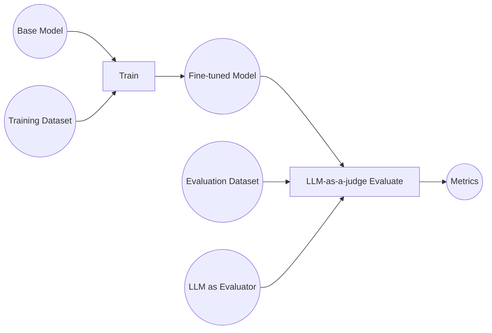
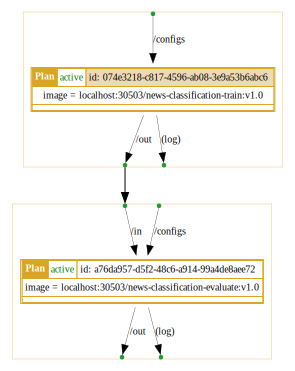
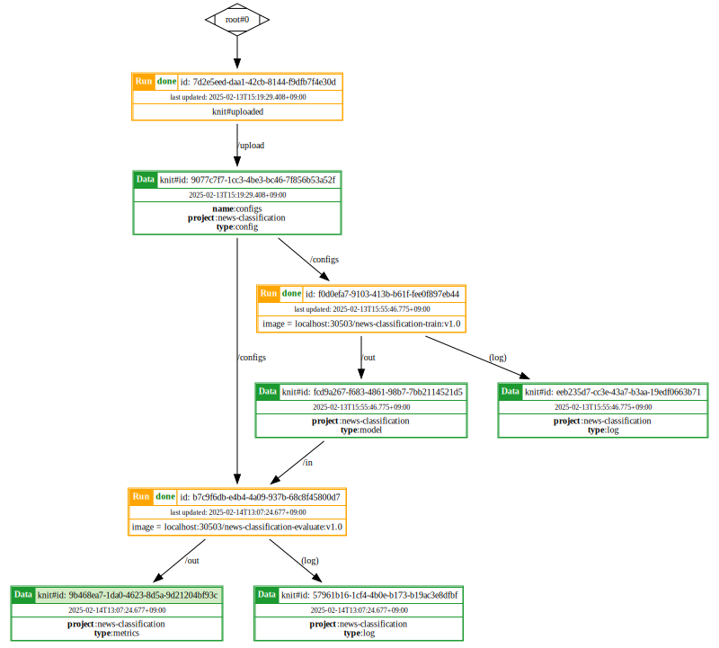

# Example: Fine-Tune LLM model for News Classification with Knitfab

This guide walks you through fine-tuning a large language model (LLM) for classification using Knitfab. Discover how Knitfab automates the fine-tuning process and how you can leverage the LLM-as-a-judge approach for efficient, human-like evaluation.

## Overview
Fine-tuning Large Language Models (LLMs) requires careful optimization of numerous parameters, a complex process that can easily become unmanageable. Knitfab simplifies this complexity by providing robust management of all training artifacts, from initial input data to final model outputs. This streamlined approach facilitates experimentation with diverse configurations, enabling efficient fine-tuning. Furthermore, we'll explore the innovative concept of "LLM-as-a-judge," a promising evaluation technique that offers human-quality assessments while significantly reducing both cost and time. This example will walk through the complete process, from fine-tuning an LLM for news classification to evaluating its performance using an LLM-as-a-judge, all within the Knitfab platform. This demonstration will highlight the power and seamless functionality of Knitfab as a comprehensive machine learning pipeline management platform.
 
The following diagram outlines the key components and steps involved:

### Data
- __Base Model:__ The pre-trained LLM used as a foundation for fine-tuning. In this example, we will use `GPT-2`.
- __Training Dataset:__ The dataset used to fine-tune the model for news classification. We will leverage the `20 Newsgroups` dataset from `scikit-learn`.
- __Fine-tuned Model:__ The resulting model after fine-tuning, now specialized for news classification.
- __Evaluation Dataset:__ A held-out subset of the `20 Newsgroups` dataset used for LLM-as-a-judge evaluation.
- __LLM as Evaluator:__ A LLM model for LLM-as-a-judge evaluation.
- __Metrics:__ Custom metrics designed to evaluate LLM outputs.

### Tasks
- __Train:__ Fine-tune the base LLM on the training dataset to classify news articles.
- __LLM-as-a-judge Evaluate:__ Assess the performance of the fine-tuned model using the defined custom metrics and the evaluation dataset.


## Prerequisites
To successfully complete this example, ensure you have met the following prerequisites:

### Essential
- **GPU:** This example is designed for GPU execution. Running it on a CPU is inefficient and will result in significantly longer processing times.
- **Knitfab Setup:** 
  - **Production:** Follow the instructions provided in [03.admin-guide](../../03.admin-guide/admin-guide-installation.en.md) for full installation.
  - **Experimentation:** Follow the instructions provided in [01.getting-started: Installing Knitfab on a local environment](../../01.getting-started/getting-started.en.md#installing-knitfab-on-a-local-environment) for a light weight version.
- **Knit CLI:** Follow the installation instructions in [01.getting-started: CLI Tool: knit](../../01.getting-started/getting-started.en.md#cli-tool-knit) to set up the Knit CLI.
- **Knit Command Initialization:** Refer to [01.getting-started: Initializing Knit Command](../../01.getting-started/getting-started.en.md#initializing-the-knit-command) for guidance on initializing Knit command using `knit init`.
- **`Docker` Installation**: Required for building and pushing images to the Knitfab platform.
- **LLM as Evaluator**: For LLM-as-a-Judge evaluation, you'll need an LLM. Three options are available:

  - **Local LLM with Ollama (Recommended)**: Set up Ollama on Docker and Kubernetes by following the instructions in [ollama/ollama-setup.en.md](ollama/ollama-setup.en.md).
  - **OpenAI**: Configure an OpenAI API key as described in the documentation: https://docs.confident-ai.com/docs/metrics-introduction#using-openai.
  - **Custom Model**: To use your own custom model, follow the setup instructions provided here: https://docs.confident-ai.com/docs/metrics-introduction#using-any-custom-llm.

### Optional
- **`kubectl`**: Required if you choose to use a local LLM with Ollama for LLM-as-a-Judge evaluation.

## Repository
To access the files and directories used in this example, clone the `knitfab-docs` repository from GitHub:
```bash
git clone https://github.com/opst/knitfab-docs.git
```
Once cloned, navigate to the `04.examples/news-classification` directory. You will find the following:
- **scripts:** This directory contains the essential files for training and deploying the model:
  - Python scripts (`train.py`, `evaluate.py`) for model training and evaluation.
  - `requirements.txt` files listing all required Python packages for dependency management.
  - `Dockerfile` used to build a Docker image of the application, enabling consistent deployment within the Knitfab Plan.
- **configs:** Contains the configuration for training and evaluation task.
- **plans:** Contains the Knitfab Plan YAML templates.

## Implementation Steps

## Step 1: Define fine-tuning task

This section provides an in-depth explanation of the logic implemented in `scripts/train/train.py` for fine-tuning a news classification model. The script follows a structured pipeline that includes argument parsing, model preparation, dataset processing, training, and evaluation. Each component is designed to facilitate easy customization and optimization.

### 1.1. Parse Arguments

The `parse_arguments` function is responsible for handling command-line arguments to configure the training process. Users can specify different parameters to override the default settings, allowing flexibility in model fine-tuning.

- `--config-file`: Path to a configuration JSON file. If provided, settings in this file will override the command-line arguments.
- `--save-to`: Directory where the trained model and logs will be stored. Defaults to `./out`.
- `--base-model`: Specifies the name of the base model to use for fine-tuning. Defaults to `openai-community/gpt2`.
- `--device`: Defines the hardware on which the training will run (`cuda` or `cpu`). Defaults to `auto`.
- `--epochs`: Number of training epochs. Defaults to `1`.
- `--learning-rate`: Specifies the learning rate for model training. Defaults to `2e-5`.

If a configuration file is provided via `--config-file`, its settings will override the corresponding command-line arguments to ensure consistency across different training runs.

**Code Breakdown**
```python
args = parser.parse_args()
if args.config_file:
    with open(args.config_file, "r") as f:
        config = json.load(f)
    for key, value in config.items():
        setattr(args, key.replace("-", "_"), value)
```
- Reads configuration from a JSON file if provided.
- Updates argument values dynamically.

### 1.2. Initialize Model and Tokenizer

The `setup_environment` method loads the selected base model and tokenizer, ensuring compatibility with quantization settings to optimize performance.

- Loads `AutoModelForSequenceClassification` with `BitsAndBytesConfig` for 4-bit quantization.
- Configures the tokenizer and sets padding token.

**Code Breakdown**
```python
quant_config = BitsAndBytesConfig(
    load_in_4bit=True,
    bnb_4bit_quant_type="nf4",
    bnb_4bit_compute_dtype=torch.float16,
    bnb_4bit_use_double_quant=True,
)
```
- Reduces model size using quantization for efficiency.
- `NormalFloat4 (NF4)` helps minimize the accuracy loss.
- `torch.float16` (half-precision floating point) allows for faster computations than full precision (`float32`) while still maintaining reasonable accuracy.
- Double quantization can further reduce memory usage.

```python
self.model = AutoModelForSequenceClassification.from_pretrained(
    self.args.base_model,
    num_labels=self.num_labels,
    quantization_config=quant_config,
    device_map=args.device,
)
```
- Load a pre-trained model for sequence classification.
- Specify the number of output labels for the classification task, the quantization config and the device (`cpu/cuda`)

### 1.3. Load and Preprocess Datasets

The `prepare_datasets` method converts raw datasets into tokenized datasets, suitable for training.

- Loads data from the `fetch_20newsgroups` dataset.
- Cleans text by removing empty or `NaN` entries.
- Tokenizes text for input to the model.

**Code Breakdown**
```python
def load_train_datasets(self) -> None:
    raw_train_dataset = fetch_20newsgroups(subset="train")
    self.train_dataset = self.prepare_datasets(raw_train_dataset)

def load_eval_datasets(self) -> None:
    raw_eval_dataset = fetch_20newsgroups(subset="test")
    self.eval_dataset = self.prepare_datasets(raw_eval_dataset)
```
- Loads train and test data subset from the `fetch_20newsgroups` dataset.

```python
def prepare_datasets(self, dataset: Any) -> Dataset:
    def tokenize(examples):
        return self.tokenizer(examples["text"], truncation=True)

    df = pd.DataFrame({
        "text": dataset.data,
        "label": dataset.target,
    })
    df_cleaned = df.dropna(subset=["text"])
    df_cleaned = df_cleaned[df_cleaned["text"].str.strip() != ""]
    
    dataset = Dataset.from_pandas(df_cleaned)
    return dataset.map(tokenize, batched=True)
```
- Converts raw text into structured `DataFrame` format.
- Applies tokenization to ensure compatibility with `Transformer` models.

### 1.4. Configure Training Parameters

The `setup_trainer` method initializes the `SFTTrainer` with appropriate hyperparameters and model configurations.

- Uses `TrainingArguments` to define training settings.
- Configures `LoraConfig` for parameter-efficient fine-tuning.
- Uses `DataCollatorWithPadding` to handle different sequence lengths.

**Code Breakdown**
```python
training_args = TrainingArguments(
    output_dir=self.args.save_to,
    logging_dir=f"{self.args.save_to}/logs",
    num_train_epochs=self.args.epochs,
    per_device_train_batch_size=1,
    per_device_eval_batch_size=1,
    gradient_accumulation_steps=2,
    learning_rate=self.args.learning_rate,
    weight_decay=0.05,
    max_grad_norm=0.3,
    fp16=True,
    bf16=False,
    warmup_ratio=0.1,
    lr_scheduler_type="cosine",
    logging_strategy="steps",
)
```
- Defines core training parameters, including batch size, learning rate, weight decay, and gradient accumulation.
- Implements mixed precision (`fp16`) for optimized training efficiency.
- Uses a cosine learning rate scheduler with a warm-up ratio of `0.1`.
- Specify a dedicated directory to organize project's outputs, such as trained models and log files.

```python
peft_config = LoraConfig(
    lora_alpha=16,
    lora_dropout=0.1,
    r=64,
    bias="none",
    task_type="SEQ_CLS",
)
```
- Implements `LoRA (Low-Rank Adaptation)` for efficient parameter tuning.
- Sets dropout and rank values to balance regularization and model performance.

```python
collator = DataCollatorWithPadding(tokenizer=self.tokenizer, padding="max_length")
```
- Ensures proper padding for sequences to maintain batch consistency.

```python
self.trainer = SFTTrainer(
    model=self.model,
    args=training_args,
    peft_config=peft_config,
    train_dataset=self.train_dataset,
    eval_dataset=self.eval_dataset,
    tokenizer=self.tokenizer,
    data_collator=collator,
)
```
- Initializes the `SFTTrainer` with the configured model, training arguments, dataset, and tokenizer.
- Combines all elements to execute the fine-tuning process efficiently.

### 1.5. Train and Evaluate the Model

The `run` method orchestrates the entire training process, from setting up the environment to saving the results.

- Loads datasets and initializes the trainer.
- Executes training and evaluation.
- Saves the trained model and evaluation metrics.

**Code Breakdown**
```python
self.trainer.train()
self.eval_results = self.trainer.evaluate()
self.save_results()
```
- Trains the model on the dataset.
- Evaluates performance on test data.
- Saves model checkpoints and metrics for later use.

## Step 2: Define LLM-as-a-judge evaluation task

This section presents an evaluation pipeline using an LLM to assess a fine-tuned news classification model. The `TestGPT2Model` class in `scripts/evaluate/evaluate.py` processes test cases, applies a category precision metric, and generates performance reports. This automated approach ensures consistent benchmarking and helps refine model accuracy.

### 2.1. Parse Arguments

The `parse_arguments` function handles command-line arguments for configuring the evaluation process. Users can specify parameters to override default settings, ensuring flexibility in model evaluation.

- `--config-file`: Path to a configuration JSON file. If provided, settings in this file override command-line arguments.
- `--model-path`: Path to the fine-tuned model. Defaults to `./in/model`.
- `--save-to`: Directory where evaluation results will be stored. Defaults to `./out`.
- `--device`: Specifies the hardware for inference (`cuda` or `cpu`). Defaults to `cuda`.
- `--num-samples`: Number of test samples to evaluate. Defaults to `100`.
- `--threshold`: Deepeval test threshold for performance measurement. Defaults to `0.8`.

If a configuration file is provided via `--config-file`, its settings will override corresponding command-line arguments for consistency.

### 2.2. Create Classifier

The `create_classifier` function initializes a text classification model for evaluation.

- Loads a fine-tuned model using `AutoModelForSequenceClassification`.
- Retrieves a tokenizer using `AutoProcessor`.
- Uses `transformers.pipeline` for efficient text classification.

**Code Breakdown**
```python
model = AutoModelForSequenceClassification.from_pretrained(model_path, num_labels=num_labels)
tokenizer = AutoProcessor.from_pretrained(model_path)

return pipeline(
    "text-classification",
    model=model,
    tokenizer=tokenizer,
    device=device,
    max_length=1024
)
```
- Initializes a classification pipeline with the given model and tokenizer.
- Ensures maximum sequence length does not exceed `1024` tokens.

### 2.3. Generate Test Cases

The `get_test_cases` function retrieves test samples from the `20 Newsgroups` dataset and prepares them for evaluation.

- Fetches the `20 Newsgroups` dataset.
- Maps numerical labels to category names.
- Generates test cases with expected and actual classification outputs.

**Code Breakdown**
```python
raw_eval_dataset = fetch_20newsgroups(subset='test')
categories = raw_eval_dataset.target_names

data = raw_eval_dataset.data[:num_samples]
target = raw_eval_dataset.target[:num_samples]

prompts = [f"### [HUMAN] Classify this news article: '{text}'\n" for text in data]

classifier = create_classifier(model_path, num_labels, device)
batch_results = classifier(prompts, truncation=True, max_length=1024, batch_size=1)
```
- Retrieves test data up to `num_samples` from the dataset.
- Uses the trained classifier to predict categories for each test sample.

```python
test_cases = []
for text, category_idx, result in zip(data, target, batch_results):
    expected_category = categories[category_idx]
    actual_output = map_category(result["label"], categories)
    test_case = LLMTestCase(
        input=text,
        actual_output=actual_output,
        expected_output=expected_category,
    )
    test_cases.append(test_case)
```
- Compares predicted category (`actual_output`) with ground truth (`expected_category`).
- Stores results as test cases for evaluation.

### 2.4. Evaluate Model Performance

The `TestGPT2Model` class manages the LLM-as-a-judge evaluation process using the `deepeval` framework.

- Defines `CategoryPrecision` metric for classification performance.
- Runs evaluations using `deepeval.evaluate` and saves results to disk.

**Code Breakdown**
```python
return GEval(
    name="CategoryPrecision",
    threshold=self.args.threshold,
    criteria="Category classifier precision - determine if the actual output matched the provided expected output",
    evaluation_steps=[
        "Award 1.0 points for exact match between actual and expected category",
        "Award 0.5 points for semantically related categories",
        "Award 0.0 points if categories are unrelated",
        "Minimum score after penalties is 0.0",
    ],
    evaluation_params=[LLMTestCaseParams.ACTUAL_OUTPUT, LLMTestCaseParams.EXPECTED_OUTPUT],
)
```
- Defines a scoring metric for classification accuracy.
- Penalizes incorrect or ambiguous predictions.

```python
def run_test(self):
    self.setup_class()
    self.eval_result = self.test_category_prediction()
    self.save_evaluate_result()
```
- Runs evaluation tests on the trained model.
- Stores results in a JSON file for analysis.

## Step 3: Build Docker images
This section involves creating Docker images for the fine-tuning and evaluation of the LLM. 

### 3.1. Build `news-classification-train` Image
```bash
docker build -t news-classification-train:v1.0 \
             -f scripts/train/Dockerfile \
             ./scripts/train
```
The `news-classification-train` image is responsible for fine-tuning of the model.

### 3.2. Build `news-classification-evaluate` Image
**Modify the Dockerfile:**
To configure the LLM as Evaluator for the LLM-as-a-Judge process, modify the command line within your Dockerfile. Consult the documentation provided in the [Prerequisites](#prerequisites) section for specific instructions and requirements.
```docker
# Modify the command (e.g., base-url, api-key) to set your LLM as Evaluator
RUN deepeval set-local-model --model-name=llama3.2 \
    --base-url="http://ollama:11434/v1/" \
    --api-key="ollama"
```
**Build Docker Image:**
```bash
docker build -t news-classification-evaluate:v1.0 \
             -f scripts/evaluate/Dockerfile \
             ./scripts/evaluate
```
The `news-classification-evaluate` image is used to evaluate the performance of the fine-tuned model with LLM-as-a-judge.

## Step 4: (Optional) Verify Docker images
> [!Note]
> 
> You may skip the Docker image verify step and proceed to ([Push Docker images to Knitfab](#step-5-push-docker-images-to-knitfab)) if you deem it unnecessary. 

### 4.1. Run the Fine-tune Image
```bash
docker run --rm -it --gpus all \
    -v "$(pwd)/configs:/configs" \
    -v "$(pwd)/out:/out" \
    news-classification-train:v1.0
```
This command runs the `news-classification-train:v1.0` image in an interactive mode.
- The `-v` flags mount the host directories containing the config files (`/configs`) and the output directory (`/out`) into the container.
- This allows you to test the image locally and generate the fine-tuned model.
- If you plan to proceed to the next step, keep the container running until it completes. Otherwise, you can stop it at any time once it appears to be running.

### 4.2. Model Evaluation with LLM-as-a-judge
> [!Warning]
> 
> These steps require a pre-existing LLM to function as the evaluator in the LLM-as-a-Judge process. Please review the [Prerequisites](#prerequisites) section for resource requirements and installation instructions.

> [!Caution]
>
> The following steps are based on the Local LLM with Ollama setup described in [ollama/ollama-setup.en.md](ollama/ollama-setup.en.md). If you plan to use a different LLM as your evaluator, you will need to adapt the solution accordingly.

```bash
docker run --rm -it --gpus all --network ollama-net\
    -v "$(pwd)/configs:/configs" \
    -v "$(pwd)/out:/out" \
    -v "$(pwd)/out/model:/in/model" \
    news-classification-evaluate:v1.0
```
- The command runs `news-classification-evaluate:v1.0` image and connects the container to the `ollama-net` network where the Ollama app is running. If you are not using Ollama, you can omit the `--network` option.
- The image evaluate the fine-tuned model using the defined custom metric and `test` subset of the `20 Newsgroups` dataset.
- If you plan to proceed to the next step, keep the container running until it completes. Otherwise, you can stop it at any time once it appears to be running.
- The evaluation metrics will be saved as a JSON file named `deepeval-result.json` in the `out` directory.

### 4.3. Performance Analysis

Review the `deepeval-result.json` file to analyze the model's performance based on the defined custom metrics. This analysis will allow you to evaluate the effectiveness of your fine-tuning. Consider whether the current custom metrics adequately reflect your specific requirements, and redefine them if necessary.

## Step 5: Push Docker images to Knitfab
Now we will push the Docker images to the Knitfab registry for use within the Knitfab platform.

### 5.1. Tag Images with Registry URI

Before pushing the images to the Knitfab registry, you need to tag them with the correct registry URI. This allows Docker to identify the target registry for the push operation.
```bash
docker tag ${docker_image} ${registry_uri}/${docker_image}
```
Replace:

- `${docker_image}` with the name of each built image (e.g., `news-classification-train:v1.0`, `news-classification-evaluate:v1.0`).
- `${registry_uri}` with the actual URI of your Knitfab registry (e.g., `192.0.2.1:30503`).

### 5.2. Push Images to Knitfab Registry

Now, push the tagged images to the Knitfab registry:
```bash
docker push ${registry_uri}/${docker_image}
```
Replace `${docker_image}` with the name of each image (including the registry URI) as tagged in the previous step.

## Step 6: Fine-tuning.
This step involves the fine-tuning of the LLM for news classification on Knitfab.

### 6.1. Generate YAML tempelate

You have two options for generating the YAML template:
- Option 1: Create a Blank Template:
```bash
knit plan template --scratch > ./plans/news-classification-train.v1.0.yaml
```
This creates a new, empty YAML template file named `news-classification-train.v1.0.yaml` in the `./plans` directory. You will need to manually populate this template with the necessary configuration details.
- Option 2: Generate Template from Docker Image:
```bash
docker save ${registry_uri}/news-classification-train:v1.0 | \
    knit plan template > ./plans/news-classification-train.v1.0.yaml
```
This command generates a YAML template based on the Docker image `news-classification-train:v1.0`.

\* Replace `${registry_uri}` with the actual URI of your Knitfab registry.

\* This approach can help automate some of the configuration process.

### 6.2. Modify YAML Template
- Crucial Modifications:
  - `image`: 
    If your Knitfab Kubernetes Cluster utilizes a local registry, replace `registry_uri` within the `image` field with `localhost`. 

    Example:
    ```YAML
    # Replace 192.0.2.1
    image: "192.0.2.1:30503/news-classification-train:v1.0"
    # With localhost
    image: "localhost:30503/news-classification-train:v1.0"
    ```
    - This ensures the image is pulled from the local registry.

  - `inputs`, `outputs`, `log`: 
    Add the following tags to the `inputs`, `outputs` and `log` sections:

    ```YAML
    inputs:
      - path: "/configs"
        tags:
          - "type:config"
          - "project:news-classification"
    
    outputs:
      - path: "/out/model"
        tags:
          - "type:model"
          - "project:news-classification"
    
    log:
      tags:
        - "type:log"
        - "project:news-classification"
    ```
    - This facilitates better organization and filtering of `inputs`, `outputs` and `log` within the Knitfab system.

  - resources:
    Define the required CPU, Memory, and GPU resources

    ```YAML
    resources:
      cpu: 1
      memory: 10Gi
      nvidia.com/gpu: "1"
    ```
    

- Other Important Considerations:
  Always double-check that your modified YAML template adheres to the correct structure and syntax. You can use the YAML file provided in the `/plans` directory of the cloned Git repository as a reference.

### 6.3. Apply the YAML Template
```bash
train_plan=$(knit plan apply ./plans/news-classification-train.v1.0.yaml)
```
This command sends the Plan YAML to the Knitfab API, which creates a new Plan based on the provided configuration. 

The output of the command, which is stored in the `train_plan` variable, is a JSON object containing details about the created Plan.

### 6.4. Extract the Plan Id
```bash
train_plan_id=$(echo "$train_plan" | jq -r '.planId')
```
This command extracts the unique Id of the created Plan from the JSON output.

### 6.5. Push Configuration File to Knitfab
```bash
knit data push -t type:config \
               -t project:news-classification \
               -n ./configs
```
This command pushes the configuration files located at `./configs` to the Knitfab platform.

The `-t` flags add tags (e.g., `type:config`, `project:news-classification`) that Knitfab uses to identify and associate configurations with generated Plans.

### 6.6. Confirm the Run Status

After pushing the configuration file, Knitfab will initiate a Run to execute the training plan. You can monitor the status of this Run using the following command:
```bash
knit run find -p $train_plan_id
```
This command displays the training Run associated with the specified Plan Id. Periodically execute the command (or ultilize the Linux watch command) and wait until the `status` changes to `done` to indicate that the fine-tuning has completed successfully.

### 6.7. Retrieve Model Information

Once the training Run has completed successfully, you can retrieve information about the generated model artifact:
- Get Run Information:
```bash
train_run=$(knit run find -p $train_plan_id)
```
- Extract Run Outputs:
```bash
train_outputs=$(echo "$train_run" | jq -r '.[-1].outputs')
```
- Get Model Knit Id:
```bash
train_model_knit_id=$(echo "$train_outputs" | jq -r '.[0].knitId')
```

### 6.8. (Optional) Review the Run Log

If you want to examine the logs generated during the training process, you can use the following commands:
- Get Run Id:
```bash
train_run_id=$(echo "$train_run" | jq -r '.[-1].runId')
```
- Show Run Log:
```bash
knit run show --log $train_run_id
```

### 6.9. (Optional) Download the Model

If you need to access the trained model artifact directly, you can download it from the Knitfab platform using the following command:
```bash
knit data pull -x $train_model_knit_id ./out
```
This command downloads the trained model artifact from the Knitfab platform and stores it in the `./out` directory.

## Step 7: LLM-as-a-judge evaluation
> [!Warning]
> 
> As with Step 2, the evaluation task requires access to an LLM to serve as the evaluator in the LLM-as-a-Judge process. Please refer to the [Prerequisites](#prerequisites) section for resource requirements and installation instructions.

After fine-tuning, we will evaluate the model performance with LLM-as-a-judge.

### 7.1. Generate YAML tempelate
- Option 1: Create a Blank Template:
```bash
knit plan template --scratch > ./plans/news-classification-evaluate.v1.0.yaml
```
- Option 2: Generate Template from Docker Image:
```bash
docker save ${registry_uri}/news-classification-evaluate:v1.0 | \
    knit plan template > ./plans/news-classification-evaluate.v1.0.yaml
```
\* Replace `${registry_uri}` with the actual URI of your Knitfab registry.

### 7.2. Modify YAML Template
- Crucial Modifications:
  - `image`: 
    If your Knitfab Kubernetes Cluster utilizes a local registry, replace `registry_uri` within the image field with `localhost`.

    Example:
    ```YAML
    # Replace 192.0.2.1
    image: "192.0.2.1:30503/news-classification-evaluate:v1.0"
    # With localhost
    image: "localhost:30503/news-classification-evaluate:v1.0"
    ```
  - `inputs`, `outputs`, `log`: 
    Add the following tags to the `inputs`, `outputs` and `log` sections:
    
    ```YAML
    inputs:
      - path: "/configs"
        tags:
          - "type:config"
          - "project:news-classification"
      
      - path: "/in"
        tags:
          - "type:model"
          - "project:news-classification"

    outputs:
      - path: "/out"
        tags:
          - "type:metrics"
          - "project:news-classification"

    log:
      tags:
        - "type:log"
        - "project:news-classification"
    ```
> [!Note]
> 
> To ensure the evaluation dynamically recognizes the output model from the training process, we will *not* define the `in/model` within the configuration file. Instead, we will explicitly define `in/model` within the Plan YAML.

  - resources: 
  Define the required CPU, Memory, and GPU resources

    ```YAML
    resources:
      cpu: 1
      memory: 10Gi
      nvidia.com/gpu: "1"
    ```

- Other Important Considerations:
  Double-check that your modified YAML template adheres to the correct structure and syntax. You can use the YAML file provided in the `/plans` directory of the cloned Git repository as a reference.

### 7.3. Apply the YAML Template
```bash
evaluate_plan=$(knit plan apply ./plans/news-classification-evaluate.v1.0.yaml)
```
- The `evaluate_plan` variable will contain the JSON response from the Knitfab API, which includes details about the created Plan.

- Since the configuration file was pushed to Knitfab in the previous step, a Run under `evaluate_plan` will be automatically triggered and processed.

### 7.4. Extract the Plan Id
```bash
evaluate_plan_id=$(echo "$evaluate_plan" | jq -r '.planId')
```

### 7.5. Confirm the Run Status
```bash
knit run find -p $evaluate_plan_id
```
Wait until the `status` changes to `done` to indicate that the evaluation has completed successfully.

### 7.6. (Optional) Retrieve Evaluation Metrics Information
- Get Run Information:
```bash
evaluate_run=$(knit run find -p $evaluate_plan_id)
```
- Extract Run Outputs:
```bash
evaluate_outputs=$(echo "$evaluate_run" | jq -r '.[-1].outputs')
```
- Get Evaluation Metrics Knit Id:
```bash
evaluate_metrics_knit_id=$(echo "$evaluate_outputs" | jq -r '.[0].knitId')
```

### 7.7. (Optional) Review the Run Log
- Get Run Id:
```bash
evaluate_run_id=$(echo "$evaluate_run" | jq -r '.[-1].runId')
```
- Show Run Log:
```bash
knit run show --log $evaluate_run_id
```

### 7.8. (Optional) Download the Metrics
```bash
knit data pull -x $evaluate_metrics_knit_id ./out
```
This command downloads the evaluation metrics artifact from the Knitfab platform and stores it in the `./out` directory.

## Step 8: Confirm Pipeline Structure and Lineage Graph

This step focuses on visually verifying the relationships between your pipeline components and tracing the flow of data through the system. We'll use graph visualizations to confirm the intended structure and data dependencies.

### 8.1. Generate Plan Graph (Pipeline Structure)

The Plan Graph provides a high-level overview of your pipeline's structure, showing the dependencies between different Plans (e.g., train, evaluate).

Use the following command, replacing `${plan_id}` with the appropriate Plan Id (`$train_plan_id`, `$evaluate_plan_id`) to generate a PNG image of the plan graph:

```bash
knit plan graph -n all ${plan_id} | dot -Tpng > plan-graph.png
```

The generated Plan Graph visualizes the pipeline's structure:

<div align="center">
    
    <br>
    <strong>Fig. 1:</strong> Pipeline structure
</div>


Verify the following from the pipeline's structure:

- **Relation between training and evaluation plan:**
  - Confirm that the `train_plan` shows the `evaluate_plan` as a downstream process.
  - This indicates:
    - The evaluation step is executed after training phase.
    - The evaluation step receives `/out/model` from the training phase.

### 7.2. Generate Lineage Graph (Data Flow)

The Lineage Graph tracks the flow of data and artifacts through your pipeline, to generate a PNG image of the plan graph:

Use the following command, replacing `${knit_id}` with the respective Knit Ids (`$train_model_knit_id`, `$evaluate_metrics_knit_id`) to display the lineage graph in your terminal:

```bash
knit data lineage -n all ${knit_id} | dot -Tpng > lineage-graph.png
```

The generated Lineage Graph visualizes the flow of data and artifacts through your pipeline:

<div align="center">
    
    <br>
    <strong>Fig. 2:</strong> Flow of data and artifacts
    <br>
</div>


Review the Lineage Graph and confirm the following:

- **Training Outputs:**
  Verify that the `$train_run` produces `/out/model` (the initial trained model) and `(log)` (execution logs) as outputs.
- **Evaluation Outputs:**
  Confirm that the `$evaluate_run` evaluates the performance of the output models from the training task and generates corresponding `/out/metrics` (performance metrics) and `(log)`.

## Step 9: Clean up
### 9.1. To Remove a Run

> [!Caution]
>
> - You can only delete a Run if it is **already stopped** and there are **no other runs dependent on it**.
> - Deleting a Run will also **permanently delete any artifacts** generated by that Run (e.g., models, metrics).

> [!Warning]
>
> Deleting a Run is an **irreversible** action.

```bash
knit run rm ${run_id}
```
Replace `${run_id}` with the unique Id of the Run in the following sequence: `$evaluate_run_id` → `$train_run_id`.

### 9.2. To Deactivate a Plan

If you no longer require a registered Plan, use the following command to deactivate it:

```bash
knit plan active no ${plan_id}
```
Replace `${plan_id}` with the unique Id of the Plan you want to deactivate (e.g., `$train_plan_id`, `$evaluate_plan_id`).

### 9.3. To Remove the Uploaded Dataset

To remove an uploaded dataset in Knitfab, you must delete the associated upload Run.

#### 9.3.1. Find the Dataset Run Id
- List Datasets:
  - Execute the following command to list all datasets with the tag `project:news-classification`:
```bash
knit data find -t project:news-classification
```
  - Example Output:
```json
{
  "knitId": "de3cec00-d723-40e3-b299-536bacdbbe44",
  "tags": [
    ...
    "project:news-classification",
    ...
  ],
  "upstream": {
    "mountpoint": {
      "path": "/upload",
      "tags": []
    },
    "run": {
      "runId": "596103be-a880-4a02-aea8-adfdbef1020b", 
      "status": "done",
      "updatedAt": "2025-01-27T10:14:28.237+00:00",
      "plan": {
        "planId": "cde9c9c3-a604-4057-9102-ed5f85d4afc7",
        "name": "knit#uploaded"
      }
    }
  },
  ...
}
```
- Locate the Upload Run:
  - In the output, identify the dataset entry where the `upstream.mountpoint.path` is equal to `/upload`.
  - Extract the corresponding `upstream.run.runId` value.

#### 9.3.2. Remove the Run
> [!Warning]
>
> Deleting a Run is an **irreversible** action. It will permanently delete the Run and any associated artifacts, including the uploaded dataset.
- Execute the following command:
```bash
knit run rm ${run_id}
```
Replace `${run_id}` with the `runId` obtained in step 1.

## Summary
This example showcases how to leverage Knitfab to streamline the process of fine-tuning large language models (LLMs) and evaluating their performance using an LLM-as-a-judge approach. Specifically, it demonstrates:

- **Automated LLM Fine-tuning with Knitfab:** Knitfab simplifies the management of training artifacts, enabling seamless experimentation with diverse configurations and maintaining a clear record of progress. This eliminates the overhead of manual tracking and facilitates efficient iteration.
- **Efficient LLM Evaluation with LLM-as-a-Judge:** By employing an LLM as a judge, this example highlights a cost-effective and time-saving method for assessing LLM quality, achieving human-comparable evaluation while significantly reducing manual effort.

## Troubleshooting
### Problem 1
Knitfab Run is stuck in "starting" status and doesn't progress.
```json
{
        "runId": "64b5a7ae-5c85-48f1-b785-955c1709174a",
        "status": "starting",
        "updatedAt": "2025-01-30T01:01:03.589+00:00",
        ...
}
```
#### Solution Steps

##### 1. Inspect the Kubernetes Pods
```bash
kubectl -n knitfab get po
```
This command lists all pods in the `knitfab` namespace. Look for the pod associated with your Run Id (`64b5a7ae-5c85-48f1-b785-955c1709174a` in this example).

##### 2. Analyze Pod Status

Pay close attention to the `STATUS` column in the output.  You might see something like this:

| NAME | READY | STATUS | RESTARTS | AGE |
|---|---|---|---|---| 
| worker-run-64b5a7ae-5c85-48f1-b785-955c1709174a-nzhpq | 1/2 | ImagePullBackOff | 0 | 101s |

**`ImagePullBackOff` Error**: This indicates that Kubernetes can't pull the Docker image required for your run. Follow the steps that match the type of your resitry.
  - **Local Registry:** If you're using a local Docker registry, ensure the `image` field in your Plan YAML uses `localhost` for the registry URI:

  <br>

  ```YAML
  image: "localhost:30503/news-classification-train:v1.0"
  ```

  - **Remote Registry:** If you're using a remote registry (like Docker Hub), verify that your Knitfab Kubernetes cluster has the necessary credentials (e.g., username/password, access token) to pull the image.

##### 3. Reapply the Plan

After fixing the image pull issue, you'll likely need to:
- **Stop the current Run:** 
```bash
knit run stop --fail ${run_id}
```
(Replace `${run_id}` with your actual Run Id, e.g., `64b5a7ae-5c85-48f1-b785-955c1709174a`)
- **(Optional) Remove the Run:** Follow the instructions in "To Remove a Run" under [Step 5: Clean Up](#step-5-clean-up).
- **Deactivate the old Plan:** Follow the instructions in "To Deactivate a Plan" under [Step 5: Clean Up](#step-5-clean-up).
- **Apply a new Plan:** Refer to the relevant section based on the type of training you're doing:
  - [Step 3: Fine-tuning.](#step-3-fine-tuning)
  - [Step 4: LLM-as-a-judge evaluation.](#step-4-llm-as-a-judge-evaluation)
