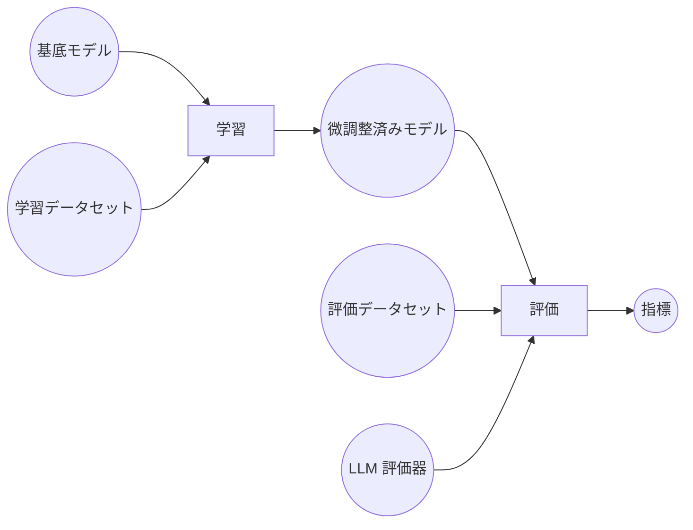

### 例
# Knitfab での LLM の微調整によるニュース分類

本書では、Knitfab を使用した一般大規模言語モデル (LLM) を微調整することにより、モデルがニュースといった特定の文書分類性能を向上することを示します。事例通して、Knitfab が微調整実験の入力と出力、および履歴の管理を自動化しながら、LLM-as-a-judge を用いて効率的に人間のような評価ができるようになります。

### 概要
LLM の微調整というのは、特定のタスクに対して処理性能と判断性能を高めるために複数な超母数を調整する工程です。しかしながら、複雑な超母数によりLLM の微調整が早くとも手ごたえなくなります。そこで、 Knitfab は学習工程だけではなく学習の入出力、成果物まで自動管理を手伝うことで、さまざまな構成設定での実験が容易になります。さらに、革新的な評価方法である LLM-as-a-judge を用いることにより人間のような評価品質を維持できながらコストの削減も可能になります。本事例では、このニュース分類微調整から LLM-as-a-judge 評価の一連まで Knitfab 上の実装を体験し、機械学習自動管理プラットフォームとして Knitfab の強さと容易さを理解できます。

ワークフローの主要なコンポーネントとプロセスの概要を図にて示します。

**コンポーネント:**
- __基底モデル:__ 微調整に使用される事前学習済み LLM。この例では、`GPT-2` を採用します。
- __学習データセット:__ モデルのニュース分類微調整に使用されるデータセット。`scikit-learn` の `20 Newsgroups` データセットを活用します。
- __微調整済みモデル:__ ニュース分類に特化した微調整済みモデル。
- __評価データセット:__ LLM-as-a-judge 評価に使用される `20 Newsgroups` データセットの `test` サブセット。
- __LLM 評価器:__ LLM-as-a-judge 評価のための LLM。
- __指標:__ LLLM-as-a-judge 評価のためのカスタム指標。

**プロセス:**
- __学習:__ ニュース記事を分類するために、学習データセットを用いて基底モデルを微調整する工程。
- __評価:__ カスタム指標と評価データセットを用いて、微調整済みモデルのパフォーマンス評価。


### 前提条件
本事例を正常に動作するために、次の前提条件を満たしているかを確認してください。

**必須:**
- **GPU:** 本例は GPU での実行を想定して設計されています。そのため、CPU での実行は非効率で処理時間が大幅に長くなります。
- **Knitfabのセットアップ:**
  - **プロダクション向けの場合:** [03.admin-guide](../../03.admin-guide/admin-guide-installation.ja.md)に記載されている手順に従って、インストールを実行します。
  - **実験向けの場合:** 簡易版については、[01.getting-started: Knitfab（簡易版） をローカル環境にインストールする](../../01.getting-started/getting-started.ja.md#Knitfab簡易版-をローカル環境にインストールする)に記載されている手順に従ってください。
- **Knit CLI:** [01.getting-started: CLI ツール: knit](../../01.getting-started/getting-started.ja.md#cli-ツール-knit)のインストール手順に従って、Knit CLI を設定します。
- **Knitコマンド初期化:** `knit init` を使用して Knit コマンドを初期化する方法については、[01.getting-started: knit コマンドの初期化](../../01.getting-started/getting-started.ja.md#knit-コマンドの初期化)を参照してください。
- **`Docker` インストール:** イメージをビルドして Knitfab にプッシュするために必要です。
- **LLM 評価器**: LLM-as-a-Judge 評価には、LLM が評価器として設定する必要があります。次の 3 つのオプションの中から 1 つを選んで設定してください。

  - **Ollama を使用したローカル LLM（推奨）**: [ollama/ollama-setup.ja.md](ollama/ollama-setup.ja.md) の手順に従って、Docker および Kubernetes に Ollama を構成してください。
  - **OpenAI**: https://docs.confident-ai.com/docs/metrics-introduction#using-openai ドキュメントの説明に従って OpenAI API キーを構成してください。
  - **カスタムモデル**: 独自のカスタムモデルを使用する場合、https://docs.confident-ai.com/docs/metrics-introduction#using-any-custom-llm に記載されている手順に従ってください。

**任意:**
- **`kubectl`**: LLM-as-a-Judge 評価に Ollama を使用したローカル LLM を選んだ場合は必須です。

### リポジトリ
本書で使用されるファイルとディレクトリは、GitHub の `knitfab-docs` リポジトリからをクローンできます。
```bash
git clone https://github.com/opst/knitfab-docs.git
```
クローンが完了したら、`04.examples/news-classification` ディレクトリ内にあるファイルを確認してください。
- **scripts:** このディレクトリには、モデルの学習と登録に必要なファイルが含まれています。
  - モデルの学習と評価のための Python スクリプト (`train.py`、`evaluate.py`)。
  - 必要なすべての Python パッケージを管理する `requirements.txt`。
  - Knitfab Plan の登録に使う Docker イメージを構築するための `Dockerfile`。
- **configs:** 学習と評価タスクの構成情報が含まれています。
- **plans:** Knitfab Plan の YAML ひな型が含まれています。

### タスク
- [ステップ 1: 学習と評価タスクの定義](#ステップ-1-学習と評価タスクの定義)
- [ステップ 2: Docker イメージをビルドして Knitfab にプッシュする](#ステップ-2-Docker-イメージをビルドして-Knitfab-にプッシュする)
- [ステップ 3: ニュース分類の微調整](#ステップ-3-ニュース分類の微調整)
- [ステップ 4: LLM-as-a-judge 評価](#ステップ-4-LLM-as-a-judge-評価)
- [ステップ 5: 片付け](#ステップ-5-片付け)

## ステップ 1: 学習と評価タスクの定義

### 1-1. 学習タスクの定義

本章では、`scripts/train/train.py` にニュース分類微調整のロジックを説明します。スクリプトは引数指定、モデル準備、データ処理、学習、と評価を構造化したパイプラインに従い、各コンポーネントの構成変更と最適化を容易にする設計を取っています。

### 1. 引数指定

`parse_arguments` 関数は、学習タスクに必要な引数を受け取ります。さまざまな母数を任意に指定できるため、モデルの微調整に柔軟的に変更できます。

#### 主要な機能
- `--config-file`: 構成ファイルのパス。指定された場合、既定引数を上書きます。
- `--save-to`: 微調整済みモデルとログが保存されるディレクトリです。既定値は `./out` です。
- `--base-model`: 微調整に使用する基底モデルを指定します。既定値は `openai-community/gpt2` です。
- `--device`: 学習が実施されるハードウェア (`cuda` または `cpu`) を定義します。既定値は `auto` です。
- `--epochs`: 学習回数. 既定値は `1` です。
- `--learning-rate`: 学習率を指定します。既定値は `2e-5` です。

構成ファイルとコマンドラインの両方で因数を指定した場合、構成ファイルの設定内容が優先されます。

#### コード解析
```python
args = parser.parse_args()
if args.config_file:
    with open(args.config_file, "r") as f:
        config = json.load(f)
    for key, value in config.items():
        setattr(args, key.replace("-", "_"), value)
```
- 指定された場合、JSON ファイルから構成を読み取ります。
- 引数値を動的に更新します。

### 2. モデルとトークナイザーの初期化

`setup_environment` 関数は、基底モデルとトークナイザーの読み込みと、パフォーマンスを最適化するために量子化設定を行います。

#### 主要な機能
- 4 ビット量子化のために `BitsAndBytesConfig` を設定し、 `AutoModelForSequenceClassification` よりをモデルを読み込みます。
- トークナイザーを構成し、パディングトークンを設定します。

#### コード解析
```python
quant_config = BitsAndBytesConfig(
    load_in_4bit=True,
    bnb_4bit_quant_type="nf4",
    bnb_4bit_compute_dtype=torch.float16,
    bnb_4bit_use_double_quant=True,
)
```
- 効率のために量子化を使用してモデルサイズを削減します。
- `NormalFloat4 (NF4)` は、精度損失を最小限に抑えるのに役立ちます。
- `torch.float16`（半精度浮動小数点数）は、妥当な精度を維持しながら、全精度（`float32`）よりも高速な計算を可能にします。
- 二重量子化により、メモリ使用量をさらに削減できます。

```python
self.model = AutoModelForSequenceClassification.from_pretrained(
    self.args.base_model,
    num_labels=self.num_labels,
    quantization_config=quant_config,
    device_map=args.device,
)
```
- シーケンス分類として基底モデルを読み込みます。
- 分類タスクの出力ラベル数、量子化構成、およびハードウェア (`cpu/cuda`) を指定します。

### 3. データセットの読み込みと前処理

`prepare_datasets` 関数は、学習データセットを読み込み、トークン化します。

#### 主要な機能
- `fetch_20newsgroups` データセットからデータを読み込みます。
- `空`または `NaN` のエントリを削除します。
- 入力形式に合わせてデータをトークン化します。

#### コード解析
```python
def load_train_datasets(self) -> None:
    raw_train_dataset = fetch_20newsgroups(subset="train")
    self.train_dataset = self.prepare_datasets(raw_train_dataset)

def load_eval_datasets(self) -> None:
    raw_eval_dataset = fetch_20newsgroups(subset="test")
    self.eval_dataset = self.prepare_datasets(raw_eval_dataset)
```
- `fetch_20newsgroups` データセットから学習および評価データを読み込みます。

```python
def prepare_datasets(self, dataset: Any) -> Dataset:
    def tokenize(examples):
        return self.tokenizer(examples["text"], truncation=True)

    df = pd.DataFrame({
        "text": dataset.data,
        "label": dataset.target,
    })
    df_cleaned = df.dropna(subset=["text"])
    df_cleaned = df_cleaned[df_cleaned["text"].str.strip() != ""]
    
    dataset = Dataset.from_pandas(df_cleaned)
    return dataset.map(tokenize, batched=True)
```
- 生データを `DataFrame` 形式に構造化します。
- データを `Transformer` で読み込んだ基底モデルの入力形式にトークン化します。

### 4. 学習超母数の設定
`setup_trainer` 関数は、適切な超母数とモデル構成を使用して `SFTTrainer` を初期化します。

#### 主要な機能
- `TrainingArguments` を使用して学習超母数を定義します。
- 微調整を効率化するために `LoraConfig` を構成します。
- `DataCollatorWithPadding` を使用してさまざまな文章を同じ固定長に変換します。

#### コード解析
```python
training_args = TrainingArguments(
    output_dir=self.args.save_to,
    logging_dir=f"{self.args.save_to}/logs",
    num_train_epochs=self.args.epochs,
    per_device_train_batch_size=1,
    per_device_eval_batch_size=1,
    gradient_accumulation_steps=2,
    learning_rate=self.args.learning_rate,
    weight_decay=0.05,
    max_grad_norm=0.3,
    fp16=True,
    bf16=False,
    warmup_ratio=0.1,
    lr_scheduler_type="cosine",
    logging_strategy="steps",
)
```
- バッチサイズ、学習率、重み減衰、勾配累積など、主要な学習超母数を定義します。
- 学習を効率化するために、混合精度 (`fp16`) を実装します。
- ウォームアップ比率 `0.1` 、とコサイン学習率スケジューラを使用します。
- 学習済みモデルやログファイルなど、プロジェクトの出力を整理するための専用ディレクトリを指定します。

```python
peft_config = LoraConfig(
    lora_alpha=16,
    lora_dropout=0.1,
    r=64,
    bias="none",
    task_type="SEQ_CLS",
)
```
- 効率的な微調整のために `LoRA (Low-Rank Adaptation)` を実装します。
- 正則化とモデル分類性能の均衡を保つために、脱落値とランク値を設定します。

```python
collator = DataCollatorWithPadding(tokenizer=self.tokenizer, padding="max_length")
```
- 文章を同じ固定長に変換します。

```python
self.trainer = SFTTrainer(
    model=self.model,
    args=training_args,
    peft_config=peft_config,
    train_dataset=self.train_dataset,
    eval_dataset=self.eval_dataset,
    tokenizer=self.tokenizer,
    data_collator=collator,
)
```
- 構成済みのモデル、学習引数、データセット、およびトークナイザーを使用して `SFTTrainer` を初期化します。
- すべての要素を組み合わせて、分類微調整を効率的に実行します。

### 5. モデルの学習と評価

`run` 関数は、環境設定から結果の保存まで、学習プロセス全体を調整します。

#### 主要な機能
- データセットを読み込み、学習器を初期化します。
- 学習と評価を実装します。
- 学習済みモデルと評価指標を保存します。

#### コード解析
```python
self.trainer.train()
self.eval_results = self.trainer.evaluate()
self.save_results()
```
- データセットを用いてモデルを学習させます。
- 評価データより分類性能を評価します。
- 後工程のために、モデルと指標を保存します。

### 1-2. LLM-as-a-judge 評価

本章では、ニュース分類微調整済みのモデルを評価するために、LLM を使用した評価パイプラインを紹介します。`scripts/evaluate/evaluate.py` の `TestGPT2Model` クラスは、定義したテストケースとニュースカテゴリ分類精度指標に従ってモデルを評価し、分類性能レポートを生成します。これにより、モデル間に一貫した水準点で比較でき、モデルの精度向上を統一な方向性に従います。

### 1. 引数指定

`parse_arguments` 関数は、評価プロセスの必要な引数を処理します。さまざまな母数を任意に指定できるため、モデルの微調整に柔軟的に変更で来ます。

#### 主要な機能
- `--config-file`: 構成ファイルのパス。指定された場合、既定引数を上書きます。
- `--model-path`: 微調整済みモデルへのパス。既定値は `./in/model` です。
- `--save-to`: 評価結果が保存されるディレクトリです。既定値は `./out` です。
- `--device`: 学習が実施されるハードウェア (`cuda` または `cpu`) を定義します。既定値は `cuda` です。
- `--num-samples`: 評価のために `test` サブセットから引き抜くサンプル数。既定値は `100` です。
- `--threshold`: Deepeval パフォーマンス評価のしきい値。既定値は `0.8` です。

構成ファイルとコマンドラインの両方で因数を指定した場合、構成ファイルの設定内容が優先されます。

### 2. 分類器の作成

`create_classifier` 関数は、評価対象の分類モデルを初期化します。

#### 主要な機能
- `AutoModelForSequenceClassification` を使用して、微調整済みモデルを読み込みます。
- `AutoProcessor` を使用して、トークナイザーを取得します。
- 効率的な文書分類のために `transformers.pipeline` を使用します。

#### コード解析
```python
model = AutoModelForSequenceClassification.from_pretrained(model_path, num_labels=num_labels)
tokenizer = AutoProcessor.from_pretrained(model_path)

return pipeline(
    "text-classification",
    model=model,
    tokenizer=tokenizer,
    device=device,
    max_length=1024
)
```
- 微調整済みモデルとトークナイザーを使用して、分類パイプラインを初期化します。
- 最大固定長が `1024` トークンを超えないようにします。

### 3. テストケースの生成

`get_test_cases` 関数は、`20 Newsgroups` データセットから `test` サブセットを取得し、評価の準備をします。

#### 主要な機能
- `20 Newsgroups` データセットを取得します。
- 数値ラベルをニュースカテゴリ名にマッピングします。
- 期待の分類出力と実際の分類出力を持つテストケースを生成します。

#### コード解析
```python
raw_eval_dataset = fetch_20newsgroups(subset='test')
categories = raw_eval_dataset.target_names

data = raw_eval_dataset.data[:num_samples]
target = raw_eval_dataset.target[:num_samples]

prompts = [f"### [HUMAN] Classify this news article: '{text}'\n" for text in data]

classifier = create_classifier(model_path, num_labels, device)
batch_results = classifier(prompts, truncation=True, max_length=1024, batch_size=1)
```
- `test` サブセットから `num_samples` までテストサンプルを取得します。
- 学習済み分類器を使用して、各テストサンプルのニュースカテゴリを予測します。

```python
test_cases = []
for text, category_idx, result in zip(data, target, batch_results):
    expected_category = categories[category_idx]
    actual_output = map_category(result["label"], categories)
    test_case = LLMTestCase(
        input=text,
        actual_output=actual_output,
        expected_output=expected_category,
    )
    test_cases.append(test_case)
```
- 予測されたニュースカテゴリ (`actual_output`) を正解 (`expected_category`) と比較します。
- 評価用のテストケースとして保存します。

### 4. モデルパフォーマンスの評価

`TestGPT2Model` クラスは、`deepeval` という LLM-as-a-judge フレームワークを使用してモデルを評価します。

#### 主要な機能
- 分類性能の `CategoryPrecision` 指標を定義します。
- `deepeval.evaluate` を使用して評価を実施し、結果を保存します。

#### コード解析
```python
return GEval(
    name="CategoryPrecision",
    threshold=self.args.threshold,
    criteria="Category classifier precision - determine if the actual output matched the provided expected output",
    evaluation_steps=[
        "Award 1.0 points for exact match between actual and expected category",
        "Award 0.5 points for semantically related categories",
        "Award 0.0 points if categories are unrelated",
        "Minimum score after penalties is 0.0",
    ],
    evaluation_params=[LLMTestCaseParams.ACTUAL_OUTPUT, LLMTestCaseParams.EXPECTED_OUTPUT],
)
```
- 分類精度指標を定義します。
- 不正確またはあいまいな予測に罰を与えます。

```python
def run_test(self):
    self.setup_class()
    self.eval_result = self.test_category_prediction()
    self.save_evaluate_result()
```
- 学習済みモデルを評価します。
- 評価結果を JSON ファイルに保存します。

## ステップ 2: Docker イメージをビルドして Knitfab にプッシュする
本章では、ニュース分類微調整の学習と評価の Docker イメージを作成し、Knitfab レジストリにプッシュします。

### 2-1. Docker イメージをビルドする
### 1. `news-classification-train` イメージのビルド:
```bash
docker build -t news-classification-train:v1.0 \
             -f scripts/train/Dockerfile \
             ./scripts/train
```
`news-classification-train` イメージは、基底モデルの微調整を担います。

### 2. `news-classification-evaluate` イメージのビルド:

#### Dockerfile の変更:
`Dockerfile` 内のコマンドラインを変更して LLM-as-a-Judge の LLM 評価器を設定する必要があります。LLM 評価器の詳細設定については、[前提条件](#前提条件)に記載されているドキュメントを参照してください。

```docker
# LLM 評価器を設定するには、コマンド（base-url、api-keyなど）を変更してください。
RUN deepeval set-local-model --model-name=llama3.2 \
    --base-url="http://ollama:11434/v1/" \
    --api-key="ollama"
```

#### Dockerイメージのビルド:
```bash
docker build -t news-classification-evaluate:v1.0 \
             -f scripts/evaluate/Dockerfile \
             ./scripts/evaluate
```
`news-classification-evaluate` イメージは微調整済みモデルに対して LLM-as-a-judge 評価を行います。

### 2-2.（任意）Docker イメージの動作確認
> [!Note]
>
> ビルドしたイメージに自信がある場合は、Knitfab へのプッシュに進んでください。（[Docker イメージを Knitfab へプッシュする](#2-3-Docker-イメージを-Knitfab-へプッシュする)）

### 1. 微調整イメージの実行:
```bash
docker run --rm -it --gpus all \
    -v "$(pwd)/configs:/configs" \
    -v "$(pwd)/out:/out" \
    news-classification-train:v1.0
```
このコマンドは、`news-classification-train:v1.0` イメージをロカール環境で実行します。
- `-v` フラグは、構成ファイル (`/configs`) と出力ディレクトリ (`/out`) をコンテナに関連付けます。
- これにより、イメージの動作確認ができ、微調整済みモデルが生成されます。

### 2. LLM-as-a-judge を使用したモデル評価:
> [!Warning]
> 
> 次の手順から LLM-as-a-Judge の評価器して事前に LLM の設定が求められています。設定手順などについては、[前提条件](#前提条件)をご確認してください。

> [!Caution]
>
> 次の手順は、[ollama/set-up-ollama.ja.md](ollama/set-up-ollama.ja.md) 資料に説明されている Ollama を使用したローカル LLM の構成に基づいています。別の LLM 評価器を使用する場合、それに応じて手順を変更してください。

```bash
docker run --rm -it --gpus all --network ollama-net\
    -v "$(pwd)/configs:/configs" \
    -v "$(pwd)/out:/out" \
    -v "$(pwd)/out/model:/in/model" \
    news-classification-evaluate:v1.0
```
- このコマンドは、`news-classification-evaluate:v1.0` イメージを実行し、Ollama アプリが実行されている `ollama-net` ネットワークに接続します。Ollama を使用していない場合は、`--network` オプションを省略または適切に変更してください。
- イメージは定義されたカスタム指標と `20 Newsgroups` データセットの `test` サブセットを使用して、微調整済みモデルを評価します。
- 評価指標は、`out` ディレクトリに `deepeval-result.json` の JSON ファイルとして保存されます。

### 3. パフォーマンス分析:

`deepeval-result.json` ファイルを確認して、定義されたカスタム指標に基づいてモデルの性能を分析します。カスタム指標が期待要件を適切に反映しているかどうかを検討し、必要に応じて調整・再定義してください。

### 2-3. Docker イメージを Knitfab へプッシュする

### 1. レジストリ URI を用いてイメージのタグ付け:

イメージを Knitfab レジストリにプッシュする前に、正しいレジストリ URI でタグ付けする必要があります。これにより、Docker はプッシュ操作の目的のレジストリを識別できます。
```bash
docker tag ${docker_image} ${registry_uri}/${docker_image}
```
プレースホルダを値で置き換えてください:

- `${docker_image}` をビルドされた各イメージの名前（例：`news-classification-train:v1.0`, `news-classification-evaluate:v1.0`）に置き換えてください。
- `${registry_uri}` を、Knitfab レジストリの実際の URI（例：`192.0.2.1:30503`）に置き換えてください。

### 2. イメージをKnitfabレジストリへプッシュ:

次に、タグ付きのイメージを Knitfab レジストリにプッシュします。
```bash
docker push ${registry_uri}/${docker_image}
```
`${docker_image}` を、前の手順でタグ付けした各イメージの名前（レジストリ URI を含む）に置き換えてください。

## ステップ 3: ニュース分類の微調整
本章では、Knitfab 上 LLM のニュース分類微調整を行います。

### 1. YAML ひな型の生成:

YAML ひな型を生成するには、2 つの選択肢があります。

- 選択肢①：空のひな型を作成する
```bash
knit plan template --scratch > ./plans/news-classification-train.v1.0.yaml
```
これにより、`./plans` ディレクトリに`news-classification-train.v1.0.yaml` という名前で新しい空の YAML ひな型が作成されます。ひな型には必要な構成要素を追記します。

- 選択肢②：Docker イメージからひな型を生成する
```bash
docker save ${registry_uri}/news-classification-train:v1.0 | \
    knit plan template > ./plans/news-classification-train.v1.0.yaml
```
このコマンドは、Docker イメージ `news-classification-train:v1.0` に基づいて YAML ひな型を生成します。

\* `${registry_uri}` を 実際の Knitfab のレジストリ URI に置き換えてください。

\* コマンドが Docker イメージを解析して、ひな型の一部分が記入済みです。

### 2. YAML ひな型の追記:
- 重要な追記点:
  - `image`:
    Knitfab Kubernetes クラスタがローカルレジストリを使用している場合は、`image` 項目の`registry_uri` を `localhost` に置き換えてください。
    
    例:
    ```YAML
    # 192.0.2.1 を
    image: "192.0.2.1:30503/news-classification-train:v1.0"
    # localhost に置き換える
    image: "localhost:30503/news-classification-train:v1.0"
    ```
    - これにより、Knitfab はローカルレジストリからイメージをプルするという意味合いになります。

  - `inputs`, `outputs`, `log`:
    以下のように関連タグを追加してください。

    ```YAML
    inputs:
      - path: "/configs"
        tags:
          - "type:config"
          - "project:news-classification"
    
    outputs:
      - path: "/out/model"
        tags:
          - "type:model"
          - "project:news-classification"
    
    log:
      tags:
        - "type:log"
        - "project:news-classification"
    ```
      - これにより、Knitfab 内での入力、出力とログの整理と検索が容易になります。
  
  - 計算資源: 
    学習プロセスに必要な資源（例：CPU、メモリ、GPU）を定義します。

    ```YAML
    resources:
      cpu: 1
      memory: 10Gi
      nvidia.com/gpu: "1"
    ```

- その他の重要な考慮事項：
  変更した YAML ひな型が正しい構造と構文に準拠していることを再確認してください。必要に応じてクローンした Git リポジトリの `/plans` ディレクトリにある YAML ファイルを参照してください。

### 3. YAML ひな型の登録:
```bash
train_plan=$(knit plan apply ./plans/news-classification-train.v1.0.yaml)
```
このコマンドは、YAML ひな型を Knitfab API に送信し、定義した構成要素に沿って新しい Plan を作成します。

`train_plan` 変数にはコマンドの出力として作成された Plan の詳細が格納されています。

### 4. Plan Id の抽出:
```bash
train_plan_id=$(echo "$train_plan" | jq -r '.planId')
```
これで、Plan の詳細から Plan の一意の Id を抽出できます。

### 5. 構成ファイルを Knitfab へプッシュ:
```bash
knit data push -t type:config \
               -t project:news-classification \
               -n ./configs
```
このコマンドは、`./configs`にある構成ファイルを Knitfab にプッシュします。

`-t` フラグは、タグ（`type:config`, `project:news-classification`）を追加することで、Knitfab が構成ファイルを Plan に関連付けられるようになります。

### 6. 実行状況の確認:

YAML ひな型を登録した後、Knitfab は学習 Plan を実行するための Run が開始します。次のコマンドを使用して、Runの実行状況を監視できます。
```bash
knit run find -p $train_plan_id
```
このコマンドは、指定された Plan Id に関連付けられた学習 Run を表示します。コマンドを定期的に実行し、`status` が `done` に変わるまで待ちます。`done` に変わると Run が正常終了になります。

### 7. モデル情報の取得:

学習 Run が正常に終了したら、生成されたモデルに関する情報を取得できます。
- Run 情報の取得:
```bash
train_run=$(knit run find -p $train_plan_id)
```
- Run 出力の抽出:
```bash
train_outputs=$(echo "$train_run" | jq -r '.[-1].outputs')
```
- モデル Knit Id の取得:
```bash
train_model_knit_id=$(echo "$train_outputs" | jq -r '.[0].knitId')
```

### 8.（任意）Run ログの確認:

学習中にログを確認したい場合は、次のコマンドを使用できます。
- Run Id の取得:
```bash
train_run_id=$(echo "$train_run" | jq -r '.[-1].runId')
```
- Run ログの表示:
```bash
knit run show --log $train_run_id
```

### 9.（任意）モデルの保存:

学習済みのモデルをローカルに保存したい場合は、次のコマンドを使用して Knitfab からダウンロードできます。
```bash
knit data pull -x $train_model_knit_id ./out
```
このコマンドは、学習済みモデルを Knitfab からダウンロードし、`./out` ディレクトリに保存します。

## ステップ 4: LLM-as-a-judge 評価
> [!Warning]
> 
> 次の手順から LLM-as-a-Judge の評価器して事前に LLM の設定が求められています。設定手順などについては、[前提条件](#前提条件)を再度ご確認してください。

本章では、ニュース分類微調整済み LLM の分類性能を LLM-as-a-judge より評価します。

### 1. YAML ひな型の生成:
YAML ひな型を生成するには、2 つの選択肢があります。

- 選択肢①：空のひな型を作成する
```bash
knit plan template --scratch > ./plans/news-classification-evaluate.v1.0.yaml
```
- 選択肢②：Docker イメージからひな型を生成する
```bash
docker save ${registry_uri}/news-classification-evaluate:v1.0 | \
    knit plan template > ./plans/news-classification-evaluate.v1.0.yaml
```
\* `${registry_uri}` を 実際の Knitfab のレジストリ URI に置き換えてください。

### 2. YAML ひな型の追記:
- 重要な追記点:
  - `image`:
    Knitfab Kubernetes クラスタがローカルレジストリを使用している場合は、`image` 項目の`registry_uri` を `localhost` に置き換えてください。

    例:
    ```YAML
    # Replace 192.0.2.1
    image: "192.0.2.1:30503/news-classification-evaluate:v1.0"
    # With localhost
    image: "localhost:30503/news-classification-evaluate:v1.0"
    ```
  - `inputs`, `outputs`, `log`:
    以下のように関連タグを追加してください。
    
    ```YAML
    inputs:
      - path: "/configs"
        tags:
          - "type:config"
          - "project:news-classification"
      
      - path: "/in"
        tags:
          - "type:model"
          - "project:news-classification"

    outputs:
      - path: "/out"
        tags:
          - "type:metrics"
          - "project:news-classification"

    log:
      tags:
        - "type:log"
        - "project:news-classification"
    ```
> [!Note]
> 
> 評価タスクが学習タスクの出力モデルを動的に認識できるように、`in/model` は構成ファイル内で定義せず、Plan YAML ひな型内で明示的に追加します。

  - これにより、Knitfab 内での入力、出力とログの整理と検索が容易になります。
  
  - 計算資源: 
    学習プロセスに必要な資源（例：CPU、メモリ、GPU）を定義します。

    ```YAML
    resources:
      cpu: 1
      memory: 10Gi
      nvidia.com/gpu: "1"
    ```

- その他の重要な考慮事項：
  変更した YAML ひな型が正しい構造と構文に準拠していることを再確認してください。必要に応じてクローンした Git リポジトリの `/plans` ディレクトリにある YAML ファイルを参照してください。

### 3. YAML ひな型の登録:
```bash
evaluate_plan=$(knit plan apply ./plans/news-classification-evaluate.v1.0.yaml)
```
- `evaluate_plan` 変数にはコマンドの出力として作成された Plan の詳細が格納されています。

- 構成ファイルは前章にて Knitfab にプッシュされているため、`evaluate_plan` の基に Run が自動的に生成され実行されます。

### 4. Plan Id の抽出:
```bash
evaluate_plan_id=$(echo "$evaluate_plan" | jq -r '.planId')
```
これで、Plan の詳細から Plan の一意の Id を抽出できます。

### 5. 実行状況の確認:
```bash
knit run find -p $evaluate_plan_id
```
`status` が `done` に変わるまで待ちます。`done` に変わると Run が正常終了になります。

### 6.（任意）評価指標の取得:

- Run 情報の取得:
```bash
evaluate_run=$(knit run find -p $evaluate_plan_id)
```
- Run出力の抽出:
```bash
evaluate_outputs=$(echo "$evaluate_run" | jq -r '.[-1].outputs')
```
- 評価指標レポートの Knit Id の取得:
```bash
evaluate_metrics_knit_id=$(echo "$evaluate_outputs" | jq -r '.[0].knitId')
```

### 7.（任意）Run ログの確認:
- Run Id の取得:
```bash
evaluate_run_id=$(echo "$evaluate_run" | jq -r '.[-1].runId')
```
- Run ログの表示:
```bash
knit run show --log $evaluate_run_id
```

### 8.（任意）指標レポートのダウンロード:
```bash
knit data pull -x $evaluate_metrics_knit_id ./out
```
このコマンドは、評価指標レポートを Knitfab からダウンロードし、`./out` ディレクトリに保存します。

## ステップ 5： 片付け
### 5-1. Run の 削除：
> [!Caution]
> 
> - Run が**すでに停止**していて、**下流に他の Run がない**場合に限り、Run を削除できます。
> - Run を削除してしまうと、その Run によって生成された**すべてのデータ、モデル、指標レポートも完全に削除**されます。

> [!Warning]
>
> Run の 削除は**非可逆**の操作です。

```bash
knit run rm ${run_id}
```
`${run_id}` を、`$evaluate_run_id` → `$train_run_id` の順に、Run の一意の Id に置き換えてください。

### 5-2. Plan の非活性化：

登録した Plan が不要になった場合は、次のコマンドを使用して非活性化ができます。
```bash
knit plan active no ${plan_id}
```
`${plan_id}` を、非活性化したい Plan の一意の Id（例：`$train_plan_id`, `$evaluate_plan_id`）に置き換えてください。

### 5-3. アップロードされたデータセットの削除：
Knitfabでアップロードされたデータセットを削除するには、関連付けられたアップロード Run を削除する必要があります。

### 1. データセット Run Id の検索:
- データセット一覧の取得：
  - 次のコマンドを実行して、タグ `project:news-classification` が付いたすべてのデータセットを取得します。
```bash
knit data find -t project:news-classification
```
- 実行例：
```json
{
  "knitId": "de3cec00-d723-40e3-b299-536bacdbbe44",
  "tags": [
    ...
    "project:news-classification",
    ...
  ],
  "upstream": {
    "mountpoint": {
      "path": "/upload",
      "tags": []
    },
    "run": {
      "runId": "596103be-a880-4a02-aea8-adfdbef1020b", 
      "status": "done",
      "updatedAt": "2025-01-27T10:14:28.237+00:00",
      "plan": {
        "planId": "cde9c9c3-a604-4057-9102-ed5f85d4afc7",
        "name": "knit#uploaded"
      }
    }
  },
  ...
}
```
- アップロード Run の特定：
  - 一覧の中から、`upstream.mountpoint.path` が `/upload` になっているエントリを特定します。
  - 該当する `upstream.run.runId` の値を抽出します。

### 2. Run の削除:
> [!Warning]
> 
> Run の削除は元に**不可逆的な**操作です。Runおよび関連するすべてのデータが完全に削除されます。
- 次のコマンドを実行します。
```bash
knit run rm ${run_id}
```
`${run_id}` を手順 1 で取得した `runId` に置き換えます。

### まとめ
本書では、Knitfab を活用して大規模言語モデル (LLM) 微調整の自動化、および LLM-as-a-judge のパフォーマンス評価を示していました。具体的には、次のことを示しています。

- **Knitfab による自動化された LLM 微調整**: Knitfab は学習成果物の管理を簡素化し、さまざまな構成に対して実験を可能にし、進捗状況の明確な記録を維持します。これにより、手動追跡のオーバーヘッドが排除され、効率的な反復が促進されます。
- **LLM-as-a-Judge による効率的な LLM 評価**: LLM を評価器として採用することにより、人間と同等評価品質を維持できながら、費用対効果を高め、時間を節約できるようになります。

### トラブルシューティング
#### 問題1：
Knitfab Run が `starting` で停止し、進行しない。
```json
{
        "runId": "64b5a7ae-5c85-48f1-b785-955c1709174a",
        "status": "starting",
        "updatedAt": "2025-01-30T01:01:03.589+00:00",
        ...
}
```

#### デバッグ手順:

### 1. Kubernetes Pod の検査:
```bash
kubectl -n knitfab get po
```
このコマンドは、`knitfab` 名前空間内のすべての Pod をリストします。この例の Run Id（`64b5a7ae-5c85-48f1-b785-955c1709174a`）に関連付けられた Pod を探します。

### 2. Pod ステータスの分析:

出力の `STATUS` 列に注意してください。次のようなものが表示されます。
| NAME | READY | STATUS | RESTARTS | AGE |
|---|---|---|---|---| 
| worker-run-64b5a7ae-5c85-48f1-b785-955c1709174a-nzhpq | 1/2 | ImagePullBackOff | 0 | 101s |

`ImagePullBackOff` エラー: これは、Kubernetes がRun に必要な Docker イメージをプルできないことを示します。以下の手順に従い、問題点を確認してください。

  - **ローカルレジストリ:** ローカルレジストリを使用している場合は、Plan YAML の `image` 項目がレジストリ URI を `localhost` に設定しているか確認してください。

  <br>

  ```YAML
  image: "localhost:30503/news-classification-train:v1.0"
  ```

  - **リモートレジストリ:** リモートレジストリ（Docker Hubなど）を使用している場合は、Knitfab Kubernetes　クラスタにイメージをプルするために必要な認証情報（例：ユーザー名/パスワード、アクセストークン）が設定されることを確認してください。

### 3. Plan の再登録:

イメージプルの問題を修正した後、Plan の再登録が必要となる場合があります。そのとき、以下の手順に従ってください。

- 現在のRunの停止:
```bash
knit run stop --fail ${run_id}
```
（`${run_id}` を実際の Run Id（例：64b5a7ae-5c85-48f1-b785-955c1709174a）に置き換えます）

- （任意）Runの削除: [ステップ5：片付け](#ステップ-5-片付け)の「Runの削除」の手順に従ってください。
- 古いPlanの非活性化: [ステップ5：片付け](#ステップ-5-片付け)の「Planの非活性化」の手順に従ってください。
- 新しいPlanの登録: 実行している学習・評価に応じて、該当する手順を参照してください。
  - [ステップ 3: ニュース分類の微調整](#ステップ-3-ニュース分類の微調整)
  - [ステップ 4: LLM-as-a-judge 評価](#ステップ-4-LLM-as-a-judge-評価)