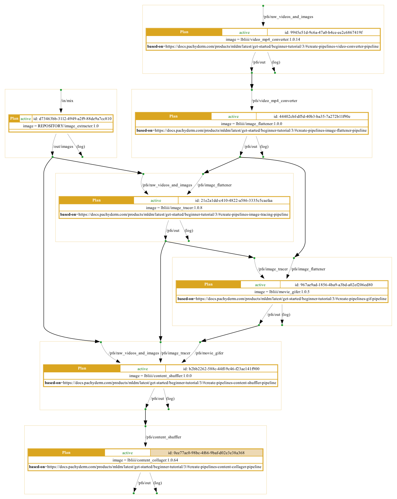
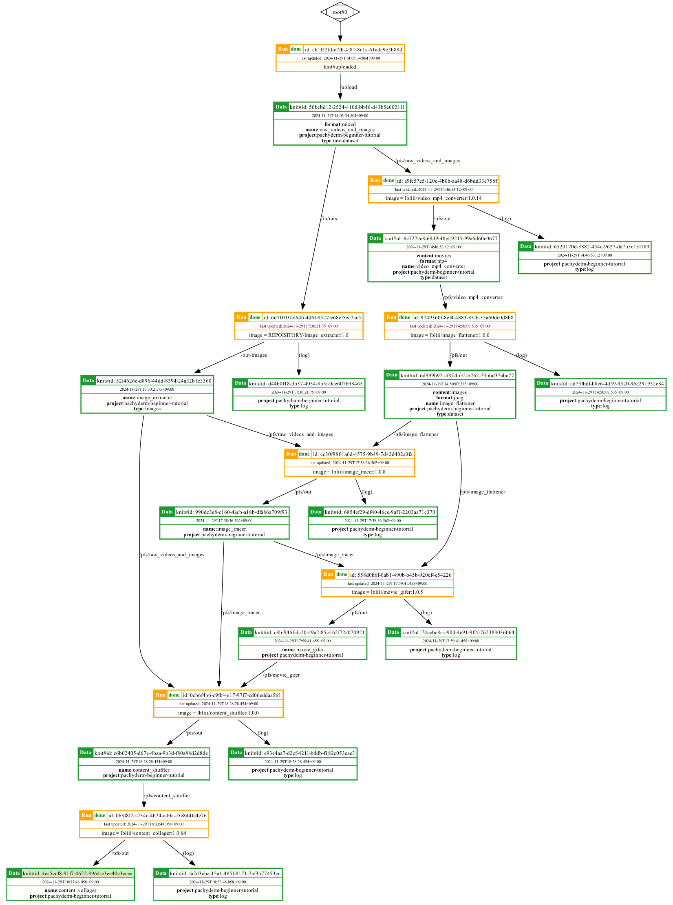

EXAMPLE: Pachyderm's Beginner Tutorial with Knitfab
================================================

本書では、データサイエンス基盤 [Pachyderm](https://www.pachyderm.com/) の [Beginner Tutorial](https://docs.pachyderm.com/products/mldm/latest/get-started/beginner-tutorial/) と同等のタスクを、Knitfab をつかって再現した事例を紹介します。

## Pachyderm とは

Pachyderm とは、データ駆動パイプラインとデータのバージョン管理を特徴とするデータサイエンス基盤です。

コンテナイメージベースのデータサイエンスタスクや、データ分割によるデータサイエンスタスクの並列化をサポートしています。

参考: https://docs.pachyderm.com/products/mldm/latest/learn/

### Knitfab との比較

Knitfab も Pachyderm も、データドリブンなタスクパイプラインシステムです。
すなわち、データの生成を監視して、新しいデータができたことをきっかけに、コンテナイメージベースのタスクを実行する、というパラダイムのもとに設計されています。
このタスクとして機械学習タスクをを実行することで、機械学習ワークフローを自動化できます。

**Pachyderm** のデータ管理手法は、タスクの定義（パイプライン）ごとにひとつの *リポジトリ* を持って、そこにタスク（Job）の出力データを記録する、という方式をとっています。
リポジトリはデータをバージョン管理したものです。パイプラインの Job が実行されるごとに、その出力がリポジトリの所定のブランチに新しいコミットとして登録されます。またリポジトリは複数の *ブランチ* を持つことができるようにもなっています。
パイプラインは、入力リポジトリの所定のブランチのコミットをきっかけに、指定されたコンテナイメージを Job として起動し、入力となるデータを渡してタスクを遂行します。
この際、入力リポジトリの全体を実際の入力データとすることも、サブセットだけを渡すこともできますし、複数のリポジトリを取り合わせてひとつの入力を生成することもできます。
Job が完了して新しいコミットがリポジトリに登録されると、そのリポジトリを参照している他のパイプラインが新しい Job を生成します。

Pachyderm では、パイプラインが他のリポジトリを入力として参照することで、一連のワークフローを構築します。

一方 **Knitfab** では、Data はタスクを実行（Run）した結果の出力として表現されています。バージョン管理はされません。Data には、その性質を表明するメタデータ（Tag）をつけることができます。
タスクの定義（Plan）は、それが入力にとることがきる Data の条件を、Tag の集合として表明します。また、出力 Data に自動的に付与される Tag も定義できます。
Plan は、その入力条件に合致する Data ごとに、その Plan に基づいた Run を作ってタスクを開始します。
Run が終了して出力 Data が作られると、その出力 Data を入力として取る他の Plan が同様に Run を開始します。

Knitfab における機械学習ワークフローは、このように、Data の生成をきっかけとした Run の連鎖反応として表現されます。

## 再現実験: Pachyderm の Beginner Tutorial

### ステップ1. オーバービュー

[Pachyderm の Begginer Tutorial](https://docs.pachyderm.com/products/mldm/latest/get-started/beginner-tutorial/)は、動画や画像から輪郭線を抽出して、元画像と輪郭画像を比較する HTML ファイルを生成する、という一連のワークフローを題材としています。

このチュートリアルでは次の各パイプラインを定義しています。

- Video Converter Pipeline: 動画を mp4 形式に変換する
- Image Flattener Pipeline: 動画からフレーム画像を抽出する
- Image Tracing Pipeline: 各画像から輪郭抽出を行う
- Gif Pipeline: 動画フレーム画像、およびその輪郭画像から、それぞれ動画 gif を生成する
- Content Shuffler Pipeline: 輪郭画像や輪郭動画 gif と、その元画像とを仕分けする
- Content Collager Pipeline: 比較用 HTML を生成する

Knitfab を用いてこのチュートリアルを再現するにあたり、これらのパイプラインをそれぞれ Plan に対応付けることを基本として進めてゆくことにします。
ただし、一部 Knitfab と Pachyderm の機能差分のために一対一対応しない部分がありました。その部分については、追加の Plan を定義して機能を補います。

### ステップ2. Knitfab プロジェクトの準備をする

まず、この一連のチュートリアルを行うディレクトリを作成します。

```
mkdir -p pachyderm-beginner-tutorial
cd pachyderm-beginner-tutorial
```

続いて、このディレクトリを Knitfab の作業ディレクトリにします。

`knit init` して、このディレクトリでの作業で使う Knitfab を設定します。

```
knit init PATH/TO/handout/knitprofile
```

さらに、このディレクトリでのプロジェクト用の共通タグを `knitenv` ファイルに記述します。

```yaml:knitenv
tag:
    - "project:pachyderm-beginner-tutorial"
```

これによって、以後の `knit data push` や `knit plan template` が、常にこの `project:pachyderm-beginner-tutorial` をセットするようになります。

### ステップ3. データを収集し、アップロードする

チュートリアルで利用するファイルをダウンロードします。

```
mkdir ./raw_videos_and_images
wget -O ./raw_videos_and_images/liberty.jpg https://raw.githubusercontent.com/pachyderm/docs-content/main/images/opencv/liberty.jpg
wget -O ./raw_videos_and_images/cat-sleeping.mov https://storage.googleapis.com/docs-tutorial-resoruces/cat-sleeping.MOV
wget -O ./raw_videos_and_images/robot.jpg https://raw.githubusercontent.com/pachyderm/docs-content/main/images/opencv/robot.jpg
wget -O ./raw_videos_and_images/highway.mov https://storage.googleapis.com/docs-tutorial-resoruces/highway.MOV
```

その後、フォルダ `./raw_videos_and_images` を Knitfab の Data としてアップロードします。

```
knit data push -t format:mixed -t type:raw-dataset -n ./raw_videos_and_images/
```

コンソールに次の出力を得ました。

```
[knit data push] 2024/11/29 14:05:29 [[1/1]] sending... ./raw_videos_and_images/
22.12 MiB / 22.12 MiB [-------------------------------------] 100.00% 6.29 MiB p/s
[knit data push] 2024/11/29 14:05:32 registered: ./raw_videos_and_images/ -> knit#id:50bcbd12-2524-410d-bb46-d43b5e602111
[knit data push] 2024/11/29 14:05:32 tagging...
[knit data push] 2024/11/29 14:05:33 [[1/1]] [OK] done: ./raw_videos_and_images/ -> knit#id:50bcbd12-2524-410d-bb46-d43b5e602111
{
    "knitId": "50bcbd12-2524-410d-bb46-d43b5e602111",
    "tags": [
        "format:mixed",
        "knit#id:50bcbd12-2524-410d-bb46-d43b5e602111",
        "knit#timestamp:2024-11-29T05:05:34.804+00:00",
        "name:raw_videos_and_images",
        "project:pachyderm-beginner-tutorial",
        "type:raw-dataset"
    ],
    "upstream": {
        "mountpoint": {
            "path": "/upload",
            "tags": []
        },
        "run": {
            "runId": "ab1f52fd-c7fb-4f81-8c1a-61adc9c5b88d",
            "status": "done",
            "updatedAt": "2024-11-29T05:05:34.804+00:00",
            "plan": {
                "planId": "088172e7-aac6-442d-8866-ea232ab04fc6",
                "name": "knit#uploaded"
            }
        }
    },
    "downstreams": [],
    "nomination": []
}
```

### ステップ4. パイプラインを構築する

Knitfab にとってワークフローを構築する、とは Plan を定義してゆくことに他なりません。
Pachyderm の各パイプラインに相当する Plan を Knitfab 側に定義してゆきます。

Pachyderm はチュートリアル用のコンテナイメージを公開しているので、Knitfab の Plan もそのイメージを利用してゆくことにします。

ここで定義した各 Plan は、いずれも

```
knit plan apply ${プラン定義yamlファイル}
```

として、 Knitfab に登録してください。

#### Video Converter Pipeline

まずは、データセット中の動画形式を mp4 に変換する、というタスクに当たる Plan を定義します。

```yaml:video_converter.plan.yaml
annotations:
  - "based-on=https://docs.pachyderm.com/products/mldm/latest/get-started/beginner-tutorial/3/#create-pipelines-video-converter-pipeline"

image: "lbliii/video_mp4_converter:1.0.14"

entrypoint: []
args:
  - python3
  - /video_mp4_converter.py
  - --input
  - /pfs/raw_videos_and_images/
  - --output
  - /pfs/out/

inputs:
  - path: "/pfs/raw_videos_and_images/"
    tags:
      - "type:raw-dataset"
      - "name:raw_videos_and_images"
      - "project:pachyderm-beginner-tutorial"

outputs:
  - path: "/pfs/out/"
    tags:
      - "type:dataset"
      - "content:movies"
      - "format:mp4"
      - "project:pachyderm-beginner-tutorial"
      - "name:video_mp4_converter"

log:
  tags:
    - "type:log"
    - "project:pachyderm-beginner-tutorial"

active: true

resouces:
  cpu: 1
  memory: 1Gi

```

`args` は、 Pachyderm Beginner Tutorial のパイプラインに指定されている args をなぞりました。

また、Pachyderm の定義に対応するように、 `inputs` と `outputs` を与えています。

- `inputs`: Knitfab では、先ほどアップロードした Data を参照できるように Tag を指定します。
- `outputs`: Data の性質を示しておくとともに、Pachyderm におけるリポジトリを模擬するものとして `name` タグを与えています。

#### Image Flattener Pipeline

これは mp4 動画からフレームを jpeg 画像として抽出するタスクです。

これも、先のものと同じように考えて、次の Plan 定義を作成します。

```yaml:image_flattener.plan.yaml
annotations:
  - "based-on=https://docs.pachyderm.com/products/mldm/latest/get-started/beginner-tutorial/3/#create-pipelines-image-flattener-pipeline"

image: "lbliii/image_flattener:1.0.0"

entrypoint: []
args:
  - python3
  - /image_flattener.py
  - --input
  - /pfs/video_mp4_converter
  - --output
  - /pfs/out/

inputs:
  - path: "/pfs/video_mp4_converter/"
    tags:
      - "type:dataset"
      - "content:movies"
      - "format:mp4"
      - "project:pachyderm-beginner-tutorial"
      - "name:video_mp4_converter"

outputs:
  - path: "/pfs/out/"
    tags:
      - "type:dataset"
      - "content:images"
      - "format:jpeg"
      - "project:pachyderm-beginner-tutorial"
      - "name:image_flattener"

log:
  tags:
    - "type:log"
    - "project:pachyderm-beginner-tutorial"

active: true

resouces:
  cpu: 1
  memory: 1Gi

```

#### Image Tracing Pipeline

このパイプラインは、Pachyderm では複数のリポジトリから画像ファイルを抽出してひとつの入力とし、その上で各画像ファイルから輪郭抽出した画像を得る、というタスクを実施します。
Knitfab には、そうした複数の Data から単一の入力を作り出す機能がありませんが、単に複数の入力を取る機能はあります。
不足しているのは「画像ファイルのみを抽出する」の部分ですので、それを補う Plan を作成します。

続いて、Pachyderm のパイプラインの本体に相当する Plan を作成します。

##### 画像を抽出する Plan

カスタムなイメージを使った Plan を作りたいので、そのための作業ディレクトリを作ります。

```
mkdir -p ./image_extracter
cd ./image_extracter
```

まずは指定されたフォルダから画像を抜き出して他のフォルダにコピーするプログラムを書きます。

```python:image_extracter.py
import argparse
import os
import pathlib
import shutil

parser = argparse.ArgumentParser(
    description="extract images from specified directories"
)

parser.add_argument(
    "-i",
    "--input",
    type=pathlib.Path,
    required=True,
    help="directories to extract images from",
)

parser.add_argument(
    "-o",
    "--output",
    type=pathlib.Path,
    required=True,
    help="directory to store the extracted images",
)

args = parser.parse_args()

# Create the output directory if it doesn't exist
output_dir = args.output
os.makedirs(output_dir, exist_ok=True)

input_dir = args.input

# allows only image file extensions
allowed_extensions = (".png", ".jpg", ".jpeg")

# Loop through input directories and copy files to the output directory
for filename in os.listdir(input_dir):
    file_path = os.path.join(input_dir, filename)
    if os.path.isfile(file_path) and filename.lower().endswith(allowed_extensions):
        shutil.copy(file_path, output_dir)

print(f"All files merged into {output_dir}")
```

このプログラムを実行するコンテナイメージに相当する Docker ファイルを書きます。

```Dockerfile
FROM python:3.12.7-slim

WORKDIR /work
COPY . .

ENTRYPOINT ["python", "image_extracter.py"]
CMD ["--input", "/in/mix", "--output", "/out/images"]
```

イメージをビルドして、タグ付けし、push します。
```
cd ../
docker build -t image_extracter:1.0 ./image_extracter/
docker tag "${REPOSITORY}/image_extracter:1.0" image_extracter:1.0
docker push ${REPOSITORY}/image_extracter:1.0
```

続いて、このイメージを利用して、最初にアップロードした Data から画像だけを抜き出す Plan 定義を作成します。

```yaml:image_extracter.plan.yaml
image: "975050250135.dkr.ecr.ap-northeast-1.amazonaws.com/image_extracter:1.0"
entrypoint: ["python", "image_extracter.py"]

args: ["--input", "/in/mix", "--output", "/out/images"]

inputs:
  - path: "/in/mix"
    tags:
      - "project:pachyderm-beginner-tutorial"
      - "format:mixed"
      - "type:raw-dataset"

outputs:
  - path: "/out/images"
    tags:
      - "project:pachyderm-beginner-tutorial"
      - "type:images"
      - "name:image_extracter"

log:
  tags:
    - "type:log"
    - "project:pachyderm-beginner-tutorial"

active: true

resouces:
  cpu: 1
  memory: 1Gi
```

##### パイプライン本体

画像から輪郭抽出を行う Plan を定義します。入力にとるのは、先程作成した画像だけを抽出した Data と、動画の各フレーム画像のはいった Data です。

次の Plan 定義を作成します。

```yaml:image_tracer.plan.yaml
annotations:
  - "based-on=https://docs.pachyderm.com/products/mldm/latest/get-started/beginner-tutorial/3/#create-pipelines-image-tracing-pipeline"

image: "lbliii/image_tracer:1.0.8"

entrypoint: []
args:
  - python3
  - /image_tracer.py
  - --input
  - /pfs/raw_videos_and_images
  - /pfs/image_flattener
  - --output
  - /pfs/out/

inputs:
  - path: "/pfs/raw_videos_and_images/"
    tags:
      - "type:images"
      - "name:image_extracter"
      - "project:pachyderm-beginner-tutorial"
  - path: "/pfs/image_flattener/"
    tags:
      - "name:image_flattener"
      - "project:pachyderm-beginner-tutorial"

outputs:
  - path: "/pfs/out/"
    tags:
      - "project:pachyderm-beginner-tutorial"
      - "name:image_tracer"

log:
  tags:
    - "type:log"
    - "project:pachyderm-beginner-tutorial"

active: true

resouces:
  cpu: 1
  memory: 1Gi
```

#### Gif Pipeline

ディレクトリに収められた画像ファイルの集合を動画 gif に変換するタスクを定義します。
入力に取りたいのは、動画の各フレーム画像のセットと、その輪郭画像のセットです。

次の Plan 定義を作成します。

```yaml:gif.plan.yaml
annotations:
  - "based-on=https://docs.pachyderm.com/products/mldm/latest/get-started/beginner-tutorial/3/#create-pipelines-gif-pipeline"

image: "lbliii/movie_gifer:1.0.5"

entrypoint: []
args:
  - python3
  - /movie_gifer.py
  - --input
  - /pfs/image_flattener
  - /pfs/image_tracer
  - --output
  - /pfs/out/

inputs:
  - path: "/pfs/image_flattener/"
    tags:
      - "name:image_flattener"
      - "project:pachyderm-beginner-tutorial"
  - path: "/pfs/image_tracer/"
    tags:
      - "name:image_tracer"
      - "project:pachyderm-beginner-tutorial"

outputs:
  - path: "/pfs/out/"
    tags:
      - "project:pachyderm-beginner-tutorial"
      - "name:movie_gifer"

log:
  tags:
    - "type:log"
    - "project:pachyderm-beginner-tutorial"

active: true

resouces:
  cpu: 1
  memory: 5Gi
```

このタスクはメモリを多めに要求したので、 `resources.memory` が増やしてあるという点に注意してください。

#### Content Shuffler Pipeline

画像や動画を、ファイル名の命名規約ベースで輪郭画像とオリジナル版とに仕分けするタスクを定義します。
ただし、動画のフレームを抽出したファイルは無視します。

次の Plan 定義を作成します。

```yaml:content_shuffler.plan.yaml
annotations:
  - "based-on=https://docs.pachyderm.com/products/mldm/latest/get-started/beginner-tutorial/3/#create-pipelines-content-shuffler-pipeline"

image: "lbliii/content_shuffler:1.0.0"

entrypoint: []
args:
  - python3
  - /content_shuffler.py
  - --input
  - /pfs/movie_gifer
  - /pfs/raw_videos_and_images
  - /pfs/image_tracer
  - --output
  - /pfs/out/

inputs:
  - path: "/pfs/movie_gifer/"
    tags:
      - "name:movie_gifer"
      - "project:pachyderm-beginner-tutorial"
  - path: "/pfs/raw_videos_and_images/"
    tags:
      - "name:image_extracter"
      - "project:pachyderm-beginner-tutorial"
  - path: "/pfs/image_tracer/"
    tags:
      - "name:image_tracer"
      - "project:pachyderm-beginner-tutorial"

outputs:
  - path: "/pfs/out/"
    tags:
      - "project:pachyderm-beginner-tutorial"
      - "name:content_shuffler"

log:
  tags:
    - "type:log"
    - "project:pachyderm-beginner-tutorial"

active: true

resouces:
  cpu: 1
  memory: 1Gi
```

#### Content Collager Pipeline

Image Shuffler の結果を使って、HTML ファイル形式の比較用ビューワを生成するタスクを定義します。

次の Plan を定義します。

```yaml:content_collager.plan.yaml
annotations:
  - "based-on=https://docs.pachyderm.com/products/mldm/latest/get-started/beginner-tutorial/3/#create-pipelines-content-collager-pipeline"

image: "lbliii/content_collager:1.0.64"

entrypoint: []
args:
  - python3
  - /content_collager.py
  - --input
  - /pfs/content_shuffler
  - --output
  - /pfs/out/

inputs:
  - path: "/pfs/content_shuffler/"
    tags:
      - "name:content_shuffler"
      - "project:pachyderm-beginner-tutorial"

outputs:
  - path: "/pfs/out/"
    tags:
      - "project:pachyderm-beginner-tutorial"
      - "name:content_collager"

log:
  tags:
    - "type:log"
    - "project:pachyderm-beginner-tutorial"

active: true

resouces:
  cpu: 1
  memory: 1Gi
```

### ステップ4. 結果を確認する

最終出力である `content_collager` の出力をダウンロードして、内容を確認します。

まずは、 Content Collage Pipeline にあたる Plan の Run を特定し、その出力の Knit ID を調べます。

```
knit run find -p ${Content Collage Pipeline の Plan ID}
```

> [!TIPS]
>
> Content Collage Pipeline にあたる Plan ID は次のようにして調べることができます。
>
> ```
> knit plan find --image lbliii/content_collager:1.0.64 | jq '.[].planId'
> ```
>
> `knit plan find` は、Knitfab に登録されている Plan を検索するコマンドです。
> `--image` フラグは、Plan に指定されているコンテナイメージに基づいてフィルタリングします。
>
> その結果を [jq](https://jqlang.github.io/jq/) に渡して、キー `planId` を抽出します。


次のようなコンソール出力が得られるはずです。

```json
[
    {
        "runId": "068f8f2e-234c-4b24-ad0a-e5e844fe4e76",
        "status": "done",
        "updatedAt": "2024-11-29T09:33:48.058+00:00",
        "exit": {
            "code": 0,
            "message": ""
        },
        "plan": {
            "planId": "0ee77ac0-98bc-4f66-9baf-d02e3e38a368",
            "image": "lbliii/content_collager:1.0.64",
            "args": [
                "python3",
                "/content_collager.py",
                "--input",
                "/pfs/content_shuffler",
                "--output",
                "/pfs/out/"
            ],
            "annotations": [
                "based-on=https://docs.pachyderm.com/products/mldm/latest/get-started/beginner-tutorial/3/#create-pipelines-content-collager-pipeline"
            ]
        },
        "inputs": [
            {
                "path": "/pfs/content_shuffler",
                "tags": [
                    "name:content_shuffler",
                    "project:pachyderm-beginner-tutorial"
                ],
                "knitId": "c6b02405-d67e-4baa-9b3d-f80a88d2d8de"
            }
        ],
        "outputs": [
            {
                "path": "/pfs/out",
                "tags": [
                    "name:content_collager",
                    "project:pachyderm-beginner-tutorial"
                ],
                "knitId": "4ea5ccf8-91f7-4622-8964-e3ee40e3ccea"
            }
        ],
        "log": {
            "tags": [
                "project:pachyderm-beginner-tutorial",
                "type:log"
            ],
            "knitId": "fa7d3cba-15a1-485f-8171-7af3b77453cc"
        }
    }
]
```

`.outputs` がこの Run の出力ですから、その Knit ID を指定して `knit data pull` すればよいです。

```
knit data pull -x 4ea5ccf8-91f7-4622-8964-e3ee40e3ccea ./outputs/content_collager
```

すると、`./outputs/content_collager/4ea5ccf8-91f7-4622-8964-e3ee40e3ccea` というディレクトリが作成され、その中に Data がダウンロードされます。

`index.html` というファイルがそのディレクトリ内に見つかるので、これをブラウザで開くと、結果を確認することができます。

### ステップ5. 作成されたリソースを調べる

ここまでに作成されたワークフローと、リネージグラフを確認します。

#### ワークフローを Plan Graph で見る

ワークフローの最後の Content Collage Pipeline にあたる Plan を起点に Plan のつながりを示した図である Plan Graph を調べます。

```
knit plan graph -n all ${Content Collage Pipeline の Plan ID} | dot -T png > plan-graph.png
```

次のような Plan Graph が得られるはずです。



この画像は、 Plan 同士の関係を、「ある Plan の出力は、他のどの Plan が利用できるか」に基づいて、想定される Data の流れを示したものです。矢印の向きに従って Plan が連鎖反応するパイプラインが構築されている、ということです。

[Pachyderm Beginner Tutorial の Overview](https://docs.pachyderm.com/products/mldm/latest/get-started/beginner-tutorial/0/#overview-part-1-beginner-overview) に示されている図と比較すると、

- 追加の Plan `image_extracter` が存在すること
- 生データのリポジトリ "raw_videos_and_images" にあたるものが存在しないこと

を除いて同じ構造をしていることがわかります。

> [!NOTE]
>
> カスタムイメージを利用している `image_extracter` については、リポジトリをマスクしてあります。

#### Data Lineage を見る

最終的に得た Data の Lineage Graph を調べて、Data の生成経緯を確認します。

```
knit data lineage -n all ${content_collager の出力の Knit ID} | dot -T png > lineage-graph.png
```

次のような Lineage Graph が得られます。



この図は、どの Data　（緑の枠） がどの Run （黄色い枠）から出力され、どの Run に入力されたか、という関係が示されています。矢印の向きがデータフローです。

[Pachyderm Beginner Tutorial の Overview](https://docs.pachyderm.com/products/mldm/latest/get-started/beginner-tutorial/0/#overview-part-1-beginner-overview) に示されている図と比較すると、

- 追加の Plan `image_extracter` の Run が存在すること
- 各 Run のログ（`(log)`）も Data として記録されていること

を除いて同じ構造をしていることがわかります。

## まとめ

Knitfab を使って、[Pachyderm](https://www.pachyderm.com/) の [Beginner Tutorial](https://docs.pachyderm.com/products/mldm/latest/get-started/beginner-tutorial/) と同等のタスクを再現することができました。

Data のフィルタリングにあたっては追加の Plan が必要でしたが、それ以外は Pachyderm 側のパイプラインと対応するように Plan を定義してゆくだけで、同等のワークフローを構築できることが確認できました。

また、Knitfab がサポートするワークフローの表現力は

- 機械学習に限らない、一般的なワークフロー
- このような分岐・合流を含んだ複雑なワークフロー
- 一度生成した Data を複数の Run に使い回すワークフロー

をカバーしていることがわかります。

さらに、ワークフローの全体像（Plan Graph）と、Data Lineage を図示することで、作業内容を一望のもとに把握することができました。
