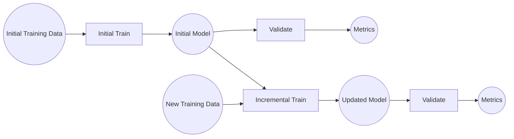
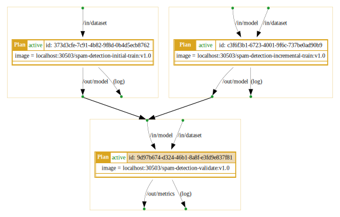
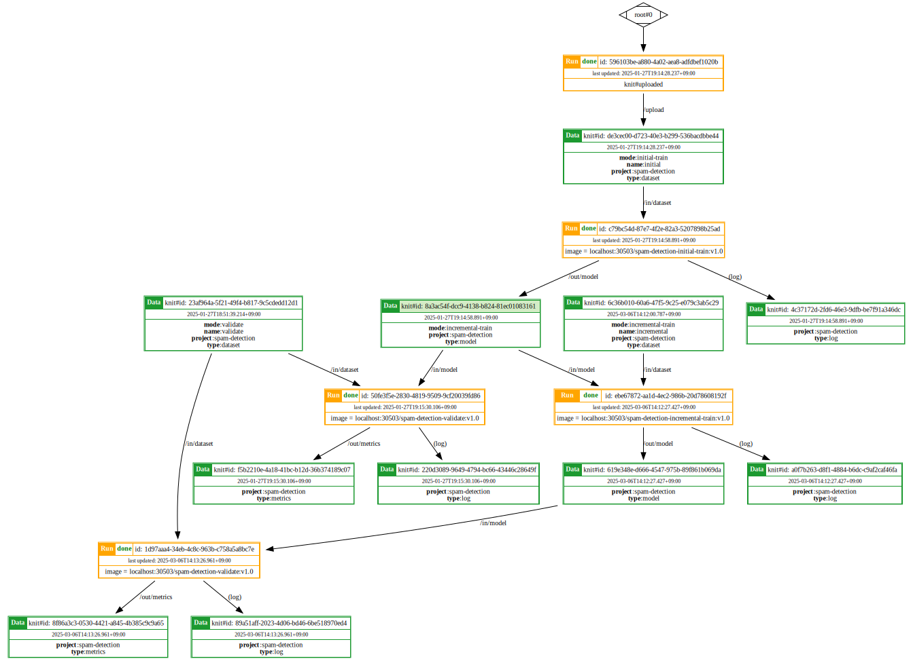

# Example: Spam Email Detection with Incremental Training

This example demonstrates how to build a simple Spam Email Detection model with incremental training capabilities using Knitfab. Learn how to leverage Knitfab to automate the model training process and manage its performance across multiple runs as new data becomes available.

## Overview
This example demonstrates an incremental machine learning pipeline. In this approach, a model is initially trained and then continuously improved by incorporating new data over time. This allows the model to adapt to changing patterns and maintain its performance.

The following diagram outlines the key components and steps involved:

### Data
- __Initial Training Data:__ The foundational dataset used to train the initial version of the ML model.
- __Initial Model:__ The first version of the ML model generated after the initial training phase.
- __New Training Data:__ Fresh data that is used to incrementally improve the existing model.
- __Updated Model:__ The refined version of the ML model after undergoing incremental training.
- __Metrics:__ Quantitative measures (e.g., accuracy, precision, recall, F1-score) used to evaluate the model's performance.

### Tasks
- __Initial Train:__ Train the initial model using the initial training data.
- __Incremental Train:__ Retrain the existing model with the new training data. This allows the model to learn from new information and potentially improve its performance.
- __Validate:__ Evaluate the model's performance on a separate hold-out dataset.


## Prerequisites
To successfully complete this example, ensure you have met the following prerequisites:

### Essential
- **Knitfab Setup:** 
  - **Production:** Follow the instructions provided in [03.admin-guide](../../03.admin-guide/admin-guide-installation.en.md) for full installation.
  - **Experimentation:** Follow the instructions provided in [01.getting-started: Installing Knitfab on a local environment](../../01.getting-started/getting-started.en.md#installing-knitfab-on-a-local-environment) for a light weight version.
- **Knit CLI:** Follow the installation instructions in [01.getting-started: CLI Tool: knit](../../01.getting-started/getting-started.en.md#cli-tool-knit) to set up the Knit CLI.
- **Knit Command Initialization:** Refer to [01.getting-started: Initializing Knit Command](../../01.getting-started/getting-started.en.md#initializing-the-knit-command) for guidance on initializing Knit command using `knit init`.
- **`Docker` Installation**: Required for building and pushing images to the Knitfab platform.

### Optional
- `kubectl` (recommended): Provides additional flexibility for debugging and interacting with Knitfab Kubernetes clusters.

## Repository
To access the files and directories used in this example, clone the `knitfab-docs` repository from GitHub:
```bash
git clone https://github.com/opst/knitfab-docs.git
```
Once cloned, navigate to the `04.examples/spam-email-detection` directory. You will find the following:
- **in/dataset:** Contains the dataset use for training and validation.
- **scripts:** Houses the training and validation Python scripts, as well as the Dockerfile necessary for deploying the Knitfab Plan.
- **plans:** Contains the Knitfab Plan YAML templates.

## Implementation Steps

## Step 1: Build Docker images
This step involves creating Docker images for each component of the spam email detection model (initial training, validation, and incremental training).

> [!Note]
>
> This example is intended to help you familiarize with building and managing ML models in Knitfab, so we will not discuss the content of Python scripts and Dockerfile.

### 1.1. Build `spam-detection-initial-train` Image
```bash
docker build -t spam-detection-initial-train:v1.0 \
             -f scripts/initial-train/Dockerfile \
             ./scripts/initial-train
```
The `spam-detection-initial-train` image is responsible for training the first version of the model.

### 1.2. Build `spam-detection-validate` Image
```bash
docker build -t spam-detection-validate:v1.0 \
             -f scripts/validate/Dockerfile \
             ./scripts/validate
```
The `spam-detection-validate` image is used to evaluate the performance of the trained model and output metrics in json format (e.g., accuracy, precision, recall).

### 1.3. Build `spam-detection-incremental-train` Image
```bash
docker build -t spam-detection-incremental-train:v1.0 \
             -f scripts/incremental-train/Dockerfile \
             ./scripts/incremental-train
```
The `spam-detection-incremental-train` image will retrain the existing model with new data to improve its performance and adapt to evolving patterns.

## Step 2: (Optional) Verify Docker images
> [!Note]
> 
> You may skip the Docker image verify step and proceed to ([Push Docker Images to Knitfab](#step-3-push-docker-images-to-knitfab)) if you deem it unnecessary. 

### 2.1. Initial Training
```bash
docker run --rm -it \
    -v "$(pwd)/in/dataset/initial:/in/dataset" \
    -v "$(pwd)/out/model:/out/model" \
    spam-detection-initial-train:v1.0
```
This command runs the `spam-detection-initial-train:v1.0` image in an interactive mode.
- The `-v` flags mount the host directories containing the initial dataset (`in/dataset/initial`) and the output directory (`out/model`) into the container.
- This allows you to test the image locally and generate the first version of the model.

### 2.2. Model Validation
```bash
docker run --rm -it \
    -v "$(pwd)/in/dataset/validate:/in/dataset" \
    -v "$(pwd)/out/model:/in/model" \
    -v "$(pwd)/out/metrics:/out/metrics" \
    spam-detection-validate:v1.0
```
The command runs `spam-detection-validate:v1.0` image to evaluate the initial model using the validation dataset.

The evaluation metrics will be saved as a JSON file named `metrics.json` in the `out/metrics` directory.

### 2.3. Performance Analysis

Open the `metrics.json` file and analyze the model's performance metrics (e.g., accuracy, precision, recall). This will help you assess the effectiveness of the initial model.

### 2.4. Incremental Training

Next, we will incrementally update the initial model with new training data.

```bash
docker run --rm -it \
    -v "$(pwd)/in/dataset/incremental:/in/dataset" \
    -v "$(pwd)/out/model:/in/model" \
    -v "$(pwd)/out/model:/out/model" \
    spam-detection-incremental-train:v1.0
```

### 2.5. Re-validation

Repeat steps [2.2 and 2.3](#22-model-validation) to validate the performance of the updated model and analyze the new `metrics.json` file.

## Step 3: Push Docker images to Knitfab
Now we will push the Docker images to the Knitfab registry for use within the Knitfab platform.

### 3.1. Tag Images with Registry URI

Before pushing the images to the Knitfab registry, you need to tag them with the correct registry URI. This allows Docker to identify the target registry for the push operation.
```bash
docker tag ${docker_image} ${registry_uri}/${docker_image}
```
Replace:

- `${docker_image}` with the name of each built image (e.g., `spam-detection-initial-train:v1.0`, `spam-detection-validate:v1.0`, `spam-detection-incremental-train:v1.0`).
- `${registry_uri}` with the actual URI of your Knitfab registry (e.g., `192.0.2.1:30503`).

### 3.2. Push Images to Knitfab Registry

Now, push the tagged images to the Knitfab registry:
```bash
docker push ${registry_uri}/${docker_image}
```
Replace `${docker_image}` with the name of each image (including the registry URI) as tagged in the previous step.

## Step 4: Initial training
This step involves the initial training of the ML model using the preprocessed data.

### 4.1. Push Traning Data to Knitfab
```bash
knit data push -t mode:initial-train \
               -t type:dataset \
               -t project:spam-detection \
               -n ./in/dataset/initial
```
This command pushes the initial training dataset located at `./in/dataset/initial` to the Knitfab platform.

The `-t` flags add tags (`mode:initial-train`, `type:dataset`, `project:spam-detection`) allowing Knitfab to identify the dataset for the later traning process.

### 4.2. Generate YAML tempelate

You have two options for generating the YAML template:
- Option 1: Create a Blank Template:
```bash
knit plan template --scratch > ./plans/spam-detection-initial-train.v1.0.yaml
```
This creates a new, empty YAML template file named `spam-detection-initial-train.v1.0.yaml` in the `./plans` directory. You will need to manually populate this template with the necessary configuration details.
- Option 2: Generate Template from Docker Image:
```bash
docker save ${registry_uri}/spam-detection-initial-train:v1.0 | \
    knit plan template > ./plans/spam-detection-initial-train.v1.0.yaml
```
This command generates a YAML template based on the Docker image `spam-detection-initial-train:v1.0`.

\* Replace `${registry_uri}` with the actual URI of your Knitfab registry.

\* This approach can help automate some of the configuration process.

### 4.3. Modify YAML Template
- Crucial Modifications:
  - `image`: 
    - If your Knitfab Kubernetes Cluster utilizes a local registry, replace `registry_uri` within the `image` field with `localhost`. 

    Example:
    ```YAML
    # Replace 192.0.2.1
    image: "192.0.2.1:30503/spam-detection-initial-train:v1.0"
    # With localhost
    image: "localhost:30503/spam-detection-initial-train:v1.0"
    ```
    - This ensures the image is pulled from the local registry.
  - `inputs`: 
    - Define the input dataset by specifying the tags used during the knit data push command to the `path:"/in/dataset"`: `project:spam-detection`, `type:dataset`, `mode:initial-train`.
    
    <br>
    
    ```YAML
    # Add tags used during the knit data push command.
    inputs:
      - path: /in/dataset
        tags:
          - project:spam-detection
          - type:dataset
          - mode:initial-train
    ```
    - This instructs Knitfab to link the correct dataset to the training process.
  - `outputs`, `log`: 
    - Add the following project-related tag to the outputs and log sections: `project:spam-detection`
    
    <br>

    ```YAML
    outputs:
      - path: "/out/model"
        tags:
          - "project:spam-detection"
          - "type:model"
    log:
      tags:
        - "type:log"
        - "project:spam-detection"
    ```
    - This facilitates better organization and filtering of outputs and logs within the Knitfab system.

- Other Important Considerations:
  - Resource Allocation: Resource allocation defaults are sufficient. However, you can customize resources (CPU, memory, GPU) as needed.
  ```YAML
  resources:
    cpu: 1
    memory: 1Gi
  ```
  - YAML Structure: Always double-check that your modified YAML template adheres to the correct structure and syntax. You can use the YAML file provided in the `/plans` directory of the cloned Git repository as a reference.

### 4.4. Apply the YAML Template
```bash
initial_train_plan=$(knit plan apply ./plans/spam-detection-initial-train.v1.0.yaml)
```
This command sends the YAML template to the Knitfab API, which creates a new Plan based on the provided configuration. 

The output of the command, which is stored in the `initial_train_plan` variable, is a JSON object containing details about the created Plan.

### 4.5. Extract the Plan Id
```bash
initial_train_plan_id=$(echo "$initial_train_plan" | jq -r '.planId')
```
This command extracts the unique Id of the created Plan from the JSON output.

### 4.6. Confirm the Run Status

After applying the YAML template, Knitfab will initiate a Run to execute the training plan. You can monitor the status of this Run using the following command:
```bash
knit run find -p $initial_train_plan_id
```
This command displays the training Run associated with the specified Plan Id. Periodically execute the command (or ultilize the Linux watch command) and wait until the `status` changes to `done` to indicate that the initial training has completed successfully.

### 4.7. Retrieve Model Information

Once the training Run has completed successfully, you can retrieve information about the generated model artifact:
- Get Run Information:
```bash
initial_train_run=$(knit run find -p $initial_train_plan_id)
```
- Extract Run Outputs:
```bash
initial_train_outputs=$(echo "$initial_train_run" | jq -r '.[-1].outputs')
```
- Get Model Knit Id:
```bash
initial_train_model_knit_id=$(echo "$initial_train_outputs" | jq -r '.[0].knitId')
```

### 4.8. (Optional) Review the Run Log

If you want to examine the logs generated during the training process, you can use the following commands:
- Get Run Id:
```bash
initial_train_run_id=$(echo "$initial_train_run" | jq -r '.[-1].runId')
```
- Show Run Log:
```bash
knit run show --log $initial_train_run_id
```

### 4.9. (Optional) Download the Model

If you need to access the trained model artifact directly, you can download it from the Knitfab platform using the following command:
```bash
knit data pull -x $initial_train_model_knit_id ./out/model
```
This command downloads the trained model artifact from the Knitfab platform and stores it in the `./out/model` directory.

## Step 5: Model validation
After training, we will validate the model to evaluate its performance and check for any issues.

### 5.1. Push Validation Data to Knitfab
```bash
knit data push -t mode:validate \
               -t type:dataset \
               -t project:spam-detection \
               -n ./in/dataset/validate
```
We add tags (`mode:validate`, `type:dataset`, `project:spam-detection`) to help the validate Plan identify the dataset.

### 5.2. Generate YAML tempelate
- Option 1: Create a Blank Template:
```bash
knit plan template --scratch > ./plans/spam-detection-validate.v1.0.yaml
```
- Option 2: Generate Template from Docker Image:
```bash
docker save ${registry_uri}/spam-detection-validate:v1.0 | \
    knit plan template > ./plans/spam-detection-validate.v1.0.yaml
```
\* Replace `${registry_uri}` with the actual URI of your Knitfab registry.

### 5.3. Modify YAML Template
- Crucial Modifications:
  - `image`: 
    - If your Knitfab Kubernetes Cluster utilizes a local registry, replace `registry_uri` within the image field with `localhost`.

    Example:
    ```YAML
    # Replace 192.0.2.1
    image: "192.0.2.1:30503/spam-detection-validate:v1.0"
    # With localhost
    image: "localhost:30503/spam-detection-validate:v1.0"
    ```
  - `inputs`: 
    - Dataset: Specify the input dataset by defining the following tags to `path:"/in/dataset"`:
      - `project:spam-detection`
      - `type:dataset`
      - `mode:validate`
    - Model: Specify the input model by defining the following tags to `path:"/in/model"`:
      - `project:spam-detection`
      - `type:model`.
    
    <br>

    ```YAML
    inputs:
      - path: "/in/dataset"
        tags:
          - "project:spam-detection"
          - "type:dataset"
          - "mode:validate"
      - path: "/in/model"
        tags:
          - "project:spam-detection"
          - "type:model"
    ```
  - `outputs`, `log`: 
    - Add the following project-related tag to the outputs and log sections: `project:spam-detection`
    
    <br>
    
    ```YAML
    outputs:
      - path: "/out/metrics"
        tags:
          - "project:spam-detection"
          - "type:metrics"
    log:
      tags:
        - "type:log"
        - "project:spam-detection"
    ```
- Other Important Considerations:
  - Resource Allocation: Resource allocation defaults are sufficient. However, you can customize resources (CPU, memory, GPU) as needed.
  ```YAML
  resources:
    cpu: 1
    memory: 1Gi
  ```
  - YAML Structure: Double-check that your modified YAML template adheres to the correct structure and syntax. You can use the YAML file provided in the `/plans` directory of the cloned Git repository as a reference.

### 5.4. Apply the YAML Template
```bash
validate_plan=$(knit plan apply ./plans/spam-detection-validate.v1.0.yaml)
```
- The `validate_plan` variable will contain the JSON response from the Knitfab API, which includes details about the created Plan.

### 5.5. Extract the Plan Id
```bash
validate_plan_id=$(echo "$validate_plan" | jq -r '.planId')
```

### 5.6. Confirm the Run Status
```bash
knit run find -p $validate_plan_id
```
Wait until the `status` changes to `done` to indicate that the validation has completed successfully.

### 5.7. (Optional) Retrieve Validation Metrics Information
- Get Run Information:
```bash
validate_run=$(knit run find -p $validate_plan_id)
```
- Extract Run Outputs:
```bash
validate_outputs=$(echo "$validate_run" | jq -r '.[-1].outputs')
```
- Get Validation Metrics Knit Id:
```bash
validate_metrics_knit_id=$(echo "$validate_outputs" | jq -r '.[0].knitId')
```

### 5.8. (Optional) Review the Run Log
- Get Run Id:
```bash
validate_run_id=$(echo "$validate_run" | jq -r '.[-1].runId')
```
- Show Run Log:
```bash
knit run show --log $validate_run_id
```

### 5.9. (Optional) Download the Metrics
```bash
knit data pull -x $validate_metrics_knit_id ./out/metric
```
This command downloads the validation metrics artifact from the Knitfab platform and stores it in the `./out/metric` directory.

## Step 6: Incremental training and validation
Once the initial training and validation are complete, we will perform incremental training using new data, followed by further validation of the updated model.

### Train and Update Initial Model with New Data

### 6.1. Push New Traning Data to Knitfab
```bash
knit data push -t mode:incremental-train \
               -t type:dataset \
               -t project:spam-detection \
               -n ./in/dataset/incremental
```
We add tags (`mode:incremental-train`, `type:dataset`, `project:spam-detection`) to help the incremental training Plan identify the dataset.

### 6.2. Generate YAML tempelate
- Option 1: Create a Blank Template:
```bash
knit plan template --scratch > ./plans/spam-detection-incremental-train.v1.0.yaml
```
- Option 2: Generate Template from Docker Image:
```bash
docker save ${registry_uri}/spam-detection-incremental-train:v1.0 | \
    knit plan template > ./plans/spam-detection-incremental-train.v1.0.yaml
```
\* Replace `${registry_uri}` with the actual URI of your Knitfab registry.

### 6.3. Modify YAML Template
- Crucial Modifications:
  - `image`: 
    - If your Knitfab Kubernetes Cluster utilizes a local registry, replace `registry_uri` within the `image` field with `localhost`.

    Example:
    ```YAML
    # Replace 192.0.2.1
    image: "192.0.2.1:30503/spam-detection-incremental-train:v1.0"
    # With localhost
    image: "localhost:30503/spam-detection-incremental-train:v1.0"
    ```
  - `inputs`: 
    - Dataset: Specify the input dataset by defining the following tags to `path:"/in/dataset"`:
      - `project:spam-detection`
      - `type:dataset`
      - `mode:incremental-train`
    - Model: Specify the input model by defining the following tags to `path:"/in/model"`:
      - `project:spam-detection`
      - `type:model`.
      - `mode:incremental-train`
    
    <br>
    
    ```YAML
    inputs:
      - path: "/in/dataset"
        tags:
          - "project:spam-detection"
          - "type:dataset"
          - "mode:incremental-train"
      - path: "/in/model"
        tags:
          - "project:spam-detection"
          - "type:model"
          - "mode:incremental-train"
    ```

> [!Caution]
>
> - Ensure the `mode:incremental-train` tag is included in the `path:"/in/model"`.
> - Failure to include this tag will result in an error during the Knitfab Plan execution.

  - `outputs`, `log`: 
    - Add the following project-related tag to the outputs and log sections: `project:spam-detection`

    <br>

    ```YAML
    outputs:
      - path: "/out/model"
        tags:
          - "project:spam-detection"
          - "type:model"
    log:
      tags:
        - "type:log"
        - "project:spam-detection"
    ```

- Other Important Considerations:
  - Resource Allocation: Resource allocation defaults are sufficient. However, you can customize resources (CPU, memory, GPU) as needed.
  ```YAML
  resources:
    cpu: 1
    memory: 1Gi
  ```
  - YAML Structure: Double-check that your modified YAML template adheres to the correct structure and syntax. You can use the YAML file provided in the `/plans` directory of the cloned Git repository as a reference.

### 6.4. Apply the YAML Template
```bash
incremental_train_plan=$(knit plan apply ./plans/spam-detection-incremental-train.v1.0.yaml)
```
- The `incremental_train_plan` variable will contain the JSON response from the Knitfab API, which includes details about the created Plan.

### 6.5. Extract the Plan Id
```bash
incremental_train_plan_id=$(echo "$incremental_train_plan" | jq -r '.planId')
```

### 6.6. Add `mode:incremental-train` Tag to the Initial Model

The model generated from the initial training currently lacks the necessary tag for the incremental training process.

To address this, we will execute the following command:

```bash
knit data tag --add mode:incremental-train $initial_train_model_knit_id
```

This command will add the required `mode:incremental-train` tag to the initial model, and trigger a new Run under the incremental train Plan.

### 6.7. Confirm the Run Status
```bash
knit run find -p $incremental_train_plan_id
```
Wait until the `status` changes to `done` to indicate that the incremental training has completed successfully.

### 6.8. Retrieve Model Information
- Get Run Information:
```bash
incremental_train_run=$(knit run find -p $incremental_train_plan_id)
```
- Extract Run Outputs:
```bash
incremental_train_outputs=$(echo "$incremental_train_run" | jq -r '.[-1].outputs')
```

- Get Model Knit Id:
```bash
incremental_train_model_knit_id=$(echo "$incremental_train_outputs" | jq -r '.[0].knitId')
```
This series of commands retrieves the Knit Id associated with the trained model artifact generated by the training Run.

### 6.9. (Optional) Review the Run Log
- Get Run Id:
```bash
incremental_train_run_id=$(echo "$incremental_train_run" | jq -r '.[-1].runId')
```
- Show Run Log:
```bash
knit run show --log $incremental_train_run_id
```

### 6.10. (Optional) Download the Model
```bash
knit data pull -x $incremental_train_model_knit_id ./out/model
```
This command downloads the trained model artifact from the Knitfab platform and stores it in the `./out/model` directory.

### 6.11. Validate the Updated Model

Knitfab will automatically trigger a new Run under the validation Plan, recognizing the output model from the incremental training process.

Repeat steps **6-9** from the ["Model validation"](#step-5-model-validation) section to:
- Confirm the triggered Run status.
- View the Run log of the validation Run.
- Download the metrics artifact for analysis.


### 6.12. Remove `mode:incremental-train` Tag

Knitfab is an automated platform that manages training processes and their associated artifacts.

When a new dataset is registered, the previous model with the tag `mode:incremental-train` will be automatically recognized by the incremental training Plan, triggering a new incremental training Run.

To prevent this unintended behavior, execute the following command to remove the `mode:incremental-train` tag.

```bash
knit data tag --remove mode:incremental-train $initial_train_model_knit_id
```

## Step 7: Confirm Pipeline Structure and Lineage Graph

This step focuses on visually verifying the relationships between your pipeline components and tracing the flow of data through the system. We'll use graph visualizations to confirm the intended structure and data dependencies.

### 7.1. Generate Plan Graph (Pipeline Structure)

The Plan Graph provides a high-level overview of your pipeline's structure, showing the dependencies between different Plans (e.g., initial train, incremental train, validate).

Use the following command, replacing `${plan_id}` with the appropriate Plan Id (`$initial_train_plan_id`, `$incremental_train_plan_id`, or `$validate_plan_id`) to generate a PNG image of the plan graph:

```bash
knit plan graph -n all ${plan_id} | dot -Tpng > plan-graph.png
```

The generated Validation Plan Graph visualizes the pipeline's structure:



**Fig. 1:** Pipeline structure.

Verify the following from the pipeline's structure:

- **Relation between training and validation plan:**
  - Confirm that the `initial_train_plan` and `incremental_train_plan` both show the `validate_plan` as a downstream process. 
  - This indicates:
    - The validation step is executed after each training phase.
    - The validation step receives `/out/model` from both training phases.
- **Isolated Training Plans:**
  - It's crucial to observe that the `initial_train_plan` does not directly show the `incremental_train_plan` as a downstream process, and vice versa. This separation is intended, as the `incremental_train_plan` *any* previously trained model that requires an update, rather than being a direct sequential step of the `initial_train_plan`. This seperation is caused by the lack of the `mode:incremental` tag in the output model of the `initial_train_plain`, that is then used as an input of the `incremental_train_plan`.

### 7.2. Generate Lineage Graph (Data Flow)

The Lineage Graph tracks the flow of data and artifacts through your pipeline, to generate a PNG image of the plan graph:

Use the following command, replacing `${knit_id}` with the respective Knit Ids (`$initial_train_model_knit_id`, `$incremental_train_model_knit_id`, `$validate_metrics_knit_id`) to display the lineage graph in your terminal:

```bash
knit data lineage -n all ${knit_id} | dot -Tpng > lineage-graph.png
```

The generated Initial Training Lineage Graph visualizes the flow of data and artifacts through your pipeline:



**Fig. 2:** Flow of data and artifacts

Review the Lineage Graph and confirm the following:

- **Initial Training Outputs:**
  Verify that the `$initial_train_run` produces `/out/model` (the initial trained model) and `(log)` (execution logs) as outputs.
- **Incremental Training Inputs:**
  Confirm that the `$incremental_train_run` recognizes the `/out/model` generated by the `$initial_train_run` as its input. This is enabled by defining the `mode:incremental` tag.
- **Incremental Training Outputs:**
  Verify that the `$incremental_train_run` updates the initial model and generates a new `/out/model` and `(log)`.
- **Validation Outputs:**
  Confirm that the `$validate_run` validates the performance of the output models from both initial and incremental training tasks and generates corresponding `/out/metrics` (performance metrics) and `(log)`.

## Step 8: Clean up
### 8.1. To Remove a Run

> [!Caution]
>
> - You can only delete a Run if it is **already stopped** and there are **no other runs dependent on it**.
> - Deleting a Run will also **permanently delete any artifacts** generated by that Run (e.g., models, metrics).

> [!Warning]
>
> Deleting a Run is an **irreversible** action.

```bash
knit run rm ${run_id}
```
Replace `${run_id}` with the unique Id of the Run in the following sequence: `$validate_run_id` → `$incremental_train_run_id` → `$initial_train_run_id`.

### 8.2 To Deactivate a Plan

If you no longer require a registered Plan, use the following command to deactivate it:

```bash
knit plan active no ${plan_id}
```

Replace `${plan_id}` with the unique Id of the Plan you want to deactivate (e.g., `$initial_train_plan_id`, `$validate_plan_id`, `$incremental_train_plan_id`).

### 8.3. To Remove the Uploaded Dataset

To remove an uploaded dataset in Knitfab, you must delete the associated upload Run.

#### 8.3.1. Find the Dataset Run Id
- List Datasets:
  - Execute the following command to list all datasets with the tag `project:spam-detection`:
```bash
knit data find -t project:spam-detection
```
  - Example Output:
```json
{
  "knitId": "de3cec00-d723-40e3-b299-536bacdbbe44",
  "tags": [
    "knit#id:de3cec00-d723-40e3-b299-536bacdbbe44",
    "knit#timestamp:2025-01-27T10:14:28.237+00:00",
    "mode:initial-train",
    "name:initial",
    "project:spam-detection",
    "type:dataset"
  ],
  "upstream": {
    "mountpoint": {
      "path": "/upload",
      "tags": []
    },
    "run": {
      "runId": "596103be-a880-4a02-aea8-adfdbef1020b", 
      "status": "done",
      "updatedAt": "2025-01-27T10:14:28.237+00:00",
      "plan": {
        "planId": "cde9c9c3-a604-4057-9102-ed5f85d4afc7",
        "name": "knit#uploaded"
      }
    }
  },
  ...
}
```
- Locate the Upload Run:
  - In the output, identify the dataset entry where the `upstream.mountpoint.path` is equal to `/upload`.
  - Extract the corresponding `upstream.run.runId` value.

#### 8.3.2. Remove the Run
> [!Warning]
>
> Deleting a Run is an **irreversible** action. It will permanently delete the Run and any associated artifacts, including the uploaded dataset.
- Execute the following command:
```bash
knit run rm ${run_id}
```
Replace `${run_id}` with the `runId` obtained in step 1.

## Summary
This example demonstrates the following:

- **Multi-stage ML Model Training and Validation:** Implementation of a multi-stage pipeline, encompassing initial training, incremental training, and subsequent validation, for a simple Spam Email Detection model.
- **Automated Training and Artifact Management:** Leveraging Knitfab to streamline and automate the entire training process, including efficient management of model versions and associated artifacts across all stages.

## Troubleshooting
### Problem 1
Knitfab Run is stuck in "starting" status and doesn't progress.
```json
{
        "runId": "64b5a7ae-5c85-48f1-b785-955c1709174a",
        "status": "starting",
        "updatedAt": "2025-01-30T01:01:03.589+00:00",
        ...
}
```
#### Solution Steps

##### 1. Inspect the Kubernetes Pods
```bash
kubectl -n knitfab get po
```
This command lists all pods in the `knitfab` namespace. Look for the pod associated with your Run Id (`64b5a7ae-5c85-48f1-b785-955c1709174a` in this example).

##### 2. Analyze Pod Status

Pay close attention to the `STATUS` column in the output.  You might see something like this:

| NAME | READY | STATUS | RESTARTS | AGE |
|---|---|---|---|---| 
| worker-run-64b5a7ae-5c85-48f1-b785-955c1709174a-nzhpq | 1/2 | ImagePullBackOff | 0 | 101s |

**`ImagePullBackOff` Error**: This indicates that Kubernetes can't pull the Docker image required for your run. Follow the steps that match the type of your resitry.
  - **Local Registry:** If you're using a local Docker registry, ensure the `image` field in your Plan YAML uses `localhost` for the registry URI:

  <br>

  ```YAML
  image: "localhost:30503/spam-detection-initial-train:v1.0"
  ```

  - **Remote Registry:** If you're using a remote registry (like Docker Hub), verify that your Knitfab Kubernetes cluster has the necessary credentials (e.g., username/password, access token) to pull the image.

##### 3. Reapply the Plan

After fixing the image pull issue, you'll likely need to:
- **Stop the current Run:** 
```bash
knit run stop --fail ${run_id}
```
(Replace `${run_id}` with your actual Run Id, e.g., `64b5a7ae-5c85-48f1-b785-955c1709174a`)
- **(Optional) Remove the Run:** Follow the instructions in "To Remove a Run" under [Step 7: Clean Up](#step-7-clean-up).
- **Deactivate the old Plan:** Follow the instructions in "To Deactivate a Plan" under [Step 7: Clean Up](#step-7-clean-up).
- **Apply a new Plan:** Refer to the relevant section based on the type of training you're doing:
  - [Step 4: Initial training.](#step-4-initial-training)
  - [Step 5: Model validation.](#step-5-model-validation)
  - [Step 6: Incremental training and validation.](#step-6-incremental-training-and-validation)

### Problem 2
Error `Plan's tag dependency makes cycle` when applying an incremental train Plan.

#### Error Messages
```json
{
    "message": "plan spec conflics with others\n caused by:@ github.com/opst/knitfab/pkg/domain/plan/db/postgres.planDependencyIsCyclic \"/work/pkg/domain/plan/db/postgres/plan.go\" l846 \u003c- @ github.com/opst/knitfab/pkg/domain/plan/db/postgres.planDependencyIsCyclic.func1 \"/work/pkg/domain/plan/db/postgres/plan.go\" l830 \u003c- plan spec is conflicting with other plan: plan's tag dependency makes cycle"
}
```

#### Solution Steps
Add tag `mode:incremental-train` to the `path:"/in/model"` entry in your Plan YAML template.
```YAML
inputs:
  - path: "/in/model"
    tags:
      - "project:spam-detection"
      - "type:model"
      - "mode:incremental-train"
``` 