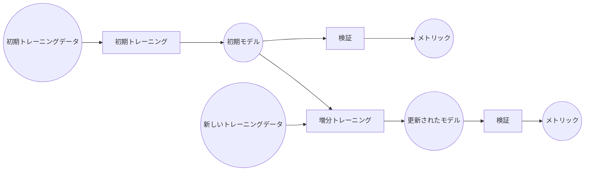

### 例
# Knitfabでの増分学習によるスパムメール検知

本書では、Knitfabを使用して増分学習機能を備えたシンプルなスパムメール検知モデルを構築する事例を示します。 Knitfabはモデルのトレーニングプロセスを自動化しながら、実験の入力と出力を記録して、履歴を遡れるようにします。

### 概要
本書では、増分機械学習 (ML) ワークフローを通してトレーニングプロセスに新しいデータを取り込むことで、MLモデルがパターンの変化に適応でき、そのパフォーマンスを維持することができます。

ワークフローの主要なコンポーネントとプロセスの概要を図にて示しています。

**コンポーネント:**

- **初期トレーニングデータ:** MLモデルの初期バージョンをトレーニングするためのデータセット。
- **初期モデル:** 初期トレーニングより生成された最初のバージョンのMLモデル。
- **新しいトレーニングデータ:** 既存モデルを増分的に改善するためのデータセット。
- **更新されたモデル:** 増分トレーニングを受けた後のMLモデルの改良版。
- **メトリック:** モデルのパフォーマンスを評価するための各指標（例：精度、適合率、再現率、F1スコア）。

**プロセス:**

- **初期トレーニング:** 初期トレーニングデータを使用して初期モデルをトレーニングします。
- **増分トレーニング:** 新しいトレーニングデータを使用して既存のモデルを再トレーニングします。これにより、モデルは新しい情報から学習し、潜在的にパフォーマンスを向上させることができます。
- **検証:** 別のデータセットでモデルのパフォーマンスを評価します。



### 前提条件
本書の事例を正常に動作するため、次の前提条件を満たしているかをご確認してください。

**必須:**
- **Knitfabのセットアップ:**
  - **プロダクションの場合:** [03.admin-guide](../../03.admin-guide/admin-guide-installation.ja.md)に記載されている手順に従って、インストールを実行します。
  - **実験の場合:** 簡易版については、[01.getting-started: Knitfab（簡易版） をローカル環境にインストールする](../../01.getting-started/getting-started.ja.md#Knitfab簡易版-をローカル環境にインストールする)に記載されている手順に従ってください。
- **Knit CLI:** [01.getting-started: CLI ツール: knit](../../01.getting-started/getting-started.ja.md#cli-ツール-knit)のインストール手順に従って、Knit CLIを設定します。
- **Knitコマンド初期化:** knit initを使用してKnitコマンドを初期化する方法については、[01.getting-started: knit コマンドの初期化](../../01.getting-started/getting-started.ja.md#knit-コマンドの初期化)を参照してください。
- **`Docker`インストール:** イメージをビルドしてKnitfabプラットフォームにプッシュするために必要です。

**任意:**

- **kubectl（推奨）：** Knitfab Kubernetesクラスタのデバッグなどに用いられます。

### リポジトリ
本書で使用されるファイルとディレクトリは、GitHubの`knitfab-docs`リポジトリからをクローンすることができます。
```bash
git clone https://github.com/opst/knitfab-docs.git
```
クローンが完了したら、`04.examples/spam-email-detection`ディレクトリ内にあるファイルをご確認してください。
- **in/dataset:** トレーニングと検証に使用するデータセットが含まれています。
- **scripts:** トレーニングと検証のPythonスクリプト、およびKnitfab Planのデプロイに必要なDockerfileが格納されています。
- **plans:** Knitfab PlanのYAMLテンプレートが含まれています。

### タスク
- [ステップ 1： Docker イメージをビルドして Knitfab にプッシュする](#ステップ-1-Docker-イメージをビルドして-Knitfab-にプッシュする)
- [ステップ 2： 初期トレーニング](#ステップ-2-初期トレーニング)
- [ステップ 3： モデル検証](#ステップ-3-モデル検証)
- [ステップ 4： 増分トレーニングと検証](#ステップ-4-増分トレーニングと検証)
- [ステップ 5： クリーンアップ](#ステップ-5-クリーンアップ)

## ステップ 1： Docker イメージをビルドして Knitfab にプッシュする

## ステップ 2： 初期トレーニング

## ステップ 3： モデル検証

## ステップ 4： 増分トレーニングと検証

## ステップ 5： クリーンアップ