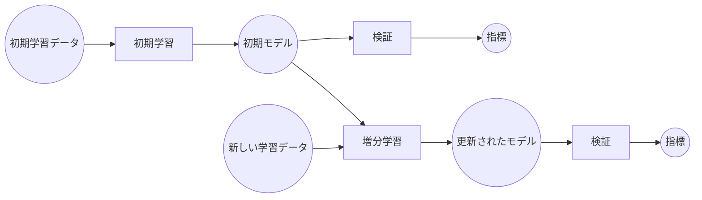

### 例
# Knitfab での増分学習によるスパムメール検知

本書では、Knitfab を使用して増分学習機能を備えた簡単なスパムメール検知モデルを構築する事例を示します。 Knitfab はモデルの学習プロセスを自動化しながら、実験の入力と出力を記録して、履歴を遡れるようにします。

### 概要
本書では、増分機械学習ワークフローを通して学習プロセスへ継続的に新しいデータを取り込むことで、既存の機械学習 (ML) モデルがパターンの進化に適応でき、その性能を維持することができます。

ワークフローの主要なコンポーネントとプロセスの概要を図にて示しています。

**コンポーネント:**

- **初期学習データ:** ML モデルの初期版を学習するためのデータセット。
- **初期モデル:** 初期学習より生成された初期版の ML モデル。
- **新しい学習データ:** 既存モデルを増分的に改善するためのデータセット。
- **更新されたモデル:** 増分学習を受けた後の ML モデルの改良版。
- **指標:** モデルの性能性能を評価するための定量的な尺度（例：精度、適合率、再現率、F1 スコア）。

**プロセス:**

- **初期学習:** 初期版のモデルが初期学習データを使用して学習する過程。
- **増分学習:** 新しい学習データを使用して既存のモデルを再学習させます。これにより、モデルは新しい情報から学習し、潜在的に性能を向上させることができます。
- **検証:** 学習用データと別のデータセットでモデルの性能を評価します。



### 前提条件
本書の事例を正常に動作するために、次の前提条件を満たしているかを確認してください。

**必須:**
- **Knitfabのセットアップ:**
  - **プロダクション向けの場合:** [03.admin-guide](../../03.admin-guide/admin-guide-installation.ja.md)に記載されている手順に従って、インストールを実行します。
  - **実験向けの場合:** 簡易版については、[01.getting-started: Knitfab（簡易版） をローカル環境にインストールする](../../01.getting-started/getting-started.ja.md#Knitfab簡易版-をローカル環境にインストールする)に記載されている手順に従ってください。
- **Knit CLI:** [01.getting-started: CLI ツール: knit](../../01.getting-started/getting-started.ja.md#cli-ツール-knit)のインストール手順に従って、Knit CLI を設定します。
- **Knitコマンド初期化:** `knit init` を使用して Knit コマンドを初期化する方法については、[01.getting-started: knit コマンドの初期化](../../01.getting-started/getting-started.ja.md#knit-コマンドの初期化)を参照してください。
- **`Docker` インストール:** イメージをビルドして Knitfab にプッシュするために必要です。

**任意:**

- **kubectl（推奨）：** Knitfab Kubernetes クラスタのデバッグなどに用いられます。

### リポジトリ
本書で使用されるファイルとディレクトリは、GitHub の `knitfab-docs` リポジトリからをクローンすることができます。
```bash
git clone https://github.com/opst/knitfab-docs.git
```
クローンが完了したら、`04.examples/spam-email-detection`ディレクトリ内にあるファイルを確認してください。
- **in/dataset:** 学習と検証に使用するデータセットが含まれています。
- **scripts:** 学習と検証の Python スクリプト、および Knitfab Plan の登録に必要な Dockerfile が格納されています。
- **plans:** Knitfab Plan の YAML ひな型が含まれています。

### タスク
- [ステップ 1： Docker イメージをビルドして Knitfab にプッシュする](#ステップ-1-Docker-イメージをビルドして-Knitfab-にプッシュする)
- [ステップ 2： 初期学習](#ステップ-2-初期学習)
- [ステップ 3： モデル検証](#ステップ-3-モデル検証)
- [ステップ 4： 増分学習と検証](#ステップ-4-増分学習と検証)
- [ステップ 5： 片付け](#ステップ-5-片付け)

## ステップ 1： Docker イメージをビルドして Knitfab にプッシュする

この手順では、スパムメール検知モデルの各コンポーネント（初期学習、検証、および増分学習）の Docker イメージを作成し、Knitfab レジストリにプッシュします。

> [!Note]
>
> 本書は、Knitfab を用いた ML モデルの構築と管理に慣れることが目的であるため、Python スクリプトや Dockerfile の内容を説明しないことにしました。

#### 1-1. Docker イメージをビルドする

**1. `spam-detection-initial-train` イメージのビルド:**
```bash
docker build -t spam-detection-initial-train:v1.0 \
             -f scripts/initial-train/Dockerfile \
             ./scripts/initial-train
```
`spam-detection-initial-train` イメージは、初期版のモデルの学習を担います。

**2. `spam-detection-validate` イメージのビルド:**
```bash
docker build -t spam-detection-validate:v1.0 \
             -f scripts/validate/Dockerfile \
             ./scripts/validate
```
`spam-detection-validate` イメージは、学習済みモデルの性能を評価し、指標を json 形式（例：精度、適合率、再現率）で出力するために使用されます。

**3. `spam-detection-incremental-train` イメージのビルド:**
```bash
docker build -t spam-detection-incremental-train:v1.0 \
             -f scripts/incremental-train/Dockerfile \
             ./scripts/incremental-train
```
`spam-detection-incremental-train` イメージは新しいデータを用いて既存のモデルを再学習させ、性能を向上します。

#### 1-2. （任意）Docker イメージを動作確認する
> [!Note]
>
> ビルドしたイメージに自信がある場合は、Knitfab へのプッシュに進んでください。（[Docker イメージを Knitfab へプッシュする](#1-3-Docker-イメージを-Knitfab-へプッシュする)）

**1. 初期学習:**
```bash
docker run --rm -it \
    -v "$(pwd)/in/dataset/initial:/in/dataset" \
    -v "$(pwd)/out/model:/out/model" \
    spam-detection-initial-train:v1.0
```

このコマンドは、`spam-detection-initial-train:v1.0` イメージをロカール環境で実行します。

- `-v` フラグが初期データセット（`in/dataset/initial`）と出力ディレクトリ（`out/model`）をコンテナに関連付けます。
- これにより、イメージの動作確認ができ、初期版のモデルが生成されます。

#### <span id="step-0-2"></span>
**2. モデル検証:**
```bash
docker run --rm -it \
    -v "$(pwd)/in/dataset/validate:/in/dataset" \
    -v "$(pwd)/out/model:/in/model" \
    -v "$(pwd)/out/metrics:/out/metrics" \
    spam-detection-validate:v1.0
```
このコマンドは、`spam-detection-validate:v1.0` イメージを実行し、初期版モデルを検証データセット対して評価します。

評価指標は、`out/metrics` ディレクトリに `metrics.json` という json ファイルとして保存されます。

**3. 性能分析:**

`metrics.json` ファイルからモデルの性能指標（例：精度、適合率、再現率）を分析し、初期モデルの有効性を確認しましょう。

**4. 増分学習:**

次に、新しい学習データを使用して初期版のモデルを増分的に学習させます。

```bash
docker run --rm -it \
    -v "$(pwd)/in/dataset/incremental:/in/dataset" \
    -v "$(pwd)/out/model:/in/model" \
    -v "$(pwd)/out/model:/out/model" \
    spam-detection-incremental-train:v1.0
```

**5. 再検証:**

手順 [2 と 3](#step-0-2) を繰り返して、新しい `metrics.json` ファイルを分析し、更新されたモデルの性能を検証します。

#### 1-3. Docker イメージを Knitfab へプッシュする

**1. レジストリ URI を用いてイメージのタグ付け:**

イメージを Knitfab レジストリにプッシュする前に、正しいレジストリ URI でタグ付けする必要があります。これにより、Docker はプッシュ操作の目的のレジストリを識別できます。

```bash
docker tag ${docker_image} ${registry_uri}/${docker_image}
```

置換：

- `${docker_image}` をビルドされた各イメージの名前（例：`spam-detection-initial-train:v1.0`、`spam-detection-validate:v1.0`、`spam-detection-incremental-train:v1.0`）に置き換えてください。
- `${registry_uri}` を、Knitfab レジストリの実際の URI（例：`192.0.2.1:30503`）に置き換えてください。

**2. イメージをKnitfabレジストリへプッシュ:**

次に、タグ付きのイメージを Knitfab レジストリにプッシュします。
```bash
docker push ${registry_uri}/${docker_image}
```
`${docker_image}` を、前の手順でタグ付けした各イメージの名前（レジストリ URI を含む）に置き換えてください。

## ステップ 2： 初期学習
この手順では、準備したデータセットを使用して ML モデルの初期学習を行います。

**1. 学習データを Knitfab へプッシュ:**
```bash
knit data push -t mode:initial-train \
               -t type:dataset \
               -t project:spam-detection \
               -n ./in/dataset/initial
```
このコマンドは、`./in/dataset/initial`にある初期学習データセットを Knitfab にプッシュします。

`-t` フラグは、タグ（`mode:initial-train`、`type:dataset`、`project:spam-detection`）を追加することで、後述の学習プロセスで Knitfab がデータセットを識別できるようになります。

**2. YAML ひな型の生成:**

YAML ひな型を生成するには、2 つの選択があります。

- 選択①：空のひな型を作成する
```bash
knit plan template --scratch > ./plans/spam-detection-initial-train.v1.0.yaml
```
これにより、`./plans` ディレクトリに`spam-detection-initial-train.v1.0.yaml` という名前で新しい空の YAML ひな型が作成されます。ひな型には必要な構成要素を追記します。

- 選択②：Docker イメージからひな型を生成する
```bash
docker save ${registry_uri}/spam-detection-initial-train:v1.0 | \
    knit plan template > ./plans/spam-detection-initial-train.v1.0.yaml
```
このコマンドは、`Docker` イメージ `spam-detection-initial-train:v1.0` に基づいて YAML ひな型を生成します。

\* `${registry_uri}` を 実際の Knitfab のレジストリ URI に置き換えてください。

\* コマンドが Docker イメージを解析して、ひな型の一部分が記入済みです。

**3. YAML ひな型の追記:**
- 重要な追記点：
  - `image`：
    - Knitfab Kubernetes クラスタがローカルレジストリを使用している場合は、`image` 項目の`registry_uri` を `localhost` に置き換えてください。
    
    例：
    ```YAML
    # 192.0.2.1 を
    image: "192.0.2.1:30503/spam-detection-initial-train:v1.0"
    # localhost に置き換える
    image: "localhost:30503/spam-detection-initial-train:v1.0"
    ```
    - これにより、Knitfab はローカルレジストリからイメージをプルするという意味合いになります。

  - `inputs`：
    - `knit data push` コマンド中に使用されたタグ（`project:spam-detection`、`type:dataset`、`mode:initial-train`）を `path:"/in/dataset"` に指定してください。
      
    <br>

    ```YAML
    # knit data push コマンド中に使用されたタグ追加する。
    inputs:
      - path: /in/dataset
        tags:
          - project:spam-detection
          - type:dataset
          - mode:initial-train
    ```
    - これは、Knitfab が学習プロセスを正しいデータセットと関連付けるためです。

  - `outputs`、`log`：
    - `outputs` および `log` 項目に、プロジェクト関連タグ (`project:spam-detection`) を追加します。

    <br>

    ```YAML
    outputs:
      - path: "/out/model"
        tags:
          - "project:spam-detection"
          - "type:model"
    log:
      tags:
        - "type:log"
        - "project:spam-detection"
    ```
      - これにより、Knitfab 内での出力とログの整理と検索が容易になります。

- その他の重要な考慮事項：
  - 計算資源割り当て：学習プロセスに必要な資源（例：CPU、メモリ、GPU）を追加に定義します。
  - YAML構造：変更した YAML ひな型が正しい構造と構文に準拠していることを再確認してください。必要に応じてクローンした Git リポジトリの `/plans` ディレクトリにある YAML ファイルを参照してください。

**4. YAML ひな型の登録:**
```bash
initial_train_plan=$(knit plan apply ./plans/spam-detection-initial-train.v1.0.yaml)
```
このコマンドは、YAML ひな型を Knitfab API に送信し、定義した構成要素に沿って新しい Plan を作成します。

`initial_train_plan` 変数にはコマンドの出力として作成された Plan の詳細が格納されています。

**5. Plan Id の抽出:**
```bash
initial_train_plan_id=$(echo "$initial_train_plan" | jq -r '.planId')
```
これで、Plan の詳細から Plan の一意の Id を抽出できます。

**6. 実行状況の確認:**

YAML ひな型を登録した後、Knitfab は学習 Plan を実行するための Run が開始します。次のコマンドを使用して、Runの実行状況を監視できます。
```bash
knit run find -p $initial_train_plan_id
```
このコマンドは、指定された Plan Id に関連付けられた学習 Run を表示します。コマンドを定期的に実行し、`status` が `done` に変わるまで待ちます。`done` に変わると Run が正常終了になります。

**7. モデル情報の取得:**

学習 Run が正常に終了したら、生成されたモデルに関する情報を取得できます。

- Run 情報の取得：
```bash
initial_train_run=$(knit run find -p $initial_train_plan_id)
```
- Run 出力の抽出：
```bash
initial_train_outputs=$(echo "$initial_train_run" | jq -r '.[-1].outputs')
```
- モデル Knit Id の取得：
```bash
initial_train_model_knit_id=$(echo "$initial_train_outputs" | jq -r '.[0].knitId')
```

**8.（任意）Run ログの確認:**

学習中にログを確認したい場合は、次のコマンドを使用できます。
- Run Id の取得：
```bash
initial_train_run_id=$(echo "$initial_train_run" | jq -r '.[-1].runId')
```
- Run ログの表示：
```bash
knit run show --log $initial_train_run_id
```

**9.（任意）モデルの保存:**

学習済みのモデルをロカールに保存したい場合は、次のコマンドを使用して Knitfab からダウンロードできます。
```bash
knit data pull -x $initial_train_model_knit_id ./out/model
```
このコマンドは、学習済みモデルを Knitfab からダウンロードし、`./out/model` ディレクトリに保存します。

## ステップ 3： モデル検証
学習後、モデルの性能を評価します。

**1. 検証データをKnitfabへプッシュ:**

```bash
knit data push -t mode:validate \
               -t type:dataset \
               -t project:spam-detection \
               -n ./in/dataset/validate
```

検証 Plan がデータセットを識別できるように、タグ（`mode:validate`、`type:dataset`、`project:spam-detection`）を追加します。

**2. YAML ひな型の生成:**

- 選択①：空のひな型を作成する
```bash
knit plan template --scratch > ./plans/spam-detection-validate.v1.0.yaml
```
- 選択②：Dockerイメージからひな型を生成する
```bash
docker save ${registry_uri}/spam-detection-validate:v1.0 | \
    knit plan template > ./plans/spam-detection-validate.v1.0.yaml
```
\* `${registry_uri}` を 実際の Knitfab のレジストリ URI に置き換えてください。

**3. YAML ひな型の追記:**

- 重要な追記点：
  - `image`：
    - Knitfab Kubernetesクラスタがローカルレジストリを使用している場合は、`image` 項目の`registry_uri` を `localhost` に置き換えてください。
    
    例：
    ```YAML
    # 192.0.2.1 を
    image: "192.0.2.1:30503/spam-detection-validate:v1.0"
    # localhost に置き換える
    image: "localhost:30503/spam-detection-validate:v1.0"
    ```
    - これにより、Knitfab はローカルレジストリからイメージをプルするという意味合いになります。
    
  - `inputs`：
    - データセット: `path:"/in/dataset"`に次のタグを定義します。
      - `project:spam-detection`
      - `type:dataset`
      - `mode:validate`
    - モデル: `path:"/in/model"` に次のタグを定義します。
      - `project:spam-detection`
      - `type:model`
      
    <br>

    ```YAML
    inputs:
      - path: "/in/dataset"
        tags:
          - "project:spam-detection"
          - "type:dataset"
          - "mode:validate"
      - path: "/in/model"
        tags:
          - "project:spam-detection"
          - "type:model"
    ```

  - `outputs`、`log`：
    - `outputs` および `log` 項目に、プロジェクト関連タグ (`project:spam-detection`) を追加します。

    <br>

    ```YAML
    outputs:
      - path: "/out/metrics"
        tags:
          - "project:spam-detection"
          - "type:metrics"
    log:
      tags:
        - "type:log"
        - "project:spam-detection"
    ```

- その他の重要な考慮事項：
  - 計算資源割り当て：学習プロセスに必要な資源（例：CPU、メモリ、GPU）を追加に定義します。
  - YAML構造：変更した YAML ひな型が正しい構造と構文に準拠していることを再確認してください。必要に応じてクローンした Git リポジトリの `/plans` ディレクトリにあるYAMLファイルを参照してください。

**4. YAML ひな型の登録:**

以下のコマンドを実行し検証 Plan を登録します。
```bash
validate_plan=$(knit plan apply ./plans/spam-detection-validate.v1.0.yaml)
```
- `validate_plan` 変数には、作成された Plan の詳細が含まれます。

**5. Plan Id の抽出:**
```bash
validate_plan_id=$(echo "$validate_plan" | jq -r '.planId')
```

**6. 実行状況の確認:**
```bash
knit run find -p $validate_plan_id
```
コマンドを定期的に実行し、`status` が `done` に変わるまで待ちます。`done` に変わると Run が正常終了になります。

**7. （任意）検証指標の取得:**

- Run 情報の取得：
```bash
validate_run=$(knit run find -p $validate_plan_id)
```
- Run出力の抽出：
```bash
validate_outputs=$(echo "$validate_run" | jq -r '.[-1].outputs')
```
- 検証指標レポートの Knit Id の取得：
```bash
validate_metrics_knit_id=$(echo "$validate_outputs" | jq -r '.[0].knitId')
```

**8.（任意）Run ログの確認:**

- Run Id の取得：
```bash
validate_run_id=$(echo "$validate_run" | jq -r '.[-1].runId')
```
- Run ログの表示：
```bash
knit run show --log $validate_run_id
```

**9.（任意）指標レポートのダウンロード:**
```bash
knit data pull -x $validate_metrics_knit_id ./out/metric
```
このコマンドは、検証指標レポートを Knitfab からダウンロードし、`./out/metric` ディレクトリに保存します。

## ステップ 4： 増分学習と検証
初期学習と検証が完了したら、新しいデータを使用して増分学習を実行し、その後、更新されたモデルのさらなる検証を行います。

#### 4-1. 新しいデータを用いた初期モデルの再学習と更新：
**1. 新しい学習データを Knitfab へプッシュ:**
```bash
knit data push -t mode:incremental-train \
               -t type:dataset \
               -t project:spam-detection \
               -n ./in/dataset/incremental
```
増分学習 Plan がデータセットを識別できるように、タグ（`mode:incremental-train`、`type:dataset`、`project:spam-detection`）を追加します。

**2. YAML ひな型の生成:**
- 選択①：空のひな型を作成する
```bash
knit plan template --scratch > ./plans/spam-detection-incremental-train.v1.0.yaml
```
- 選択②：Docker イメージからひな型を生成する
```bash
docker save ${registry_uri}/spam-detection-incremental-train:v1.0 | \
    knit plan template > ./plans/spam-detection-incremental-train.v1.0.yaml
```
\* `${registry_uri}` を 実際の Knitfab のレジストリ URI に置き換えてください。

**3. YAML ひな型の追記:**

- 重要な追記点：
  - `image`：
    - Knitfab Kubernetes クラスタがローカルレジストリを使用している場合は、`image` 項目の`registry_uri` を `localhost` に置き換えてください。
    
    例：
    ```YAML
    # 192.0.2.1 を
    image: "192.0.2.1:30503/spam-detection-incremental-train:v1.0"
    # localhost に置き換える
    image: "localhost:30503/spam-detection-incremental-train:v1.0"
    ```
    - これにより、Knitfab はローカルレジストリからイメージをプルするという意味合いになります。
    
  - `inputs`：
    - データセット: `path:"/in/dataset"`に次のタグを定義します。
      - `project:spam-detection`
      - `type:dataset`
      - `mode:incremental-train`
    - モデル: `path:"/in/model"` に次のタグを定義します。
      - `project:spam-detection`
      - `type:model`
      - `mode:incremental-train`
      
    <br>

    ```YAML
    inputs:
      - path: "/in/dataset"
        tags:
          - "project:spam-detection"
          - "type:dataset"
          - "mode:incremental-train"
      - path: "/in/model"
        tags:
          - "project:spam-detection"
          - "type:model"
          - "mode:incremental-train"
    ```
> [!Caution]
>
> - `mode:incremental-train` タグが `path:"/in/model"` に含まれていることを必ず確認してください。
> - タグ不足で、Knitfab Plan 実行する際にエラーが発生することがあります。

  - `outputs`、`log`：
    - `outputs` および `log` 項目に、プロジェクト関連タグ (`project:spam-detection`) を追加します。

    <br>

    ```YAML
    outputs:
      - path: "/out/model"
        tags:
          - "project:spam-detection"
          - "type:model"
    log:
      tags:
        - "type:log"
        - "project:spam-detection"
    ```

- その他の重要な考慮事項：
  - 計算資源割り当て：学習プロセスに必要な資源（例：CPU、メモリ、GPU）を追加に定義します。
  - YAML構造：変更した YAML ひな型が正しい構造と構文に準拠していることを再確認してください。必要に応じてクローンした Git リポジトリの `/plans` ディレクトリにある YAML ファイルを参照してください。

**4. YAML ひな型の登録:**
```bash
incremental_train_plan=$(knit plan apply ./plans/spam-detection-incremental-train.v1.0.yaml)
```
- `incremental_train_plan` 変数には、作成された Plan の詳細が含まれます。

**5. Plan Id の抽出:**
```bash
incremental_train_plan_id=$(echo "$incremental_train_plan" | jq -r '.planId')
```

**6. `mode:incremental-train` タグを初期モデルに追加:**

現在、初期版のモデルには増分学習を認識させるたぬに `mode:incremental-train` タグが不足しています。

したがって、次のコマンドを実行し必要なタグを付けます。
```bash
knit data tag --add mode:incremental-train $initial_train_model_knit_id
```
コマンドは必要な `mode:incremental-train` タグを初期版のモデルに追加し、そして増分学習 Plan の基に新しいRun が実行されます。

**7. 実行状況の確認:**
```bash
knit run find -p $incremental_train_plan_id
```
コマンドを定期的に実行し、`status` が `done` に変わるまで待ちます。`done` に変わると Run が正常終了になります。

**8. モデル情報の取得:**

- Run 情報の取得：
```bash
incremental_train_run=$(knit run find -p $incremental_train_plan_id)
```
- Run 出力の抽出：
```bash
incremental_train_outputs=$(echo "$incremental_train_run" | jq -r '.[-1].outputs')
```
- モデル Knit Id の取得：
```bash
incremental_train_model_knit_id=$(echo "$incremental_train_outputs" | jq -r '..knitId')
```
この一連のコマンドは、増分学習 Run によって生成されたモデルに関連付けられている Knit Id を取得します。

**9.（任意）Run ログの確認:**
- Run Id の取得：
```bash
incremental_train_run_id=$(echo "$incremental_train_run" | jq -r '.[-1].runId')
```
- Runログの表示：
```bash
knit run show --log $incremental_train_run_id
```

**10.（任意）モデルの保存:**
```bash
knit data pull -x $incremental_train_model_knit_id./out/model
```
このコマンドは、学習済みモデルを Knitfab からダウンロードし、`./out/model` ディレクトリに保存します。

#### 4-2. 増分モデルの検証：
**0. 検証 Plan の自動実行:**

Knitfab は、増分学習からの出力したモデルを認識し、検証Plan の基に新しい Run を自動的に実行します。

**1. 検証 Run と指標レポートの確認:**

[モデル検証](#ステップ-3-モデル検証)の手順6〜9を再実行し、以下のことを確認します。
- 検証 Run のログ
- 指標レポート

#### 4-3. 初期版のモデルから `mode:incremental-train` タグを削除する

Knitfab は、学習プロセスとそれに関連付けられたリネージを自動的に管理する MLOps ツールです。

そのため、新しいデータセットが登録されると、`mode:incremental-train` タグが付いた初期版のモデルが増分学習 Plan によって認識され、新しい Run が勝手に実行されます。

この意図しない動作を防ぐために、次のコマンドを実行して、初期版のモデルから `mode:incremental-train` タグを削除してください。

```bash
knit data tag --remove mode:incremental-train $initial_train_model_knit_id
```

## ステップ 5： 片付け
#### 5-1. Run の 削除：
> [!Caution]
> 
> - Run が**すでに停止**していて、**下流に他の Run がない**場合に限り、Run を削除できます。
> - Run を削除してしまうと、その Run によって生成された**すべてのデータ、モデル、指標レポートも完全に削除**されます。

> [!Warning]
>
> Run の 削除は**非可逆**の操作です。

```bash
knit run rm ${run_id}
```

`${run_id}` を、`$validate_run_id` → `$incremental_train_run_id` → `$initial_train_run_id` の順に、Run の一意の Id に置き換えてください。

#### 5-2. Plan の非活性化：

登録した Plan が不要になった場合は、次のコマンドを使用して非活性化ができます。
```bash
knit plan active no ${plan_id}
```
`${plan_id}` を、非活性化したい Plan の一意の Id（例：`$initial_train_plan_id`、`$validate_plan_id`、`$incremental_train_plan_id`）に置き換えてください。

#### 5-3. アップロードされたデータセットの削除：
Knitfabでアップロードされたデータセットを削除するには、関連付けられたアップロード Run を削除する必要があります。

**1. データセット Run Id の検索:**

- データセット一覧の取得：
  - 次のコマンドを実行して、タグ `project:spam-detection` が付いたすべてのデータセットを取得します。
```bash
knit data find -t project:spam-detection
```
- 実行例：
```json
{
  "knitId": "de3cec00-d723-40e3-b299-536bacdbbe44",
  "tags": [
    "knit#id:de3cec00-d723-40e3-b299-536bacdbbe44",
    "knit#timestamp:2025-01-27T10:14:28.237+00:00",
    "mode:initial-train",
    "name:initial",
    "project:spam-detection",
    "type:dataset"
  ],
  "upstream": {
    "mountpoint": {
      "path": "/upload",
      "tags": []
    },
    "run": {
      "runId": "596103be-a880-4a02-aea8-adfdbef1020b", 
      "status": "done",
      "updatedAt": "2025-01-27T10:14:28.237+00:00",
      "plan": {
        "planId": "cde9c9c3-a604-4057-9102-ed5f85d4afc7",
        "name": "knit#uploaded"
      }
    }
  },
  ...
}
```
- アップロード Run の特定：
  - 一覧の中から、`upstream.mountpoint.path` が `/upload` になっているエントリを特定します。
  - 該当する `upstream.run.runId` の値を抽出します。

**2. Run の削除:**
> [!Warning]
> 
> Run の削除は元に**非可逆**の操作です。Runおよび関連するすべてのデータが完全に削除されます。

- 次のコマンドを実行します。
```bash
knit run rm ${run_id}
```
`${run_id}` を手順 1 で取得した `runId` に置き換えます。

### まとめ
本書の事例は、以下のことを示しました。

- **多段階 ML モデルの学習と検証:** 簡単ななスパムメール検知モデルの初期学習、増分学習、および後続の検証を含む、多段階ワークフローを実装しました。
- **学習とリネージ管理の自動化**: Knitfab を活用して、学習プロセスを自動化し、実験ごとに入出力と関連リネージを管理しました。

### トラブルシューティング
#### 問題1：
Knitfab Run が `starting` で停止し、進行しない。
```json
{
        "runId": "64b5a7ae-5c85-48f1-b785-955c1709174a",
        "status": "starting",
        "updatedAt": "2025-01-30T01:01:03.589+00:00",
        ...
}
```

**デバッグ手順：**

**1. Kubernetes Pod の検査:**
```bash
kubectl -n knitfab get po
```
このコマンドは、`knitfab` 名前空間内のすべての Pod をリストします。この例の Run Id（`64b5a7ae-5c85-48f1-b785-955c1709174a`）に関連付けられた Pod を探します。

**2. Pod ステータスの分析:**

出力の `STATUS` 列に注意してください。次のようなものが表示されます。
| NAME | READY | STATUS | RESTARTS | AGE |
|---|---|---|---|---| 
| worker-run-64b5a7ae-5c85-48f1-b785-955c1709174a-nzhpq | 1/2 | ImagePullBackOff | 0 | 101s |

- `ImagePullBackOff` エラー: これは、Kubernetes がRun に必要な Docker イメージをプルできないことを示します。

  - **ローカルレジストリ:** ローカルレジストリを使用している場合は、Plan YAML の `image` 項目がレジストリ URI を `localhost` に設定しているか確認してください。

  <br>

  ```YAML
  image: "localhost:30503/spam-detection-initial-train:v1.0"
  ```

  - **レジストリ認証情報:** リモートレジストリ（Docker Hubなど）を使用している場合は、Knitfab Kubernetes　クラスタにイメージをプルするために必要な認証情報（例：ユーザー名/パスワード、アクセストークン）が設定されることを確認してください。

3. Plan の再登録：

イメージプルの問題を修正した後、Plan の再登録が必要となる場合があります。そのとき、以下の手順に従ってください。

- 現在のRunの停止:
```bash
knit run stop --fail ${run_id}
```
（`${run_id}` を実際の Run Id（例：64b5a7ae-5c85-48f1-b785-955c1709174a）に置き換えます）

- （任意）Runの削除: [ステップ5：片付け](#ステップ-5-片付け)の「Runの削除」の手順に従ってください。
- 古いPlanの非活性化: [ステップ5：片付け](#ステップ-5-片付け)の「Planの非活性化」の手順に従ってください。
- 新しいPlanの登録: 実行している学習・検証に応じて、該当する手順を参照してください。
  - [ステップ 2： 初期学習](#ステップ-2-初期学習)
  - [ステップ 3： モデル検証](#ステップ-3-モデル検証)
  - [ステップ 4： 増分学習と検証](#ステップ-4-増分学習と検証)

#### 問題2：
増分学習 Plan の登録時に **「Plan's tag dependency makes cycle」** エラーが発生する。

**エラーの詳細：**
```json
{
    "message": "plan spec conflics with others\n caused by:@ github.com/opst/knitfab/pkg/domain/plan/db/postgres.planDependencyIsCyclic \"/work/pkg/domain/plan/db/postgres/plan.go\" l846 \u003c- @ github.com/opst/knitfab/pkg/domain/plan/db/postgres.planDependencyIsCyclic.func1 \"/work/pkg/domain/plan/db/postgres/plan.go\" l830 \u003c- plan spec is conflicting with other plan: plan's tag dependency makes cycle"
}
```

**解決策：**

増分学習 Plan の YAML ひな型に以下の内容が設定されているか再度確認してください。
- `path:"/in/model"` にタグ `mode:incremental-train` を追記してあること。

```YAML
inputs:
  - path: "/in/model"
    tags:
      - "project:spam-detection"
      - "type:model"
      - "mode:incremental-train"
``` 