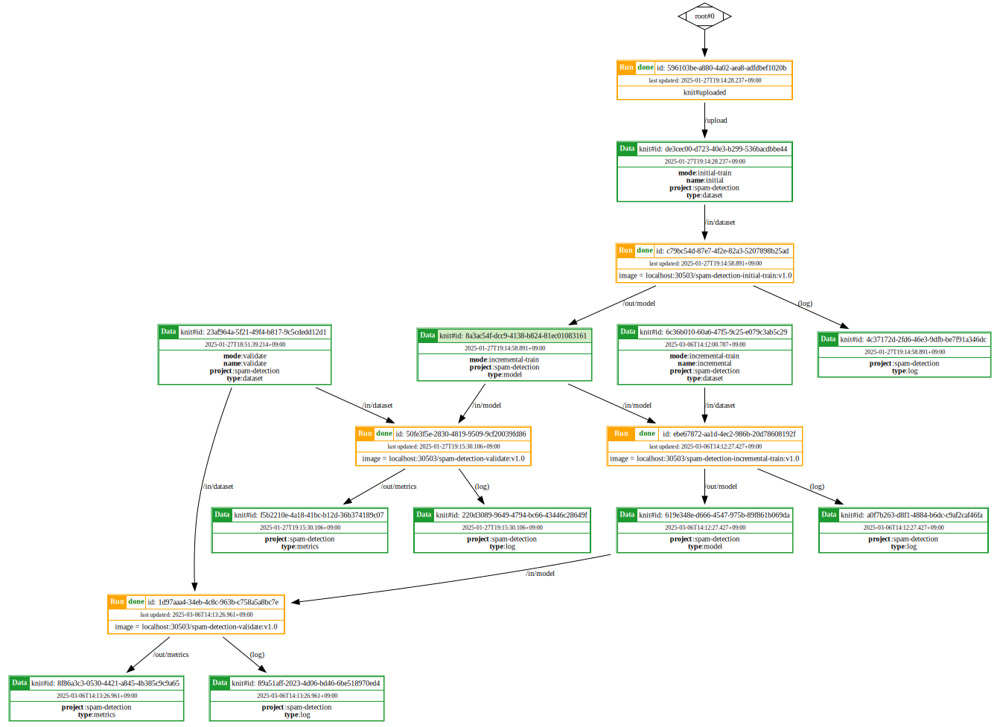

# Example: 増分学習によるスパムメール検知

本書では、Knitfab を使用して増分学習機能を備えた簡単なスパムメール検知システムを構築する事例を示します。 Knitfab はモデルの学習プロセスを自動化しながら、実験の入力と出力を記録して、その履歴を遡れるようにします。

## 概要
この事例では、増分機械学習パイプラインを通して学習プロセスへ継続的に新しいデータを取り込むアプローチをとることで、既存の機械学習 (ML) モデルがパターンの変化に適応でき、その性能を維持することができることを示します。


パイプラインの主要なデータとタスクの概要を図にて示します。


### データ

- **初期学習データ:** ML モデルの初期版を学習するためのデータセット。
- **初期モデル:** 初期学習より生成された初期版の ML モデル。
- **新しい学習データ:** 既存モデルを増分的に改善するためのデータセット。
- **更新されたモデル:** 増分学習を受けた後の ML モデルの改良版。
- **指標:** モデルの性能性能を評価するための定量的な尺度（例: 精度、適合率、再現率、F1 スコア）。

### タスク

- **初期学習:** 初期版のモデルが初期学習データを使用して学習する処理。
- **増分学習:** 新しい学習データを使用して既存のモデルを再学習する処理。(これにより、モデルは新しい情報から学習し、潜在的に性能を向上させることができます。)
- **検証:** 学習用データと別のデータセットでモデルの性能を評価する処理。


## 前提条件
この事例を正常に動作させるために、次の前提条件を満たしているかを確認してください。

### 必須
- **Knitfabがセットアップずみ:
  - **プロダクション向けの場合:** [03.admin-guide](../../03.admin-guide/admin-guide-installation.ja.md)に記載されている手順に従って、インストールを実行します。
  - **実験向けの場合:** 簡易版については、[01.getting-started: Knitfab（簡易版） をローカル環境にインストールする](../../01.getting-started/getting-started.ja.md#Knitfab簡易版-をローカル環境にインストールする)に記載されている手順に従ってください。
- **Knit CLIが使える:** [01.getting-started: CLI ツール: knit](../../01.getting-started/getting-started.ja.md#cli-ツール-knit)のインストール手順に従って、Knit CLI を設定します。
- **Knitコマンドを初期化ずみ:** `knit init` を使用して Knit コマンドを初期化する方法については、[01.getting-started: knit コマンドの初期化](../../01.getting-started/getting-started.ja.md#knit-コマンドの初期化)を参照してください。
- **`Docker` インストールずみ:** コンテナイメージをビルドして Knitfab にプッシュするために必要です。

### 任意

- **kubectl（推奨）が使える:** Knitfab Kubernetes クラスタのデバッグなどに用います。


## リポジトリ
この事例で使用されるファイルとディレクトリは、GitHub の `knitfab-docs` リポジトリから取得（クローン）できます。

```bash
git clone https://github.com/opst/knitfab-docs.git
```
クローンが完了したら、リポジトリ配下の`04.examples/spam-email-detection`ディレク
トリ内にあるファイルを確認してください。以下が含まれています。
- **in/dataset:** 学習と検証に使用するデータセットが含まれています。
- **scripts:** 学習と検証の Python スクリプト、および Knitfab Plan の登録に必要な Dockerfile が格納されています。
- **plans:** Knitfab Plan の YAML ひな型が含まれています。

## 実施手順

## ステップ 1: Docker イメージのビルド

Knitfabでは、各タスクをコンテナとして実行します。そのため、ユーザは必要なタスクをコンテナイメージとして用意する必要があります。


このステップでは、スパムメール検知のパイプラインの各タスク（初期学習、検証、および増分学習）の Docker イメージを作成します。

> [!Note]
>
> この事例は、Knitfab を用いた ML パイプラインの構築と管理に集中するため、Python スクリプトや Dockerfile の内容についての説明はいたしません。

以下、'spam-email-detection' ディレクトリをカレントディレクトリとしてから、**1.1.**~**1.3.** のコマンドを実行してください。

### 1.1. `spam-detection-initial-train` イメージのビルド
```bash
docker build -t spam-detection-initial-train:v1.0 \
             -f scripts/initial-train/Dockerfile \
             ./scripts/initial-train
```
`spam-detection-initial-train` イメージは、初期版のモデルの学習を担います。

### 1.2. `spam-detection-validate` イメージのビルド
```bash
docker build -t spam-detection-validate:v1.0 \
             -f scripts/validate/Dockerfile \
             ./scripts/validate
```
`spam-detection-validate` イメージは、学習済みモデルの性能を評価し、指標を json 形式（例: 精度、適合率、再現率）で出力するために使用されます。

### 1.3. `spam-detection-incremental-train` イメージのビルド
```bash
docker build -t spam-detection-incremental-train:v1.0 \
             -f scripts/incremental-train/Dockerfile \
             ./scripts/incremental-train
```
`spam-detection-incremental-train` イメージは新しいデータを用いて既存のモデルを再学習させ、性能を向上します。

## ステップ 2:（任意）Docker イメージの動作確認
> [!Note]
>
> イメージの動作確認としてタスクをすべて実施すると時間がかかりますので、適宜中断してください。
### 2.1. 初期学習の確認
```bash
docker run --rm -it \
    -v "$(pwd)/in/dataset/initial:/in/dataset" \
    -v "$(pwd)/out/model:/out/model" \
    spam-detection-initial-train:v1.0
```

このコマンドは、`spam-detection-initial-train:v1.0` イメージをロカール環境で実行します。

- `-v` フラグが初期データセット（`in/dataset/initial`）と出力ディレクトリ（`out/model`）をコンテナに関連付けます。
- これにより、イメージの動作確認ができ、初期版のモデルが生成されます。

### 2.2. モデル検証処理の確認
```bash
docker run --rm -it \
    -v "$(pwd)/in/dataset/validate:/in/dataset" \
    -v "$(pwd)/out/model:/in/model" \
    -v "$(pwd)/out/metrics:/out/metrics" \
    spam-detection-validate:v1.0
```
このコマンドは、`spam-detection-validate:v1.0` イメージを実行し、初期版モデルを検証データセット対して評価します。

評価指標は、`out/metrics` ディレクトリに `metrics.json` という json ファイルとして保存されます。

### 2.3. 性能の確認

`metrics.json` ファイルにあるモデルの性能指標（例: 精度、適合率、再現率）を見て、初期モデルの有効性を確認しましょう。

### 2.4. 増分学習の確認

次に、新しい学習データを使用して初期版のモデルを増分的に学習させます。

```bash
docker run --rm -it \
    -v "$(pwd)/in/dataset/incremental:/in/dataset" \
    -v "$(pwd)/out/model:/in/model" \
    -v "$(pwd)/out/model:/out/model" \
    spam-detection-incremental-train:v1.0
```

### 2.5. 再検証

手順 [2.2.~2.4.](#22-モデル検証処理の確認)を繰り返して、その都度出力される新しい `metrics.json` ファイルを確認し、更新されたモデルの性能指標の変化を検証します。モデルが正しく増分学習できていれば、性能指標もその都度変化しているはずです。

## ステップ 3: Docker イメージを Knitfab にプッシュする
このステップではステップ２で作成した全ての Docker イメージを Knitfab レジストリにプッシュします。
これにより、Knitfabはそのイメージ＝タスクを Run として実行できる状態になります。

### 3.1. レジストリ URI を用いてイメージのタグ付け

イメージを Knitfab レジストリにプッシュする前に、正しいレジストリ URI で**タグ付け**する必要があります。これにより、Docker はプッシュ操作の目的のレジストリを識別できます。

```bash
docker tag ${docker_image} ${registry_uri}/${docker_image}
```

プレースホルダ`${...}`は、以下のように実際の値で置き換えてください:

- `${docker_image}` をビルドされた各イメージの名前（例: `spam-detection-initial-train:v1.0`、`spam-detection-validate:v1.0`、`spam-detection-incremental-train:v1.0`）に置き換えてください。
- `${registry_uri}` を、Knitfab レジストリの実際の URI（例: `192.0.2.1:30503`）に置き換えてください。

### 3.2. イメージをKnitfabレジストリへプッシュ

次に、タグ付きのイメージを Knitfab レジストリにプッシュします。
```bash
docker push ${registry_uri}/${docker_image}
```
`${docker_image}` を、ステップ3.1. でタグ付けした各イメージの名前（レジストリ URI を含む）に置き換えてください。

## ステップ 4: 初期学習
この手順では、準備したデータセットを使用して ML モデルの初期学習を行います。

### 4.1. 学習データを Knitfab へプッシュ
```bash
knit data push -t mode:initial-train \
               -t type:dataset \
               -t project:spam-detection \
               -n ./in/dataset/initial
```
このコマンドは、`./in/dataset/initial`にある初期学習データセットを Knitfab にプッシュします。

`-t` フラグは、タグ（`mode:initial-train`、`type:dataset`、`project:spam-detection`）の指定です。
これらのタグが一致性を判断することで、後述の学習プロセスで Knitfab は必要なデータセットを識別できます。

### 4.2. YAML ひな型の生成

YAML ひな型を生成するには、2つの選択肢があります。

- 選択肢①:「空の」ひな型を作成する
```bash
knit plan template --scratch > ./plans/spam-detection-initial-train.v1.0.yaml
```
これにより、`./plans` ディレクトリに`spam-detection-initial-train.v1.0.yaml` という名前で新しい YAML ひな型が作成されます。このひな型の設定項目の値は全て空欄や仮の値になっていますので、ユーザが必要な項目を追記します。

- 選択肢②: Docker イメージからひな型を生成する
```bash
docker save ${registry_uri}/spam-detection-initial-train:v1.0 | \
    knit plan template > ./plans/spam-detection-initial-train.v1.0.yaml
```
このコマンドは、`Docker` イメージ `spam-detection-initial-train:v1.0` に基づいて YAML ひな型を生成します。
すなわち、コンテナイメージ名などの指定項目が自動的に設定されてYAMLファイルが作られます。

\* `${registry_uri}` を 実際の Knitfab のレジストリ URI に置き換えてください。

\* コマンドが Docker イメージを解析して、ひな型の一部分が記入済みです。

### 4.3. YAML ひな型への追記
- 重要な追記項目:
  - `image`:
    - Knitfab Kubernetes クラスタがローカルレジストリを使用している場合は、`image` 項目の`registry_uri` を `localhost` に置き換えてください。
    
    例:
    ```YAML
    # 192.0.2.1 を
    image: "192.0.2.1:30503/spam-detection-initial-train:v1.0"
    # localhost に置き換える
    image: "localhost:30503/spam-detection-initial-train:v1.0"
    ```
    - これにより、Knitfab はローカルレジストリからイメージをプルするという意味になります。

  - `inputs`:
    - `knit data push` コマンド中に使用されたタグ（`project:spam-detection`、`type:dataset`、`mode:initial-train`）を `path:"/in/dataset"` に指定してください。
      
    <br>

    ```YAML
    # knit data push コマンド中に使用されたタグ追加する。
    inputs:
      - path: /in/dataset
        tags:
          - project:spam-detection
          - type:dataset
          - mode:initial-train
    ```
    - これは、Knitfab が学習プロセスを正しいデータセットと関連付けるためです。

  - `outputs`、`log`:
    - `outputs` および `log` 項目に、プロジェクト関連タグ (`project:spam-detection`) を追加します。

    <br>

    ```YAML
    outputs:
      - path: "/out/model"
        tags:
          - "project:spam-detection"
          - "type:model"
    log:
      tags:
        - "type:log"
        - "project:spam-detection"
    ```
      - これにより、Knitfab 内での出力とログの整理と検索が容易になります。

- その他の重要な考慮事項:
  - 計算資源割り当て: 学習プロセスに必要な計算資源はデフォルト設定で十分ですが、必要に応じて CPU、メモリ、GPU などの資源を追加で定義してください。
  ```YAML
  resources:
    cpu: 1
    memory: 1Gi
  ```
  - YAML構造: 変更した YAML ひな型が正しい構造と構文に準拠していることを再確認してください。必要に応じてクローンした Git リポジトリの `/plans` ディレクトリにある YAML ファイルを参照してください。

### 4.4. YAML ひな型の登録
```bash
initial_train_plan=$(knit plan apply ./plans/spam-detection-initial-train.v1.0.yaml)
```
このコマンドは、YAML ひな型を Knitfab API に送信し、定義した設定項目に沿って新しい Plan を作成します。

`initial_train_plan` 変数にはコマンドの出力として作成された Plan の詳細が格納されます。

### 4.5. Plan Id の抽出
```bash
initial_train_plan_id=$(echo "$initial_train_plan" | jq -r '.planId')
```
これで、Plan の詳細から Plan の一意の Id を抽出できます。

### 4.6. 実行状況の確認

YAML ひな型を登録すると、Knitfab は学習 Plan を実行するための Run を開始します。この動作はバックグラウンドで行われ、Runを開始したことを示すメッセージ等をユーザに自動的に通知することはありません。

Runの状況を知るには、次のコマンドを使用して、Runの現在の実行状況を Knitfab に問い合わせます。
```bash
knit run find -p $initial_train_plan_id
```
このコマンドは、指定された Plan Id に関連付けられた学習 Run を表示します。コマン
ドを定期的に実行し( Linux の watch コマンドが便利です)、`status` が `done` に変わる
まで待ちます。Run が正常終了すれば、'status'が`done` に変わります。

### 4.7. モデル情報の取得

学習 Run が正常に終了したら、生成されたモデルに関する情報を取得できます。

- Run 情報の取得:
```bash
initial_train_run=$(knit run find -p $initial_train_plan_id)
```
- Run 出力の抽出:
```bash
initial_train_outputs=$(echo "$initial_train_run" | jq -r '.[-1].outputs')
```
- モデル Knit Id の取得:
```bash
initial_train_model_knit_id=$(echo "$initial_train_outputs" | jq -r '.[0].knitId')
```

### 4.8.（任意）Run ログの確認

Run の実行中に出力されたログを確認したい場合は、次のコマンドを使用できます。
- Run Id の取得:
```bash
initial_train_run_id=$(echo "$initial_train_run" | jq -r '.[-1].runId')
```
- Run ログの表示:
```bash
knit run show --log $initial_train_run_id
```

### 4.9.（任意）モデルの保存

学習済みのモデルをローカルに保存したい場合は、次のコマンドを使用して Knitfab からダウンロードできます。

```bash
knit data pull -x $initial_train_model_knit_id ./out/model
```
この例では、学習済みモデルを Knitfab からダウンロードし、`./out/model` ディレクトリに保存しています。

## ステップ 5: モデル検証
学習後、モデルの性能を評価します。

### 5.1. 検証データをKnitfabへプッシュ

```bash
knit data push -t mode:validate \
               -t type:dataset \
               -t project:spam-detection \
               -n ./in/dataset/validate
```

検証 Plan がデータセットを識別できるように、タグ（`mode:validate`、`type:dataset`、`project:spam-detection`）を設定します。

### 5.2. YAML ひな型の生成

- 選択肢①: 空のひな型を作成する
```bash
knit plan template --scratch > ./plans/spam-detection-validate.v1.0.yaml
```
- 選択肢②: Dockerイメージからひな型を生成する
```bash
docker save ${registry_uri}/spam-detection-validate:v1.0 | \
    knit plan template > ./plans/spam-detection-validate.v1.0.yaml
```
\* `${registry_uri}` を 実際の Knitfab のレジストリ URI に置き換えてください。

### 5.3. YAML ひな型への追記

- 重要な追記項目:
  - `image`:
    - Knitfab Kubernetesクラスタがローカルレジストリを使用している場合は、`image` 項目の`registry_uri` を `localhost` に置き換えてください。
    
    例:
    ```YAML
    # 192.0.2.1 を
    image: "192.0.2.1:30503/spam-detection-validate:v1.0"
    # localhost に置き換える
    image: "localhost:30503/spam-detection-validate:v1.0"
    ```
    - これにより、Knitfab はローカルレジストリからイメージをプルするという意味合いになります。
    
  - `inputs`:
    - データセット: `path:"/in/dataset"`に次のタグを定義します。
      - `project:spam-detection`
      - `type:dataset`
      - `mode:validate`
    - モデル: `path:"/in/model"` に次のタグを定義します。
      - `project:spam-detection`
      - `type:model`
      
    <br>

    ```YAML
    inputs:
      - path: "/in/dataset"
        tags:
          - "project:spam-detection"
          - "type:dataset"
          - "mode:validate"
      - path: "/in/model"
        tags:
          - "project:spam-detection"
          - "type:model"
    ```

  - `outputs`、`log`:
    - `outputs` および `log` 項目に、プロジェクト関連タグ (`project:spam-detection`) を追加します。

    <br>

    ```YAML
    outputs:
      - path: "/out/metrics"
        tags:
          - "project:spam-detection"
          - "type:metrics"
    log:
      tags:
        - "type:log"
        - "project:spam-detection"
    ```

- その他の重要な考慮事項:
  - 計算資源割り当て: 検証プロセスに必要な計算資源はデフォルト設定で十分ですが、必要に応じて CPU、メモリ、GPU などの資源を追加で定義してください。
  ```YAML
  resources:
    cpu: 1
    memory: 1Gi
  ```
  - YAML構造: 変更した YAML ひな型が正しい構造と構文に準拠していることを再確認してください。必要に応じてクローンした Git リポジトリの `/plans` ディレクトリにあるYAMLファイルを参照してください。

### 5.4. YAML ひな型の登録

以下のコマンドを実行し検証 Plan を登録します。
```bash
validate_plan=$(knit plan apply ./plans/spam-detection-validate.v1.0.yaml)
```
- `validate_plan` 変数には、作成された Plan の詳細が含まれます。

### 5.5. Plan Id の抽出
```bash
validate_plan_id=$(echo "$validate_plan" | jq -r '.planId')
```

### 5.6. 実行状況の確認
```bash
knit run find -p $validate_plan_id
```
コマンドを定期的に実行し、`status` が `done` に変わるまで待ちます。`done` に変わると Run が正常終了になります。

### 5.7. （任意）検証指標の取得

- Run 情報の取得:
```bash
validate_run=$(knit run find -p $validate_plan_id)
```
- Run出力の抽出:
```bash
validate_outputs=$(echo "$validate_run" | jq -r '.[-1].outputs')
```
- 検証指標レポートの Knit Id の取得:
```bash
validate_metrics_knit_id=$(echo "$validate_outputs" | jq -r '.[0].knitId')
```

### 5.8.（任意）Run ログの確認

- Run Id の取得:
```bash
validate_run_id=$(echo "$validate_run" | jq -r '.[-1].runId')
```
- Run ログの表示:
```bash
knit run show --log $validate_run_id
```

### 5.9.（任意）指標レポートのダウンロード
```bash
knit data pull -x $validate_metrics_knit_id ./out/metric
```
このコマンドは、検証指標レポートを Knitfab からダウンロードし、`./out/metric` ディレクトリに保存します。

## ステップ 6: 増分学習と検証
初期学習と検証が完了したら、新しいデータを使用して増分学習を実行し、その後、更新されたモデルのさらなる検証を行います。

### 新しいデータを用いた初期モデルの再学習と更新
### 6.1. 新しい学習データを Knitfab へプッシュ
```bash
knit data push -t mode:incremental-train \
               -t type:dataset \
               -t project:spam-detection \
               -n ./in/dataset/incremental
```
増分学習 Plan がデータセットを識別できるように、タグ（`mode:incremental-train`、`type:dataset`、`project:spam-detection`）を追加します。

### 6.2. YAML ひな型の生成
- 選択肢①: 空のひな型を作成する
```bash
knit plan template --scratch > ./plans/spam-detection-incremental-train.v1.0.yaml
```
- 選択肢②: Docker イメージからひな型を生成する
```bash
docker save ${registry_uri}/spam-detection-incremental-train:v1.0 | \
    knit plan template > ./plans/spam-detection-incremental-train.v1.0.yaml
```
\* `${registry_uri}` を 実際の Knitfab のレジストリ URI に置き換えてください。

### 6.3. YAML ひな型への追記

- 重要な追記項目:
  - `image`:
    - Knitfab Kubernetes クラスタがローカルレジストリを使用している場合は、`image` 項目の`registry_uri` を `localhost` に置き換えてください。
    
    例:
    ```YAML
    # 192.0.2.1 を
    image: "192.0.2.1:30503/spam-detection-incremental-train:v1.0"
    # localhost に置き換える
    image: "localhost:30503/spam-detection-incremental-train:v1.0"
    ```
    - これにより、Knitfab はローカルレジストリからイメージをプルするという意味合いになります。
    
  - `inputs`:
    - データセット: `path:"/in/dataset"`に次のタグを定義します。
      - `project:spam-detection`
      - `type:dataset`
      - `mode:incremental-train`
    - モデル: `path:"/in/model"` に次のタグを定義します。
      - `project:spam-detection`
      - `type:model`
      - `mode:incremental-train`
      
    <br>

    ```YAML
    inputs:
      - path: "/in/dataset"
        tags:
          - "project:spam-detection"
          - "type:dataset"
          - "mode:incremental-train"
      - path: "/in/model"
        tags:
          - "project:spam-detection"
          - "type:model"
          - "mode:incremental-train"
    ```
> [!Caution]
>
> - `mode:incremental-train` タグが `path:"/in/model"` に含まれていることを必ず確認してください。
> - タグ不足で、Knitfab Plan 実行する際にエラーが発生することがあります。

  - `outputs`、`log`:
    - `outputs` および `log` 項目に、プロジェクト関連タグ (`project:spam-detection`) を追加します。

    <br>

    ```YAML
    outputs:
      - path: "/out/model"
        tags:
          - "project:spam-detection"
          - "type:model"
    log:
      tags:
        - "type:log"
        - "project:spam-detection"
    ```

- その他の重要な考慮事項:
  - 計算資源割り当て: 学習プロセスに必要な計算資源はデフォルト設定設定で十分ですが、必要に応じて CPU、メモリ、GPU などの資源を追加で定義してください。
  ```YAML
  resources:
    cpu: 1
    memory: 1Gi
  ```
  - YAML構造: 変更した YAML ひな型が正しい構造と構文に準拠していることを再確認してください。必要に応じてクローンした Git リポジトリの `/plans` ディレクトリにある YAML ファイルを参照してください。

### 6.4. YAML ひな型の登録
```bash
incremental_train_plan=$(knit plan apply ./plans/spam-detection-incremental-train.v1.0.yaml)
```
- `incremental_train_plan` 変数には、作成された Plan の詳細が含まれます。

### 6.5. Plan Id の抽出
```bash
incremental_train_plan_id=$(echo "$incremental_train_plan" | jq -r '.planId')
```

### 6.6. `mode:incremental-train` タグを初期モデルに追加

現在、初期版のモデルには増分学習を認識させるたぬに `mode:incremental-train` タグが不足しています。

したがって、次のコマンドを実行し必要なタグを付けます。
```bash
knit data tag --add mode:incremental-train $initial_train_model_knit_id
```
コマンドは必要な `mode:incremental-train` タグを初期版のモデルに追加し、そして増分学習 Plan の基に新しいRun が実行されます。

### 6.7. 実行状況の確認
```bash
knit run find -p $incremental_train_plan_id
```
コマンドを定期的に実行し、`status` が `done` に変わるまで待ちます。`done` に変わると Run が正常終了になります。

### 6.8. モデル情報の取得

- Run 情報の取得:
```bash
incremental_train_run=$(knit run find -p $incremental_train_plan_id)
```
- Run 出力の抽出:
```bash
incremental_train_outputs=$(echo "$incremental_train_run" | jq -r '.[-1].outputs')
```
- モデル Knit Id の取得:
```bash
incremental_train_model_knit_id=$(echo "$incremental_train_outputs" | jq -r '..knitId')
```
この一連のコマンドは、増分学習 Run によって生成されたモデルに関連付けられている Knit Id を取得します。

### 6.9.（任意）Run ログの確認
- Run Id の取得:
```bash
incremental_train_run_id=$(echo "$incremental_train_run" | jq -r '.[-1].runId')
```
- Runログの表示:
```bash
knit run show --log $incremental_train_run_id
```

### 6.10.（任意）モデルの保存
```bash
knit data pull -x $incremental_train_model_knit_id./out/model
```
このコマンドは、学習済みモデルを Knitfab からダウンロードし、`./out/model` ディレクトリに保存します。

### 6.11. 増分モデルの検証

Knitfab は、増分学習からの出力したモデルをタグで認識し、検証Plan を基に新しい Run を自動的に実行します。
生成した検証 Run の実装状況、ログ、指標レポートの確認は[ステップ5:モデル検証](#ステップ-5-モデル検証)の手順 6〜9 を実施してください。

### 6.12. 以前のモデルから `mode:incremental-train` タグを削除する

Knitfab は、ある Plan の入力データが更新されると、自動的にその Plan に基づく Run を実行する仕組みです。
その入力データはタグの一致によって認識されます。

そのため、今後さらに新しいデータセットを登録する際に、`mode:incremental-train` タグが付いた以前のモデルが残っていると、このタグを入力とする「増分学習 Plan」 によって認識され、増分学習の Run が自動的に実行されてしまいます。

この意図しない動作を防ぐために、新しいデータを登録する前に、次のコマンドを実行して以前のモデルから `mode:incremental-train` タグを削除しておいてください。

```bash
knit data tag --remove mode:incremental-train $initial_train_model_knit_id
```

## ステップ7: パイプライン構造とリネージグラフの確認
このステップでは、構築したパイプライン構造を可視化し、データ依存関係を確認します。

### 7.1. Plan グラフの生成（パイプライン構造）
Plan グラフは、パイプラインの全体像を把握し、初期学習、増分学習、検証などの異なる Plan 間の依存関係を示します。

次のコマンドを実行して、Plan グラフの PNG 画像を生成してください。`${plan_id}` は、該当する Plan Id(`$initial_train_plan_id`、`$incremental_train_plan_id`、`$validate_plan_id`) に置き換えてください。

```bash
knit plan graph -n all ${plan_id} | dot -Tpng > plan-graph.png
```

以下のようにパイプライン構造を表す検証 Plan グラフを代表として表示します。


**Fig. 1:** 学習パイプライン構造 

グラフはタスク間の依存関係を以下のように示します。
- **訓練タスクと評価タスクの関係:**
  - `initial_train_plan` と `incremental_train_plan` の両方が、 `validate_plan` を下流タスクとして示していることを確認します。
  - これは、次のことを意味します。
    - 各学習タスクの後に検証が実行されること。
    - 検証タスクがそれぞれの学習タスクから生成された `/out/model` を受け取ること。
- **独立した学習 Plan:**
  - `initial_train_plan` と `incremental_train_plan` の間に依存関係が存在しないことを確認します。
  - これは意図的な設計であり、`incremental_train_plan` は、`initial_train_plan` の直接的な後続ステップではなく、すべて学習済みモデルを基に増分学習を行うことを意味します。
  - `initial_train_plan` の出力モデルに `mode:incremental` タグを付与することで、`incremental_train_plan` の学習対象として認識され、リネージグラフにその関係が示されます。
### 7.2. リネージグラフの生成（データフロー）

リネージグラフは、パイプライン内のデータと成果物の依存関係を示します。

以下のコマンドを実行して、リネージグラフの PNG 画像（`lineage-graph.png`）を生成してください。`${knit_id}` は、該当する Knit Id (`$initial_train_model_knit_id`、`$incremental_train_model_knit_id`、`$validate_metrics_knit_id`) に置き換えてください。

```bash
knit data lineage -n all ${knit_id} | dot -Tpng > lineage-graph.png
```
以下のように初期学習リネージグラフを代表として表示します。



**Fig. 2:** 学習データと成果物のリネージグラフ

グラフはデータと成果物の依存関係を以下のようにしまします。
- **初期学習の出力:**
  `$initial_train_run` が `/out/model`（初期学習済みモデル）と `(log)`（実行ログ）を出力として生成していることを確認します。
- **増分学習の入力:**
  `$incremental_train_run` が `$initial_train_run` によって生成された `/out/model` をタスク入力として認識していることを確認します。これは、`mode:incremental` タグによってタスクが関連付けられていることを意味します。
- **増分学習の出力:**
  `$incremental_train_run` が初期モデルを更新し、新しい `/out/model` と `(log)` を生成していることを確認します。
- **検証の出力:**
  `$validate_run` が、初期学習タスクと増分学習タスクの両方からの出力モデルの性能を検証し、対応する `/out/metrics`（性能指標）と `(log)` を生成していることを確認します。

## ステップ 8: 片付け
### 8.1. Run の 削除
> [!Caution]
> 
> - Run が**すでに停止**していて、**下流に他の Run がない**場合に限り、Run を削除できます。
> - Run を削除してしまうと、その Run によって生成された**すべてのデータ、モデル、指標レポートも完全に削除**されます。

> [!Warning]
>
> Run の 削除は**非可逆**の操作です。

```bash
knit run rm ${run_id}
```

`${run_id}` を、`$validate_run_id` → `$incremental_train_run_id` → `$initial_train_run_id` の順に、Run の一意の Id に置き換えてください。

### 8.2. Plan の非活性化

登録した Plan が不要になった場合は、次のコマンドを使用して非活性化ができます。
```bash
knit plan active no ${plan_id}
```
`${plan_id}` を、非活性化したい Plan の一意の Id（例: `$initial_train_plan_id`、`$validate_plan_id`、`$incremental_train_plan_id`）に置き換えてください。

### 8.3. アップロードされたデータセットの削除
Knitfabでアップロードされたデータセットを削除するには、関連付けられたアップロード Run を削除する必要があります。
以下の手順で実施します。

#### 8.3.1. データセット Run Id の検索

- データセット一覧の取得:
  - 次のコマンドを実行して、タグ `project:spam-detection` が付いたすべてのデータセットを取得します。
```bash
knit data find -t project:spam-detection
```
- 実行例:
```json
{
  "knitId": "de3cec00-d723-40e3-b299-536bacdbbe44",
  "tags": [
    "knit#id:de3cec00-d723-40e3-b299-536bacdbbe44",
    "knit#timestamp:2025-01-27T10:14:28.237+00:00",
    "mode:initial-train",
    "name:initial",
    "project:spam-detection",
    "type:dataset"
  ],
  "upstream": {
    "mountpoint": {
      "path": "/upload",
      "tags": []
    },
    "run": {
      "runId": "596103be-a880-4a02-aea8-adfdbef1020b", 
      "status": "done",
      "updatedAt": "2025-01-27T10:14:28.237+00:00",
      "plan": {
        "planId": "cde9c9c3-a604-4057-9102-ed5f85d4afc7",
        "name": "knit#uploaded"
      }
    }
  },
  ...
}
```
- アップロード Run の特定:
  - 一覧の中から、`upstream.mountpoint.path` が `/upload` になっているエントリを特定します。
  - 該当する `upstream.run.runId` の値を抽出します。

#### 8.3.2. Run の削除
> [!Warning]
> 
> Run の削除は元に戻せない**不可逆的な**操作です。Runおよび関連するすべてのデータが完全に削除されます。慎重に実行してください。


- 次のコマンドを実行します。
```bash
knit run rm ${run_id}
```
`${run_id}` を手順 1 で取得した `runId` に置き換えます。

## まとめ
この事例では、以下のことを示しました。

- **多段階パイプラインの学習と検証:** 簡単なスパムメール検知システムの初期学習、増分学習、および後続の検証を含む、多段階パイプラインを実装しました。
- **学習とリネージ管理の自動化**: Knitfab の機能により、タスク実行ごとの入出力データが自動保存され履歴（リネージ）化されることを示しました。

## トラブルシューティング
### 問題 1
Knitfab Run が `starting` で停止し、進行しない。
```json
{
        "runId": "64b5a7ae-5c85-48f1-b785-955c1709174a",
        "status": "starting",
        "updatedAt": "2025-01-30T01:01:03.589+00:00",
        ...
}
```

#### 解決手順

##### 1. Kubernetes Pod の検査
```bash
kubectl -n knitfab get po
```
このコマンドは、`knitfab` 名前空間内のすべての Pod をリストします。この例の Run Id（`64b5a7ae-5c85-48f1-b785-955c1709174a`）に関連付けられた Pod を探します。

##### 2. Pod ステータスの分析

出力の `STATUS` 列に注意してください。次のようなものが表示されます。
| NAME | READY | STATUS | RESTARTS | AGE |
|---|---|---|---|---| 
| worker-run-64b5a7ae-5c85-48f1-b785-955c1709174a-nzhpq | 1/2 | ImagePullBackOff | 0 | 101s |

`ImagePullBackOff` エラー: これは、Kubernetes がRun に必要な Docker イメージをプルできないことを示します。以下の手順に従い、問題点を確認してください。

  - **ローカルレジストリ:** ローカルレジストリを使用している場合は、Plan YAML の `image` 項目がレジストリ URI を `localhost` に設定しているか確認してください。

  <br>

  ```YAML
  image: "localhost:30503/spam-detection-initial-train:v1.0"
  ```

  - **リモートレジストリ:** リモートレジストリ（Docker Hubなど）を使用している場合は、Knitfab Kubernetes　クラスタにイメージをプルするために必要な認証情報（例: ユーザー名/パスワード、アクセストークン）が設定されることを確認してください。

##### 3. Plan の再登録

イメージプルの問題を修正した後、Plan の再登録が必要となる場合があります。そのとき、以下の手順に従ってください。

- 現在のRunの停止:
```bash
knit run stop --fail ${run_id}
```
（`${run_id}` を実際の Run Id（例: 64b5a7ae-5c85-48f1-b785-955c1709174a）に置き換えます）

- （任意）Runの削除: [ステップ7: 片付け](#ステップ-7-片付け)の「Runの削除」の手順に従ってください。
- 古いPlanの非活性化: [ステップ7: 片付け](#ステップ-7-片付け)の「Planの非活性化」の手順に従ってください。
- 新しいPlanの登録: 実行している学習・検証に応じて、該当する手順を参照してください。
  - [ステップ 4: 初期学習](#ステップ-4-初期学習)
  - [ステップ 5: モデル検証](#ステップ-5-モデル検証)
  - [ステップ 6: 増分学習と検証](#ステップ-6-増分学習と検証)

### 問題 2
増分学習 Plan の登録時に **「Plan's tag dependency makes cycle」** エラーが発生する。

#### エラーの詳細
```json
{
    "message": "plan spec conflics with others\n caused by:@ github.com/opst/knitfab/pkg/domain/plan/db/postgres.planDependencyIsCyclic \"/work/pkg/domain/plan/db/postgres/plan.go\" l846 \u003c- @ github.com/opst/knitfab/pkg/domain/plan/db/postgres.planDependencyIsCyclic.func1 \"/work/pkg/domain/plan/db/postgres/plan.go\" l830 \u003c- plan spec is conflicting with other plan: plan's tag dependency makes cycle"
}
```

#### 解決手順

増分学習 Plan の YAML ひな型に以下の内容が設定されているか再度確認してください。
- `path:"/in/model"` にタグ `mode:incremental-train` を追記してあること。

```YAML
inputs:
  - path: "/in/model"
    tags:
      - "project:spam-detection"
      - "type:model"
      - "mode:incremental-train"
``` 